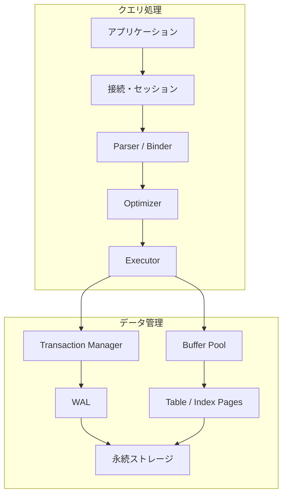
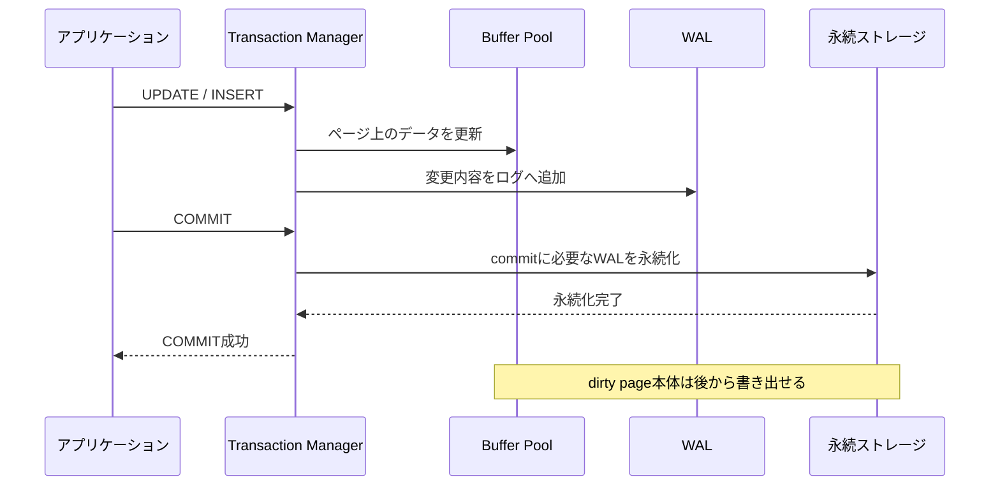

データベースへ送ったSQLは、いきなりファイルを読み書きするわけではありません。構文を解析し、実行方法を選び、必要なページをメモリへ載せ、ほかのトランザクションとの競合を調整したうえで、結果を返します。

この章では個々の仕組みへ深く入る前に、データベースシステム全体の地図を作ります。

## この章で答える問い

- DBMSは「データを保存する箱」以上に何をしているのか
- SQLはどの構成要素を通って実行されるのか
- 読み取りと書き込みでは、どの処理が異なるのか
- 単一ノードDBを分散DBへ拡張すると、何が難しくなるのか

## 先に結論：DBMSは保証を提供する実行システム

DBMS（Database Management System）の役割は、データを置くことだけではありません。アプリケーションから見ると、DBMSは主に次の機能をまとめて提供しています。

| 機能 | DBMSが行うこと | アプリケーションが得るもの |
| --- | --- | --- |
| データモデル | table、row、constraintとしてデータを表現する | 共通の問い合わせ方法と整合性 |
| クエリ処理 | SQLから実行方法を選び、演算子を動かす | 物理配置を意識しすぎずに検索できる |
| ストレージ管理 | page、index、buffer poolを管理する | 大量データを永続化して効率よく参照できる |
| 並行性制御 | lockやMVCCで同時実行を調整する | 複数リクエストを安全に並行実行できる |
| 障害回復 | WALとcheckpointから状態を復元する | commit済みデータをクラッシュ後も維持できる |
| 分散処理 | 複製、合意、分割を調整する | 可用性や容量を複数ノードへ拡張できる |

重要なのは、それぞれが独立していないことです。たとえばoptimizerがindex scanを選べるのは、ストレージエンジンがインデックスを管理しているからです。トランザクションを高速にcommitできるのは、変更済みページを毎回すべて書き出す代わりにWALを利用できるからです。

## SQLが通る経路

Web APIがSQLを送り、結果を受け取るまでの代表的な経路を単純化すると、次のようになります。



この図は責務を理解するための概念図です。実際の製品では、各モジュールの境界や名前が異なります。また、処理は常に図の左から右へ一度だけ進むわけではありません。Executorは必要な行が見つかるまで、Buffer PoolやTransaction Managerと繰り返しやり取りします。

### 1. 接続とセッション

DBは接続を受け付け、認証し、セッションを作ります。セッションには、実行中のトランザクション、タイムゾーン、分離レベル、prepared statementなどの状態が関連づきます。

接続確立には通信や認証のコストがあるため、Webアプリケーションは通常connection poolを使います。ただし、接続を増やすほどDB内部の同時実行数やメモリ消費も増えるので、poolを大きくすれば必ず速くなるわけではありません。

### 2. ParserとBinder

ParserはSQLを構文木へ変換します。Binderは、指定されたtableやcolumnが存在するか、参照に曖昧さがないか、型が適合するかを確認します。

次のSQLでは、ordersとcustomersの定義を調べ、customer_id同士を比較可能か判断します。

```sql
SELECT c.name, SUM(o.total_amount)
FROM customers AS c
JOIN orders AS o ON o.customer_id = c.id
WHERE o.ordered_at >= DATE '2026-08-01'
GROUP BY c.id, c.name;
```

### 3. Optimizer

SQLは欲しい結果を宣言しますが、tableを読む順序やjoinのアルゴリズムは通常指定しません。Optimizerは統計情報を使って行数やコストを推定し、複数の候補から実行計画を選びます。

たとえば、8月の注文が全体のほとんどを占めるならtable scanが有利かもしれません。対象がごく少数なら、ordered_atのindex scanが有利かもしれません。インデックスが存在することと、それを使うことが最適であることは別の問題です。

### 4. Executor

Executorは選ばれた物理実行計画を動かします。scanが行を取り出し、filterが条件に合う行を残し、joinが別の入力と組み合わせ、aggregationが顧客ごとの合計を計算します。

演算子は1行ずつ処理する場合もあれば、複数行をまとめたbatchで処理する場合もあります。途中結果がメモリに収まらなければ、一時ファイルへ退避することもあります。

### 5. Buffer Poolとストレージ

Tableやindexは、通常page/blockと呼ばれる固定サイズの単位で管理されます。必要なpageがBuffer Poolにあればメモリから読み、なければストレージから読み込みます。

1行だけ必要でも、ストレージからはその行を含むpage全体を読むのが基本です。したがってDB性能を考えるときは、行数だけでなく「何ページに触れるか」が重要になります。

## 読み取りでは何が起きるか

主キーで注文を1件検索する場合を考えます。

```sql
SELECT id, customer_id, status, total_amount
FROM orders
WHERE id = 42001;
```

単純化した処理は次のとおりです。

1. SQLを解析し、orders.idの型と権限を確認する
2. 主キーインデックスを使う計画を選ぶ
3. インデックスのrootからleafへpageをたどる
4. 必要ならtable pageからrowを取得する
5. MVCCなどの規則で、そのrowが現在のトランザクションから見えるか確認する
6. 必要なcolumnを結果として返す

Buffer Poolに対象pageが残っていれば、ストレージI/Oなしで処理できる可能性があります。同じSQLでも、cacheの状態によって応答時間が変わる理由の一つです。

## 書き込みでは何が加わるか

注文を確定する更新では、ほかのトランザクションとの競合と、クラッシュ後の復旧を考える必要があります。

```sql
BEGIN;

UPDATE inventory
SET available = available - 1
WHERE product_id = 7
  AND available > 0;

INSERT INTO orders (customer_id, status, total_amount)
VALUES (101, 'confirmed', 4800);

COMMIT;
```



典型的なWAL方式では、変更済みのデータpage本体より先に、復旧に必要なログを永続化します。これにより、すべてのdirty pageを書き出すのを待たずにcommitを返せます。クラッシュ後はログを使って、commit済み更新のredoや未完了更新のundoを行います。

ここでの説明は全体像です。ログの内容、undoの有無、page書き出しの条件は製品やストレージエンジンによって異なります。

## 単一ノードから分散DBへ

単一ノードDBでは、CPU、メモリ、ストレージが一つの障害領域にあります。複数ノードへ拡張すると、容量や可用性を高められる一方、ネットワークに起因する新しい状態が生まれます。

| 新しい問題 | 代表的な仕組み | 残る判断 |
| --- | --- | --- |
| ノード障害に備えてコピーを持つ | replication | 同期か非同期か、どこまでをcommitとするか |
| 現在のleaderを決める | consensus、Raft | 通信分断時にどちら側が処理を継続するか |
| データ量や負荷を分割する | partitioning、sharding | shard keyと再配置をどう設計するか |
| 複数ノードをまたいで更新する | 2PC、Saga | atomicityか補償か、中間状態をどう扱うか |

分散DBでは「別ノードが落ちた」のか「応答が遅れている」のかを、観測しているノードから完全には区別できません。そのため、可用性、整合性、応答時間のすべてを無条件に最大化することはできず、要件に応じた設計が必要になります。

## 性能を見るための4つの軸

DBの性能を「速い」という一語で表すと、重要な違いが隠れます。

- **Latency**：1回の処理が完了するまでの時間
- **Throughput**：単位時間あたりに完了できる処理量
- **Concurrency**：同時に進行している処理数
- **Resource efficiency**：CPU、メモリ、I/O、networkをどれだけ使うか

たとえば同時接続を増やすと、一時的にthroughputが上がってもlock待ちやI/O待ちが増え、個々のlatencyが悪化する場合があります。本書では、仕組みを説明するときに「何を速くし、その代わり何が増えるのか」を明示します。

## 本書で使う最小スキーマ

後続章では、主に顧客、商品、在庫、注文を題材にします。各章で必要な部分だけ拡張します。

```sql
CREATE TABLE customers (
  id          BIGINT PRIMARY KEY,
  name        TEXT NOT NULL
);

CREATE TABLE products (
  id          BIGINT PRIMARY KEY,
  name        TEXT NOT NULL,
  price       INTEGER NOT NULL CHECK (price >= 0)
);

CREATE TABLE inventory (
  product_id  BIGINT PRIMARY KEY REFERENCES products(id),
  available   INTEGER NOT NULL CHECK (available >= 0)
);

CREATE TABLE orders (
  id           BIGINT PRIMARY KEY,
  customer_id  BIGINT NOT NULL REFERENCES customers(id),
  status       TEXT NOT NULL,
  total_amount INTEGER NOT NULL CHECK (total_amount >= 0),
  ordered_at   TIMESTAMP NOT NULL
);
```

このスキーマが完全なECサイト設計というわけではありません。内部処理の違いを比較しやすくするための共通の観察対象です。

## よくある誤解

### 「インデックスがあれば検索は必ず速い」

対象行が多い場合、インデックスとtableを往復するより、tableを順番に読むほうが低コストなことがあります。Optimizerは統計とコストモデルからこれを判断します。

### 「COMMIT時にはデータpage本体が書き終わっている」

WALを使うDBでは、commitに必要なログの永続化を先に保証し、dirty page本体は後から書き出せます。永続性とデータpageの即時書き出しは同義ではありません。

### 「replicaがあれば障害時にデータは失われない」

非同期replicationでは、leaderでcommit済みでもreplicaへ届いていない更新があり得ます。何をもってcommit成功とするかが重要です。

## まとめ

- SQLは解析、最適化、物理実行を経てtableやindexへアクセスする
- DBはpageを基本単位として読み書きし、Buffer PoolでI/Oを減らす
- Transaction Managerは並行性を調整し、WALはcommitと障害回復を支える
- 分散化すると、replication、consensus、sharding、分散transactionの問題が加わる
- 性能はlatencyだけでなく、throughput、concurrency、資源消費と併せて考える

## 確認問題

1. SQLの記述順とDB内部の実行順が一致しないのはなぜでしょうか。
2. 1行を読むだけでもpage単位のI/Oを考える必要があるのはなぜでしょうか。
3. commit時にdirty page本体の書き出しを待たずに済むのは、どの仕組みのおかげでしょうか。
4. 単一ノードから複数ノードへ拡張したとき、新たに考える必要がある失敗を3つ挙げてください。
5. throughputが増えてもlatencyが悪化する状況を一つ考えてください。

## 参考資料

- [PostgreSQL Documentation: The Path of a Query](https://www.postgresql.org/docs/current/query-path.html)
- [PostgreSQL Documentation: Database Physical Storage](https://www.postgresql.org/docs/current/storage.html)
- [PostgreSQL Documentation: Reliability and the Write-Ahead Log](https://www.postgresql.org/docs/current/wal.html)

次章では、tableやrowの土台となるリレーショナルモデルへ進みます。論理的なデータ設計と、indexなどの物理設計を切り分けます。
