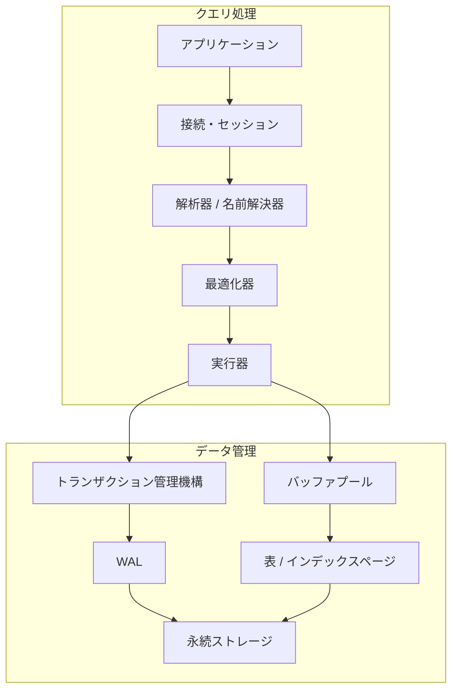
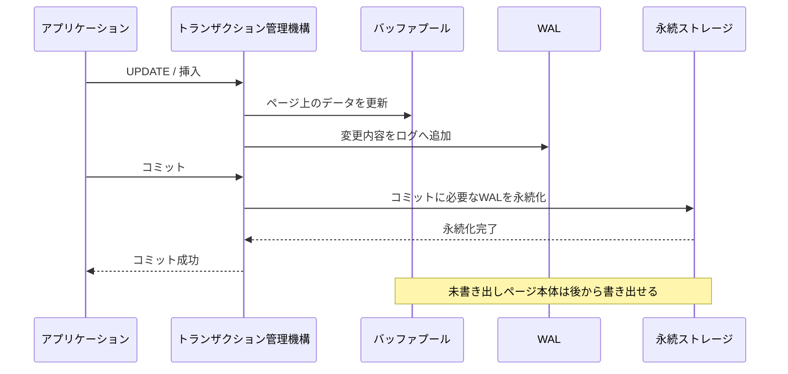

データベースへ送ったSQLは、いきなりファイルを読み書きするわけではありません。構文を解析し、実行方法を選び、必要なページをメモリへ載せ、ほかのトランザクションとの競合を調整したうえで、結果を返します。

この章では個々の仕組みへ深く入る前に、データベースシステム全体の地図を作ります。

## この章で答える問い

- DBMSは「データを保存する箱」以上に何をしているのか
- SQLはどの構成要素を通って実行されるのか
- 読み取りと書き込みでは、どの処理が異なるのか
- 単一ノードDBを分散DBへ拡張すると、何が難しくなるのか

## 先に結論：DBMSは保証を提供する実行システム

DBMS（データベース管理システム）の役割は、データを置くことだけではありません。アプリケーションから見ると、DBMSは主に次の機能をまとめて提供しています。

| 機能 | DBMSが行うこと | アプリケーションが得るもの |
| --- | --- | --- |
| データモデル | 表、行、制約としてデータを表現する | 共通の問い合わせ方法と整合性 |
| クエリ処理 | SQLから実行方法を選び、演算子を動かす | 物理配置を意識しすぎずに検索できる |
| ストレージ管理 | ページ、インデックス、バッファプールを管理する | 大量データを永続化して効率よく参照できる |
| 並行性制御 | ロックやMVCCで同時実行を調整する | 複数リクエストを安全に並行実行できる |
| 障害回復 | WALとチェックポイントから状態を復元する | コミット済みデータをクラッシュ後も維持できる |
| 分散処理 | 複製、合意、分割を調整する | 可用性や容量を複数ノードへ拡張できる |

重要なのは、それぞれが独立していないことです。たとえば最適化器がインデックス走査を選べるのは、ストレージエンジンがインデックスを管理しているからです。トランザクションを高速にコミットできるのは、変更済みページを毎回すべて書き出す代わりにWALを利用できるからです。

## SQLが通る経路

Web APIがSQLを送り、結果を受け取るまでの代表的な経路を単純化すると、次のようになります。



この図は責務を理解するための概念図です。実際の製品では、各モジュールの境界や名前が異なります。また、処理は常に図の左から右へ一度だけ進むわけではありません。実行器は必要な行が見つかるまで、バッファプールやトランザクション管理機構と繰り返しやり取りします。

### 1. 接続とセッション

DBは接続を受け付け、認証し、セッションを作ります。セッションには、実行中のトランザクション、タイムゾーン、分離レベル、プリペアド文などの状態が関連づきます。

接続確立には通信や認証のコストがあるため、Webアプリケーションは通常接続プールを使います。ただし、接続を増やすほどDB内部の同時実行数やメモリ消費も増えるので、プールを大きくすれば必ず速くなるわけではありません。

### 2. 解析器と名前解決器

解析器はSQLを構文木へ変換します。名前解決器は、指定された表や列が存在するか、参照に曖昧さがないか、型が適合するかを確認します。

次のSQLでは、ordersとcustomersの定義を調べ、customer_id同士を比較可能か判断します。

```sql
SELECT c.name, SUM(o.total_amount)
FROM customers AS c
JOIN orders AS o ON o.customer_id = c.id
WHERE o.ordered_at >= DATE '2026-08-01'
GROUP BY c.id, c.name;
```

### 3. 最適化器

SQLは欲しい結果を宣言しますが、表を読む順序や結合のアルゴリズムは通常指定しません。最適化器は統計情報を使って行数やコストを推定し、複数の候補から実行計画を選びます。

たとえば、8月の注文が全体のほとんどを占めるなら表走査が有利かもしれません。対象がごく少数なら、ordered_atのインデックス走査が有利かもしれません。インデックスが存在することと、それを使うことが最適であることは別の問題です。

### 4. 実行器

実行器は選ばれた物理実行計画を動かします。走査が行を取り出し、絞り込みが条件に合う行を残し、結合が別の入力と組み合わせ、集約が顧客ごとの合計を計算します。

演算子は1行ずつ処理する場合もあれば、複数行をまとめた一括単位で処理する場合もあります。途中結果がメモリに収まらなければ、一時ファイルへ退避することもあります。

### 5. バッファプールとストレージ

表やインデックスは、通常ページ／ブロックと呼ばれる固定サイズの単位で管理されます。必要なページがバッファプールにあればメモリから読み、なければストレージから読み込みます。

1行だけ必要でも、ストレージからはその行を含むページ全体を読むのが基本です。したがってDB性能を考えるときは、行数だけでなく「何ページに触れるか」が重要になります。

## 読み取りでは何が起きるか

主キーで注文を1件検索する場合を考えます。

```sql
SELECT id, customer_id, status, total_amount
FROM orders
WHERE id = 42001;
```

単純化した処理は次のとおりです。

1. SQLを解析し、orders.idの型と権限を確認する
2. 主キーインデックスを使う計画を選ぶ
3. インデックスのルートから葉へページをたどる
4. 必要なら表ページから行を取得する
5. MVCCなどの規則で、その行が現在のトランザクションから見えるか確認する
6. 必要な列を結果として返す

バッファプールに対象ページが残っていれば、ストレージI/Oなしで処理できる可能性があります。同じSQLでも、キャッシュの状態によって応答時間が変わる理由の一つです。

## 書き込みでは何が加わるか

注文を確定する更新では、ほかのトランザクションとの競合と、クラッシュ後の復旧を考える必要があります。

```sql
BEGIN;

UPDATE inventory
SET available = available - 1
WHERE product_id = 7
  AND available > 0;

INSERT INTO orders (customer_id, status, total_amount)
VALUES (101, 'confirmed', 4800);

COMMIT;
```



典型的なWAL方式では、変更済みのデータページ本体より先に、復旧に必要なログを永続化します。これにより、すべての未書き出しページを書き出すのを待たずにコミットを返せます。クラッシュ後はログを使って、コミット済み更新の再実行や未完了更新の取り消しを行います。

ここでの説明は全体像です。ログの内容、取り消しの有無、ページ書き出しの条件は製品やストレージエンジンによって異なります。

## 単一ノードから分散DBへ

単一ノードDBでは、CPU、メモリ、ストレージが一つの障害領域にあります。複数ノードへ拡張すると、容量や可用性を高められる一方、ネットワークに起因する新しい状態が生まれます。

| 新しい問題 | 代表的な仕組み | 残る判断 |
| --- | --- | --- |
| ノード障害に備えてコピーを持つ | レプリケーション | 同期か非同期か、どこまでをコミットとするか |
| 現在のリーダーを決める | 合意、Raft | 通信分断時にどちら側が処理を継続するか |
| データ量や負荷を分割する | 分割、シャーディング | シャードキーと再配置をどう設計するか |
| 複数ノードをまたいで更新する | 2PC、Saga | 原子性か補償か、中間状態をどう扱うか |

分散DBでは「別ノードが落ちた」のか「応答が遅れている」のかを、観測しているノードから完全には区別できません。そのため、可用性、整合性、応答時間のすべてを無条件に最大化することはできず、要件に応じた設計が必要になります。

## 性能を見るための4つの軸

DBの性能を「速い」という一語で表すと、重要な違いが隠れます。

- **遅延時間**：1回の処理が完了するまでの時間
- **処理量**：単位時間あたりに完了できる処理量
- **同時実行性**：同時に進行している処理数
- **資源効率**：CPU、メモリ、I/O、ネットワークをどれだけ使うか

たとえば同時接続を増やすと、一時的に処理量が上がってもロック待ちやI/O待ちが増え、個々の遅延時間が悪化する場合があります。本書では、仕組みを説明するときに「何を速くし、その代わり何が増えるのか」を明示します。

## 本書で使う最小スキーマ

後続章では、主に顧客、商品、在庫、注文を題材にします。各章で必要な部分だけ拡張します。

```sql
CREATE TABLE customers (
  id          BIGINT PRIMARY KEY,
  name        TEXT NOT NULL
);

CREATE TABLE products (
  id          BIGINT PRIMARY KEY,
  name        TEXT NOT NULL,
  price       INTEGER NOT NULL CHECK (price >= 0)
);

CREATE TABLE inventory (
  product_id  BIGINT PRIMARY KEY REFERENCES products(id),
  available   INTEGER NOT NULL CHECK (available >= 0)
);

CREATE TABLE orders (
  id           BIGINT PRIMARY KEY,
  customer_id  BIGINT NOT NULL REFERENCES customers(id),
  status       TEXT NOT NULL,
  total_amount INTEGER NOT NULL CHECK (total_amount >= 0),
  ordered_at   TIMESTAMP NOT NULL
);
```

このスキーマが完全なECサイト設計というわけではありません。内部処理の違いを比較しやすくするための共通の観察対象です。

## よくある誤解

### 「インデックスがあれば検索は必ず速い」

対象行が多い場合、インデックスと表を往復するより、表を順番に読むほうが低コストなことがあります。最適化器は統計とコストモデルからこれを判断します。

### 「コミット時にはデータページ本体が書き終わっている」

WALを使うDBでは、コミットに必要なログの永続化を先に保証し、未書き出しページ本体は後から書き出せます。永続性とデータページの即時書き出しは同義ではありません。

### 「レプリカがあれば障害時にデータは失われない」

非同期レプリケーションでは、リーダーでコミット済みでもレプリカへ届いていない更新があり得ます。何をもってコミット成功とするかが重要です。

## まとめ

- SQLは解析、最適化、物理実行を経て表やインデックスへアクセスする
- DBはページを基本単位として読み書きし、バッファプールでI/Oを減らす
- トランザクション管理機構は並行性を調整し、WALはコミットと障害回復を支える
- 分散化すると、レプリケーション、合意、シャーディング、分散トランザクションの問題が加わる
- 性能は遅延時間だけでなく、処理量、同時実行性、資源消費と併せて考える

## 確認問題

1. SQLの記述順とDB内部の実行順が一致しないのはなぜでしょうか。
2. 1行を読むだけでもページ単位のI/Oを考える必要があるのはなぜでしょうか。
3. コミット時に未書き出しページ本体の書き出しを待たずに済むのは、どの仕組みのおかげでしょうか。
4. 単一ノードから複数ノードへ拡張したとき、新たに考える必要がある失敗を3つ挙げてください。
5. 処理量が増えても遅延時間が悪化する状況を一つ考えてください。

## 参考資料

- [PostgreSQL Documentation: The Path of a Query](https://www.postgresql.org/docs/current/query-path.html)
- [PostgreSQL Documentation: Database Physical Storage](https://www.postgresql.org/docs/current/storage.html)
- [PostgreSQL Documentation: Reliability and the Write-Ahead Log](https://www.postgresql.org/docs/current/wal.html)

次章では、表や行の土台となるリレーショナルモデルへ進みます。論理的なデータ設計と、インデックスなどの物理設計を切り分けます。
