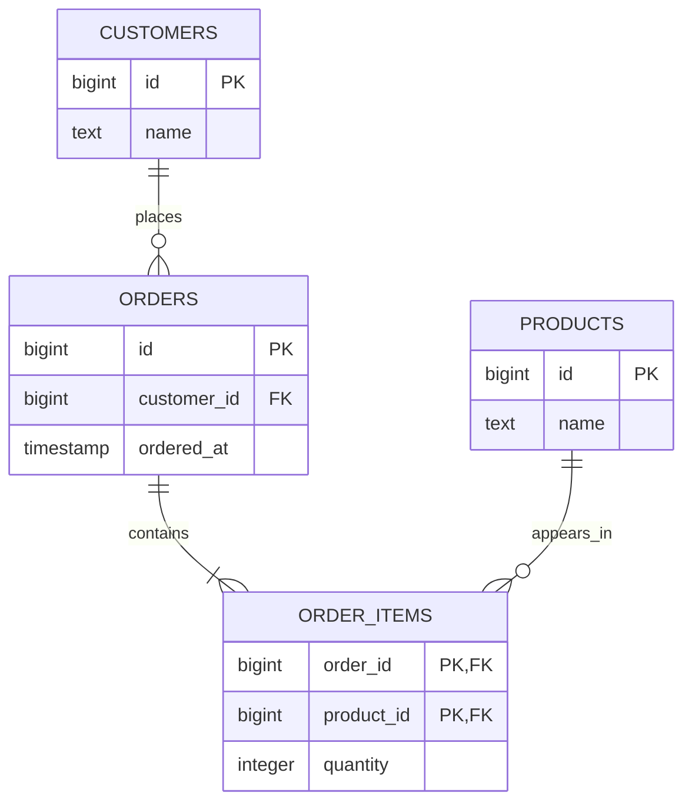

アプリケーションのデータをtableへ入れる前に、「何を同じものとして識別するか」「どの状態を正しいとみなすか」を決める必要があります。リレーショナルモデルは、この判断を行と列の見た目ではなく、集合、属性、キー、制約という形で表現するための土台です。

この章では、後続のストレージやインデックスへ進む前に、論理的なデータ設計を整理します。

## この章で答える問い

- relation、tuple、attributeは、SQLのtable、row、columnと完全に同じなのか
- primary key、foreign key、unique constraintは何を保証するのか
- 自然キーと代理キーは、どのような基準で選ぶのか
- 正規化は何を防ぎ、非正規化は何を引き受けるのか
- スキーマ設計とインデックス設計を分ける必要があるのはなぜか

## relationは値の集合である

リレーショナルモデルでは、relationを同じ属性を持つtupleの集合として扱います。各属性にはdomain、つまり取り得る値の範囲があります。

| リレーショナルモデル | SQLで近いもの | 注意点 |
| --- | --- | --- |
| relation | table | SQLのtableは重複行を許し得る |
| tuple | row | rowには物理的な位置や暗黙の順序を期待しない |
| attribute | column | columnには型とNULL許可などがある |
| domain | data typeとconstraint | SQLの型だけでは業務上の範囲を表し切れないことがある |

数学的なrelationは集合なので、同じtupleが重複せず、tupleの順序もありません。一方、SQLは実務上の都合からbag、つまり重複を許す多重集合として振る舞う場面があります。SELECTの結果に順序が必要ならORDER BYを明示し、重複を除きたいならDISTINCTなどを指定します。

:::caution[暗黙の順序を使わない]
現在たまたま主キー順に返っていても、実行計画、並列実行、ページ配置が変われば順序は変化します。ORDER BYのない結果に順序の保証はありません。
:::

## NULLと三値論理

NULLは空文字列や0ではなく、「値が存在しない、または未知である」ことを表します。NULLを含む比較の結果は、true/falseだけでなくunknownになることがあります。

```sql
SELECT NULL = NULL;       -- unknown
SELECT NULL IS NULL;      -- true
SELECT 1 NOT IN (1, NULL); -- false
SELECT 2 NOT IN (1, NULL); -- unknown
```

WHERE句はtrueになった行だけを残します。falseとunknownはどちらも除外されるため、NULLを含むNOT INや外部結合では直感と異なる結果になりがちです。

NULLを許可するかどうかは、単なる実装上の好みではありません。「未入力」「適用外」「不明」「削除済み」など複数の意味を一つのNULLへ詰め込むと、問い合わせと制約が難しくなります。

## 行を識別するキー

### candidate keyとprimary key

candidate keyは、rowを一意に識別でき、不要な属性を含まない最小の属性集合です。candidate keyが複数ある場合、そのうち一つをprimary keyとして選び、残りも必要ならUNIQUE制約で守ります。

たとえばユーザーを次の属性で表すとします。

```sql
CREATE TABLE users (
  id            BIGINT PRIMARY KEY,
  email         TEXT NOT NULL UNIQUE,
  display_name  TEXT NOT NULL
);
```

idとemailは、どちらも一意ならcandidate keyです。primary keyにidを選んだからといって、emailの重複を許してよいわけではありません。業務上の一意性は別途UNIQUEで表現します。

### natural keyとsurrogate key

natural keyは業務上すでに意味を持つ値です。国コード、商品コード、メールアドレスなどが候補になります。surrogate keyはDB上の識別のために導入する値で、連番やUUIDなどが使われます。

| 観点 | natural key | surrogate key |
| --- | --- | --- |
| 業務上の意味 | ある | 原則としてない |
| 値の変更 | 業務変更の影響を受ける | 通常は変更しない |
| 外部キーの幅 | 複合・長文字列になり得る | 短く統一しやすい |
| 一意性 | そのまま表現できる | natural key側にもUNIQUEが必要 |

surrogate keyを採用しても、業務上の重複防止はなくなりません。たとえばusers.idとは別にusers.emailへUNIQUE制約が必要です。逆にnatural keyが短く安定しているなら、必ずsurrogate keyを追加する必要もありません。

## constraintは正しい状態の境界である

DB constraintは、どの書き込み経路から来た変更にも適用されます。Web APIのバリデーションは分かりやすいエラーを返すために重要ですが、バッチ、管理ツール、別サービスなどすべての経路を永久に網羅する保証にはなりません。

代表的なconstraintを注文スキーマへ適用します。

```sql
CREATE TABLE customers (
  id          BIGINT GENERATED ALWAYS AS IDENTITY PRIMARY KEY,
  email       TEXT NOT NULL UNIQUE,
  name        TEXT NOT NULL
);

CREATE TABLE products (
  id          BIGINT GENERATED ALWAYS AS IDENTITY PRIMARY KEY,
  sku         TEXT NOT NULL UNIQUE,
  name        TEXT NOT NULL,
  price       INTEGER NOT NULL CHECK (price >= 0)
);

CREATE TABLE orders (
  id           BIGINT GENERATED ALWAYS AS IDENTITY PRIMARY KEY,
  customer_id  BIGINT NOT NULL REFERENCES customers(id),
  status       TEXT NOT NULL
               CHECK (status IN ('pending', 'confirmed', 'cancelled')),
  ordered_at   TIMESTAMPTZ NOT NULL,
  UNIQUE (customer_id, id)
);
```

- NOT NULLは値の欠落を防ぐ
- UNIQUEはcandidate keyや業務上の一意性を守る
- CHECKはrow単体で評価できる値域を守る
- FOREIGN KEYは参照先rowの存在を守る
- PRIMARY KEYはNOT NULLかつUNIQUEな代表キーになる

### foreign keyが表すもの

FOREIGN KEYは、参照元の値が参照先に存在することを保証します。削除・更新時の動作は、RESTRICT、CASCADE、SET NULLなどから業務上のライフサイクルに合わせて選びます。

CASCADEは便利ですが、「顧客を削除したら過去の注文も消す」という判断が法務・監査要件に合うとは限りません。参照整合性と削除ポリシーは別々に検討します。

## 関数従属性と正規化

属性集合Xの値が決まると属性集合Yの値が一意に決まるとき、X → Yというfunctional dependency（関数従属性）があるといいます。

次の未整理なデータを考えます。

| order_id | ordered_at | customer_id | customer_name | product_id | product_name | quantity |
| --- | --- | --- | --- | --- | --- | --- |
| 1001 | 2026-08-20 | 10 | Alice | 7 | Keyboard | 1 |
| 1001 | 2026-08-20 | 10 | Alice | 9 | Mouse | 2 |

ここには次のような依存があります。

- order_id → ordered_at, customer_id
- customer_id → customer_name
- product_id → product_name
- order_id, product_id → quantity

一つの表へすべて入れると、同じ顧客名や商品名が注文行ごとに重複します。

### 更新・挿入・削除の異常

- **更新異常**：顧客名を変えるとき、過去の全注文行を更新する必要がある
- **挿入異常**：まだ注文されていない商品を登録できない
- **削除異常**：最後の注文行を消すと、商品情報まで失われる

正規化は、これらの異常が起きる依存関係を別のrelationへ分解する考え方です。



### 第1〜第3正規形の直感

正規形の厳密な定義は依存関係を使いますが、最初は次の直感で捉えます。

1. **第1正規形（1NF）**：一つのcellへ繰り返し項目を詰め込まず、relationとして扱える値にする
2. **第2正規形（2NF）**：複合キーの一部にだけ依存する属性を分離する
3. **第3正規形（3NF）**：キーではない属性を経由して決まる属性を分離する

ORDER_ITEMSのキーが(order_id, product_id)なのにproduct_nameが入っていると、product_nameはproduct_idだけに依存します。PRODUCTSへ分けることで、商品の名称を一か所で管理できます。

:::note[「一つのcell」の意味]
1NFを「文字列を絶対に分割できないこと」と理解すると混乱します。住所や日時も内部的には分割できます。重要なのは、現在のデータモデルで値を一つのdomainとして扱い、集合をカンマ区切り文字列へ隠さないことです。
:::

## 非正規化は意図的な重複である

正規化されたスキーマでも、読み取り要件のために値を重複して保持する場合があります。

例として、注文確定時の商品名と単価をORDER_ITEMSへsnapshotとして保存する設計があります。これは単なる性能対策ではなく、「商品マスタが変更されても、購入時点の明細を残す」という業務上の意味を持ちます。

非正規化するときは、最低限次を決めます。

1. どの値を正とするか
2. 複製された値をいつ更新するか
3. 更新途中の不一致を許容するか
4. 再構築・修復できるか
5. 読み取りの改善が書き込み複雑性に見合うか

「joinを避けたい」だけで重複を導入すると、書き込み経路が増え、transactionや非同期更新の設計まで複雑になります。

## 論理設計と物理設計を分ける

論理設計は、データの意味と正しい状態を決めます。物理設計は、その論理モデルを特定のworkloadで効率よく扱う方法を決めます。

| 論理設計 | 物理設計 |
| --- | --- |
| relationの分割 | tableの物理配置 |
| primary/foreign key | B+tree、hash、LSM-tree |
| NOT NULL、CHECK、UNIQUE | clustered/secondary index |
| transactionで守る不変条件 | partitioning、compression |

「検索が遅いから正規化をやめる」と決める前に、実行計画、index、集約table、cacheなど別の手段を確認します。逆に、理論上きれいな正規化を守るために、必要な履歴やsnapshotを失ってもいけません。

## よくある誤解

### 「primary keyがあれば重複データは存在しない」

surrogate keyが異なれば、業務上同じemailや注文番号を持つrowを複数登録できます。業務上のcandidate keyにもUNIQUE制約が必要です。

### 「foreign keyはjoinを速くする」

FOREIGN KEYの目的は参照整合性です。参照元columnにindexが自動作成されるかどうかは製品によって異なり、join性能は別途確認する必要があります。

### 「正規化されたスキーマは常に最速である」

正規化は更新異常を減らす論理設計であり、特定queryのI/Oを最小にする規則ではありません。性能はworkloadと物理設計を含めて評価します。

## まとめ

- relationは順序を持たないtupleの集合であり、SQLのtableとはbag semanticsやNULLの点で差がある
- candidate keyはrowを一意に識別する最小の属性集合である
- surrogate keyを使っても、業務上の一意性にはUNIQUE制約が必要である
- constraintはすべての書き込み経路に対して正しい状態の境界を作る
- 正規化は関数従属性を整理し、更新・挿入・削除の異常を減らす
- 非正規化では、重複値の正本と同期方法を明示する
- 論理設計とindexなどの物理設計は、分けて考えてから接続する

## 確認問題

1. ORDER BYのないSELECT結果へ順序を期待できない理由を説明してください。
2. surrogate keyを採用しても、natural keyへUNIQUE制約が必要になる例を挙げてください。
3. 顧客名を注文明細へ保存した場合に起きる3種類の更新異常を考えてください。
4. 注文時点の商品単価をORDER_ITEMSへ保存することは、単なる重複でしょうか。業務上の意味も含めて説明してください。
5. アプリケーションのバリデーションだけでなく、DB constraintも置く利点を説明してください。

## 参考資料

- [E. F. Codd, “A Relational Model of Data for Large Shared Data Banks”](https://doi.org/10.1145/362384.362685)
- [PostgreSQL Documentation: Constraints](https://www.postgresql.org/docs/current/ddl-constraints.html)
- [PostgreSQL Documentation: Table Expressions](https://www.postgresql.org/docs/current/queries-table-expressions.html)

次章では、ここで設計したtableがファイル内でどのようにpageとrecordへ変換され、Buffer Poolへ読み込まれるかを追跡します。
