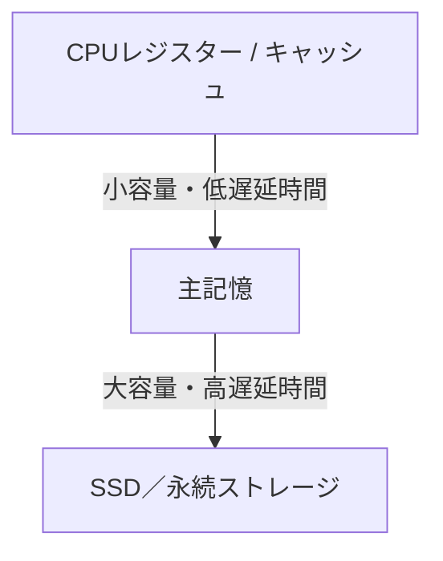
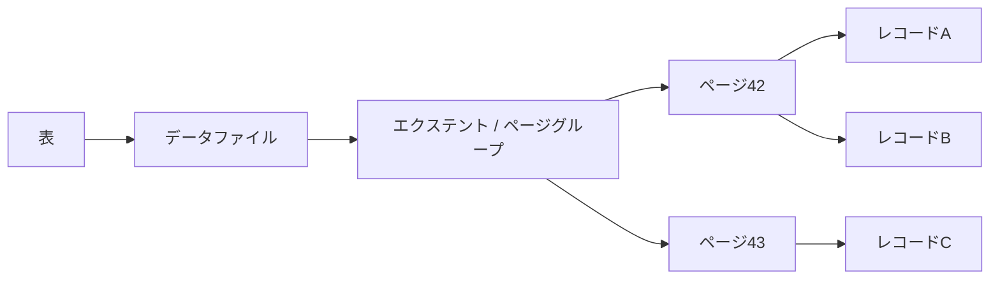
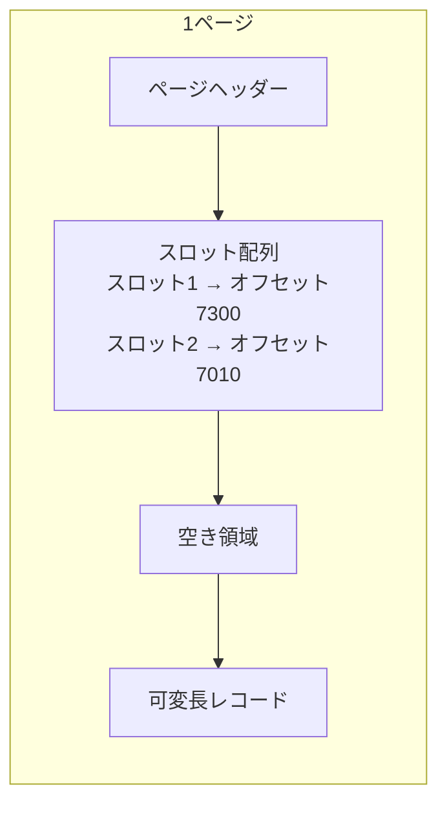
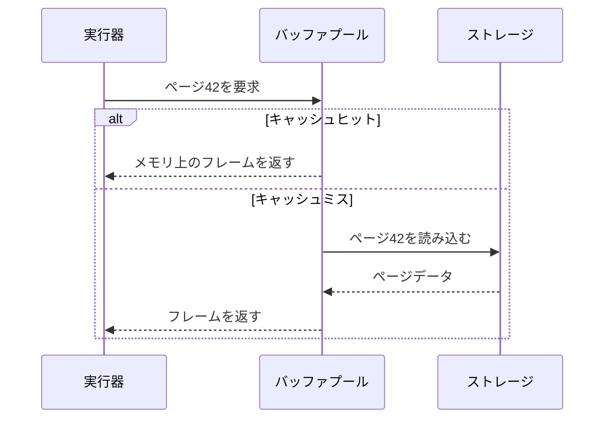

SQLでは行を1件ずつ扱いますが、ストレージは行単位で読み書きされるとは限りません。DBMSは多数の行をページへまとめ、ページをバッファプールへ載せて処理します。

この違いを理解すると、「1件取得なのになぜI/Oが発生するのか」「メモリを増やすとなぜ速くなるのか」「更新した行がすぐデータファイルへ書かれなくてもよいのはなぜか」を説明できるようになります。

## この章で答える問い

- DBが行ではなくページ／ブロック単位で読み書きするのはなぜか
- 可変長レコードをページ内で移動させても、どうやって参照を維持するのか
- バッファプールは何をキャッシュし、未書き出しページをどう扱うのか
- DBのバッファプールとOSのページキャッシュは何が違うのか
- 行指向と列指向ストレージは、どの処理負荷に向くのか

## ストレージ階層とページ

CPUから永続ストレージへ向かうほど、一般に容量は増え、アクセス時間は長くなります。



DBMSはストレージとメモリの間でデータを効率よく運ぶために、固定サイズのページを基本単位として管理します。製品によってページ、ブロックという語の使い方は異なりますが、本書ではDBが管理する固定サイズ領域をページと呼びます。

ページ大きさは4 KiB、8 KiB、16 KiBなど、実装によって異なります。ページを使う理由は次のとおりです。

- I/Oを一定サイズへまとめられる
- ページ番号からファイル内オフセットを計算しやすい
- バッファプールのフレームと一対一に対応させやすい
- チェックサム、WAL、ロックなどの管理単位を作りやすい
- 1回のI/Oで近くの複数レコードを読み、局所性を利用できる

一方、1バイトだけ必要でもページ全体を読むことがあります。したがってアクセスコストは「何行読むか」だけでなく「何ページに散らばっているか」に左右されます。

## ファイル、エクステント、ページ、レコード

単純化すると、表の物理構造は次の階層になります。



- **ファイル**：OS上のファイル。大きな表は複数ファイルへ分かれることがある
- **エクステント**：連続するページ群をまとめた割り当て単位
- **ページ**：I/Oとバッファプール管理の基本単位
- **レコード**：行を物理形式へ符号化したもの

論理的な行と物理的なレコードは同じではありません。レコードには列値だけでなく、長さ、NULLビットマップ、トランザクション可視性情報、別領域へのポインターなどが含まれ得ます。

## ヒープファイル

ヒープファイルは、レコードを特定のキー順へ維持せずページへ格納する基本構造です。新しいレコードは空き領域のあるページへ入り、検索時は必要に応じてページを走査します。

ヒープという名前でも、優先度キューとしてのヒープデータ構造とは別物です。

ヒープファイルには次の管理が必要です。

- どのページに空きがあるか
- ページ内のどこにレコードがあるか
- 削除済み領域をいつ再利用するか
- レコードが移動・拡張した場合に参照をどう保つか

空きページを毎回全走査しないため、空き領域マップやページディレクトリのような補助情報を持つ実装があります。

## スロットページ

可変長レコードをページへ詰める代表的な構造がスロットページです。ページヘッダー側にスロット配列を置き、レコード本体は反対側から詰めます。



外部からレコードを参照するときは、直接バイトオフセットを使う代わりに(ページID, スロットID)というレコードIDを使えます。ページ内でレコード本体を詰め直してオフセットが変わっても、スロットの値を更新すればレコードIDを維持できます。

### ページヘッダーに置かれる情報

実装によって異なりますが、ヘッダーには次のような情報が置かれます。

- ページIDやページ型
- 空き領域の境界
- スロット数
- ページLSN
- チェックサム
- 次・前ページへのリンク
- トランザクションや可視性に関する情報

ページLSNは、そのページへ反映済みのWAL位置を表すために使われます。クラッシュ復旧では、ログレコードを再適用する必要があるか判断する手がかりになります。

## レコードの物理形式

固定長列だけならオフセット計算は簡単です。しかしテキスト、VARCHAR、NULL、可変長配列などがあると、レコードヘッダーとオフセット表が必要になります。

典型的なレコードは概念的に次の部分を持ちます。

| 部分 | 役割 |
| --- | --- |
| レコードヘッダー | 状態、長さ、可視性情報など |
| NULLビットマップ | どの列がNULLか |
| 固定長フィールド | 整数、タイムスタンプなど |
| 可変長メタデータ | 可変長値のオフセットや長さ |
| 可変長データ | テキスト、二分など |

大きな値がページへ収まらない場合、別ページや別ファイルへ格納し、レコード側にポインターを置く実装があります。そのためSELECTで同じ行を読む場合でも、要求する列によってI/O量が変わることがあります。

## バッファプール

バッファプールは、ストレージ上のページをメモリへキャッシュするDBMS内部の領域です。バッファプール内の各フレームが、あるページの内容を保持します。



ページがバッファプールにある状態をキャッシュヒット、ない状態をキャッシュミスと呼びます。キャッシュミスではストレージI/Oが必要になるため、処理負荷の作業集合がバッファプールへ収まるかどうかは性能へ大きく影響します。

### 固定と固定解除

ある演算子がページを使用中に、そのフレームが置換されると困ります。そこでページを使用中として固定し、処理が終わったら固定解除します。

固定件数が0でないフレームは、通常置換対象にできません。長時間大量のページを固定すると、置換可能なフレームが減り、ほかのクエリへ影響します。

### 未書き出しページ

バッファプール内で更新されたものの、まだデータファイルへ書き出されていないページを未書き出しページと呼びます。

未書き出しページをすぐ同期的に書き込むと、各UPDATEがストレージ待ちになり処理量が下がります。WAL方式では、先に必要なログを永続化しておけば、未書き出しページ本体はチェックポイントやバックグラウンドの書き込み処理によって後から書き出せます。

ただし、未書き出しページを置換する場合は書き出しが必要です。未書き出しページが一度に大量に追い出されると、I/O遅延時間の急増が起こり得ます。

## 置換方針

バッファプールが満杯になると、どのフレームを追い出すか選びます。理想は「今後最も長く使われないページ」ですが、未来は分かりません。

代表的な考え方には次があります。

- **LRU**：最近使われていないページを優先して追い出す
- **時計**：参照ビットとリングを使ってLRUを低コストに近似する
- **LRU-K**：直近K回の参照履歴から一時的走査と頻繁な利用を区別する

単純なLRUでは、大きな表走査がバッファプールを一周して、頻繁に使うインデックスページまで追い出すキャッシュ汚染が起き得ます。DBMSは走査リングや複数キューなど、処理負荷を考慮した工夫を行います。

## 順次I/OとランダムI/O

- **順次I/O**：近接ページを順番に読む。先読みや大きなリクエストを利用しやすい
- **ランダムI/O**：離れたページへ飛びながら読む。多数の小さなリクエストになりやすい

SSDではHDDよりランダムアクセスの負担が小さいものの、リクエスト数、キュー、帯域、書き込み増幅は依然として重要です。さらに、ページがメモリにキャッシュされている場合はストレージ特性よりメモリアクセスとCPUコストが中心になります。

「インデックス走査は必ず順次走査より速い」と言えないのは、インデックスから多数の表ページへランダムに移動する場合があるためです。

## 行指向と列-指向

行指向ストレージは、一つの行の列を近くに置きます。列指向ストレージは、同じ列の値をまとめます。

| 観点 | 行指向 | 列-指向 |
| --- | --- | --- |
| 得意な処理負荷 | 少数行の参照・更新、OLTP | 多数行から一部列を集計、OLAP |
| 1行の取得 | 必要列が近い | 複数列領域を組み合わせる |
| 圧縮 | 異なる型・値が混在 | 同種値が並び圧縮しやすい |
| update | 比較的行いやすい | 一括や追記を中心にする実装が多い |
| ベクトル化実行 | 利用可能 | 特に相性がよい |

これは二者択一とは限りません。行保存に列指向インデックスを追加したり、高負荷データを行形式、分析用複製を列形式にしたりする混成設計もあります。

## OSのページキャッシュとの関係

通常のファイルI/Oを使うと、OSもファイルページをキャッシュします。DBMSのバッファプールとOSのページキャッシュの両方に同じデータが存在すると、二重バッファリングになる可能性があります。

DBMSが独自バッファプールを持つ理由には次があります。

- トランザクションやWAL順序を理解して未書き出しページを書き出せる
- クエリや走査パターンを考慮して置換できる
- ページ固定、先読み、バックグラウンド書き込みを制御できる
- メモリ使用量とI/O時期を予測しやすい

一部のDBMSは直接I/OでOSキャッシュを迂回し、一部はOSキャッシュも積極的に利用します。どちらが正しいというより、DBMS、OS、ファイルシステム、処理負荷の組み合わせです。

### fsyncが保証すること

書き込みシステム呼び出しが成功しても、データが装置上の不揮発領域へ到達したとは限りません。OSや装置のキャッシュに残っている可能性があります。永続性が必要な境界ではfsync相当の仕組みを使います。

DBMSがコミットのたびに何をfsyncするかは、WAL、グループコミット、設定によって変わります。アプリケーションから見たコミットの保証を理解するには、DBMS設定とストレージの永続性保証を確認する必要があります。

## ページ数を概算する

8 KiBページ、ページヘッダーとスロットを差し引いた有効領域が約7,800バイト、平均レコード大きさが195バイトだと仮定します。

```text
1ページ当たりレコード数 ≈ ⌊7,800 / 195⌋ = 40

1,000,000レコード / 40 ≈ 25,000ページ

25,000ページ × 8 KiB ≈ 195 MiB
```

これは単純化した概算です。実際には充填率、アラインメント、バージョン、削除済みレコード、外部格納、インデックスが加わります。それでもページ数の桁を把握すると、全件走査やバッファプール容量を考えやすくなります。

## 肥大化、不要版の回収、圧縮

MVCCを使うDBでは、更新時に古いバージョンがすぐ消えないことがあります。削除済み・不可視のレコードがページへ残ると、同じ有効行数でもページ数が増える表の肥大化が起きます。

不要版の回収やコンパクションは再利用可能領域を回収しますが、実装と処理方法は異なります。圧縮はI/O量を減らす一方、CPUコスト、更新の難しさ、ページ再圧縮を増やします。

性能を見るときは論理行数だけでなく、次も確認します。

- 表/インデックスの物理大きさ
- 不要レコードや削除マーカー
- ページ密度と充填率
- バッファプールヒット率
- 読み取り/書き込みページ数

## よくある誤解

### 「1行のSELECTは1行分だけストレージから読む」

通常は行を含むページ全体を読みます。大きな外部格納値やインデックス走査があれば、複数ページへ触れます。

### 「バッファプールヒット率が高ければ性能問題はない」

ヒット率が高くても、不要なページを大量に読むクエリ、ロック待ち、CPU負荷の高い式評価、メモリ不足によるディスク退避は起こり得ます。ヒット率は一つの指標です。

### 「SSDならページ配置を考えなくてよい」

SSDでも帯域、IOPS、リクエスト数、書き込み増幅、キャッシュ局所性は重要です。さらにCPUキャッシュやメモリ局所性の差も残ります。

## まとめ

- DBMSはページをI/Oとメモリ管理の基本単位として使う
- ヒープファイルはキー順を維持せず、空き領域を管理しながらレコードを格納する
- スロットページはスロットを介して可変長レコードを参照し、ページ内の移動を可能にする
- バッファプールはページをフレームへキャッシュし、固定、未書き出し、置換を管理する
- WALが先に永続化されれば、未書き出しページ本体は後から書き出せる
- 順次/ランダムI/Oの差は、キャッシュとストレージ特性を含めて評価する
- 行指向と列指向ストレージは、OLTPとOLAPのアクセスパターンに適合させる

## 確認問題

1. 1件の行取得でもページ全体を読む設計には、どのような利点と欠点がありますか。
2. スロットページでレコード本体を移動してもレコードIDを維持できる理由を説明してください。
3. 未書き出しページをコミット時に毎回書き出さなくてもよい条件は何ですか。
4. 大規模表走査が単純LRUのバッファプールへ与える影響を説明してください。
5. 平均レコード大きさとページ大きさから表走査のI/O量を概算してください。

## 参考資料

- [PostgreSQL Documentation: Database Page Layout](https://www.postgresql.org/docs/current/storage-page-layout.html)
- [PostgreSQL Documentation: Resource Consumption — Memory](https://www.postgresql.org/docs/current/runtime-config-resource.html)
- [SQLite Documentation: Database File Format](https://www.sqlite.org/fileformat.html)

次章では、ページを木構造へ編成し、少ないI/Oで目的のキーへ到達するB-木/B+木を扱います。
