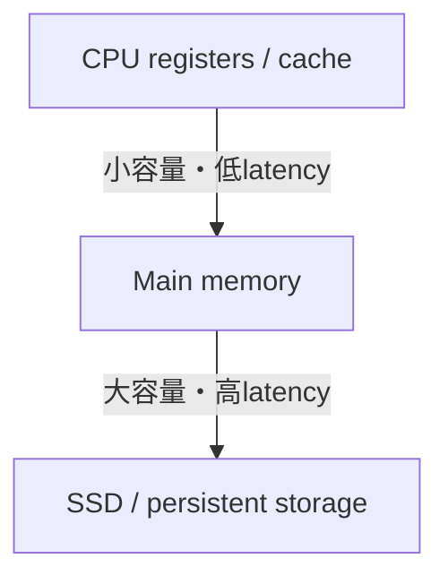
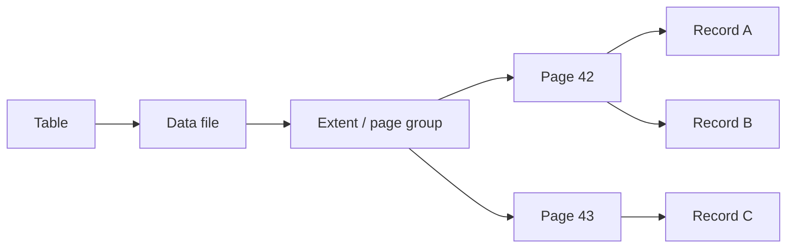
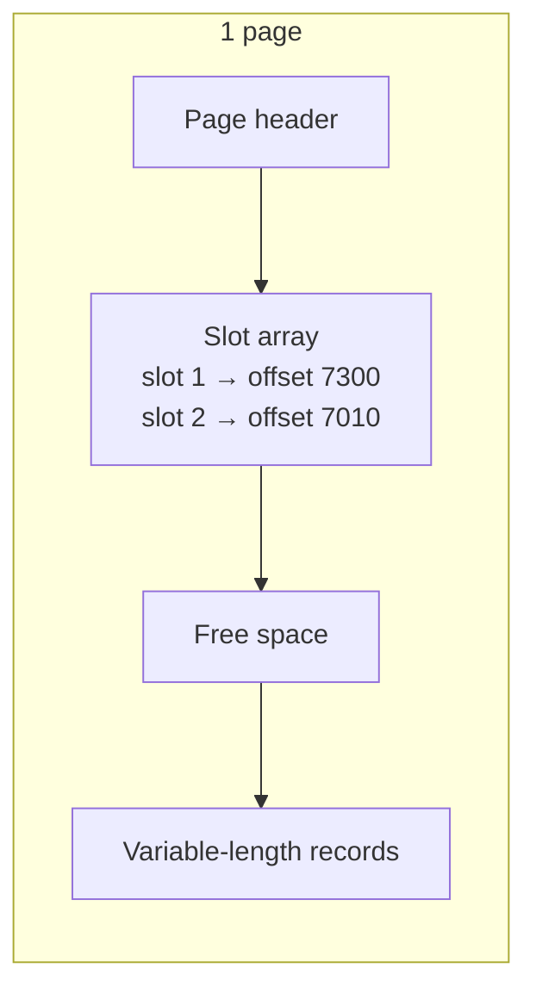
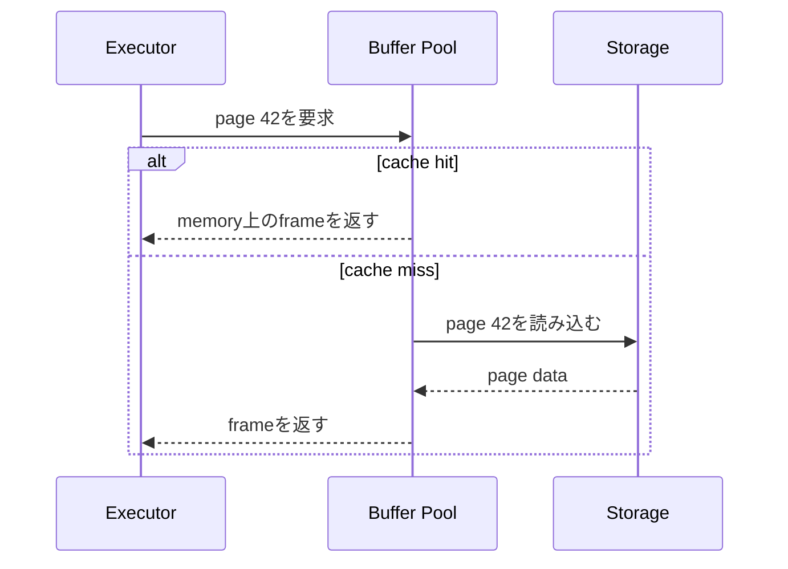

SQLではrowを1件ずつ扱いますが、ストレージはrow単位で読み書きされるとは限りません。DBMSは多数のrowをpageへまとめ、pageをBuffer Poolへ載せて処理します。

この違いを理解すると、「1件取得なのになぜI/Oが発生するのか」「メモリを増やすとなぜ速くなるのか」「更新したrowがすぐデータファイルへ書かれなくてもよいのはなぜか」を説明できるようになります。

## この章で答える問い

- DBがrowではなくpage/block単位で読み書きするのはなぜか
- 可変長recordをpage内で移動させても、どうやって参照を維持するのか
- Buffer Poolは何をcacheし、dirty pageをどう扱うのか
- DBのBuffer PoolとOS page cacheは何が違うのか
- row-orientedとcolumn-oriented storageは、どのworkloadに向くのか

## ストレージ階層とpage

CPUから永続ストレージへ向かうほど、一般に容量は増え、アクセス時間は長くなります。



DBMSはストレージとメモリの間でデータを効率よく運ぶために、固定サイズのpageを基本単位として管理します。製品によってpage、blockという語の使い方は異なりますが、本書ではDBが管理する固定サイズ領域をpageと呼びます。

Page sizeは4 KiB、8 KiB、16 KiBなど、実装によって異なります。pageを使う理由は次のとおりです。

- I/Oを一定サイズへまとめられる
- page番号からファイル内offsetを計算しやすい
- Buffer Poolのframeと一対一に対応させやすい
- checksum、WAL、lockなどの管理単位を作りやすい
- 1回のI/Oで近くの複数recordを読み、局所性を利用できる

一方、1byteだけ必要でもpage全体を読むことがあります。したがってアクセスコストは「何row読むか」だけでなく「何pageに散らばっているか」に左右されます。

## file、extent、page、record

単純化すると、tableの物理構造は次の階層になります。



- **file**：OS上のファイル。大きなtableは複数fileへ分かれることがある
- **extent**：連続するpage群をまとめた割り当て単位
- **page**：I/OとBuffer Pool管理の基本単位
- **record**：rowを物理形式へencodeしたもの

論理的なrowと物理的なrecordは同じではありません。recordにはcolumn値だけでなく、長さ、NULL bitmap、transaction visibility情報、別領域へのpointerなどが含まれ得ます。

## heap file

Heap fileは、recordを特定のkey順へ維持せずpageへ格納する基本構造です。新しいrecordは空き領域のあるpageへ入り、検索時は必要に応じてpageを走査します。

Heapという名前でも、priority queueとしてのheap data structureとは別物です。

Heap fileには次の管理が必要です。

- どのpageに空きがあるか
- page内のどこにrecordがあるか
- 削除済み領域をいつ再利用するか
- recordが移動・拡張した場合に参照をどう保つか

空きpageを毎回全走査しないため、free space mapやpage directoryのような補助情報を持つ実装があります。

## slotted page

可変長recordをpageへ詰める代表的な構造がslotted pageです。Page header側にslot arrayを置き、record本体は反対側から詰めます。



外部からrecordを参照するときは、直接byte offsetを使う代わりに(page ID, slot ID)というrecord IDを使えます。Page内でrecord本体を詰め直してoffsetが変わっても、slotの値を更新すればrecord IDを維持できます。

### page headerに置かれる情報

実装によって異なりますが、headerには次のような情報が置かれます。

- page IDやpage type
- free spaceの境界
- slot数
- page LSN
- checksum
- 次・前pageへのlink
- transactionやvisibilityに関する情報

Page LSNは、そのpageへ反映済みのWAL位置を表すために使われます。Crash recoveryでは、log recordを再適用する必要があるか判断する手がかりになります。

## recordの物理形式

固定長columnだけならoffset計算は簡単です。しかしTEXT、VARCHAR、NULL、可変長配列などがあると、record headerとoffset tableが必要になります。

典型的なrecordは概念的に次の部分を持ちます。

| 部分 | 役割 |
| --- | --- |
| record header | 状態、長さ、visibility情報など |
| NULL bitmap | どのcolumnがNULLか |
| fixed-length fields | integer、timestampなど |
| variable-length metadata | 可変長値のoffsetや長さ |
| variable-length payload | text、binaryなど |

大きな値がpageへ収まらない場合、別pageや別fileへ格納し、record側にpointerを置く実装があります。そのためSELECTで同じrowを読む場合でも、要求するcolumnによってI/O量が変わることがあります。

## Buffer Pool

Buffer Poolは、ストレージ上のpageをメモリへcacheするDBMS内部の領域です。Buffer Pool内の各frameが、あるpageの内容を保持します。



PageがBuffer Poolにある状態をcache hit、ない状態をcache missと呼びます。Cache missではストレージI/Oが必要になるため、workloadのworking setがBuffer Poolへ収まるかどうかは性能へ大きく影響します。

### pinとunpin

ある演算子がpageを使用中に、そのframeが置換されると困ります。そこでpageを使用中としてpinし、処理が終わったらunpinします。

Pin countが0でないframeは、通常replacement対象にできません。長時間大量のpageをpinすると、置換可能なframeが減り、ほかのqueryへ影響します。

### dirty page

Buffer Pool内で更新されたものの、まだデータファイルへ書き出されていないpageをdirty pageと呼びます。

Dirty pageをすぐ同期書き込みすると、各UPDATEがストレージ待ちになりthroughputが下がります。WAL方式では、先に必要なlogを永続化しておけば、dirty page本体はcheckpointやbackground writerによって後から書き出せます。

ただし、dirty pageを置換する場合は書き出しが必要です。Dirty pageが一度に大量に追い出されると、I/O latencyのspikeが起こり得ます。

## replacement policy

Buffer Poolが満杯になると、どのframeを追い出すか選びます。理想は「今後最も長く使われないpage」ですが、未来は分かりません。

代表的な考え方には次があります。

- **LRU**：最近使われていないpageを優先して追い出す
- **Clock**：参照bitとringを使ってLRUを低コストに近似する
- **LRU-K**：直近K回の参照履歴から一時的scanと頻繁な利用を区別する

単純なLRUでは、大きなtable scanがBuffer Poolを一周して、頻繁に使うindex pageまで追い出すcache pollutionが起き得ます。DBMSはscan ringや複数queueなど、workloadを考慮した工夫を行います。

## sequential I/Oとrandom I/O

- **sequential I/O**：近接pageを順番に読む。read-aheadや大きなrequestを利用しやすい
- **random I/O**：離れたpageへ飛びながら読む。多数の小さなrequestになりやすい

SSDではHDDよりrandom accessのpenaltyが小さいものの、request数、queue、帯域、write amplificationは依然として重要です。さらに、pageがmemoryにcacheされている場合はストレージ特性よりmemory accessとCPU costが中心になります。

「index scanは必ずsequential scanより速い」と言えないのは、indexから多数のtable pageへrandomに移動する場合があるためです。

## row-orientedとcolumn-oriented

Row-oriented storageは、一つのrowのcolumnを近くに置きます。Column-oriented storageは、同じcolumnの値をまとめます。

| 観点 | row-oriented | column-oriented |
| --- | --- | --- |
| 得意なworkload | 少数rowの参照・更新、OLTP | 多数rowから一部columnを集計、OLAP |
| 1 rowの取得 | 必要columnが近い | 複数column領域を組み合わせる |
| compression | 異なる型・値が混在 | 同種値が並び圧縮しやすい |
| update | 比較的行いやすい | batchや追記を中心にする実装が多い |
| vectorized execution | 利用可能 | 特に相性がよい |

これは二者択一とは限りません。行storeにcolumnar indexを追加したり、hot dataをrow形式、分析用copyをcolumn形式にしたりするhybrid設計もあります。

## OS page cacheとの関係

通常のfile I/Oを使うと、OSもfile pageをcacheします。DBMSのBuffer PoolとOS page cacheの両方に同じデータが存在すると、double bufferingになる可能性があります。

DBMSが独自Buffer Poolを持つ理由には次があります。

- transactionやWAL順序を理解してdirty pageを書き出せる
- queryやscan patternを考慮してreplacementできる
- page pin、prefetch、background writeを制御できる
- memory使用量とI/O timingを予測しやすい

一部のDBMSはDirect I/OでOS cacheを迂回し、一部はOS cacheも積極的に利用します。どちらが正しいというより、DBMS、OS、filesystem、workloadの組み合わせです。

### fsyncが保証すること

write system callが成功しても、データがdevice上の不揮発領域へ到達したとは限りません。OSやdeviceのcacheに残っている可能性があります。Durabilityが必要な境界ではfsync相当の仕組みを使います。

DBMSがcommitのたびに何をfsyncするかは、WAL、group commit、設定によって変わります。アプリケーションから見たcommitの保証を理解するには、DBMS設定とstorageのdurability保証を確認する必要があります。

## page数を概算する

8 KiB page、page headerとslotを差し引いた有効領域が約7,800 bytes、平均record sizeが195 bytesだと仮定します。

```text
records per page ≈ floor(7,800 / 195) = 40

1,000,000 records / 40 ≈ 25,000 pages

25,000 pages × 8 KiB ≈ 195 MiB
```

これは単純化した概算です。実際にはfill factor、alignment、version、削除済みrecord、外部格納、indexが加わります。それでもpage数の桁を把握すると、full scanやBuffer Pool容量を考えやすくなります。

## bloat、vacuum、compression

MVCCを使うDBでは、更新時に古いversionがすぐ消えないことがあります。削除済み・不可視のrecordがpageへ残ると、同じ有効row数でもpage数が増えるtable bloatが起きます。

Vacuumやcompactionは再利用可能領域を回収しますが、実装と処理方法は異なります。CompressionはI/O量を減らす一方、CPU cost、更新の難しさ、page再圧縮を増やします。

性能を見るときは論理row数だけでなく、次も確認します。

- table/indexの物理size
- dead recordやtombstone
- page densityとfill factor
- Buffer Pool hit率
- read/write page数

## よくある誤解

### 「1 rowのSELECTは1 row分だけストレージから読む」

通常はrowを含むpage全体を読みます。大きな外部格納値やindex traversalがあれば、複数pageへ触れます。

### 「Buffer Pool hit率が高ければ性能問題はない」

Hit率が高くても、不要なpageを大量に読むquery、lock待ち、CPU-intensiveな式評価、memory spillは起こり得ます。Hit率は一つのsignalです。

### 「SSDならpage配置を考えなくてよい」

SSDでも帯域、IOPS、request数、write amplification、cache localityは重要です。さらにCPU cacheやmemory localityの差も残ります。

## まとめ

- DBMSはpageをI/Oとmemory管理の基本単位として使う
- heap fileはkey順を維持せず、free spaceを管理しながらrecordを格納する
- slotted pageはslotを介して可変長recordを参照し、page内の移動を可能にする
- Buffer Poolはpageをframeへcacheし、pin、dirty、replacementを管理する
- WALが先に永続化されれば、dirty page本体は後から書き出せる
- sequential/random I/Oの差は、cacheとstorage特性を含めて評価する
- row-orientedとcolumn-oriented storageは、OLTPとOLAPのaccess patternに適合させる

## 確認問題

1. 1件のrow取得でもpage全体を読む設計には、どのような利点と欠点がありますか。
2. Slotted pageでrecord本体を移動してもrecord IDを維持できる理由を説明してください。
3. Dirty pageをcommit時に毎回書き出さなくてもよい条件は何ですか。
4. 大規模table scanが単純LRUのBuffer Poolへ与える影響を説明してください。
5. 平均record sizeとpage sizeからtable scanのI/O量を概算してください。

## 参考資料

- [PostgreSQL Documentation: Database Page Layout](https://www.postgresql.org/docs/current/storage-page-layout.html)
- [PostgreSQL Documentation: Resource Consumption — Memory](https://www.postgresql.org/docs/current/runtime-config-resource.html)
- [SQLite Documentation: Database File Format](https://www.sqlite.org/fileformat.html)

次章では、pageを木構造へ編成し、少ないI/Oで目的のkeyへ到達するB-tree/B+treeを扱います。
