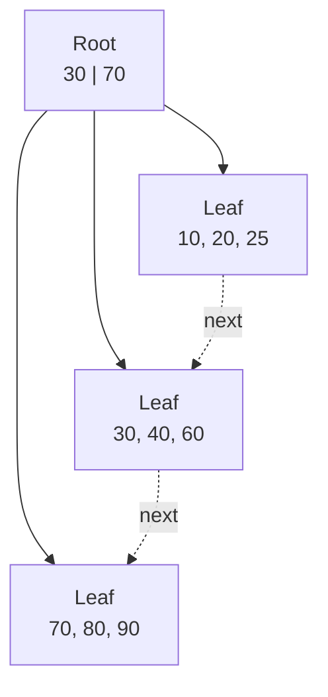
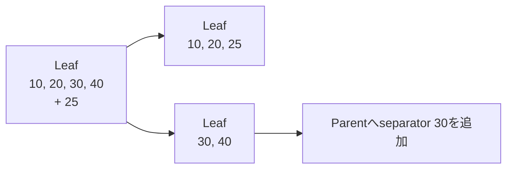
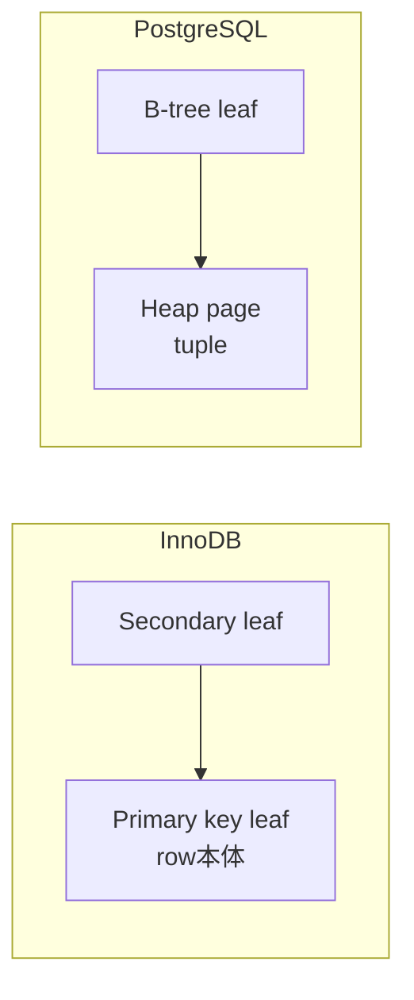

Indexは「検索を速くする追加データ構造」です。ただし、どの検索にも効く魔法ではありません。Indexを追加すると、読み取り経路が増える一方、書き込み、memory、storage、maintenanceのcostも増えます。

この章では、RDBで広く使われるB-tree系indexをpage構造として理解し、queryに合わせたindex設計へつなげます。

## この章で答える問い

- B-treeとB+treeはbinary search treeと何が違うのか
- なぜB+treeはストレージ上の検索と範囲走査に向くのか
- clustered indexとsecondary indexでtable lookupはどう変わるのか
- 複合indexは、どの条件とORDER BYに利用できるのか
- covering indexは何を省略し、どのcostを増やすのか

## binary treeではなく多分木を使う理由

Memory上のbalanced binary search treeなら、N件の検索はO(log₂N)です。しかし各nodeが別pageにあると、木の高さだけI/Oが必要になります。

B-tree系構造は、一つのnodeへ多数のkeyとchild pointerを置きます。この分岐数をfan-outと呼びます。1 pageに数百のchild pointerを置ければ、数億件あっても木の高さを小さくできます。

たとえばfan-outが400なら、単純化して次の件数を表せます。

```text
height 1:          400 entries
height 2:      160,000 entries
height 3:   64,000,000 entries
height 4: 25,600,000,000 entries
```

Rootや上位nodeがBuffer Poolに残っていれば、検索ごとに必要なstorage I/Oは主にleaf付近だけになります。

## B-treeとB+tree

用語は文献・製品によって揺れますが、教科書的には次のように区別します。

- **B-tree**：内部nodeにもrecordまたはrecord pointerを置ける
- **B+tree**：内部nodeはseparator keyとchild pointerを持ち、全entryをleafへ置く

B+treeのleafはkey順にlinkされるため、あるkeyを見つけた後に隣のleafへ進む範囲走査が容易です。



DB製品がindexを「B-tree」と呼んでいても、leafにentryを集めてlinkするB+treeに近い実装が一般的です。本書では製品名を尊重しつつ、構造を説明するときはB+treeと呼びます。

## point lookup

WHERE id = 42001の検索を考えます。

1. Root pageでseparator keyを比較し、childを選ぶ
2. Internal pageがあれば同様にchildを選ぶ
3. Leaf page内を検索し、index entryを見つける
4. Entryがrow本体でなければ、record IDやprimary keyでtableを読む

最後のtable accessは製品・index種別によって異なります。Indexだけで必要columnがそろう場合は省略できることがあります。

## range scan

次のqueryでは、ordered_atの下限をB+treeで探し、その後leafを順番にたどれます。

```sql
SELECT id, ordered_at, total_amount
FROM orders
WHERE ordered_at >= TIMESTAMPTZ '2026-08-01'
  AND ordered_at <  TIMESTAMPTZ '2026-09-01'
ORDER BY ordered_at;
```

Start keyへ到達するcostに加えて、条件に該当するleaf pageと必要なtable pageを読みます。結果件数が多いほど後半のcostが支配的になり、table scanのほうが有利になる場合があります。

## insert、split、merge

新しいentryはkey順に対応するleafへ入ります。Leafに空きがなければpage splitします。



Splitでは新しいpageの割り当て、entry移動、parent更新、WALなどが必要です。Parentも満杯ならsplitが上へ伝播し、root splitで木が一段高くなることがあります。

Delete後に利用率が下がると、mergeやredistributionでpageをまとめる実装があります。ただし、並行アクセス中の即時mergeを避け、後からmaintenanceする製品もあります。

### fill factor

Pageを最初から100%埋めず空きを残すと、将来のinsert/updateによるsplitを減らせます。その代わり、同じentry数に必要なpageが増え、read I/Oとmemory使用が増えます。

単調増加keyはtree右端へinsertが集中しやすく、random keyはpage全体へ分散します。UUIDの種類やkey生成方法は、分散性だけでなくindex localityにも影響します。

## clustered index

Clusteredという語は製品ごとに意味が異なるため、物理構造まで確認する必要があります。

### InnoDB

InnoDBではtable data自体がprimary keyのclustered index leafへ格納されます。

- Primary key lookupはleafでrow本体へ到達する
- Secondary index leafは、row locatorとしてprimary key値を持つ
- Secondary indexからrow全体を読むと、primary key B+treeをもう一度たどる
- Primary keyが長いと、すべてのsecondary index entryも大きくなり得る

Primary keyがない場合のclustered key選択規則もあるため、明示的に安定したkeyを設計するのが基本です。

### PostgreSQL

PostgreSQLの通常tableはheapであり、B-tree index leafはheap tupleを指すTIDを持ちます。CLUSTERコマンドであるindex順にtableを並べ直せますが、その順序は後続の更新で自動維持されません。

つまり「clustered index」という同じ言葉から、InnoDBとPostgreSQLで同じtable accessを想像してはいけません。



## secondary index

Primary/clustered access path以外のindexをsecondary indexと呼びます。Secondary indexは異なる検索条件を支えますが、row本体へ追加accessが必要な場合があります。

次のquery用にcustomer_idへindexを作るとします。

```sql
CREATE INDEX orders_customer_id_idx
ON orders (customer_id);
```

一人の顧客の注文が物理的に近ければtable page数は少なくなります。全体へ散らばっていれば、多数のrandom table accessになる可能性があります。Optimizerは対象件数とcorrelationを含む統計から、index scanを使うか判断します。

## composite index

Composite indexは複数columnを順序付きtupleとして保持します。

```sql
CREATE INDEX orders_customer_ordered_idx
ON orders (customer_id, ordered_at DESC);
```

Index orderは概念的に次のようになります。

```text
(customer_id=10, ordered_at=2026-08-20)
(customer_id=10, ordered_at=2026-08-18)
(customer_id=10, ordered_at=2026-08-02)
(customer_id=11, ordered_at=2026-08-19)
```

このindexは次のqueryと相性がよいです。

```sql
SELECT id, ordered_at
FROM orders
WHERE customer_id = 10
ORDER BY ordered_at DESC
LIMIT 20;
```

先頭columncustomer_idを固定すると、その範囲内でordered_at順に読めるからです。

### leftmost prefix

一般にB+tree composite indexは、左から連続するcolumn条件を利用しやすい構造です。

| 条件 | 利用の考え方 |
| --- | --- |
| customer_id = ? | 先頭columnなので範囲を絞れる |
| customer_id = ? AND ordered_at >= ? | 2 columnで狭い範囲を作れる |
| ordered_at >= ? | 先頭customer_idが未指定なので全体に散らばる |
| customer_id >= ? AND ordered_at = ? | 最初のrange以降を探索境界へ使いにくい |

製品によってskip scanなどの最適化がありますが、基本構造を理解したうえで実行計画を確認します。

### column順をselectivityだけで決めない

「selectivityが高いcolumnを必ず先頭にする」という規則だけでは不十分です。次をまとめて考えます。

- equalityかrangeか
- 複数queryで共通するprefix
- ORDER BYやGROUP BY
- join condition
- 更新頻度とentry size
- partition keyとの関係

## covering indexとindex-only scan

Queryに必要なcolumnがすべてindex entryにあれば、table pageを読まずに結果を返せる可能性があります。

```sql
CREATE INDEX orders_customer_covering_idx
ON orders (customer_id, ordered_at DESC)
INCLUDE (status, total_amount);
```

Key columnは探索と順序に使われ、INCLUDE columnはpayloadとしてleafへ置かれます。これによりindex-only scanが可能になります。

ただし「indexに値がある」だけではtable accessを必ず省略できるとは限りません。MVCC visibilityをtable側で確認する実装では追加情報が必要です。PostgreSQLはvisibility mapを使い、page上の全tupleが可視と分かる場合にheap accessを省略できます。

Covering indexのcostもあります。

- entryが大きくなりfan-outが下がる
- leaf page数が増える
- update時に書き換えるindexが増える
- Buffer Poolを多く使う
- vacuumやmaintenance costが増える

## partial index

一部のrowだけをindexへ入れるpartial indexは、条件が安定しておりquery predicateと合致する場合に有効です。

```sql
CREATE INDEX orders_pending_idx
ON orders (ordered_at)
WHERE status = 'pending';
```

Pendingが全注文のごく一部なら、小さくhotなindexを作れます。一方、query conditionがpartial index predicateを満たすとoptimizerが証明できなければ使われません。

## selectivityとcardinality

Selectivityは、条件に一致する割合です。1億row中1件なら非常に高い選別性、半分なら低い選別性と表現します。

Index scanの概算costを次のように分けると理解しやすくなります。

```text
tree traversal
+ matching leaf pages
+ table pages
+ CPU for comparison / visibility
```

対象rowが増えるとtree traversalの定数部分より、leafとtable accessが支配的になります。低selectivity条件ではsequential scanが有利になり得ます。

## index designの手順

1. 遅いqueryと実際のparameter分布を特定する
2. WHERE、JOIN、ORDER BY、GROUP BY、SELECT columnを分ける
3. equality、range、sort、LIMITを考えてkey順を決める
4. table lookup削減の価値が高ければcoveringを検討する
5. 書き込み量、既存indexとの重複、storage costを評価する
6. EXPLAIN ANALYZEとproductionに近いdata分布で検証する
7. 利用されないindexを監視し、削除候補にする

## よくある誤解

### 「columnごとにindexを作ればよい」

複数の単一column indexを組み合わせられる場合もありますが、composite indexの順序やcoveringとはcostが異なります。書き込み時はすべてのindex更新が必要です。

### 「primary key lookupはどのDBでも1回のB+tree traversal」

InnoDB clustered primary key、PostgreSQL heap、ほかのstorage engineではrow本体への到達方法が異なります。

### 「index sizeはtable sizeに比べれば無視できる」

複数のwide covering indexや長いprimary keyは、storage、memory、WAL、backup、replication量を大きくします。

## まとめ

- B+treeは高いfan-outで木の高さを抑え、leaf linkでrange scanを可能にする
- Insertではpage splitが発生し、fill factorはread密度とwrite余裕を交換する
- Clustered/secondary indexの物理構造は製品ごとに確認する
- Composite indexは左からのkey順、equality、range、sortを合わせて設計する
- Covering indexはtable accessを減らす代わりにentryとwrite costを増やす
- Selectivityが低い条件ではtable scanが有利になり得る
- Indexはqueryとdata分布を測定して設計し、維持costまで評価する

## 確認問題

1. Fan-out 400のB+treeがbinary treeよりstorage I/Oを減らせる理由を説明してください。
2. InnoDBのsecondary index lookupでprimary keyが必要になる理由は何ですか。
3. (customer_id, ordered_at) indexがordered_at単独条件に使いにくい理由を説明してください。
4. Covering indexがreadを改善し、writeを悪化させる経路を列挙してください。
5. 対象rowがtableの40%ある場合、index scanとtable scanをどう比較しますか。

## 参考資料

- [PostgreSQL Documentation: B-Tree Indexes](https://www.postgresql.org/docs/current/btree.html)
- [PostgreSQL Documentation: Index-Only Scans and Covering Indexes](https://www.postgresql.org/docs/current/indexes-index-only-scans.html)
- [PostgreSQL Documentation: Partial Indexes](https://www.postgresql.org/docs/current/indexes-partial.html)
- [MySQL Documentation: Clustered and Secondary Indexes](https://dev.mysql.com/doc/refman/8.4/en/innodb-index-types.html)

次章では、等価検索に特化したhash indexと、書き込みを順次I/Oへ変換するLSM-treeを扱います。
