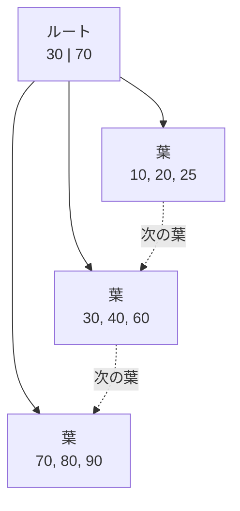
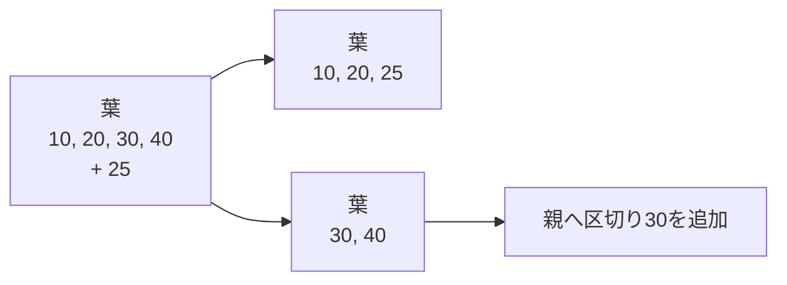
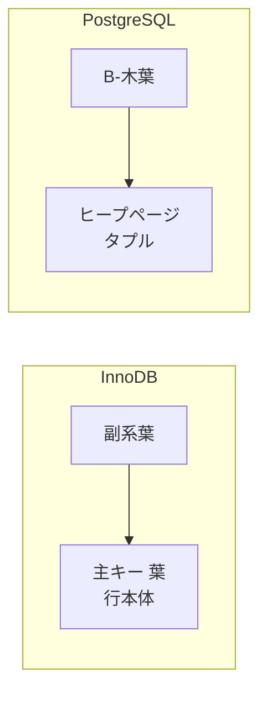

インデックスは「検索を速くする追加データ構造」です。ただし、どの検索にも効く魔法ではありません。インデックスを追加すると、読み取り経路が増える一方、書き込み、メモリ、ストレージ、保守のコストも増えます。

この章では、RDBで広く使われるB-木系インデックスをページ構造として理解し、クエリに合わせたインデックス設計へつなげます。

## この章で答える問い

- B-木とB+木は二分探索木と何が違うのか
- なぜB+木はストレージ上の検索と範囲走査に向くのか
- クラスタ化インデックスとセカンダリインデックスで表の参照はどう変わるのか
- 複合インデックスは、どの条件とORDER BYに利用できるのか
- カバリングインデックスは何を省略し、どのコストを増やすのか

## 二分木ではなく多分木を使う理由

メモリ上の平衡二分探索木なら、N件の検索はO(ログ₂N)です。しかし各ノードが別ページにあると、木の高さだけI/Oが必要になります。

B-木系構造は、一つのノードへ多数のキーと子ポインターを置きます。この分岐数を分岐数と呼びます。1ページに数百の子ポインターを置ければ、数億件あっても木の高さを小さくできます。

たとえば分岐数が400なら、単純化して次の件数を表せます。

```text
高さ1:          400項目
高さ2:      160,000項目
高さ3:   64,000,000項目
高さ4: 25,600,000,000項目
```

ルートや上位ノードがバッファプールに残っていれば、検索ごとに必要なストレージI/Oは主に葉付近だけになります。

## B-木とB+木

用語は文献・製品によって揺れますが、教科書的には次のように区別します。

- **B-木**：内部ノードにもレコードまたはレコードポインターを置ける
- **B+木**：内部ノードは区切りキーと子ポインターを持ち、全項目を葉へ置く

B+木の葉はキー順にリンクされるため、あるキーを見つけた後に隣の葉へ進む範囲走査が容易です。



DB製品がインデックスを「B-木」と呼んでいても、葉に項目を集めてリンクするB+木に近い実装が一般的です。本書では製品名を尊重しつつ、構造を説明するときはB+木と呼びます。

## 単一キー検索

WHERE id = 42001の検索を考えます。

1. ルートページで区切りキーを比較し、子を選ぶ
2. 内部ページがあれば同様に子を選ぶ
3. 葉ページ内を検索し、インデックス項目を見つける
4. 項目が行本体でなければ、レコードIDや主キーで表を読む

最後の表アクセスは製品・インデックス種別によって異なります。インデックスだけで必要列がそろう場合は省略できることがあります。

## 範囲走査

次のクエリでは、ordered_atの下限をB+木で探し、その後葉を順番にたどれます。

```sql
SELECT id, ordered_at, total_amount
FROM orders
WHERE ordered_at >= TIMESTAMPTZ '2026-08-01'
  AND ordered_at <  TIMESTAMPTZ '2026-09-01'
ORDER BY ordered_at;
```

開始キーへ到達するコストに加えて、条件に該当する葉ページと必要な表ページを読みます。結果件数が多いほど後半のコストが支配的になり、表走査のほうが有利になる場合があります。

## 挿入、分割、マージ

新しい項目はキー順に対応する葉へ入ります。葉に空きがなければページ分割します。



分割では新しいページの割り当て、項目移動、親更新、WALなどが必要です。親も満杯なら分割が上へ伝播し、ルート分割で木が一段高くなることがあります。

削除後に利用率が下がると、マージや再分配でページをまとめる実装があります。ただし、並行アクセス中の即時マージを避け、後から保守する製品もあります。

### 充填率

ページを最初から100%埋めず空きを残すと、将来の挿入／更新による分割を減らせます。その代わり、同じ項目数に必要なページが増え、読み取りI/Oとメモリ使用が増えます。

単調増加キーは木右端へ挿入が集中しやすく、ランダムキーはページ全体へ分散します。UUIDの種類やキー生成方法は、分散性だけでなくインデックス局所性にも影響します。

## クラスタ化インデックス

クラスタ化という語は製品ごとに意味が異なるため、物理構造まで確認する必要があります。

### InnoDB

InnoDBでは表データ自体が主キーのクラスタ化インデックス葉へ格納されます。

- 主キー 参照は葉で行本体へ到達する
- セカンダリインデックス葉は、行位置情報として主キー値を持つ
- セカンダリインデックスから行全体を読むと、主キー B+木をもう一度たどる
- 主キーが長いと、すべてのセカンダリインデックス項目も大きくなり得る

主キーがない場合のクラスタ化キー選択規則もあるため、明示的に安定したキーを設計するのが基本です。

### PostgreSQL

PostgreSQLの通常表はヒープであり、B-木インデックス葉はヒープタプルを指すTIDを持ちます。クラスターコマンドであるインデックス順に表を並べ直せますが、その順序は後続の更新で自動維持されません。

つまり「クラスタ化インデックス」という同じ言葉から、InnoDBとPostgreSQLで同じ表アクセスを想像してはいけません。



## セカンダリインデックス

主系/クラスタ化アクセス経路以外のインデックスをセカンダリインデックスと呼びます。セカンダリインデックスは異なる検索条件を支えますが、行本体へ追加アクセスが必要な場合があります。

次のクエリ用にcustomer_idへインデックスを作るとします。

```sql
CREATE INDEX orders_customer_id_idx
ON orders (customer_id);
```

一人の顧客の注文が物理的に近ければ表ページ数は少なくなります。全体へ散らばっていれば、多数のランダム表アクセスになる可能性があります。最適化器は対象件数と相関を含む統計から、インデックス走査を使うか判断します。

## 複合インデックス

複合インデックスは複数列を順序付きタプルとして保持します。

```sql
CREATE INDEX orders_customer_ordered_idx
ON orders (customer_id, ordered_at DESC);
```

インデックス注文は概念的に次のようになります。

```text
(customer_id=10, ordered_at=2026-08-20)
(customer_id=10, ordered_at=2026-08-18)
(customer_id=10, ordered_at=2026-08-02)
(customer_id=11, ordered_at=2026-08-19)
```

このインデックスは次のクエリと相性がよいです。

```sql
SELECT id, ordered_at
FROM orders
WHERE customer_id = 10
ORDER BY ordered_at DESC
LIMIT 20;
```

先頭列のcustomer_idを固定すると、その範囲内でordered_at順に読めるからです。

### 左端接頭辞

一般にB+木複合インデックスは、左から連続する列条件を利用しやすい構造です。

| 条件 | 利用の考え方 |
| --- | --- |
| customer_id = ? | 先頭列なので範囲を絞れる |
| customer_id = ? AND ordered_at >= ? | 2列で狭い範囲を作れる |
| ordered_at >= ? | 先頭customer_idが未指定なので全体に散らばる |
| customer_id >= ? AND ordered_at = ? | 最初の範囲以降を探索境界へ使いにくい |

製品によってスキップ走査などの最適化がありますが、基本構造を理解したうえで実行計画を確認します。

### 列順を選択率だけで決めない

「選択率が高い列を必ず先頭にする」という規則だけでは不十分です。次をまとめて考えます。

- 等値か範囲か
- 複数クエリで共通する接頭辞
- ORDER BYやGROUP BY
- 結合条件
- 更新頻度と項目大きさ
- パーティションキーとの関係

## カバリングインデックスとインデックスのみの走査

クエリに必要な列がすべてインデックス項目にあれば、表ページを読まずに結果を返せる可能性があります。

```sql
CREATE INDEX orders_customer_covering_idx
ON orders (customer_id, ordered_at DESC)
INCLUDE (status, total_amount);
```

キー列は探索と順序に使われ、INCLUDE列は内容として葉へ置かれます。これによりインデックスのみの走査が可能になります。

ただし「インデックスに値がある」だけでは表アクセスを必ず省略できるとは限りません。MVCC可視性を表側で確認する実装では追加情報が必要です。PostgreSQLは可視性マップを使い、ページ上の全タプルが可視と分かる場合にヒープアクセスを省略できます。

カバリングインデックスのコストもあります。

- 項目が大きくなり分岐数が下がる
- 葉ページ数が増える
- 更新時に書き換えるインデックスが増える
- バッファプールを多く使う
- 不要版の回収や保守コストが増える

## 部分インデックス

一部の行だけをインデックスへ入れる部分インデックスは、条件が安定しておりクエリ述語と合致する場合に有効です。

```sql
CREATE INDEX orders_pending_idx
ON orders (ordered_at)
WHERE status = 'pending';
```

保留中が全注文のごく一部なら、小さく高負荷なインデックスを作れます。一方、クエリ条件が部分インデックス述語を満たすと最適化器が証明できなければ使われません。

## 選択率と行数

選択率は、条件に一致する割合です。1億行中1件なら非常に高い選別性、半分なら低い選別性と表現します。

インデックス走査の概算コストを次のように分けると理解しやすくなります。

```text
木走査
+ 一致葉ページ
+ 表ページ
+ 比較／可視性判定のCPUコスト
```

対象行が増えると木走査の定数部分より、葉と表アクセスが支配的になります。低選択率条件では順次走査が有利になり得ます。

## インデックス設計の手順

1. 遅いクエリと実際のパラメーター分布を特定する
2. WHERE、結合、ORDER BY、GROUP BY、SELECT列を分ける
3. 等値、範囲、ソート、上限を考えてキー順を決める
4. 表の参照削減の価値が高ければカバリングを検討する
5. 書き込み量、既存インデックスとの重複、ストレージコストを評価する
6. EXPLAIN解析と本番環境に近いデータ分布で検証する
7. 利用されないインデックスを監視し、削除候補にする

## よくある誤解

### 「列ごとにインデックスを作ればよい」

複数の単一列インデックスを組み合わせられる場合もありますが、複合インデックスの順序やカバリングとはコストが異なります。書き込み時はすべてのインデックス更新が必要です。

### 「主キー 参照はどのDBでも1回のB+木走査」

InnoDBクラスタ化主キー、PostgreSQLヒープ、ほかのストレージエンジンでは行本体への到達方法が異なります。

### 「インデックス大きさは表大きさに比べれば無視できる」

複数の幅広いカバリングインデックスや長い主キーは、ストレージ、メモリ、WAL、バックアップ、レプリケーション量を大きくします。

## まとめ

- B+木は高い分岐数で木の高さを抑え、葉リンクで範囲走査を可能にする
- 挿入ではページ分割が発生し、充填率は読み取り密度と書き込み余裕を交換する
- クラスタ化/セカンダリインデックスの物理構造は製品ごとに確認する
- 複合インデックスは左からのキー順、等値、範囲、ソートを合わせて設計する
- カバリングインデックスは表アクセスを減らす代わりに項目と書き込みコストを増やす
- 選択率が低い条件では表走査が有利になり得る
- インデックスはクエリとデータ分布を測定して設計し、維持コストまで評価する

## 確認問題

1. 分岐数400のB+木が二分木よりストレージI/Oを減らせる理由を説明してください。
2. InnoDBのセカンダリインデックス参照で主キーが必要になる理由は何ですか。
3. (customer_id, ordered_at) インデックスがordered_at単独条件に使いにくい理由を説明してください。
4. カバリングインデックスが読み取りを改善し、書き込みを悪化させる経路を列挙してください。
5. 対象行が表の40%ある場合、インデックス走査と表走査をどう比較しますか。

## 参考資料

- [PostgreSQL Documentation: B-Tree Indexes](https://www.postgresql.org/docs/current/btree.html)
- [PostgreSQL Documentation: Index-Only Scans and Covering Indexes](https://www.postgresql.org/docs/current/indexes-index-only-scans.html)
- [PostgreSQL Documentation: Partial Indexes](https://www.postgresql.org/docs/current/indexes-partial.html)
- [MySQL Documentation: Clustered and Secondary Indexes](https://dev.mysql.com/doc/refman/8.4/en/innodb-index-types.html)

次章では、等価検索に特化したハッシュインデックスと、書き込みを順次I/Oへ変換するLSM-木を扱います。
