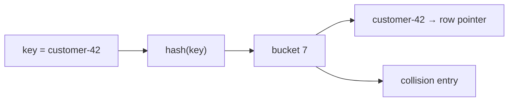
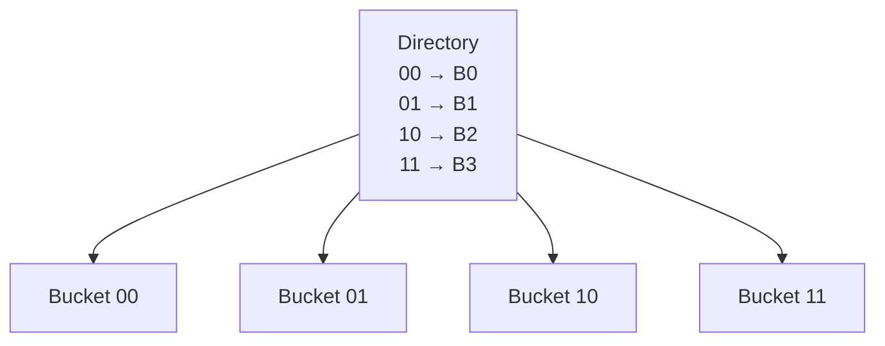
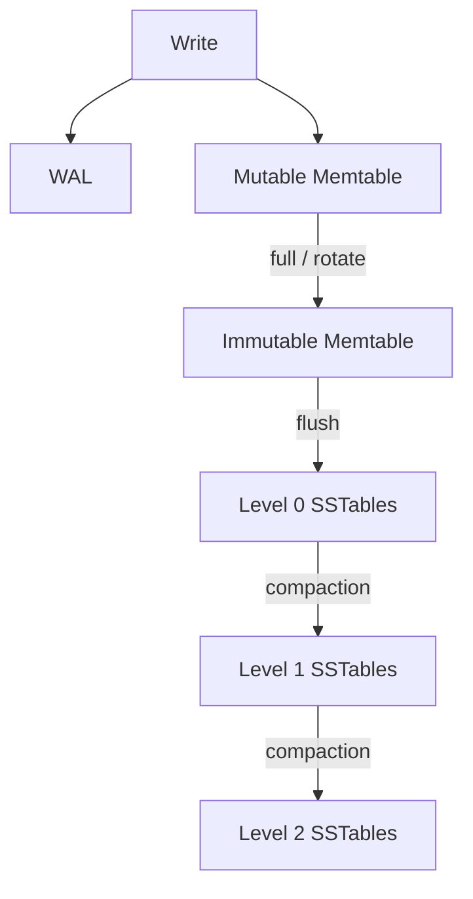
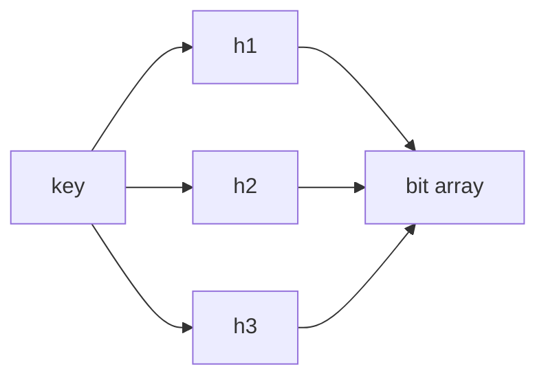
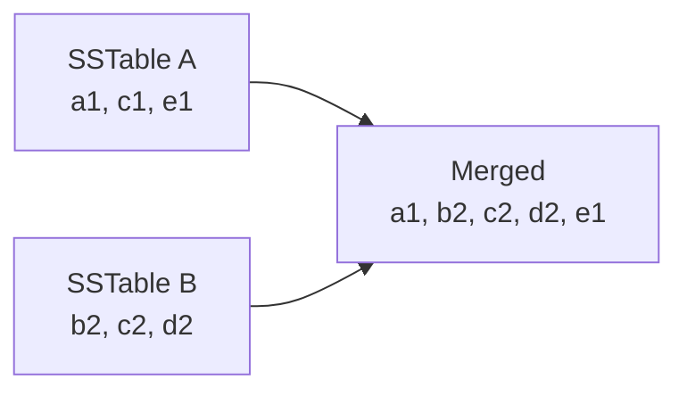

B+treeは等価検索と範囲検索の両方を扱える汎用的な構造ですが、すべてのworkloadで最適とは限りません。等価検索だけならhash indexが単純で高速になり得ます。大量の書き込みでは、LSM-treeがrandom writeを順次writeへ変換できます。

この章では、data structureの名前ではなく、どのI/Oを減らし、代わりに何を増やすのかを比較します。

## この章で答える問い

- Hash indexはなぜ等価検索へ向き、範囲検索へ向かないのか
- Bucketが偏ったり増えたりしたとき、hash indexはどう拡張するのか
- LSM-treeはrandom writeをどのようにsequential writeへ変換するのか
- Compactionは何を解決し、どのresourceを消費するのか
- Read、write、space amplificationとは何か

## hash index

Hash indexはkeyへhash functionを適用し、得られたhash値からbucketを選びます。



理想的にkeyがbucketへ均等分散し、bucketがmemoryまたは少数pageに収まれば、等価検索は少ないaccessで済みます。

```sql
SELECT *
FROM sessions
WHERE session_id = 'a8f3...';
```

一方、hash値はkeyの大小関係を保存しません。customer-10とcustomer-11が近いbucketに入る保証はないため、次のrange queryには基本的に向きません。

```sql
SELECT *
FROM orders
WHERE ordered_at >= TIMESTAMPTZ '2026-08-01'
  AND ordered_at <  TIMESTAMPTZ '2026-09-01';
```

## collision

異なるkeyが同じbucketへ対応することをcollisionと呼びます。Hash spaceが有限である以上、collision自体は異常ではありません。解決方法が必要です。

### chaining

Bucketからentry listやoverflow pageをたどります。実装が単純ですが、偏りや高いload factorでchainが長くなるとlookup costが増えます。

### open addressing

Bucket array内の別slotをprobeします。Linear probing、quadratic probing、double hashingなどがあります。Memory上ではcache localityを得やすい一方、load factorが高いとprobe数が増えます。

Disk-based hash indexではpage単位のbucketとoverflow pageを使う設計が一般的です。

## hash tableの拡張

固定bucket数のstatic hashingでは、data増加時にoverflowが増えます。全entryを倍のbucketへrehashすると大きな停止やI/Oが必要です。

### extendible hashing

Hash bitのprefixを使うdirectoryを持ち、overflowしたbucketだけをsplitします。Directoryは必要に応じて倍増します。



### linear hashing

Directoryを必須とせず、bucketを一定順序で段階的にsplitします。大規模な一括rehashを避け、成長を平準化します。

どちらも「table全体を一度に作り直さず、少数bucketずつ増やす」ことが中心です。

## hash indexの使いどころ

向いている例：

- session IDやcache keyのpoint lookup
- in-memory hash joinのbuild table
- key-value storeのmemory index
- equality conditionだけを扱うindex

向いていない例：

- range scan
- ORDER BYをindex順で満たす
- prefix search
- min/maxや隣接keyの探索

RDBのdisk indexではB+treeが十分高速かつ汎用的なので、hash indexの採用範囲は製品によって異なります。PostgreSQLのhash indexは等価operator用であり、multi-columnやuniquenessなどB-treeと異なる制約があります。

## append-only logからLSM-treeへ

Writeを速く受け付ける単純な方法は、file末尾へ追記することです。Sequential appendは効率的ですが、最新keyを探すためにlog全体を読むわけにはいきません。

Memory上にkeyから最新offsetへのhash mapを置けばpoint lookupできます。しかしmemoryへ全key indexが収まらない場合やrange scanをしたい場合、別の構造が必要です。

LSM-tree（Log-Structured Merge-tree）は、更新をまずmemory上のsorted structureへ入れ、まとまったsorted fileとしてstorageへ書き出します。

## LSM-treeのwrite path

代表的な構成を単純化すると次のようになります。



1. DurabilityのためwriteをWALへ追記する
2. Memory上のsorted memtableへkey/valueを追加する
3. Memtableが一定sizeになるとimmutableへ切り替える
4. Immutable memtableをsorted SSTableとして順次writeする
5. Background compactionでSSTableをmergeし、level間を移動する

SSTableはSorted String Tableの略で、key順に並んだimmutable fileです。一度作成したSSTableをin-place updateせず、新しいversionを別fileへ書きます。

## read path

一つのkeyがmemtable、immutable memtable、複数levelのSSTableのどこにあるか分からないため、readは新しい構造から順に探します。


各SSTableには次の補助構造を持たせます。

- block index：目的keyがあり得るblockを絞る
- Bloom filter：そのfileにkeyが確実に存在しない場合を判定する
- min/max key metadata：rangeが重ならないfileを除外する
- block cache：頻繁に読むdata/index blockをmemoryへ置く

## Bloom filter

Bloom filterは、ある集合にkeyが含まれるかをbit arrayと複数hash functionで判定する確率的data structureです。

- 「存在しない」と判定した場合、本当に存在しない
- 「存在するかもしれない」と判定した場合、false positiveの可能性がある
- false negativeはない



LSM-treeでは、存在しないkeyを探すたびに全SSTableを読むcostを減らします。Bloom filterが「ない」と答えたfileはstorage accessなしでskipできます。

False positive率を下げるにはkeyあたりbit数やhash数を増やしますが、memory costも増えます。

## compaction

新しいSSTableを追加し続けるだけでは、同じkeyの古いversion、delete tombstone、小さなfileが増えます。Compactionは複数のsorted runをmergeし、不要versionを除去し、file配置を整えます。



同じkey cでは新しいversion c2を残し、snapshotやretention条件上不要ならc1を除去できます。

Compactionはreadを改善しますが、background I/OとCPUを消費します。Write trafficがcompaction能力を超えると、L0 fileが増えてread amplificationが悪化し、最終的にwrite stallで流入を抑えることがあります。

## leveledとtiered compaction

### leveled compaction

各levelのsize上限を定め、下位levelへ小さな範囲ずつmergeします。同一level内のkey rangeを重複させない設計では、read時に調べるfile数を抑えられます。

- read amplificationを抑えやすい
- space amplificationを抑えやすい
- 同じdataを複数回書き直し、write amplificationが増えやすい

### tiered / size-tiered compaction

同程度sizeのSSTableを複数蓄積してからmergeします。

- write amplificationを抑えやすい
- 同じkey rangeを持つrunが増え、read amplificationが高くなりやすい
- 古いversionが複数runへ残り、spaceを使いやすい

実際のengineはleveled、tiered、universal、time-windowなどをworkloadに合わせて組み合わせます。

## tombstone

Immutable SSTableのentryをその場で消せないため、deleteもtombstoneという新しいrecordとして書きます。

```text
older SSTable:  order:42 → confirmed
newer SSTable:  order:42 → TOMBSTONE
```

Readは新しいtombstoneを見たら「削除済み」と判断します。Compaction時に古いvalueとtombstoneを安全に除去できますが、replica、snapshot、下位levelに古いvalueが残っていないことを考慮する必要があります。

Tombstoneが大量に残るとreadとspaceを圧迫します。TTL workloadではcompaction strategyが特に重要です。

## amplificationで比較する

### write amplification

Applicationが書いたlogical byteに対し、storageへ実際に何byte書いたかの比率です。

```text
write amplification =
  bytes written to storage / logical bytes written by application
```

WAL、B+tree page split、LSM compaction、replicationなどが増加要因です。

### read amplification

一つのlogical readを満たすために読むpage、block、file、byteの余分さです。

- B+treeのinternal/leaf/table lookup
- LSMの複数SSTable探索
- tombstoneやold versionのscan

### space amplification

現在有効なlogical dataに対し、storageを何倍使っているかです。

- B+treeのfree spaceとold version
- LSMの複数versionとtombstone
- compaction中のinput/output共存

一つのamplificationを下げると別のamplificationが上がりやすくなります。

## B+tree、hash、LSM-treeの比較

| 観点 | B+tree | Hash index | LSM-tree |
| --- | --- | --- | --- |
| point lookup | 得意 | 非常に得意 | Bloom/filter/cache次第 |
| range scan | 得意 | 不向き | sorted SSTableで可能 |
| write | in-place page更新とsplit | bucket更新 | memory + sequential flush |
| background work | vacuum/rebalance等 | resize/split | compaction |
| read amplification | tree + table access | bucket/overflow | memtable + 複数run |
| write amplification | WAL + page/index更新 | WAL + bucket更新 | WAL + compaction |
| 代表的用途 | 汎用RDB index | equality lookup | write-heavy KV/DB engine |

同じ「LSM-tree採用」でも、memtable、level size、compaction、cache、filterによって特性は大きく変わります。名前だけで性能を判断しません。

## workloadから選ぶ

### Write-heavy event ingestion

大量の追記、時間範囲read、TTL削除がある場合、LSM-treeとtime-based compactionが候補になります。ただしcompaction帯域とtombstone管理が必要です。

### Session lookup

Session IDによるpoint lookupだけでrange scanが不要なら、hash-based structureが適合しやすいです。Durabilityとresize方法も確認します。

### Order management

Primary key lookup、顧客別の時系列、statusによるfilter、transactional updateを行うならB+treeを持つRDBが扱いやすい場合があります。

選択はdata structure単体ではなく、transaction、replication、operabilityを含むDB全体で行います。

## よくある誤解

### 「LSM-treeは書き込みが1回なのでwrite amplificationがない」

WAL、flush、複数levelのcompactionで同じdataを何度も書くことがあります。Front-end latencyを下げても、background writeは消えません。

### 「Bloom filterがあればkeyの存在が分かる」

Bloom filterのpositiveは「存在するかもしれない」です。実dataを読む必要があります。

### 「Hash lookupは常にO(1)だからB+treeより速い」

Collision、overflow、resize、cache miss、durability、range要件を含める必要があります。Big-Oの平均計算量だけではI/O costを説明できません。

## まとめ

- Hash indexはhash値でbucketを選び、equality lookupへ向く
- Collisionはchainingやprobingで解決し、dynamic hashingで段階的に成長させる
- LSM-treeはwriteをmemtableへ受け、sorted SSTableとしてsequentialにflushする
- Readでは複数構造を探すため、index、cache、Bloom filterでI/Oを減らす
- Compactionはversion、tombstone、file数を整理するが、CPUとI/Oを消費する
- Leveledとtiered compactionはread、write、space amplificationの配分が異なる
- Data structureはworkloadと運用要件を含めて選ぶ

## 確認問題

1. Hash indexがordered_atのrange queryに向かない理由を説明してください。
2. Extendible hashingが一括rehashを避ける仕組みを説明してください。
3. LSM-treeのwriteが高速でも、background I/Oが増える理由は何ですか。
4. Bloom filterのfalse positiveとfalse negativeの違いを説明してください。
5. Leveledとtiered compactionを3種類のamplificationから比較してください。

## 参考資料

- [PostgreSQL Documentation: Hash Indexes](https://www.postgresql.org/docs/current/hash-index.html)
- [Patrick O’Neil et al., “The Log-Structured Merge-Tree”](https://doi.org/10.1007/s002360050048)
- [RocksDB Wiki: Compaction](https://github.com/facebook/rocksdb/wiki/Compaction)
- [RocksDB Wiki: Bloom Filter](https://github.com/facebook/rocksdb/wiki/RocksDB-Bloom-Filter)

次章からはquery processingへ進みます。SQLがrelation algebraとlogical planへ変換される過程を追跡します。
