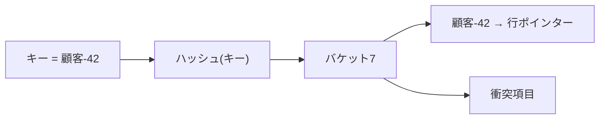
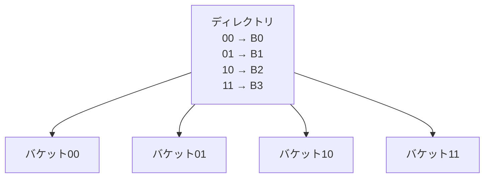
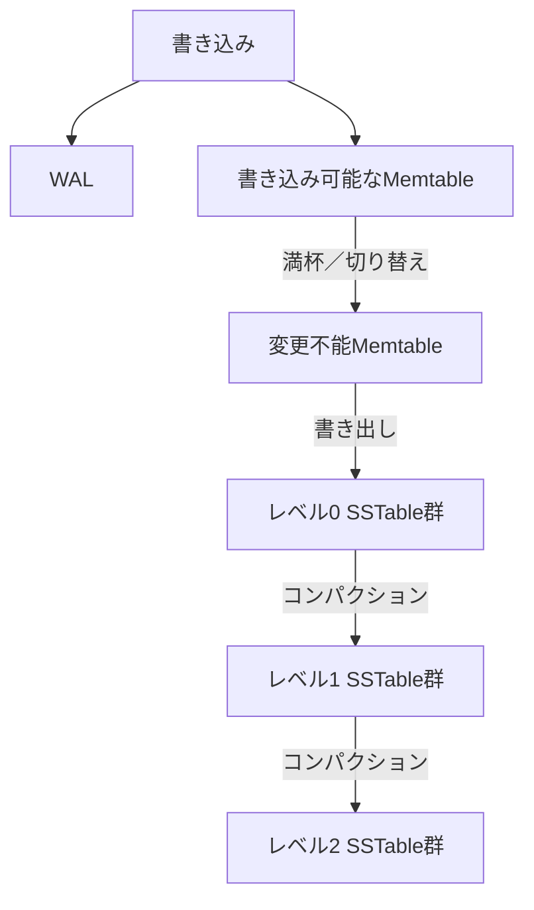
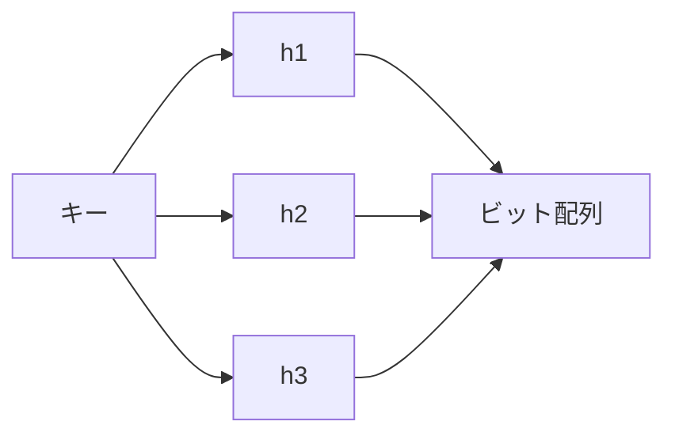
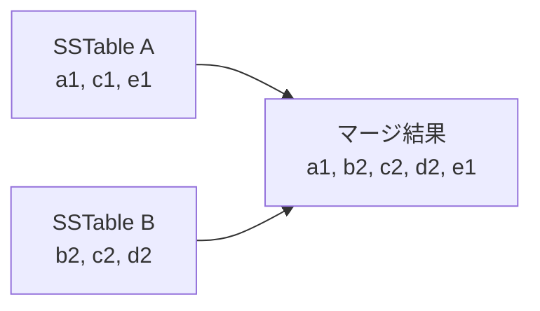

B+木は等価検索と範囲検索の両方を扱える汎用的な構造ですが、すべての処理負荷で最適とは限りません。等価検索だけならハッシュインデックスが単純で高速になり得ます。大量の書き込みでは、LSM-木がランダム書き込みを順次書き込みへ変換できます。

この章では、データ構造の名前ではなく、どのI/Oを減らし、代わりに何を増やすのかを比較します。

## この章で答える問い

- ハッシュインデックスはなぜ等価検索へ向き、範囲検索へ向かないのか
- バケットが偏ったり増えたりしたとき、ハッシュインデックスはどう拡張するのか
- LSM-木はランダム書き込みをどのように順次書き込みへ変換するのか
- コンパクションは何を解決し、どの資源を消費するのか
- 読み取り、書き込み、容量増幅とは何か

## ハッシュインデックス

ハッシュインデックスはキーへハッシュ関数を適用し、得られたハッシュ値からバケットを選びます。



理想的にキーがバケットへ均等分散し、バケットがメモリまたは少数ページに収まれば、等価検索は少ないアクセスで済みます。

```sql
SELECT *
FROM sessions
WHERE session_id = 'a8f3...';
```

一方、ハッシュ値はキーの大小関係を保存しません。顧客-10と顧客-11が近いバケットに入る保証はないため、次の範囲クエリには基本的に向きません。

```sql
SELECT *
FROM orders
WHERE ordered_at >= TIMESTAMPTZ '2026-08-01'
  AND ordered_at <  TIMESTAMPTZ '2026-09-01';
```

## 衝突

異なるキーが同じバケットへ対応することを衝突と呼びます。ハッシュ領域が有限である以上、衝突自体は異常ではありません。解決方法が必要です。

### チェイン法

バケットから項目リストやオーバーフロー ページをたどります。実装が単純ですが、偏りや高い負荷係数で連鎖が長くなると参照コストが増えます。

### オープンアドレス法

バケット配列内の別スロットを探索します。線形探索法、二次探索法、二重ハッシュ法などがあります。メモリ上ではキャッシュ局所性を得やすい一方、負荷係数が高いと探索数が増えます。

ディスク方式ハッシュインデックスではページ単位のバケットとオーバーフロー ページを使う設計が一般的です。

## ハッシュ表の拡張

固定バケット数の静的ハッシュ法では、データ増加時にオーバーフローが増えます。全項目を倍のバケットへ再ハッシュすると大きな停止やI/Oが必要です。

### 拡張可能ハッシュ法

ハッシュビットの接頭辞を使うディレクトリを持ち、オーバーフローしたバケットだけを分割します。ディレクトリは必要に応じて倍増します。



### 線形ハッシュ法

ディレクトリを必須とせず、バケットを一定順序で段階的に分割します。大規模な一括再ハッシュを避け、成長を平準化します。

どちらも「表全体を一度に作り直さず、少数バケットずつ増やす」ことが中心です。

## ハッシュインデックスの使いどころ

向いている例：

- セッションIDやキャッシュキーの単一キー検索
- in-メモリハッシュ結合の構築表
- キー-値保存のメモリインデックス
- 等値条件だけを扱うインデックス

向いていない例：

- 範囲走査
- ORDER BYをインデックス順で満たす
- 接頭辞検索
- min/maxや隣接キーの探索

RDBのディスクインデックスではB+木が十分高速かつ汎用的なので、ハッシュインデックスの採用範囲は製品によって異なります。PostgreSQLのハッシュインデックスは等価演算子用であり、複数列や一意性などB-木と異なる制約があります。

## 追記専用ログからLSM-木へ

書き込みを速く受け付ける単純な方法は、ファイル末尾へ追記することです。順次追記は効率的ですが、最新キーを探すためにログ全体を読むわけにはいきません。

メモリ上にキーから最新オフセットへのハッシュマップを置けば単一キー検索できます。しかしメモリへ全キー インデックスが収まらない場合や範囲走査をしたい場合、別の構造が必要です。

LSM-木（ログ構造化マージ木）は、更新をまずメモリ上の整列済み構造へ入れ、まとまった整列済みファイルとしてストレージへ書き出します。

## LSM-木の書き込み経路

代表的な構成を単純化すると次のようになります。



1. 永続性のため書き込みをWALへ追記する
2. メモリ上の整列済みMemtableへキー/値を追加する
3. Memtableが一定大きさになると不変へ切り替える
4. 変更不能Memtableを整列済みSSTableとして順次書き出す
5. バックグラウンドコンパクションでSSTableをマージし、レベル間を移動する

SSTableは整列済み文字列表の略で、キー順に並んだ不変ファイルです。一度作成したSSTableをその場では更新せず、新しいバージョンを別ファイルへ書きます。

## 読み取り経路

一つのキーがMemtable、変更不能Memtable、複数レベルのSSTableのどこにあるか分からないため、読み取りは新しい構造から順に探します。


各SSTableには次の補助構造を持たせます。

- 停止インデックス：目的キーがあり得る停止を絞る
- Bloomフィルター：そのファイルにキーが確実に存在しない場合を判定する
- min/maxキー メタデータ：範囲が重ならないファイルを除外する
- 停止キャッシュ：頻繁に読むデータ/インデックス停止をメモリへ置く

## Bloomフィルター

Bloomフィルターは、ある集合にキーが含まれるかをビット配列と複数ハッシュ関数で判定する確率的データ構造です。

- 「存在しない」と判定した場合、本当に存在しない
- 「存在するかもしれない」と判定した場合、偽陽性の可能性がある
- 偽陰性はない



LSM-木では、存在しないキーを探すたびに全SSTableを読むコストを減らします。Bloomフィルターが「ない」と答えたファイルはストレージアクセスなしでスキップできます。

偽陽性率を下げるにはキーあたりビット数やハッシュ数を増やしますが、メモリコストも増えます。

## コンパクション

新しいSSTableを追加し続けるだけでは、同じキーの古いバージョン、削除マーカー、小さなファイルが増えます。コンパクションは複数の整列済みランをマージし、不要バージョンを除去し、ファイル配置を整えます。



同じキー cでは新しいバージョンc2を残し、スナップショットや保持期間条件上不要ならc1を除去できます。

コンパクションは読み取りを改善しますが、バックグラウンドI/OとCPUを消費します。書き込み通信量がコンパクション能力を超えると、L0ファイルが増えて読み取り増幅が悪化し、最終的に書き込み停止で流入を抑えることがあります。

## レベル方式と階層方式のコンパクション

### レベル方式のコンパクション

各レベルの大きさ上限を定め、下位レベルへ小さな範囲ずつマージします。同一レベル内のキー 範囲を重複させない設計では、読み取り時に調べるファイル数を抑えられます。

- 読み取り増幅を抑えやすい
- 容量増幅を抑えやすい
- 同じデータを複数回書き直し、書き込み増幅が増えやすい

### 階層方式 / 大きさ-階層方式のコンパクション

同程度大きさのSSTableを複数蓄積してからマージします。

- 書き込み増幅を抑えやすい
- 同じキー 範囲を持つ実行が増え、読み取り増幅が高くなりやすい
- 古いバージョンが複数ランへ残り、領域を使いやすい

実際のエンジンはレベル方式、階層方式、ユニバーサル方式、時間窓方式などを処理負荷に合わせて組み合わせます。

## 削除マーカー

不変SSTableの項目をその場で消せないため、削除も削除マーカーという新しいレコードとして書きます。

```text
古いSSTable:  注文:42 → 確定済み
新しいSSTable: 注文:42 → 削除マーカー
```

読み取りは新しい削除マーカーを見たら「削除済み」と判断します。コンパクション時に古い値と削除マーカーを安全に除去できますが、レプリカ、スナップショット、下位レベルに古い値が残っていないことを考慮する必要があります。

削除マーカーが大量に残ると読み取りと領域を圧迫します。TTL処理負荷ではコンパクション方針が特に重要です。

## 増幅で比較する

### 書き込み増幅

アプリケーションが書いた論理バイトに対し、ストレージへ実際に何バイト書いたかの比率です。

```text
書き込み増幅 =
  ストレージへ書いたバイト数／アプリケーションが書いた論理バイト数
```

WAL、B+木ページ分割、LSMコンパクション、レプリケーションなどが増加要因です。

### 読み取り増幅

一つの論理読み取りを満たすために読むページ、停止、ファイル、バイトの余分さです。

- B+木の内部/葉/表の参照
- LSMの複数SSTable探索
- 削除マーカーや古いバージョンの走査

### 容量増幅

現在有効な論理データに対し、ストレージを何倍使っているかです。

- B+木の空き領域と古いバージョン
- LSMの複数バージョンと削除マーカー
- コンパクション中の入力/出力共存

一つの増幅を下げると別の増幅が上がりやすくなります。

## B+木、ハッシュ、LSM-木の比較

| 観点 | B+木 | ハッシュインデックス | LSM-木 |
| --- | --- | --- | --- |
| 単一キー検索 | 得意 | 非常に得意 | Bloom/絞り込み/キャッシュ次第 |
| 範囲走査 | 得意 | 不向き | 整列済みSSTableで可能 |
| 書き込み | ページのその場更新と分割 | バケット更新 | メモリ + 順次書き出し |
| バックグラウンド処理 | 不要版の回収/再均衡化等 | 拡張/分割 | コンパクション |
| 読み取り増幅 | 木 + 表アクセス | バケット/オーバーフロー | Memtable + 複数ラン |
| 書き込み増幅 | WAL + ページ/インデックス更新 | WAL + バケット更新 | WAL + コンパクション |
| 代表的用途 | 汎用RDBインデックス | 等値参照 | 書き込み中心のKV/DBエンジン |

同じ「LSM-木採用」でも、Memtable、レベル大きさ、コンパクション、キャッシュ、絞り込みによって特性は大きく変わります。名前だけで性能を判断しません。

## 処理負荷から選ぶ

### 書き込み中心のイベント取り込み

大量の追記、時間範囲読み取り、TTL削除がある場合、LSM-木と時間基準コンパクションが候補になります。ただしコンパクション帯域と削除マーカー管理が必要です。

### セッション参照

セッションIDによる単一キー検索だけで範囲走査が不要なら、ハッシュ方式構造が適合しやすいです。永続性と拡張方法も確認します。

### 注文管理

主キー 参照、顧客別の時系列、状態による絞り込み、トランザクション更新を行うならB+木を持つRDBが扱いやすい場合があります。

選択はデータ構造単体ではなく、トランザクション、レプリケーション、運用性を含むDB全体で行います。

## よくある誤解

### 「LSM-木は書き込みが1回なので書き込み増幅がない」

WAL、書き出し、複数レベルのコンパクションで同じデータを何度も書くことがあります。利用者向けの遅延時間を下げても、バックグラウンド書き込みは消えません。

### 「Bloomフィルターがあればキーの存在が分かる」

Bloomフィルターの陽性は「存在するかもしれない」です。実データを読む必要があります。

### 「ハッシュ参照は常にO(1)だからB+木より速い」

衝突、オーバーフロー、拡張、キャッシュミス、永続性、範囲要件を含める必要があります。O記法の平均計算量だけではI/Oコストを説明できません。

## まとめ

- ハッシュインデックスはハッシュ値でバケットを選び、等値参照へ向く
- 衝突はチェイン法や探索法で解決し、動的ハッシュ法で段階的に成長させる
- LSM-木は書き込みをMemtableへ受け、整列済みSSTableとして順次書き出す
- 読み取りでは複数構造を探すため、インデックス、キャッシュ、BloomフィルターでI/Oを減らす
- コンパクションはバージョン、削除マーカー、ファイル数を整理するが、CPUとI/Oを消費する
- レベル方式と階層方式のコンパクションは読み取り、書き込み、容量増幅の配分が異なる
- データ構造は処理負荷と運用要件を含めて選ぶ

## 確認問題

1. ハッシュインデックスがordered_atの範囲クエリに向かない理由を説明してください。
2. 拡張可能ハッシュ法が一括再ハッシュを避ける仕組みを説明してください。
3. LSM-木の書き込みが高速でも、バックグラウンドI/Oが増える理由は何ですか。
4. Bloomフィルターの偽陽性と偽陰性の違いを説明してください。
5. レベル方式と階層方式のコンパクションを3種類の増幅から比較してください。

## 参考資料

- [PostgreSQL Documentation: Hash Indexes](https://www.postgresql.org/docs/current/hash-index.html)
- [Patrick O’Neil et al., “The Log-Structured Merge-Tree”](https://doi.org/10.1007/s002360050048)
- [RocksDB Wiki: Compaction](https://github.com/facebook/rocksdb/wiki/Compaction)
- [RocksDB Wiki: Bloom Filter](https://github.com/facebook/rocksdb/wiki/RocksDB-Bloom-Filter)

次章からはクエリ処理へ進みます。SQLが関係代数と論理計画へ変換される過程を追跡します。
