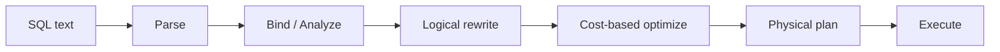
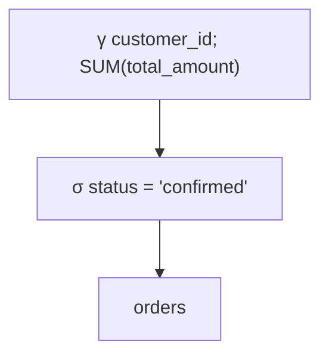
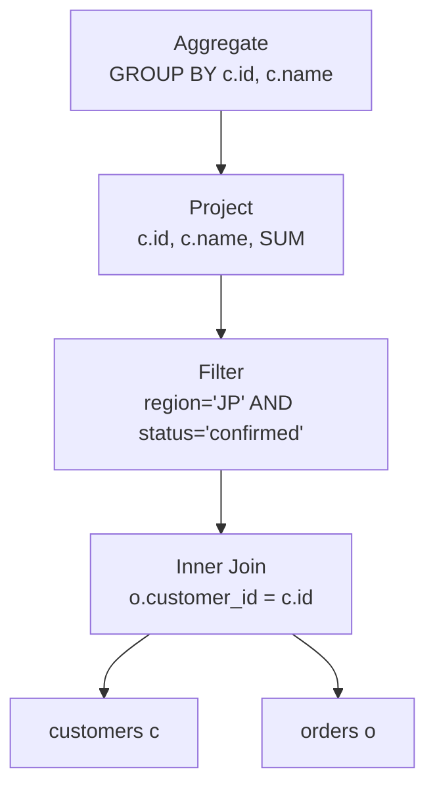
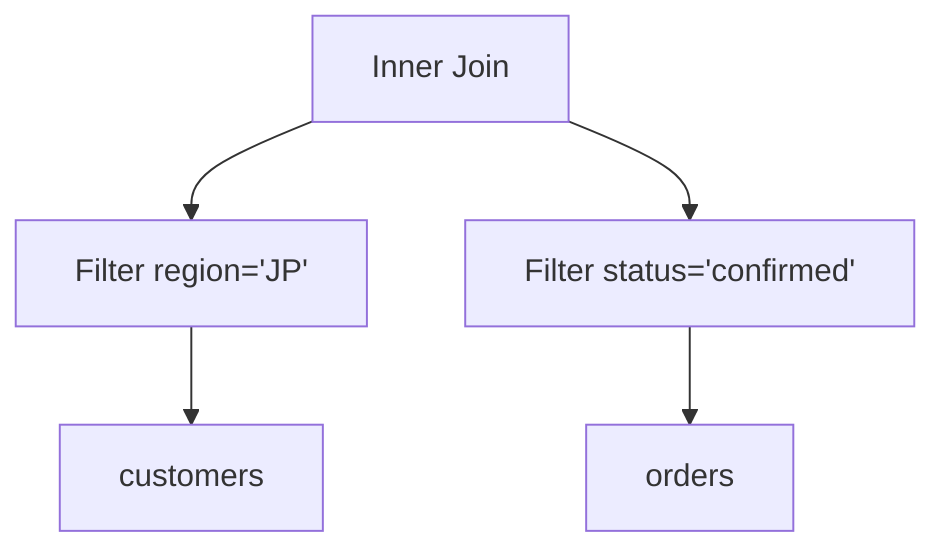
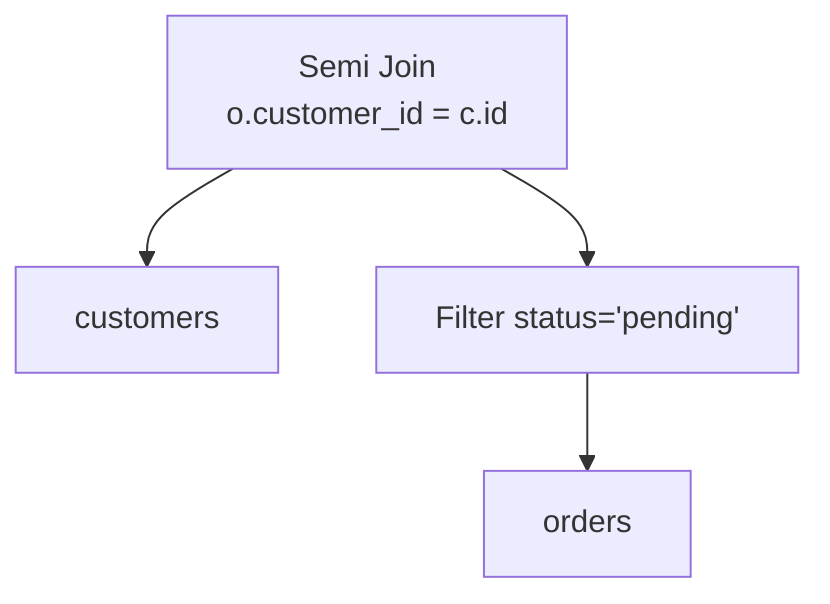

SQLには「どのindexを何page読むか」「どのtableを先にjoinするか」を通常書きません。欲しい結果を宣言し、実行方法をDBMSへ委ねます。この宣言性が、同じSQLをdata量やindexの変化に応じて異なる方法で実行できる理由です。

この章では、SQL textが意味を持つtreeへ変換され、結果を変えない範囲で書き換えられる過程を扱います。

## この章で答える問い

- SQLはどの段階で構文・名前・型を検査されるのか
- Relation algebraはSQLを理解するうえで何に役立つのか
- Logical planとphysical planは何が違うのか
- Predicate pushdownやprojection pruningはなぜ速くなるのか
- NULL、outer join、duplicateは書き換えをどう難しくするのか

## query processingの全体像



製品によって段階の分け方は異なりますが、責務は次のように整理できます。

1. **Parse**：tokenとgrammarを検査し、syntax treeを作る
2. **Bind/Analyze**：table・column・functionをcatalogへ結びつけ、型と権限を確認する
3. **Logical rewrite**：意味を保つ規則でtreeを変形する
4. **Optimize**：access path、join順、algorithmの候補をcostで比較する
5. **Execute**：選ばれたoperatorを動かす

## parsing

Parserは文字列をtokenへ分け、grammarに従ってabstract syntax tree（AST）を作ります。

```sql
SELECT customer_id, SUM(total_amount)
FROM orders
WHERE status = 'confirmed'
GROUP BY customer_id;
```

ASTはSELECT list、FROM、WHERE、GROUP BYなど、SQLの構文上の構造を表します。この段階ではordersという名前が実在するtableか、total_amountがnumericかまでは決めていない実装もあります。

Syntax errorはこの段階で検出されます。

```sql
SELECT FROM orders; -- select listがない
```

## bindingとsemantic analysis

BinderまたはanalyzerはAST内の名前をcatalog objectへ結びつけます。

- ordersはどのschemaのtableか
- customer_idはどのtableのcolumnか
- aliasによる参照は曖昧でないか
- SUMへ渡す型は集約可能か
- 比較する左右の型を変換できるか
- 実行userにSELECT権限があるか

```sql
SELECT id
FROM customers
JOIN orders ON customer_id = id;
```

customersとordersの両方にidがあれば、このSQLは曖昧です。c.id、o.idのように修飾する必要があります。

Binderは暗黙castを挿入することもあります。Column側へfunctionやcastが入ると、既存indexの探索条件として使いにくくなる場合があるため、型の一致は性能にも影響します。

## relation algebra

Relation algebraはrelationを入力とし、relationを出力するoperatorの体系です。代表的なoperatorをSQLへ対応づけます。

| Relation algebra | 記号 | SQLで近いもの |
| --- | --- | --- |
| selection | σ | WHERE |
| projection | π | SELECT column |
| join | ⋈ | JOIN ... ON |
| rename | ρ | AS |
| union | ∪ | UNION |
| difference | − | EXCEPT |
| Cartesian product | × | CROSS JOIN |
| grouping/aggregation | γ | GROUP BY、aggregate |

先ほどのqueryを概念的に書くと次のtreeになります。



実行は通常、treeのleafから上へdataを渡すと考えます。まずordersを読み、statusでfilterし、customer_idごとにaggregateします。

Relation algebraを使う利点は、SQLの表面的な記述順ではなく、operatorとdata flowとして考えられることです。

## logical plan

Logical planは「何の論理演算を行うか」を表します。まだ具体的なscanやjoin algorithmは決めません。

次のSQLを考えます。

```sql
SELECT c.id, c.name, SUM(o.total_amount) AS amount
FROM customers AS c
JOIN orders AS o ON o.customer_id = c.id
WHERE c.region = 'JP'
  AND o.status = 'confirmed'
GROUP BY c.id, c.name;
```

初期logical planは概念的に次のようになります。



## logical rewrite

Optimizerは結果を変えないequivalence ruleを使ってplanを変形します。

### predicate pushdown

Join後にfilterする代わりに、それぞれの入力だけで評価できるpredicateをscan近くへ移します。



Joinへ渡すrow数が減るため、joinのCPU、memory、中間結果を減らせます。Indexがあればfilterをindex conditionへ変換できる可能性もあります。

### projection pruning

後続operatorで不要なcolumnを早く捨てます。Row幅が小さくなるとmemory、copy、sort、network transferを減らせます。

たとえばcustomersに50 columnあっても、id、name、regionしか使わないなら、残りをplan内へ運ぶ必要はありません。

### constant folding

Compile時に計算できる式を先に評価します。

```sql
WHERE price > 100 * 12
-- logical rewrite後のイメージ
WHERE price > 1200
```

Deterministicでないfunction、session設定、overflowなどを考慮するため、何でも評価できるわけではありません。

### boolean simplification

```text
(status = 'confirmed' AND TRUE)
→ status = 'confirmed'

(id = 1 OR FALSE)
→ id = 1
```

Constraintから常にfalseと分かるbranchを除去できる場合もあります。

## joinの交換・結合則

Inner joinは条件を満たせば交換・結合順を変えられます。

```text
A ⋈ B = B ⋈ A

(A ⋈ B) ⋈ C = A ⋈ (B ⋈ C)
```

これによりoptimizerは小さな中間結果を作るjoin順を探せます。しかしouter join、semi/anti join、volatile function、duplicate、NULL semanticsがあると自由に並べ替えられない場合があります。

## SQLはpureなset algebraではない

### bag semantics

SQLはduplicate rowを保持します。

```sql
SELECT status FROM orders;
```

同じstatusが何度も返ります。UNIONは重複を除去し、UNION ALLは保持します。Duplicate除去にはsortやhashが必要なので、意味だけでなくcostも異なります。

### three-valued logic

NULLを含むpredicateはunknownになり得ます。

```sql
WHERE NOT (status = 'confirmed')
```

statusがNULLならstatus = 'confirmed'はunknown、NOT unknownもunknownです。そのrowはWHEREを通りません。Classical boolean algebraの変形をそのまま適用すると結果を変える可能性があります。

### outer join

LEFT JOINは右側にmatchしないrowへNULLを補います。右側columnへのpredicateをWHEREへ置くかONへ置くかで意味が変わります。

```sql
-- 注文がない顧客も残す
SELECT c.id, o.id
FROM customers c
LEFT JOIN orders o
  ON o.customer_id = c.id
 AND o.status = 'confirmed';

-- WHEREに置くと、注文がない顧客が除外されinner join相当になり得る
SELECT c.id, o.id
FROM customers c
LEFT JOIN orders o ON o.customer_id = c.id
WHERE o.status = 'confirmed';
```

Predicate pushdownは「下へ移せば必ず同じ」ではありません。

## subqueryとdecorrelation

相関subqueryは外側rowごとに内側を評価するように見えます。

```sql
SELECT c.id
FROM customers c
WHERE EXISTS (
  SELECT 1
  FROM orders o
  WHERE o.customer_id = c.id
    AND o.status = 'pending'
);
```

Optimizerはこれをsemi joinへdecorrelateできる場合があります。



Semi joinは右側のcolumnを返さず、matchの有無だけを使います。Inner join + DISTINCTよりduplicateを作らずに済む可能性があります。

Subqueryがaggregate、LIMIT、volatile function、複雑なcorrelationを含む場合はdecorrelationできないことがあります。

## viewとCTE

Viewは保存されたquery definitionです。Optimizerはviewを展開して外側predicateをpushdownできる場合があります。

Common Table Expression（WITH）は読みやすさと再利用に役立ちますが、materializeされるかinlineされるかは製品・version・指定によります。CTEを「必ず一時tableになる」「必ずinlineされる」と決めつけず、実行計画を確認します。

## rule rewriteとcost-based choice

Logical rewriteの中には、ほぼ常に有利でruleとして適用できるものがあります。Projection pruningや明らかなconstant foldingが例です。

一方、次はdata量とresourceに依存します。

- table scanかindex scanか
- hash joinかnested loopか
- join順
- aggregation方式
- parallelism

これらはphysical plan候補をcostで比較します。Logical equivalenceは「結果が同じ」を保証し、cost-based optimizerが「どれを実行するか」を選びます。

## よくある誤解

### 「SQLは上から順に実行される」

SQLのtext順はsyntaxであり、physical execution orderではありません。Optimizerは意味を保ってoperatorを移動・結合します。

### 「predicateは下へ移すほど常に正しい」

Outer join、NULL、volatile function、security barrierなどで意味が変わる場合があります。

### 「同じ結果のSQLなら同じplanになる」

表現差、parameter、statistics、prepared plan、optimizer ruleによって候補と選択が変わり得ます。

## まとめ

- SQLはparse、bind、logical rewrite、physical optimizationを経て実行される
- Relation algebraはqueryをoperatorとdata flowとして表現する
- Logical planは何を計算するか、physical planはどう計算するかを表す
- Predicate pushdownとprojection pruningは早い段階でrow数・row幅を減らす
- Inner joinは並べ替えやすいが、outer joinやNULLでは制約が増える
- SQLはbag semanticsとthree-valued logicを持ち、単純なset algebraと異なる
- Correlated subqueryをsemi/anti joinへ変換できる場合がある

## 確認問題

1. Parserとbinderが検出するerrorをそれぞれ一つ挙げてください。
2. Predicate pushdownがjoin costを減らす経路を説明してください。
3. LEFT JOINのON条件をWHEREへ移すと結果が変わる例を説明してください。
4. UNIONとUNION ALLの意味と実行costの違いは何ですか。
5. Correlated EXISTSをsemi joinへ変換する利点を説明してください。

## 参考資料

- [PostgreSQL Documentation: The Path of a Query](https://www.postgresql.org/docs/current/query-path.html)
- [PostgreSQL Documentation: Table Expressions](https://www.postgresql.org/docs/current/queries-table-expressions.html)
- [SQLite Documentation: The Query Optimizer Overview](https://www.sqlite.org/optoverview.html)

次章では、logical operatorを実際に動かすscan、sort、aggregation、pipelineなどのphysical executionを扱います。
