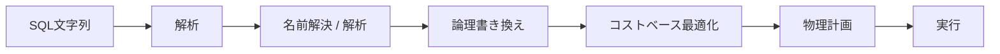
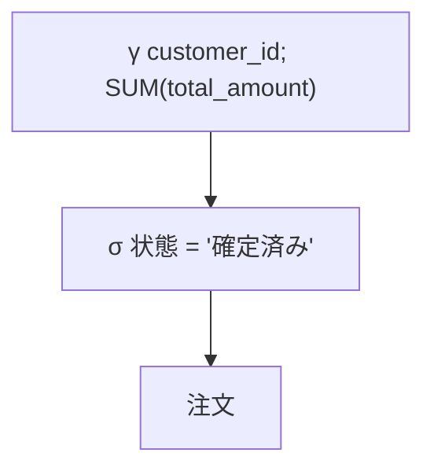
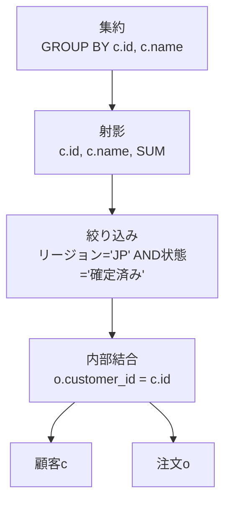
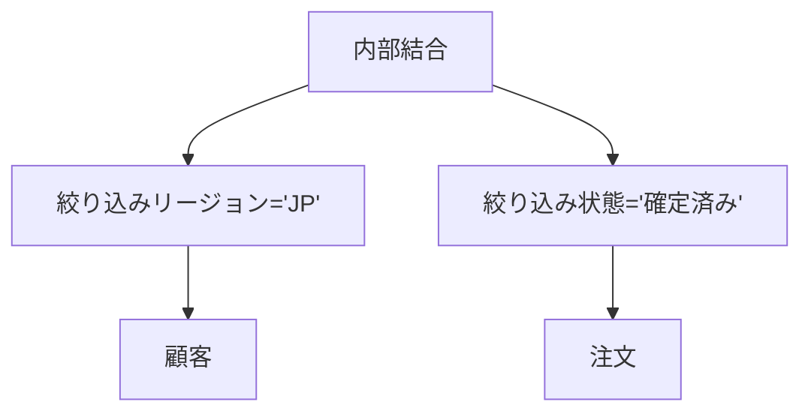
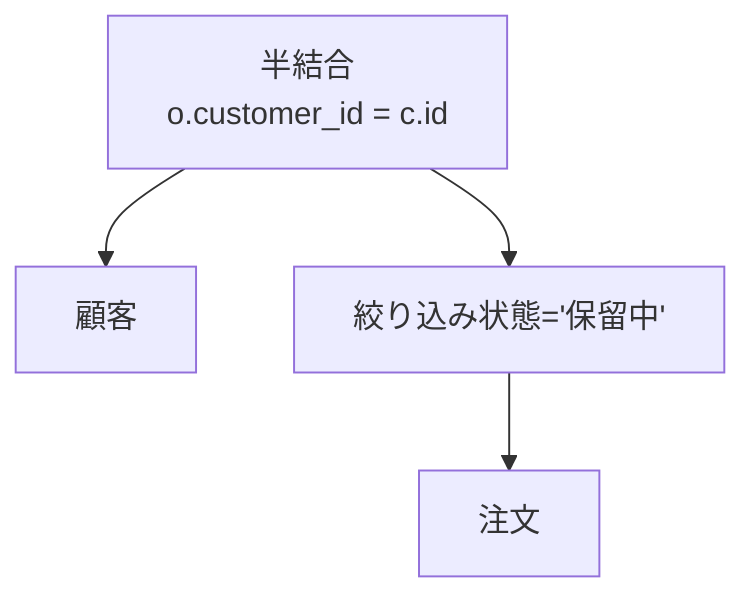

SQLには「どのインデックスを何ページ読むか」「どの表を先に結合するか」を通常書きません。欲しい結果を宣言し、実行方法をDBMSへ委ねます。この宣言性が、同じSQLをデータ量やインデックスの変化に応じて異なる方法で実行できる理由です。

この章では、SQL文字列が意味を持つ木へ変換され、結果を変えない範囲で書き換えられる過程を扱います。

## この章で答える問い

- SQLはどの段階で構文・名前・型を検査されるのか
- 関係代数はSQLを理解するうえで何に役立つのか
- 論理計画と物理計画は何が違うのか
- 述語のプッシュダウンや射影の刈り込みはなぜ速くなるのか
- NULL、外部結合、重複は書き換えをどう難しくするのか

## クエリ処理の全体像



製品によって段階の分け方は異なりますが、責務は次のように整理できます。

1. **解析**：トークンと文法を検査し、構文木を作る
2. **名前解決/解析**：表・列・関数をカタログへ結びつけ、型と権限を確認する
3. **論理書き換え**：意味を保つ規則で木を変形する
4. **最適化**：アクセス経路、結合順、アルゴリズムの候補をコストで比較する
5. **実行**：選ばれた演算子を動かす

## 構文解析

解析器は文字列をトークンへ分け、文法に従って抽象構文木（AST）を作ります。

```sql
SELECT customer_id, SUM(total_amount)
FROM orders
WHERE status = 'confirmed'
GROUP BY customer_id;
```

ASTはSELECTリスト、FROM、WHERE、GROUP BYなど、SQLの構文上の構造を表します。この段階ではordersという名前が実在する表か、total_amountが数値型かまでは決めていない実装もあります。

構文エラーはこの段階で検出されます。

```sql
SELECT FROM orders; -- select listがない
```

## 名前解決と意味解析

名前解決器または解析器はAST内の名前をカタログオブジェクトへ結びつけます。

- ordersはどのスキーマの表か
- customer_idはどの表の列か
- 別名による参照は曖昧でないか
- SUMへ渡す型は集約可能か
- 比較する左右の型を変換できるか
- 実行利用者にSELECT権限があるか

```sql
SELECT id
FROM customers
JOIN orders ON customer_id = id;
```

customersとordersの両方にidがあれば、このSQLは曖昧です。c.id、o.idのように修飾する必要があります。

名前解決器は暗黙型変換を挿入することもあります。列側へ関数や型変換が入ると、既存インデックスの探索条件として使いにくくなる場合があるため、型の一致は性能にも影響します。

## 関係代数

関係代数は関係を入力とし、関係を出力する演算子の体系です。代表的な演算子をSQLへ対応づけます。

| 関係代数 | 記号 | SQLで近いもの |
| --- | --- | --- |
| 選択 | σ | WHERE |
| 射影 | π | SELECT列 |
| 結合 | ⋈ | 結合 ... ON |
| 名前変更 | ρ | AS |
| 和集合 | ∪ | 和集合 |
| 差集合 | − | EXCEPT |
| 直積 | × | CROSS結合 |
| グループ化／集約 | γ | GROUP BY、集約 |

先ほどのクエリを概念的に書くと次の木になります。



実行は通常、木の葉から上へデータを渡すと考えます。まずordersを読み、状態で絞り込みし、customer_idごとに集約します。

関係代数を使う利点は、SQLの表面的な記述順ではなく、演算子とデータ流れとして考えられることです。

## 論理計画

論理計画は「何の論理演算を行うか」を表します。まだ具体的な走査や結合アルゴリズムは決めません。

次のSQLを考えます。

```sql
SELECT c.id, c.name, SUM(o.total_amount) AS amount
FROM customers AS c
JOIN orders AS o ON o.customer_id = c.id
WHERE c.region = 'JP'
  AND o.status = 'confirmed'
GROUP BY c.id, c.name;
```

初期論理計画は概念的に次のようになります。



## 論理書き換え

最適化器は結果を変えない等価変換規則を使って計画を変形します。

### 述語のプッシュダウン

結合後に絞り込みする代わりに、それぞれの入力だけで評価できる述語を走査近くへ移します。



結合へ渡す行数が減るため、結合のCPU、メモリ、中間結果を減らせます。インデックスがあれば絞り込みをインデックス条件へ変換できる可能性もあります。

### 射影の刈り込み

後続演算子で不要な列を早く捨てます。行幅が小さくなるとメモリ、複製、ソート、ネットワーク転送を減らせます。

たとえばcustomersに50列あっても、id、name、リージョンしか使わないなら、残りを計画内へ運ぶ必要はありません。

### 定数畳み込み

コンパイル時に計算できる式を先に評価します。

```sql
WHERE price > 100 * 12
-- 論理書き換え後のイメージ
WHERE price > 1200
```

決定論的でない関数、セッション設定、オーバーフローなどを考慮するため、何でも評価できるわけではありません。

### 論理式の簡約

```text
(状態 = '確定済み' AND TRUE)
→ 状態 = '確定済み'

(id = 1 OR FALSE)
→ id = 1
```

制約から常に偽と分かる分岐を除去できる場合もあります。

## 結合の交換・結合則

内部結合は条件を満たせば交換・結合順を変えられます。

```text
A ⋈ B = B ⋈ A

(A ⋈ B) ⋈ C = A ⋈ (B ⋈ C)
```

これにより最適化器は小さな中間結果を作る結合順を探せます。しかし外部結合、半結合／反結合、揮発性関数、重複、NULL意味論があると自由に並べ替えられない場合があります。

## SQLは純粋な集合代数ではない

### バッグ意味論

SQLは重複行を保持します。

```sql
SELECT status FROM orders;
```

同じ状態が何度も返ります。和集合は重複を除去し、UNION ALLは保持します。重複除去にはソートやハッシュが必要なので、意味だけでなくコストも異なります。

### 3値論理

NULLを含む述語は不明になり得ます。

```sql
WHERE NOT (status = 'confirmed')
```

状態がNULLなら状態 = '確定済み'は不明、NOT不明も不明です。その行はWHEREを通りません。古典ブール代数の変形をそのまま適用すると結果を変える可能性があります。

### 外部結合

左結合は右側に一致しない行へNULLを補います。右側列への述語をWHEREへ置くかONへ置くかで意味が変わります。

```sql
-- 注文がない顧客も残す
SELECT c.id, o.id
FROM customers c
LEFT JOIN orders o
  ON o.customer_id = c.id
 AND o.status = 'confirmed';

-- WHEREに置くと、注文がない顧客が除外され内部結合相当になり得る
SELECT c.id, o.id
FROM customers c
LEFT JOIN orders o ON o.customer_id = c.id
WHERE o.status = 'confirmed';
```

述語のプッシュダウンは「下へ移せば必ず同じ」ではありません。

## サブクエリと非相関化

相関サブクエリは外側行ごとに内側を評価するように見えます。

```sql
SELECT c.id
FROM customers c
WHERE EXISTS (
  SELECT 1
  FROM orders o
  WHERE o.customer_id = c.id
    AND o.status = 'pending'
);
```

最適化器はこれを半結合へ非相関化できる場合があります。



半結合は右側の列を返さず、一致の有無だけを使います。内部結合 + DISTINCTより重複を作らずに済む可能性があります。

サブクエリが集約、上限、揮発性関数、複雑な相関を含む場合は非相関化できないことがあります。

## ビューとCTE

ビューは保存されたクエリ定義です。最適化器はビューを展開して外側述語をプッシュダウンできる場合があります。

共通表式（WITH）は読みやすさと再利用に役立ちますが、実体化されるかインラインされるかは製品・バージョン・指定によります。CTEを「必ず一時表になる」「必ずインラインされる」と決めつけず、実行計画を確認します。

## 規則による書き換えとコストベース選択

論理書き換えの中には、ほぼ常に有利で規則として適用できるものがあります。射影の刈り込みや明らかな定数畳み込みが例です。

一方、次はデータ量と資源に依存します。

- 表走査かインデックス走査か
- ハッシュ結合か入れ子ループか
- 結合順
- 集約方式
- 並列度

これらは物理計画候補をコストで比較します。論理的な等価性は「結果が同じ」を保証し、コストベース最適化器が「どれを実行するか」を選びます。

## よくある誤解

### 「SQLは上から順に実行される」

SQLのテキスト順は構文であり、物理実行順序ではありません。最適化器は意味を保って演算子を移動・結合します。

### 「述語は下へ移すほど常に正しい」

外部結合、NULL、揮発性関数、セキュリティバリアなどで意味が変わる場合があります。

### 「同じ結果のSQLなら同じ計画になる」

表現差、パラメーター、統計情報、準備済み計画、最適化器規則によって候補と選択が変わり得ます。

## まとめ

- SQLは解析、名前解決、論理書き換え、物理最適化を経て実行される
- 関係代数はクエリを演算子とデータ流れとして表現する
- 論理計画は何を計算するか、物理計画はどう計算するかを表す
- 述語のプッシュダウンと射影の刈り込みは早い段階で行数・行幅を減らす
- 内部結合は並べ替えやすいが、外部結合やNULLでは制約が増える
- SQLはバッグ意味論と3値論理を持ち、単純な集合代数と異なる
- 相関サブクエリを半結合／反結合へ変換できる場合がある

## 確認問題

1. 解析器と名前解決器が検出するエラーをそれぞれ一つ挙げてください。
2. 述語のプッシュダウンが結合コストを減らす経路を説明してください。
3. 左結合のON条件をWHEREへ移すと結果が変わる例を説明してください。
4. 和集合とUNION ALLの意味と実行コストの違いは何ですか。
5. 相関EXISTSを半結合へ変換する利点を説明してください。

## 参考資料

- [PostgreSQL Documentation: The Path of a Query](https://www.postgresql.org/docs/current/query-path.html)
- [PostgreSQL Documentation: Table Expressions](https://www.postgresql.org/docs/current/queries-table-expressions.html)
- [SQLite Documentation: The Query Optimizer Overview](https://www.sqlite.org/optoverview.html)

次章では、論理演算子を実際に動かす走査、ソート、集約、パイプラインなどの物理実行を扱います。
