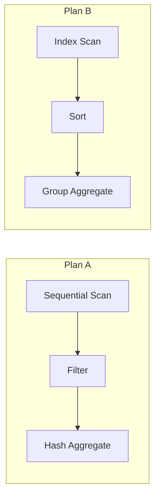
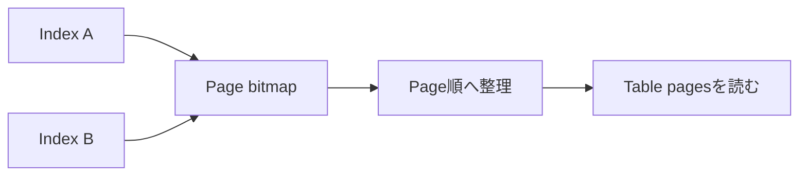
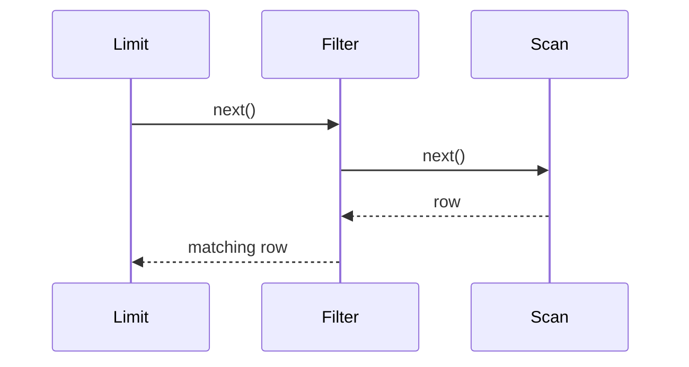
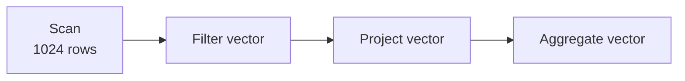
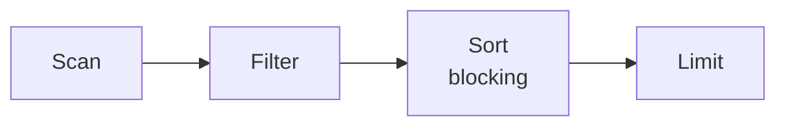
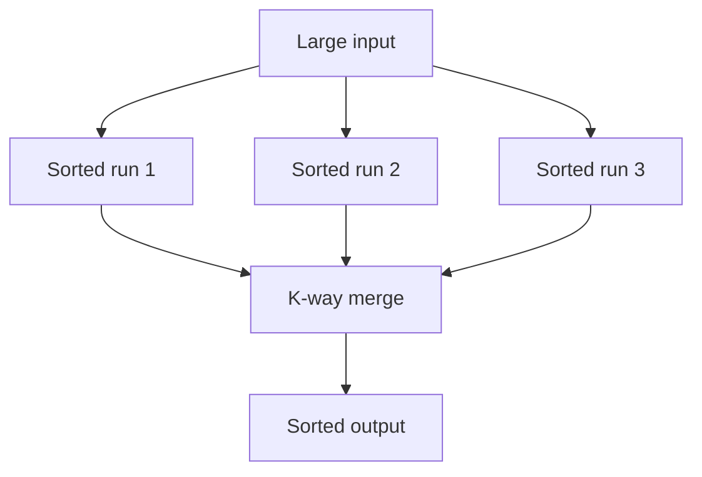
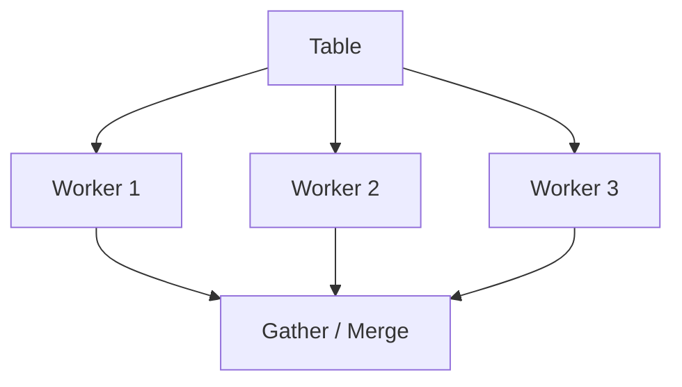

Logical planが同じでも、tableを順に読むかindexをたどるか、rowを1件ずつ渡すかbatchで渡すかによって性能は変わります。Physical planは、論理演算を具体的なalgorithmとaccess pathへ落としたものです。

この章では、join以外の主要operatorと、operator間でdataを受け渡す実行modelを扱います。

## この章で答える問い

- Table scan、index scan、index-only scan、bitmap scanは何を読むのか
- Iterator modelとvectorized executionは何が違うのか
- Pipeliningとmaterializationは、latencyとmemoryをどう変えるのか
- Sortやaggregationがmemoryへ収まらないと何が起きるのか
- Parallel executionは、どこまで処理を分割できるのか

## physical plan

次のlogical planを考えます。

```text
Aggregate by customer_id
  Filter status = 'confirmed'
    Scan orders
```

Physical planの候補には、少なくとも次があります。



同じ結果を返しますが、読むpage、memory、CPU、startup costが違います。

## scan operator

### sequential / table scan

Tableのdata pageを順番に読み、各recordへpredicateを適用します。

向いている状況：

- tableの大部分を読む
- 利用可能なindexがない
- sequential I/Oが効率的
- parallel scanで範囲を分担できる
- 必要columnがtableにまとまっている

Table scanは「遅い計画」ではありません。100万rowのうち80万rowを返すなら、indexとtableを往復するより合理的です。

### index scan

Index conditionに合うentryを探し、必要ならtable rowを読みます。

```sql
SELECT *
FROM orders
WHERE customer_id = 42;
```

対象rowが少なく、table page accessも少ない場合に有利です。Index entry順とtable物理順のcorrelationが低いとrandom accessが増えます。

### index-only scan

必要columnがindexへ含まれ、visibilityもindexまたは補助情報で判断できればtable accessを省略します。

Indexが小さくcacheされているread-heavy workloadでは大きな改善になりますが、wide covering indexの維持costも考えます。

### bitmap scan

複数indexや多数のmatching entryから、読むべきtable pageの集合をbitmapとして作ります。



Row pointer順に即座にtableへ飛ぶ代わりにpage単位でまとめ、random I/Oを減らします。複数indexのAND/ORも組み合わせられます。一方、bitmap構築memoryとstartup costが必要です。

## filter、projection、limit

### filter

入力rowごとにpredicateを評価します。Index conditionとして処理できなかった条件や、functionを含む条件がresidual filterとして残ります。

EXPLAIN ANALYZEでは「何row読んで、何rowをfilterで捨てたか」が重要です。大量に読んで大部分を捨てているなら、より早い段階で絞れるaccess pathを検討します。

### projection

必要columnだけを出力します。Logicalには単純でも、expression、cast、JSON構築、user-defined functionがあるとCPU costが増えます。

### limit

LIMITは必要件数へ達したら上流を止められる場合があります。

```sql
SELECT id, ordered_at
FROM orders
WHERE customer_id = 42
ORDER BY ordered_at DESC
LIMIT 20;
```

ORDER BYと一致するindexがあれば20件で停止できます。一致しなければ全候補をsortしてから20件を選ぶ可能性があります。Top-N heapで全sortを避けられる実装もあります。

## Iterator / Volcano model

古典的な実行modelでは、各operatorがnext()相当のinterfaceを持ち、親operatorが子へ次のrowを要求します。



利点：

- operatorを組み合わせやすい
- 1 rowずつpipelineできる
- LIMITなどが早く停止できる
- 中間結果全体をmemoryへ置かなくてよい

欠点：

- rowごとのfunction callやbranch cost
- CPU cacheとSIMDを使いにくい
- columnar dataを小さな単位で処理してしまう

## vectorized execution

Vectorized executionは、1 rowではなく数百〜数千rowのbatch/vectorをoperator間で渡します。



同じ処理を連続dataへ適用するため、function callを減らし、CPU cache、branch prediction、SIMDを利用しやすくなります。Column-oriented storageと特に相性がよいですが、row storeでもbatch executionを採用できます。

Batchを大きくすると効率は上がりやすい一方、最初のresultが出るまでのstartup latencyやworking memoryが増えます。

## push-based execution

Iteratorのpullとは逆に、子operatorが生成したbatchを親へpushするmodelもあります。Operator fusionによってfilterとprojectionを一つのcompiled loopへまとめる実装もあります。

Query compilationはvirtual functionやinterpretation overheadを減らせますが、compile time、code cache、複雑性が増えます。短いOLTP queryではcompile costが相対的に大きくなる場合があります。

## pipeliningとmaterialization

### pipelining

Operatorがrow/batchを生成したら、全入力を待たずに次へ渡します。

- 最初のresultを早く返せる
- 中間結果全体を保持しなくてよい
- LIMITで上流を早く停止できる

### materialization

中間結果をmemoryまたはtemporary storageへ一度保存します。

- 同じ結果を複数回再利用できる
- pipelineの境界を作る
- rewindが必要なoperatorを支える
- memoryを超えるとdisk I/Oが増える

Sort、hash table build、duplicate eliminationなど、全入力または大部分を必要とするoperatorをpipeline breaker/blocking operatorと呼びます。



Sortは通常、入力を受け取り終えるまで最小rowを確定できません。

## sort

### in-memory sort

入力がmemoryへ収まれば、quicksort、timsort、heapなど実装に適したalgorithmで並べます。Fixed-length keyやradix sortを利用するengineもあります。

### external merge sort

入力がmemoryを超える場合、次の手順でdiskを使います。

1. Memoryへ収まるchunkを読む
2. Chunkをsortしてtemporary runへ書く
3. 複数runをmulti-way mergeする



Memoryが少ないとrun数とmerge passが増え、temporary I/Oが増えます。EXPLAINでsort method、memory、disk spillを確認できる製品があります。

## aggregation

### hash aggregation

Group keyをhash tableのkeyとし、aggregate stateを更新します。

```text
customer_id → { count, sum, min, max ... }
```

入力が未sortでも1 passで処理しやすい一方、group数が多くhash tableがmemoryを超えるとpartition/spillが必要です。

### sort/group aggregation

Group key順に入力をsortし、同じkeyが連続する間aggregateします。入力がすでにindexや上流operatorによってsort済みなら、追加sortなしで少ないstateだけ保持できます。

| 観点 | Hash aggregate | Sort/group aggregate |
| --- | --- | --- |
| 入力順 | 不要 | group key順が必要 |
| memory | group数に比例 | 現在group中心 |
| 既存sortの利用 | しない | 利用できる |
| spill | hash partition | external sort |
| 出力順 | 未保証 | group key順になり得る |

## memory budgetとspill

Sort、hash aggregate、hash joinはquery-local memoryを使います。設定値を大きくするとspillを減らせますが、同時query数を掛け合わせる必要があります。

```text
potential memory
≈ concurrent queries
× memory-intensive operators per query
× operator memory limit
```

1 queryに1 GiBを与えて速くなっても、100 queryが同時実行されればmemory pressureやOOMを起こし得ます。Per-query最適化とsystem全体のcapacityは別です。

## parallel execution

大きなscanやaggregationは複数workerへ分割できます。



Parallelismには次のoverheadがあります。

- worker起動とscheduling
- data分配・再partition
- partial resultのmerge
- shared resource contention
- NUMA・cache locality

小さなqueryではserialのほうが速いことがあります。また、volatile function、lock、順序要件などでparallel化できないoperatorもあります。

Distributed DBではworkerが別nodeに広がり、network exchangeがphysical operatorとして加わります。

## operatorを読む順序

EXPLAIN ANALYZEを見るときは、次を確認します。

1. Leaf scanで何row/page読んだか
2. Filterで何row捨てたか
3. 推定rowと実rowが最初にずれた場所
4. Sort/hashがmemoryへ収まったか
5. Loop回数を掛けた総仕事量
6. Parallel workerの分担と偏り
7. 上位operatorへ渡るrow幅

最上位のtotal timeだけでなく、dataが増えた最初のoperatorを探します。

## よくある誤解

### 「sequential scanが出たのでindexが足りない」

対象割合が高い、tableが小さい、index lookupがrandom、statisticsがそう推定したなど合理的な理由があります。

### 「memory設定は大きいほどよい」

Operator単位・query単位・connection単位で使われる可能性があり、concurrencyとの積で考えます。

### 「parallel workerを増やせば線形に速くなる」

Serial部分、merge、I/O帯域、contention、skewによってspeedupは頭打ちになります。

## まとめ

- Physical planはlogical operatorを具体的なaccess pathとalgorithmへ落とす
- Table/index/index-only/bitmap scanは読むpageとstartup costが異なる
- Iterator modelはcomposabilityとpipelineに優れ、vectorized executionはCPU効率を上げる
- Pipeliningはlatencyとmemoryを抑え、materializationは再利用やblocking処理を支える
- Sortとhash aggregateはmemoryを超えるとtemporary storageへspillする
- Per-operator memoryはconcurrencyとの積でcapacityを考える
- Parallel executionには分配・merge・contentionのoverheadがある

## 確認問題

1. Tableの60%を読むqueryでsequential scanが有利になり得る理由を説明してください。
2. Bitmap scanが通常のindex scanよりtable page accessをまとめられる仕組みは何ですか。
3. Sortがpipeline breakerになる理由を説明してください。
4. Hash aggregationとsort aggregationをmemoryと入力順から比較してください。
5. Per-query memoryを増やす前にconcurrencyを確認する必要があるのはなぜですか。

## 参考資料

- [PostgreSQL Documentation: Using EXPLAIN](https://www.postgresql.org/docs/current/using-explain.html)
- [PostgreSQL Documentation: Planner Method Configuration](https://www.postgresql.org/docs/current/runtime-config-query.html)
- [Goetz Graefe, “Volcano—An Extensible and Parallel Query Evaluation System”](https://doi.org/10.1109/69.273032)

次章では、physical operatorの中でも特に選択肢とcost差が大きいjoin algorithmを比較します。
