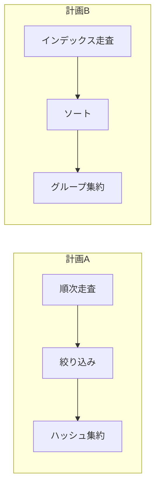
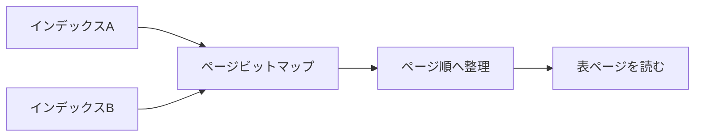
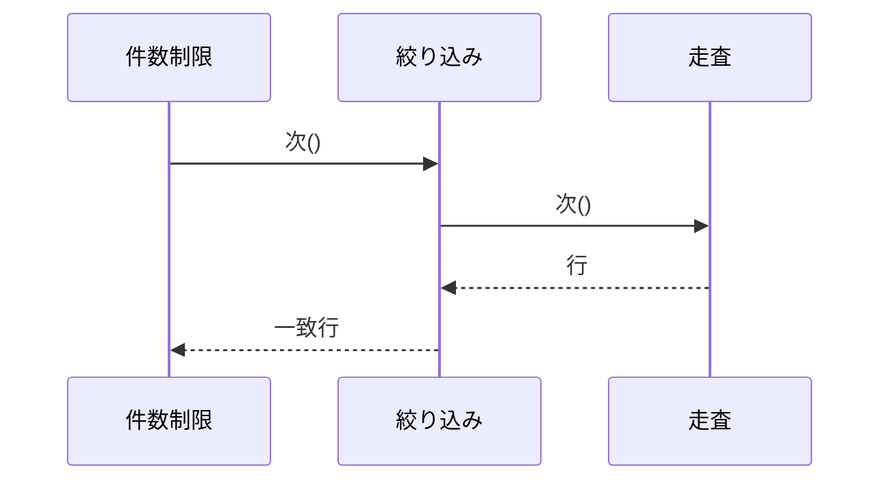
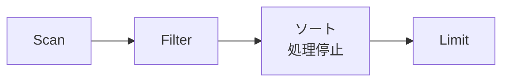
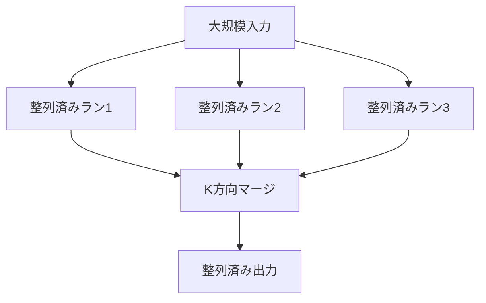
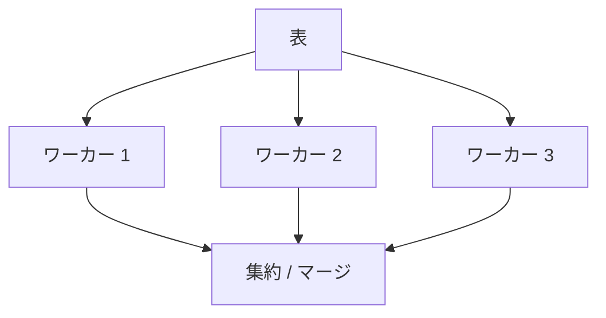

論理計画が同じでも、表を順に読むかインデックスをたどるか、行を1件ずつ渡すか一括で渡すかによって性能は変わります。物理計画は、論理演算を具体的なアルゴリズムとアクセス経路へ落としたものです。

この章では、結合以外の主要演算子と、演算子間でデータを受け渡す実行モデルを扱います。

## この章で答える問い

- 表走査、インデックス走査、インデックスのみの走査、ビットマップ走査は何を読むのか
- イテレーター モデルとベクトル化実行は何が違うのか
- パイプライン処理と実体化は、遅延時間とメモリをどう変えるのか
- ソートや集約がメモリへ収まらないと何が起きるのか
- 並列実行は、どこまで処理を分割できるのか

## 物理計画

次の論理計画を考えます。

```text
customer_idで集約
  絞り込み状態 = '確定済み'
    ordersを走査
```

物理計画の候補には、少なくとも次があります。



同じ結果を返しますが、読むページ、メモリ、CPU、起動コストが違います。

## 走査演算子

### 順次 / 表走査

表のデータページを順番に読み、各レコードへ述語を適用します。

向いている状況：

- 表の大部分を読む
- 利用可能なインデックスがない
- 順次I/Oが効率的
- 並列走査で範囲を分担できる
- 必要列が表にまとまっている

表走査は「遅い計画」ではありません。100万行のうち80万行を返すなら、インデックスと表を往復するより合理的です。

### インデックス走査

インデックス条件に合う項目を探し、必要なら表行を読みます。

```sql
SELECT *
FROM orders
WHERE customer_id = 42;
```

対象行が少なく、表ページアクセスも少ない場合に有利です。インデックス項目順と表物理順の相関が低いとランダムアクセスが増えます。

### インデックスのみの走査

必要列がインデックスへ含まれ、可視性もインデックスまたは補助情報で判断できれば表アクセスを省略します。

インデックスが小さくキャッシュされている読み取り中心の処理負荷では大きな改善になりますが、幅広いカバリングインデックスの維持コストも考えます。

### ビットマップ走査

複数インデックスや多数の一致項目から、読むべき表ページの集合をビットマップとして作ります。



行ポインター順に即座に表へ飛ぶ代わりにページ単位でまとめ、ランダムI/Oを減らします。複数インデックスのAND/ORも組み合わせられます。一方、ビットマップ構築メモリと起動コストが必要です。

## 絞り込み、射影、上限

### 絞り込み

入力行ごとに述語を評価します。インデックス条件として処理できなかった条件や、関数を含む条件が残余フィルターとして残ります。

EXPLAIN解析では「何行読んで、何行を絞り込みで捨てたか」が重要です。大量に読んで大部分を捨てているなら、より早い段階で絞れるアクセス経路を検討します。

### 射影

必要列だけを出力します。論理には単純でも、式、型変換、JSON構築、ユーザー定義関数があるとCPUコストが増えます。

### 上限

上限は必要件数へ達したら上流を止められる場合があります。

```sql
SELECT id, ordered_at
FROM orders
WHERE customer_id = 42
ORDER BY ordered_at DESC
LIMIT 20;
```

ORDER BYと一致するインデックスがあれば20件で停止できます。一致しなければ全候補をソートしてから20件を選ぶ可能性があります。Top-Nヒープで全ソートを避けられる実装もあります。

## イテレーター / Volcanoモデル

古典的な実行モデルでは、各演算子が次()相当のインターフェースを持ち、親演算子が子へ次の行を要求します。



利点：

- 演算子を組み合わせやすい
- 1行ずつパイプラインできる
- 上限などが早く停止できる
- 中間結果全体をメモリへ置かなくてよい

欠点：

- 行ごとの関数呼び出しや分岐コスト
- CPUキャッシュとSIMDを使いにくい
- 列指向データを小さな単位で処理してしまう

## ベクトル化実行

ベクトル化実行は、1行ではなく数百〜数千行の一括/ベクトルを演算子間で渡します。


同じ処理を連続データへ適用するため、関数呼び出しを減らし、CPUキャッシュ、分岐予測、SIMDを利用しやすくなります。列指向ストレージと特に相性がよいですが、行保存でも一括実行を採用できます。

一括を大きくすると効率は上がりやすい一方、最初の結果が出るまでの起動遅延時間や作業メモリが増えます。

## プッシュ型実行

イテレーターのプルとは逆に、子演算子が生成した一括を親へプッシュするモデルもあります。演算子の融合によって絞り込みと射影を一つのコンパイル済みループへまとめる実装もあります。

クエリのコンパイルは仮想関数や解釈オーバーヘッドを減らせますが、コンパイル時間、コードキャッシュ、複雑性が増えます。短いOLTPクエリではコンパイルコストが相対的に大きくなる場合があります。

## パイプライン処理と実体化

### パイプライン処理

演算子が行/一括を生成したら、全入力を待たずに次へ渡します。

- 最初の結果を早く返せる
- 中間結果全体を保持しなくてよい
- 上限で上流を早く停止できる

### 実体化

中間結果をメモリまたは一時的なストレージへ一度保存します。

- 同じ結果を複数回再利用できる
- パイプラインの境界を作る
- 巻き戻しが必要な演算子を支える
- メモリを超えるとディスクI/Oが増える

ソート、ハッシュ表構築、重複除去など、全入力または大部分を必要とする演算子をパイプライン阻害演算子/処理停止演算子と呼びます。



ソートは通常、入力を受け取り終えるまで最小行を確定できません。

## ソート

### メモリ内ソート

入力がメモリへ収まれば、クイックソート、ティムソート、ヒープなど実装に適したアルゴリズムで並べます。固定長キーや基数ソートを利用するエンジンもあります。

### 外部マージソート

入力がメモリを超える場合、次の手順でディスクを使います。

1. メモリへ収まるチャンクを読む
2. チャンクをソートして一時ランへ書く
3. 複数ランを多方向マージする



メモリが少ないとラン数とマージ回数が増え、一時的なI/Oが増えます。EXPLAINでソート方式、メモリ、ディスク退避を確認できる製品があります。

## 集約

### ハッシュ集約

グループキーをハッシュ表のキーとし、集約状態を更新します。

```text
customer_id → { 件数, 合計, 最小, 最大 ... }
```

入力が未ソートでも1回の走査で処理しやすい一方、グループ数が多くハッシュ表がメモリを超えるとパーティション/ディスク退避が必要です。

### ソート/グループ集約

グループキー順に入力をソートし、同じキーが連続する間集約します。入力がすでにインデックスや上流演算子によってソート済みなら、追加ソートなしで少ない状態だけ保持できます。

| 観点 | ハッシュ集約 | ソート/グループ集約 |
| --- | --- | --- |
| 入力順 | 不要 | グループキー順が必要 |
| メモリ | グループ数に比例 | 現在グループ中心 |
| 既存ソートの利用 | しない | 利用できる |
| ディスク退避 | ハッシュパーティション | 外部ソート |
| 出力順 | 未保証 | グループキー順になり得る |

## メモリ上限とディスク退避

ソート、ハッシュ集約、ハッシュ結合はクエリ-局所メモリを使います。設定値を大きくするとディスク退避を減らせますが、同時クエリ数を掛け合わせる必要があります。

```text
必要になり得るメモリ
≈ 並行クエリ数
× クエリ当たりのメモリ負荷が高い演算子数
× 演算子メモリ上限
```

1クエリに1 GiBを与えて速くなっても、100クエリが同時実行されればメモリ圧迫やOOMを起こし得ます。クエリごとの最適化とシステム全体の容量は別です。

## 並列実行

大きな走査や集約は複数ワーカーへ分割できます。



並列度には次のオーバーヘッドがあります。

- ワーカー起動とスケジューリング
- データ分配・再パーティション
- 部分的結果のマージ
- 共有資源競合
- NUMA・キャッシュ局所性

小さなクエリでは直列のほうが速いことがあります。また、揮発性関数、ロック、順序要件などで並列化できない演算子もあります。

分散DBではワーカーが別ノードに広がり、ネットワーク交換が物理演算子として加わります。

## 演算子を読む順序

EXPLAIN解析を見るときは、次を確認します。

1. 葉走査で何行/ページ読んだか
2. 絞り込みで何行捨てたか
3. 推定行と実行が最初にずれた場所
4. ソート/ハッシュがメモリへ収まったか
5. ループ回数を掛けた総仕事量
6. 並列ワーカーの分担と偏り
7. 上位演算子へ渡る行幅

最上位の合計時間だけでなく、データが増えた最初の演算子を探します。

## よくある誤解

### 「順次走査が出たのでインデックスが足りない」

対象割合が高い、表が小さい、インデックス参照がランダム、統計情報がそう推定したなど合理的な理由があります。

### 「メモリ設定は大きいほどよい」

演算子単位・クエリ単位・接続単位で使われる可能性があり、同時実行性との積で考えます。

### 「並列ワーカーを増やせば線形に速くなる」

直列部分、マージ、I/O帯域、競合、偏りによって高速化率は頭打ちになります。

## まとめ

- 物理計画は論理演算子を具体的なアクセス経路とアルゴリズムへ落とす
- 表/インデックス/インデックス-のみ/ビットマップ走査は読むページと起動コストが異なる
- イテレーター モデルは合成可能性とパイプラインに優れ、ベクトル化実行はCPU効率を上げる
- パイプライン処理は遅延時間とメモリを抑え、実体化は再利用や処理停止処理を支える
- ソートとハッシュ集約はメモリを超えると一時的なストレージへディスク退避する
- 演算子ごとのメモリは同時実行性との積で容量を考える
- 並列実行には分配・マージ・競合のオーバーヘッドがある

## 確認問題

1. 表の60%を読むクエリで順次走査が有利になり得る理由を説明してください。
2. ビットマップ走査が通常のインデックス走査より表ページアクセスをまとめられる仕組みは何ですか。
3. ソートがパイプライン阻害演算子になる理由を説明してください。
4. ハッシュ集約とソート集約をメモリと入力順から比較してください。
5. クエリごとのメモリを増やす前に同時実行性を確認する必要があるのはなぜですか。

## 参考資料

- [PostgreSQL Documentation: Using EXPLAIN](https://www.postgresql.org/docs/current/using-explain.html)
- [PostgreSQL Documentation: Planner Method Configuration](https://www.postgresql.org/docs/current/runtime-config-query.html)
- [Goetz Graefe, “Volcano—An Extensible and Parallel Query Evaluation System”](https://doi.org/10.1109/69.273032)

次章では、物理演算子の中でも特に選択肢とコスト差が大きい結合アルゴリズムを比較します。
