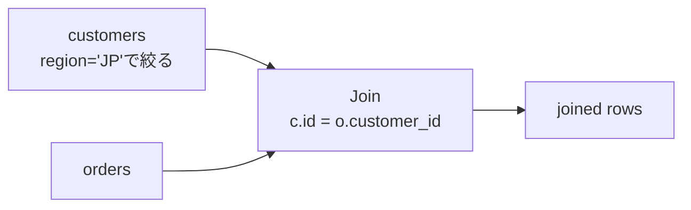
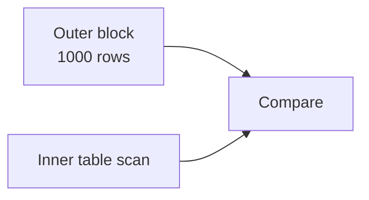
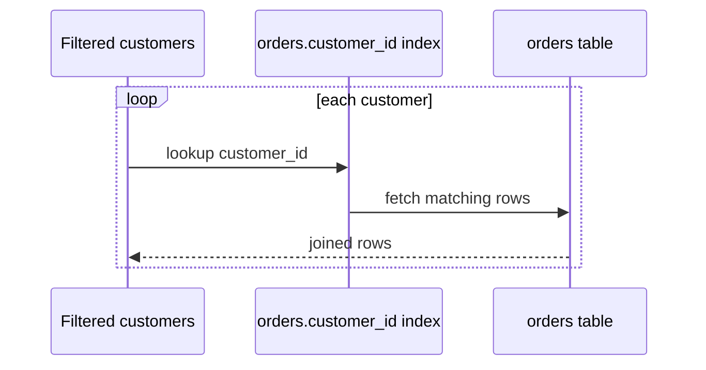
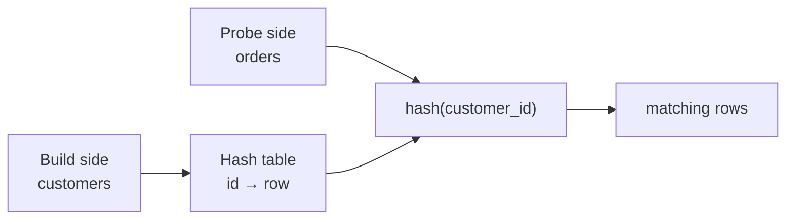
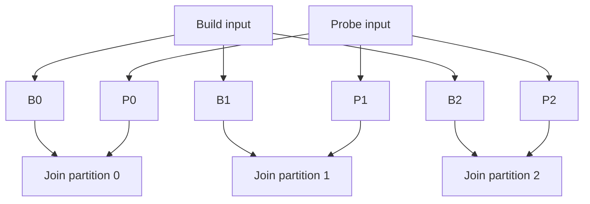
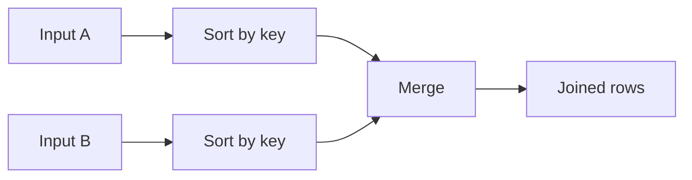
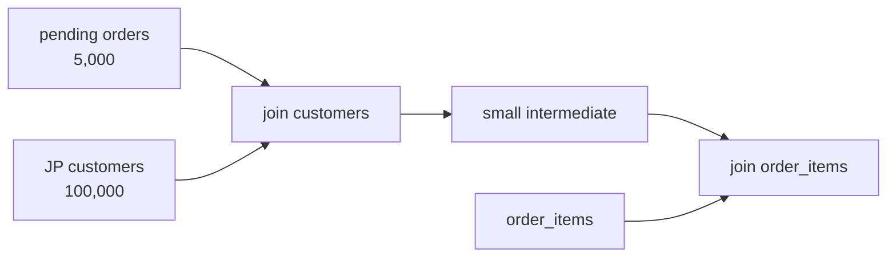
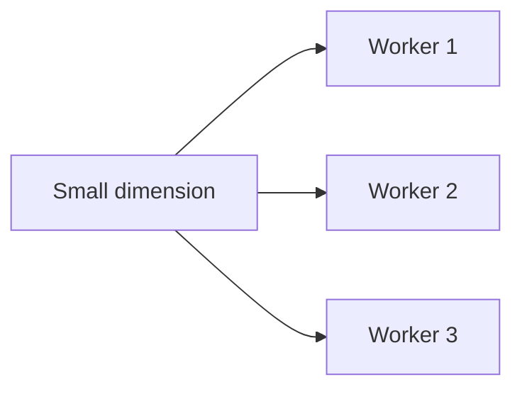

Joinは複数relationを関連づける論理演算です。同じinner joinでも、nested loop、hash join、sort-merge joinでは必要なI/O、memory、startup costが大きく異なります。

この章では「どのjoinが最速か」ではなく、「どの入力条件なら、どのcostが小さくなるか」を判断できるようにします。

## この章で答える問い

- Nested loop joinが少数rowで強く、大量rowで危険なのはなぜか
- Hash joinで小さい入力をbuild側にするのはなぜか
- Sort-merge joinはどのような順序・条件で有利になるのか
- Memoryに収まらないjoinはどうspillするのか
- Join orderが中間結果sizeをどう変えるのか

## joinの入力と出力

顧客と注文を結合します。

```sql
SELECT c.id, c.name, o.id, o.total_amount
FROM customers AS c
JOIN orders AS o ON o.customer_id = c.id
WHERE c.region = 'JP';
```

Joinのcostはtable全体のsizeだけでなく、filter後の入力row数、row幅、key distribution、index、memoryで決まります。



## simple nested loop join

最も単純なnested loopは、外側の各rowに対して内側を全scanします。

```text
for each customer c:
  for each order o:
    if o.customer_id = c.id:
      emit(c, o)
```

外側M row、内側N rowなら、比較回数は概ねM×Nです。

```text
1,000 customers × 10,000,000 orders
= 10,000,000,000 comparisons
```

小さい入力同士なら単純で有効ですが、大規模入力では不適切です。

## block nested loop join

外側rowをmemory blockへまとめ、内側を1回scanする間にblock内の全rowと比較します。



内側のscan回数を減らし、I/O localityを改善します。Join buffer sizeが大きいほど外側を多く保持できますが、memoryを消費します。

## index nested loop join

内側join keyにindexがあれば、外側rowごとにindex lookupします。

```text
for each customer c:
  lookup orders_customer_id_idx(c.id)
  emit matching orders
```



外側が少数rowで、内側indexのselectivityが高いと非常に有効です。

例：

```sql
SELECT c.id, o.id
FROM customers c
JOIN orders o ON o.customer_id = c.id
WHERE c.id = 42;
```

Customersは1 row、orders.customer_id indexから数十rowを取るだけです。

一方、外側が100万rowなら100万回のindex traversalが発生します。Inner table pageが散らばっていればrandom I/Oも増えます。EXPLAINではinner operatorのloopsを掛けて総仕事量を見ます。

## hash join

Hash joinは通常、小さい入力をbuild sideとしてhash tableを作り、大きい入力をprobeします。



### build phase

```text
for each customer c:
  hash_table[hash(c.id)].append(c)
```

### probe phase

```text
for each order o:
  for each candidate c in hash_table[hash(o.customer_id)]:
    if c.id = o.customer_id:
      emit(c, o)
```

Hash collisionがあるため、hash値だけでなく元keyのequalityも確認します。

### build側を小さくする理由

Build sideはhash tableとしてmemoryへ保持します。小さな入力をbuildするとmemory、cache miss、spillを減らせます。

ただしouter joinの向き、join semantics、既存filter、parallel planによって単純に左右を交換できないことがあります。

### hash joinが向く条件

- equi-join
- 少なくともbuild sideがmemoryへ収まりやすい
- 大きい入力を一度scanできる
- 入力がsortされていない
- inner tableへの有効なindex lookupがない、または外側が大きい

Hash functionでgroupingできないrange conditionには、そのまま使えません。

```sql
-- hash join向き
ON o.customer_id = c.id

-- 通常のhash joinでは扱えない
ON p.valid_from <= o.ordered_at
AND p.valid_to > o.ordered_at
```

## grace hash joinとspill

Build sideがmemoryへ収まらない場合、両入力を同じhash functionでpartitionし、対応partitionごとにjoinします。



Partitionをtemporary storageへ書いて読み直すため、I/Oが増えます。Data skewで一つのkeyへrowが集中すると、そのpartitionだけmemoryへ収まらず再partitionが必要になることがあります。

## sort-merge join

両入力をjoin key順にsortし、先頭からmergeします。

```text
customers: 10, 20, 30, 40
orders:     10, 10, 30, 30, 30, 50
             ↑         ↑
```

Keyを比較し、小さい側を進めます。同じkeyが複数ある場合、そのgroupの組み合わせを出力します。



### 向く条件

- 入力がすでにjoin key順
- Index scanからsorted inputを得られる
- Join結果にも同じorderが必要
- 大規模入力でsequential accessを使いたい
- equalityに加えて一部range joinを扱う

両入力にsortが必要ならstartup costが大きくなります。Sortがmemoryを超えるとexternal merge sortが必要です。

## algorithm比較

| 観点 | Index nested loop | Hash join | Sort-merge join |
| --- | --- | --- | --- |
| 得意な入力 | outerが小さくinnerにindex | equi-join、大規模scan | sorted input、大規模・range |
| startup cost | 小さい | hash build | sortが必要なら大きい |
| memory | outer + index access | build hash table | sort buffer / runs |
| random access | 多くなり得る | 主にscan | 主にsequential |
| output order | outer/index次第 | 未保証 | join key順になり得る |
| non-equality | index rangeなら可能 | 基本不可 | 条件により可能 |
| LIMITとの相性 | 最初のrowを出しやすい | build完了待ち | sort完了待ちの場合 |

Nested loopを一括りにせず、innerがtable scanかindex lookupかを見ることが重要です。

## join typeとphysical algorithm

### inner join

両側にmatchする組み合わせを返します。交換・結合順を変えやすく、algorithm選択も広いです。

### left outer join

左側を必ず残し、右にmatchがなければNULLを補います。Build/probeの向きやpredicate pushdownに制約があります。

### semi join

右側にmatchがある左rowを1回だけ返します。EXISTSの実装に使われます。右側の全matchを出力しないため、最初のmatchで停止できます。

### anti join

右側にmatchがない左rowを返します。NOT EXISTSの実装に使われます。NULLを含むNOT INとはsemanticsが異なる点に注意します。

## join order

3 table以上では、algorithmだけでなくjoin順が重要です。

```sql
SELECT ...
FROM customers c
JOIN orders o ON o.customer_id = c.id
JOIN order_items i ON i.order_id = o.id
WHERE c.region = 'JP'
  AND o.status = 'pending';
```

仮に次の件数とします。

```text
customers             10,000,000
JP customers             100,000
orders                100,000,000
pending orders             5,000
order_items           300,000,000
```

Pending ordersを先に絞ってcustomer、itemへjoinすれば中間結果を小さくできます。Filter前のcustomers × ordersから始めると、巨大な中間結果を作りかねません。



Optimizerがjoin orderを選ぶには、各filter後のcardinality推定が必要です。推定を外すと、小さいと思った入力をnested loop外側にし、実際には大量loopになることがあります。

## data skew

平均では1 customerあたり10 ordersでも、特定customerだけ1000万orders持つ場合があります。

- Hash partitionが一部workerへ集中する
- Index nested loopの一回だけ極端に多くなる
- Parallel worker間で完了時間が偏る
- Memory estimateが外れる

Average cardinalityだけでなく、most common valueやhistogramが重要です。

## distributed join

Dataが別nodeにあると、network transferがjoin costへ加わります。

代表的なexchange：

- **broadcast join**：小さいtableを全workerへ配る
- **repartition join**：両入力をjoin key hashで再分配する
- **co-located join**：同じpartition keyで配置済みならnetwork移動を避ける



Smallの判断を誤るとbroadcastがnetworkとmemoryを圧迫します。Shard key設計はjoin localityにも影響します。

## EXPLAINで確認する

Join nodeでは次を読みます。

1. Join typeとalgorithm
2. Outer/build側とinner/probe側
3. 推定rowsと実rows
4. Inner operatorのloops
5. Hash table size、batch、spill
6. Sort methodとdisk usage
7. Join filterで捨てたrows
8. Parallel workerのskew

Nested loopのinnerが1 msでも、100万loopsなら総costは大きくなります。

## よくある誤解

### 「nested loopは遅く、hash joinは速い」

Outerが1 rowでinnerに適切なindexがあればnested loopは最小latencyになり得ます。Hash joinはbuildとfull scanが必要です。

### 「hash joinはO(N)だからmemory量は関係ない」

Memoryへ収まらなければpartitionをdiskへspillし、追加I/Oが発生します。Skewで一部partitionだけ収まらないこともあります。

### 「sort-merge joinはsortするので常に不利」

入力がindexや上流operatorですでにsortedなら追加sortは不要です。Output orderを後続でも利用できます。

## まとめ

- Simple nested loopはM×N比較だが、index nested loopはinner lookupで大幅に減らせる
- Outerが小さくinnerに有効なindexがある場合、index nested loopが有利
- Hash joinは小さいbuild sideをhash tableへ置き、大きいprobe sideをscanする
- Memoryを超えるhash joinはpartitionをspillし、skewが問題になる
- Sort-merge joinはsorted inputやrange条件、ordered outputで有利になり得る
- Join typeはalgorithmの向きと合法な書き換えを制約する
- Join orderは中間結果sizeを変え、cardinality estimationに依存する

## 確認問題

1. Outer 10 row、inner 1億rowでinner keyにindexがある場合、どのjoinを候補にしますか。
2. Hash joinでbuild sideを小さくする理由をmemoryとcacheから説明してください。
3. Grace hash joinが追加I/Oを必要とする理由は何ですか。
4. Sort-merge joinで既存index orderを再利用できる例を作ってください。
5. Cardinality estimateの誤りがnested loopのloopsへどう増幅されるか説明してください。

## 参考資料

- [PostgreSQL Documentation: Using EXPLAIN](https://www.postgresql.org/docs/current/using-explain.html)
- [PostgreSQL Documentation: Planner Cost Constants](https://www.postgresql.org/docs/current/runtime-config-query.html)
- [Goetz Graefe, “Query Evaluation Techniques for Large Databases”](https://doi.org/10.1145/152610.152611)

次章では、statisticsとcardinality estimationから、optimizerがjoin順とphysical planを選ぶ仕組みを扱います。
