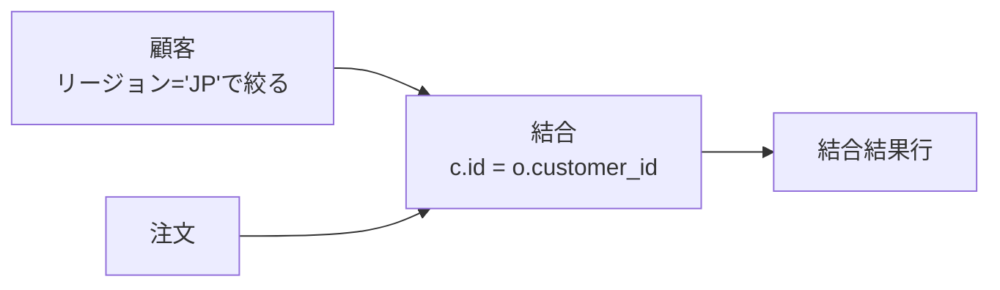
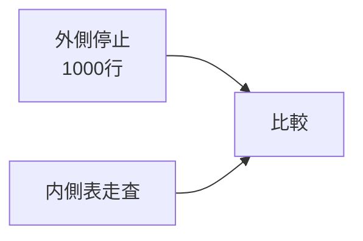
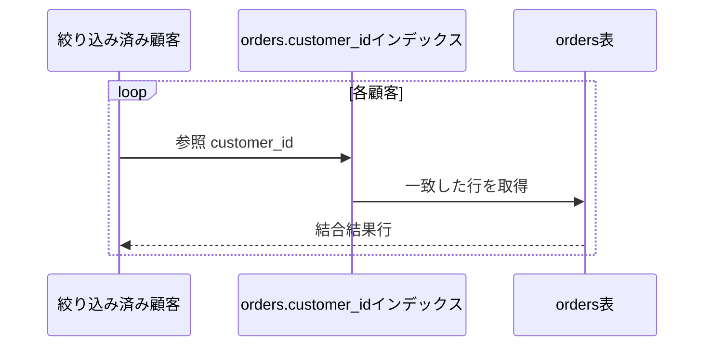
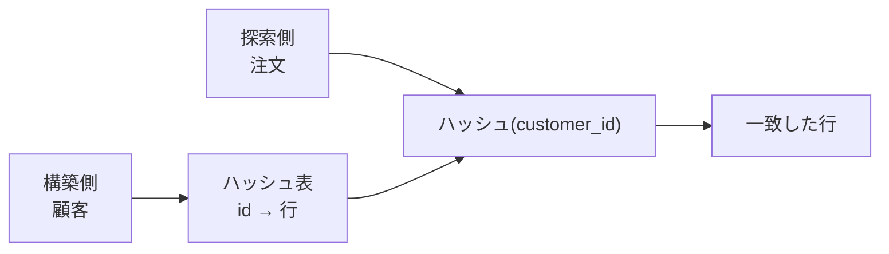
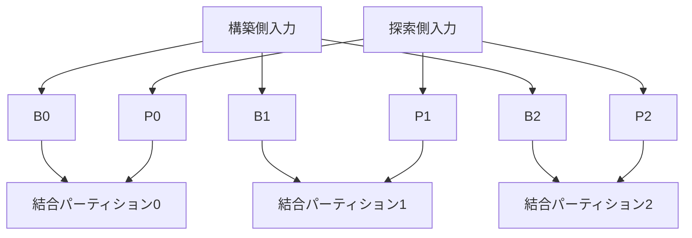
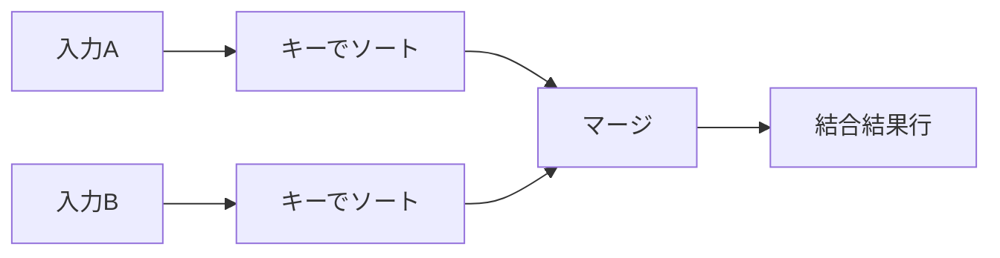
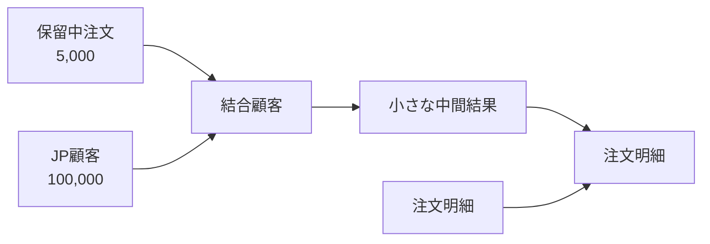
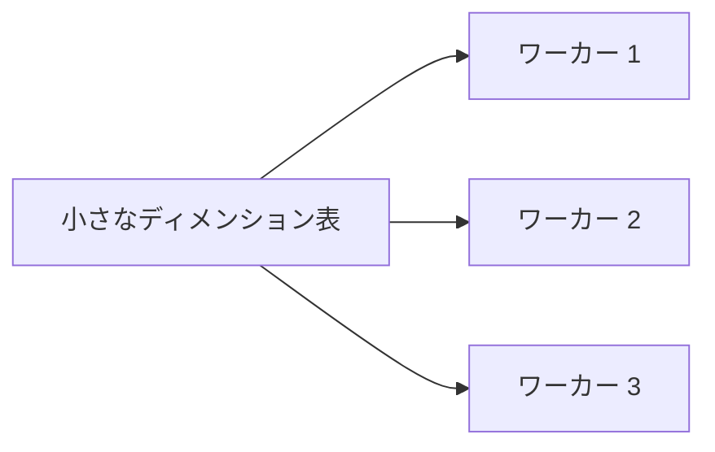

結合は複数関係を関連づける論理演算です。同じ内部結合でも、入れ子ループ、ハッシュ結合、ソートマージ結合では必要なI/O、メモリ、起動コストが大きく異なります。

この章では「どの結合が最速か」ではなく、「どの入力条件なら、どのコストが小さくなるか」を判断できるようにします。

## この章で答える問い

- 入れ子ループ結合が少数行で強く、大量行で危険なのはなぜか
- ハッシュ結合で小さい入力を構築側にするのはなぜか
- ソートマージ結合はどのような順序・条件で有利になるのか
- メモリに収まらない結合はどうディスク退避するのか
- 結合順序が中間結果大きさをどう変えるのか

## 結合の入力と出力

顧客と注文を結合します。

```sql
SELECT c.id, c.name, o.id, o.total_amount
FROM customers AS c
JOIN orders AS o ON o.customer_id = c.id
WHERE c.region = 'JP';
```

結合のコストは表全体の大きさだけでなく、絞り込み後の入力行数、行幅、キーの分布、インデックス、メモリで決まります。



## 単純入れ子ループ結合

最も単純な入れ子ループは、外側の各行に対して内側を全走査します。

```text
各顧客cについて:
  各注文oについて:
    if o.customer_id = c.id:
      (c, o)を出力
```

外側M行、内側N行なら、比較回数は概ねM×Nです。

```text
1,000顧客 × 10,000,000注文
= 10,000,000,000回の比較
```

小さい入力同士なら単純で有効ですが、大規模入力では不適切です。

## 停止入れ子ループ結合

外側行をメモリ停止へまとめ、内側を1回走査する間に停止内の全行と比較します。



内側の走査回数を減らし、I/O局所性を改善します。結合バッファが大きいほど外側を多く保持できますが、メモリを消費します。

## インデックス入れ子ループ結合

内側結合キーにインデックスがあれば、外側行ごとにインデックス参照します。

```text
各顧客cについて:
  参照 orders_customer_id_idx(c.id)
  一致した注文を出力
```



外側が少数行で、内側インデックスの選択率が高いと非常に有効です。

例：

```sql
SELECT c.id, o.id
FROM customers c
JOIN orders o ON o.customer_id = c.id
WHERE c.id = 42;
```

customersは1行、orders.customer_idインデックスから数十行を取るだけです。

一方、外側が100万行なら100万回のインデックス走査が発生します。内側表ページが散らばっていればランダムI/Oも増えます。EXPLAINでは内側演算子のループ数を掛けて総仕事量を見ます。

## ハッシュ結合

ハッシュ結合は通常、小さい入力を構築側としてハッシュ表を作り、大きい入力を探索します。



### 構築段階

```text
各顧客cについて:
  hash_table[ハッシュ(c.id)].追記(c)
```

### 探索段階

```text
各注文oについて:
  hash_table[ハッシュ(o.customer_id)]の各候補cについて:
    if c.id = o.customer_id:
      (c, o)を出力
```

ハッシュ衝突があるため、ハッシュ値だけでなく元キーの等値も確認します。

### 構築側を小さくする理由

構築側はハッシュ表としてメモリへ保持します。小さな入力を構築するとメモリ、キャッシュミス、ディスク退避を減らせます。

ただし外部結合の向き、結合意味論、既存絞り込み、並列計画によって単純に左右を交換できないことがあります。

### ハッシュ結合が向く条件

- 等値結合
- 少なくとも構築側がメモリへ収まりやすい
- 大きい入力を一度走査できる
- 入力がソートされていない
- 内側表への有効なインデックス参照がない、または外側が大きい

ハッシュ関数でグループ化できない範囲条件には、そのまま使えません。

```sql
-- ハッシュ結合向き
ON o.customer_id = c.id

-- 通常のハッシュ結合では扱えない
ON p.valid_from <= o.ordered_at
AND p.valid_to > o.ordered_at
```

## Graceハッシュ結合とディスク退避

構築側がメモリへ収まらない場合、両入力を同じハッシュ関数でパーティションし、対応パーティションごとに結合します。



パーティションを一時的なストレージへ書いて読み直すため、I/Oが増えます。データ偏りで一つのキーへ行が集中すると、そのパーティションだけメモリへ収まらず再パーティションが必要になることがあります。

## ソートマージ結合

両入力を結合キー順にソートし、先頭からマージします。

```text
顧客: 10, 20, 30, 40
注文: 10, 10, 30, 30, 30, 50
             ↑         ↑
```

キーを比較し、小さい側を進めます。同じキーが複数ある場合、そのグループの組み合わせを出力します。



### 向く条件

- 入力がすでに結合キー順
- インデックス走査から整列済み入力を得られる
- 結合結果にも同じ注文が必要
- 大規模入力で順次アクセスを使いたい
- 等値に加えて一部範囲結合を扱う

両入力にソートが必要なら起動コストが大きくなります。ソートがメモリを超えると外部マージソートが必要です。

## アルゴリズム比較

| 観点 | インデックス入れ子ループ | ハッシュ結合 | ソートマージ結合 |
| --- | --- | --- | --- |
| 得意な入力 | 外側が小さく内側にインデックス | 等値結合、大規模走査 | 整列済み入力、大規模・範囲 |
| 起動コスト | 小さい | ハッシュ構築 | ソートが必要なら大きい |
| メモリ | 外側 + インデックスアクセス | 構築ハッシュ表 | ソートバッファ / ラン |
| ランダムアクセス | 多くなり得る | 主に走査 | 主に順次 |
| 出力順序 | 外側/インデックス次第 | 未保証 | 結合キー順になり得る |
| 非等値 | インデックス範囲なら可能 | 基本不可 | 条件により可能 |
| 上限との相性 | 最初の行を出しやすい | 構築完了待ち | ソート完了待ちの場合 |

入れ子ループを一括りにせず、内側が表走査かインデックス参照かを見ることが重要です。

## 結合型と物理アルゴリズム

### 内部結合

両側に一致する組み合わせを返します。交換・結合順を変えやすく、アルゴリズム選択も広いです。

### 左外部結合

左側を必ず残し、右に一致がなければNULLを補います。構築/探索の向きや述語のプッシュダウンに制約があります。

### 半結合

右側に一致がある左行を1回だけ返します。EXISTSの実装に使われます。右側の全一致を出力しないため、最初の一致で停止できます。

### 反結合

右側に一致がない左行を返します。NOT EXISTSの実装に使われます。NULLを含むNOT INとは意味論が異なる点に注意します。

## 結合順序

3表以上では、アルゴリズムだけでなく結合順が重要です。

```sql
SELECT ...
FROM customers c
JOIN orders o ON o.customer_id = c.id
JOIN order_items i ON i.order_id = o.id
WHERE c.region = 'JP'
  AND o.status = 'pending';
```

仮に次の件数とします。

```text
顧客                   10,000,000
日本の顧客                100,000
注文                  100,000,000
保留中の注文               5,000
order_items           300,000,000
```

保留中の注文を先に絞って顧客、明細へ結合すれば中間結果を小さくできます。絞り込み前の顧客 × 注文から始めると、巨大な中間結果を作りかねません。



最適化器が結合順序を選ぶには、各絞り込み後の行数推定が必要です。推定を外すと、小さいと思った入力を入れ子ループ外側にし、実際には大量ループになることがあります。

## データ偏り

平均では1顧客あたり10件の注文でも、特定顧客だけ1,000万件の注文持つ場合があります。

- ハッシュパーティションが一部ワーカーへ集中する
- インデックス入れ子ループの一回だけ極端に多くなる
- 並列ワーカー間で完了時間が偏る
- メモリ推定が外れる

平均行数だけでなく、最頻値やヒストグラムが重要です。

## 分散結合

データが別ノードにあると、ネットワーク転送が結合コストへ加わります。

代表的な交換：

- **ブロードキャスト結合**：小さい表を全ワーカーへ配る
- **再分割結合**：両入力を結合キー ハッシュで再分配する
- **同一配置結合**：同じパーティションキーで配置済みならネットワーク移動を避ける



小規模の判断を誤るとブロードキャストがネットワークとメモリを圧迫します。シャードキー設計は結合局所性にも影響します。

## EXPLAINで確認する

結合ノードでは次を読みます。

1. 結合型とアルゴリズム
2. 外側/構築側と内側/探索側
3. 推定行と実行
4. 内側演算子のループ数
5. ハッシュ表大きさ、一括、ディスク退避
6. ソート方式とディスク使用量
7. 結合絞り込みで捨てた行
8. 並列ワーカーの偏り

入れ子ループの内側が1 msでも、100万ループ数なら総コストは大きくなります。

## よくある誤解

### 「入れ子ループは遅く、ハッシュ結合は速い」

外側が1行で内側に適切なインデックスがあれば入れ子ループは最小遅延時間になり得ます。ハッシュ結合は構築と全件走査が必要です。

### 「ハッシュ結合はO(N)だからメモリ量は関係ない」

メモリへ収まらなければパーティションをディスクへディスク退避し、追加I/Oが発生します。偏りで一部パーティションだけ収まらないこともあります。

### 「ソートマージ結合はソートするので常に不利」

入力がインデックスや上流演算子ですでに整列済みなら追加ソートは不要です。出力順序を後続でも利用できます。

## まとめ

- 単純入れ子ループはM×N比較だが、インデックス入れ子ループは内側参照で大幅に減らせる
- 外側が小さく内側に有効なインデックスがある場合、インデックス入れ子ループが有利
- ハッシュ結合は小さい構築側をハッシュ表へ置き、大きい探索側を走査する
- メモリを超えるハッシュ結合はパーティションをディスク退避し、偏りが問題になる
- ソートマージ結合は整列済み入力や範囲条件、順序付けられた出力で有利になり得る
- 結合型はアルゴリズムの向きと合法な書き換えを制約する
- 結合順序は中間結果大きさを変え、行数推定に依存する

## 確認問題

1. 外側10行、内側1億行で内側キーにインデックスがある場合、どの結合を候補にしますか。
2. ハッシュ結合で構築側を小さくする理由をメモリとキャッシュから説明してください。
3. Graceハッシュ結合が追加I/Oを必要とする理由は何ですか。
4. ソートマージ結合で既存インデックス注文を再利用できる例を作ってください。
5. 行数推定の誤りが入れ子ループのループ数へどう増幅されるか説明してください。

## 参考資料

- [PostgreSQL Documentation: Using EXPLAIN](https://www.postgresql.org/docs/current/using-explain.html)
- [PostgreSQL Documentation: Planner Cost Constants](https://www.postgresql.org/docs/current/runtime-config-query.html)
- [Goetz Graefe, “Query Evaluation Techniques for Large Databases”](https://doi.org/10.1145/152610.152611)

次章では、統計情報と行数推定から、最適化器が結合順と物理計画を選ぶ仕組みを扱います。
