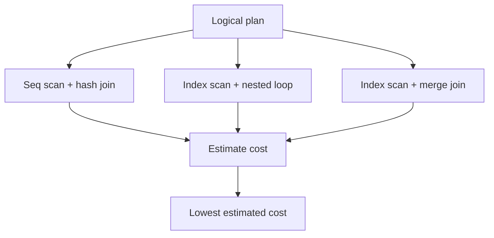
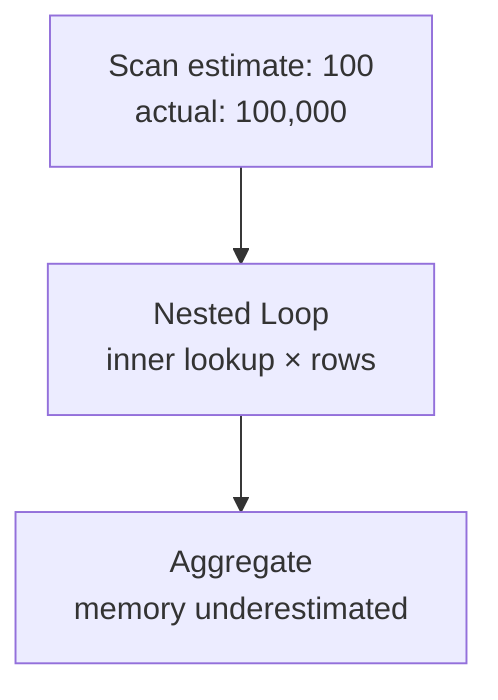

Optimizerは実際に全候補planを実行して最速を選ぶわけではありません。Statisticsから各operatorのrow数を推定し、I/O、CPU、memory、networkをcostへ換算して比較します。

推定に基づく以上、optimizerは間違えることがあります。重要なのはhintで結論を強制する前に、どの推定がなぜ外れ、後続の判断へどう伝播したかを見つけることです。

## この章で答える問い

- Cost-based optimizerはどの候補を、何のcostで比較するのか
- Selectivityとcardinalityはどう推定されるのか
- Histogram、NDV、most common valuesは何を表すのか
- Column間相関やdata skewで推定が外れるのはなぜか
- EXPLAIN ANALYZEから最初の誤推定をどう見つけるのか

## rule-basedとcost-based

Rule-based optimizationは、「predicateをscan近くへ移す」「不要columnを除く」などの規則でplanを変形します。

Cost-based optimizationは、複数の合法な候補から推定costが最小のものを選びます。



「indexを使える」という事実は候補を増やすだけです。Index planのcostがtable scanより高いと推定すれば使いません。

## statistics

Optimizerはtableを毎回全scanして分布を調べるわけにはいきません。Catalogへ保存したstatisticsを使います。

代表的な情報：

- total row/page count
- NULL fraction
- number of distinct values（NDV）
- most common values（MCV）とfrequency
- histogram
- average column width
- physical orderとのcorrelation
- multi-column dependencyやjoint statistics

Statisticsはsampleから作る場合があり、正確な全dataではありません。Data更新後に古くなることもあります。

## selectivityとcardinality

Selectivityはpredicateを通る割合、cardinalityはoperatorが出力するrow数です。

```text
estimated cardinality
= input rows × selectivity
```

1,000,000 rowのtableでselectivity 0.01なら、10,000 rowと推定します。

### equality

値が均等分布し、NDVが100なら、単純には次のように推定できます。

```text
selectivity(column = value) ≈ 1 / NDV
= 1 / 100
= 0.01
```

しかしstatusのようなcolumnは均等ではありません。

```text
confirmed  94%
pending     1%
cancelled   5%
```

MCV statisticsがあれば、pending = 1%を直接使えます。

### range

Histogramは値域をbucketへ分け、range predicateがどの割合を含むか推定します。

```text
price histogram boundaries:
0 | 1000 | 2000 | 5000 | 10000
```

price BETWEEN 1000 AND 2000なら、該当bucketのfrequencyから推定します。Bucket内部で均等という仮定が入るため、狭いspikeや急な偏りは外れます。

## histogram

### equi-width

値域を同じ幅へ分けます。分布が偏ると、一つのbucketに大量rowが集中します。

### equi-depth

各bucketのrow数が概ね同じになるよう境界を選びます。Skewを表現しやすい一方、bucket内部の分布は近似です。

### most common values

頻出値をhistogramから分離して正確に近いfrequencyを持ちます。残りの値へuniform assumptionを適用します。

Statistics targetを上げるとbucketやMCVを増やせますが、analyze timeとcatalog sizeが増えます。

## independence assumption

複数predicateのselectivityを掛け合わせるとき、columnが独立していると仮定する場合があります。

```sql
WHERE country = 'JP'
  AND prefecture = 'Tokyo'
```

仮にcountry='JP'が10%、prefecture='Tokyo'が1%なら、独立仮定では0.1%です。

```text
0.10 × 0.01 = 0.001
```

しかしTokyoならcountryはほぼJPであり、強い相関があります。実際は1%近いかもしれません。10倍の誤差がjoin順やalgorithmへ影響します。

Extended/multi-column statisticsでdependency、joint NDV、MCVを持てる製品があります。

## join cardinality

Equality joinの単純な推定例です。

```text
|A ⋈ B|
≈ |A| × |B| / max(NDV(A.key), NDV(B.key))
```

これはkeyが均等分布し、value rangeが重なるという仮定です。

Foreign keyからprimary keyへのjoinなら、参照整合性を利用して「参照元rowにつき高々1 match」と推定できる可能性があります。

推定を難しくする要因：

- hot key
- NULL
- referential integrityがない
- key rangeが部分的にしか重ならない
- multi-column join
- filter後の分布変化
- correlated predicates

## 誤差の伝播

各operatorの推定誤差は上へ伝わります。



100 rowと思ってindex nested loopを選んだのに、実際は100,000 rowならinner lookupが1,000倍になります。Aggregateのgroup数も過小推定すればmemoryを超えてspillします。

最上位の「10秒かかったoperator」だけを見るのではなく、leafから上へ推定と実数が最初に大きくずれた場所を探します。

## cost model

Costは通常、wall-clock timeそのものではなく比較用の抽象単位です。

概念的には次を組み合わせます。

```text
total cost
= page I/O cost
+ CPU per tuple/operator
+ memory/spill cost
+ parallel setup/coordination
+ network transfer
```

### I/O cost

- sequential page read
- random page read
- cache hit probability
- temporary read/write

SSD、remote storage、large memory環境ではdefault cost ratioがhardwareと合わない場合があります。ただしparameter調整の前にstatisticsとquery自体を確認します。

### CPU cost

- row processing
- expression evaluation
- function call
- comparison/hash
- decompression

UDFやcomplex JSON expressionは、単純column比較と同じcostではありません。Cost modelがcustom functionを過小評価する場合があります。

### startupとtotal cost

Planには最初のrowを返すまでのstartup costと、全rowを返すtotal costがあります。

LIMIT 1ではstartupが小さいnested loopが、全件処理ではhash joinが有利ということがあります。

## access path selection

Table scanとindex scanを比較します。

### index scanの概算

```text
B+tree traversal
+ matching leaf pages
+ table page fetches
+ visibility/filter CPU
```

### table scanの概算

```text
all table pages sequentially
+ predicate CPU for all tuples
```

Matching rowが増えたり、table pagesが散らばったりするとindex costが増えます。Covering indexやphysical correlationが高ければ減ります。

## join order search

N tableのjoin順候補は急速に増えます。全候補をenumerateするのは大きなNで困難です。

### dynamic programming

小さなtable集合のbest planを保存し、それを組み合わせます。

```text
best({A,B})
best({A,C})
best({B,C})
...
best({A,B,C})
```

比較的少数tableで高品質なplanを探せますが、search spaceが指数的に増えます。

### pruningとheuristics

- costが既知bestより高いpartial planを捨てる
- connected join graphを優先する
- bushy planを制限する
- table数が多ければgenetic/random searchへ切り替える

Optimizer time自体もquery latencyなので、探索品質とのtrade-offがあります。

## prepared statementとparameter

Prepared statementはparse/plan cost削減やsecurityに役立ちますが、parameter値によって最適planが異なる場合があります。

```sql
SELECT *
FROM orders
WHERE customer_id = $1;
```

通常customerは10 orders、最大customerは1000万orders持つとします。

- 通常値：index scan + nested loopが有利
- hot value：table/bitmap scan + hash processingが有利かもしれない

Parameter値ごとにcustom planを作るか、平均的generic planを再利用するかはcompile costとのtrade-offです。Parameter sniffing、parameter-sensitive plan、generic/custom planなど製品ごとの仕組みがあります。

## statisticsが古い場合

Bulk load直後、急成長table、値分布が時間で変わるcolumnではstatisticsが実態とずれます。

対処の順序：

1. Statistics更新時刻とsampleを確認する
2. ANALYZE相当を実行する
3. Auto analyze thresholdがworkloadに合うか確認する
4. Skew/correlationならstatistics targetやextended statisticsを検討する
5. Query predicateやdata modelを見直す

Statistics更新だけで一時的に直っても、なぜ古くなったかを運用へ反映します。

## EXPLAINとEXPLAIN ANALYZE

### EXPLAIN

推定planを表示します。Queryを実行しないため安全に見られますが、実row/timeは分かりません。

### EXPLAIN ANALYZE

Queryを実行し、実row、loops、timeなどを表示します。UPDATE/DELETEへ使うと実際に変更するため、transaction rollbackやstaging環境など安全策が必要です。

見る順序：

1. Estimated rowsとactual rows
2. Loopsを掛けた総row
3. Filterで捨てたrow
4. Scan method
5. Join build/outer side
6. Sort/hash spill
7. Buffer/page I/O
8. Planning timeとexecution time

### 最初の誤推定を探す例

```text
Index Scan orders
  estimated rows=10
  actual rows=500,000

Nested Loop
  inner loops=500,000
```

Nested Loop自体を原因と呼ぶ前に、ordersの50000倍の誤推定を調べます。原因はhot customer、古いstatistics、castされたpredicate、correlationなどかもしれません。

## hintを使う前に

Hintはplanを制御する有効な手段になる場合がありますが、data量やversionが変わっても固定判断が残ります。

先に確認するもの：

- Statistics
- Data distribution
- Predicateのsargability
- Index設計
- Type mismatch
- Configuration/hardware cost
- Query rewrite

Hintを使うなら、なぜcost modelが誤るか、どの条件でhintが無効になるか、監視方法を記録します。

## よくある誤解

### 「actual timeが最大のnodeが根本原因」

上流の誤推定や過剰rowが、後続nodeの仕事を増やしていることがあります。最初の増幅点を探します。

### 「estimated costはmilliseconds」

多くのDBでは相対比較の抽象単位です。異なるquery間の実時間をcost値だけで直接比較しません。

### 「statisticsを増やせば常にplanが改善する」

Analyze costとcatalog sizeが増え、そもそも表現できない相関もあります。問題columnへ焦点を当てます。

## まとめ

- Optimizerはstatisticsからcardinalityとcostを推定してphysical planを選ぶ
- NDV、MCV、histogramはequalityとrange selectivityを近似する
- Independence、uniformity、containmentの仮定がskewやcorrelationで外れる
- Cardinality誤差はjoin loops、memory、spillへ増幅される
- Cost modelはI/O、CPU、memory、parallel、networkを抽象単位で比較する
- Join order探索は品質とplanning timeのtrade-offを持つ
- EXPLAIN ANALYZEではleafから最初の大きな推定差を探す
- Hintの前にstatistics、data、predicate、index、型を確認する

## 確認問題

1. NDV=1000の均等columnでequality predicateのselectivityを概算してください。
2. countryとprefectureのindependence assumptionが外れる理由を説明してください。
3. 100 rowと推定したouterが実際10万rowだった場合、nested loopへどう影響しますか。
4. Startup costとtotal costで異なるplanが選ばれるquery例を作ってください。
5. EXPLAIN ANALYZEで最初のcardinality誤差を探す手順を説明してください。

## 参考資料

- [PostgreSQL Documentation: Statistics Used by the Planner](https://www.postgresql.org/docs/current/planner-stats.html)
- [PostgreSQL Documentation: Using EXPLAIN](https://www.postgresql.org/docs/current/using-explain.html)
- [PostgreSQL Documentation: Controlling the Planner with Explicit JOIN Clauses](https://www.postgresql.org/docs/current/explicit-joins.html)
- [Surajit Chaudhuri, “An Overview of Query Optimization in Relational Systems”](https://doi.org/10.1145/275487.275492)

次章からはtransactionへ進みます。まずACIDとisolation levelを、具体的な並行実行履歴から理解します。
