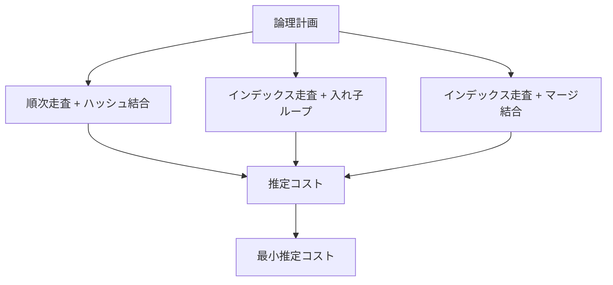
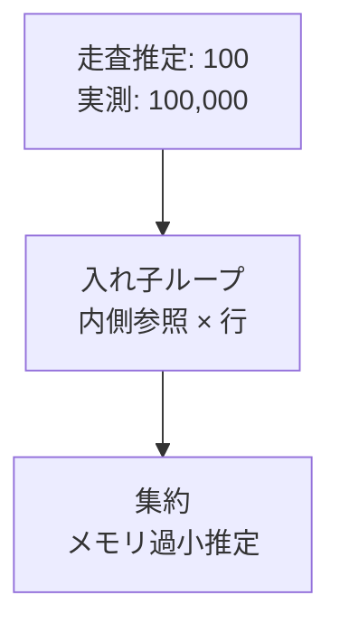

最適化器は実際に全候補計画を実行して最速を選ぶわけではありません。統計情報から各演算子の行数を推定し、I/O、CPU、メモリ、ネットワークをコストへ換算して比較します。

推定に基づく以上、最適化器は間違えることがあります。重要なのはヒントで結論を強制する前に、どの推定がなぜ外れ、後続の判断へどう伝播したかを見つけることです。

## この章で答える問い

- コストベース最適化器はどの候補を、何のコストで比較するのか
- 選択率と行数はどう推定されるのか
- ヒストグラム、NDV、最頻値は何を表すのか
- 列間相関やデータ偏りで推定が外れるのはなぜか
- EXPLAIN解析から最初の誤推定をどう見つけるのか

## 規則ベースとコストベース

規則ベース最適化は、「述語を走査近くへ移す」「不要列を除く」などの規則で計画を変形します。

コストベース最適化は、複数の合法な候補から推定コストが最小のものを選びます。



「インデックスを使える」という事実は候補を増やすだけです。インデックス計画のコストが表走査より高いと推定すれば使いません。

## 統計情報

最適化器は表を毎回全走査して分布を調べるわけにはいきません。カタログへ保存した統計情報を使います。

代表的な情報：

- 合計行/ページ件数
- NULLの割合
- 異なる値の数（NDV）
- 最頻値（MCV）と頻度
- ヒストグラム
- 平均列幅
- 物理注文との相関
- 複数列依存関係や共同統計情報

統計情報は標本から作る場合があり、正確な全データではありません。データ更新後に古くなることもあります。

## 選択率と行数

選択率は述語を通る割合、行数は演算子が出力する行数です。

```text
推定行数
= 入力行 × 選択率
```

1,000,000行の表で選択率0.01なら、10,000行と推定します。

### 等値

値が均等分布し、NDVが100なら、単純には次のように推定できます。

```text
選択率(列 = 値) ≈ 1 / NDV
= 1 / 100
= 0.01
```

しかし状態のような列は均等ではありません。

```text
確定済み94%
保留中1%
取消済み5%
```

MCV統計情報があれば、保留中 = 1%を直接使えます。

### 範囲

ヒストグラムは値域をバケットへ分け、範囲述語がどの割合を含むか推定します。

```text
価格ヒストグラム境界:
0 | 1000 | 2000 | 5000 | 10000
```

価格BETWEEN 1000 AND 2000なら、該当バケットの頻度から推定します。バケット内部で均等という仮定が入るため、狭い急増や急な偏りは外れます。

## ヒストグラム

### 等幅

値域を同じ幅へ分けます。分布が偏ると、一つのバケットに大量行が集中します。

### 等頻度

各バケットの行数が概ね同じになるよう境界を選びます。偏りを表現しやすい一方、バケット内部の分布は近似です。

### 最頻値

頻出値をヒストグラムから分離して正確に近い頻度を持ちます。残りの値へ一様仮定を適用します。

統計情報対象を上げるとバケットやMCVを増やせますが、解析時間とカタログ大きさが増えます。

## 独立性の仮定

複数述語の選択率を掛け合わせるとき、列が独立していると仮定する場合があります。

```sql
WHERE country = 'JP'
  AND prefecture = 'Tokyo'
```

仮に国='JP'が10%、都道府県='Tokyo'が1%なら、独立仮定では0.1%です。

```text
0.10 × 0.01 = 0.001
```

しかしTokyoなら国はほぼJPであり、強い相関があります。実際は1%近いかもしれません。10倍の誤差が結合順やアルゴリズムへ影響します。

Extended/複数列統計情報で依存関係、共同NDV、MCVを持てる製品があります。

## 結合行数

等値結合の単純な推定例です。

```text
|A ⋈ B|
≈ |A| × |B| / max(NDV(A.key), NDV(B.key))
```

これはキーが均等分布し、値範囲が重なるという仮定です。

外部キーから主キーへの結合なら、参照整合性を利用して「参照元行につき高々1一致」と推定できる可能性があります。

推定を難しくする要因：

- 高負荷キー
- NULL
- 参照整合性がない
- キー 範囲が部分的にしか重ならない
- 複数列結合
- 絞り込み後の分布変化
- 相関する述語

## 誤差の伝播

各演算子の推定誤差は上へ伝わります。



100行と思ってインデックス入れ子ループを選んだのに、実際は100,000行なら内側参照が1,000倍になります。集約のグループ数も過小推定すればメモリを超えてディスク退避します。

最上位の「10秒かかった演算子」だけを見るのではなく、葉から上へ推定と実数が最初に大きくずれた場所を探します。

## コストモデル

コストは通常、実時間そのものではなく比較用の抽象単位です。

概念的には次を組み合わせます。

```text
合計コスト
= ページI/Oコスト
+ タプル／演算子当たりのCPUコスト
+ メモリ/ディスク退避コスト
+ 並列設定／調整コスト
+ ネットワーク転送
```

### I/Oコスト

- 順次ページ読み取り
- ランダムページ読み取り
- キャッシュヒット率
- 一時的な読み取り/書き込み

SSD、リモートストレージ、大規模メモリ環境では既定値コスト比率がハードウェアと合わない場合があります。ただしパラメーター調整の前に統計情報とクエリ自体を確認します。

### CPUコスト

- 行処理
- 式の評価
- 関数呼び出し
- 比較／ハッシュ
- 伸長

UDFや複雑なJSON式は、単純列比較と同じコストではありません。コストモデルがカスタム関数を過小評価する場合があります。

### 起動と合計コスト

計画には最初の行を返すまでの起動コストと、全行を返す合計コストがあります。

上限1では起動が小さい入れ子ループが、全件処理ではハッシュ結合が有利ということがあります。

## アクセス経路選択

表走査とインデックス走査を比較します。

### インデックス走査の概算

```text
B+木走査
+ 一致葉ページ
+ 表ページ取得
+ 可視性/絞り込みCPU
```

### 表走査の概算

```text
全表ページを順次走査
+ 全タプルに対する述語評価のCPUコスト
```

一致行が増えたり、表ページが散らばったりするとインデックスコストが増えます。カバリングインデックスや物理相関が高ければ減ります。

## 結合順序探索

N表の結合順候補は急速に増えます。全候補を列挙するのは大きなNで困難です。

### 動的計画法

小さな表集合の最良計画を保存し、それを組み合わせます。

```text
best({A,B})
best({A,C})
best({B,C})
...
best({A,B,C})
```

比較的少数表で高品質な計画を探せますが、探索空間が指数的に増えます。

### 刈り込みとヒューリスティクス

- コストが既知の最良コストより高い部分的計画を捨てる
- 連結した結合グラフを優先する
- ブッシー計画を制限する
- 表数が多ければ遺伝的／ランダム探索へ切り替える

最適化に要する時間自体もクエリ遅延に含まれるため、探索品質とのトレードオフがあります。

## プリペアド文とパラメーター

プリペアド文は解析/計画コスト削減やセキュリティに役立ちますが、パラメーター値によって最適計画が異なる場合があります。

```sql
SELECT *
FROM orders
WHERE customer_id = $1;
```

通常顧客は10件の注文、最大顧客は1,000万件の注文持つとします。

- 通常値：インデックス走査 + 入れ子ループが有利
- 高負荷値：表/ビットマップ走査 + ハッシュ処理が有利かもしれない

パラメーター値ごとにカスタム計画を作るか、平均的汎用計画を再利用するかはコンパイルコストとのトレードオフです。パラメータースニッフィング、パラメーター依存計画、汎用/カスタム計画など製品ごとの仕組みがあります。

## 統計情報が古い場合

一括投入の直後、急成長表、値分布が時間で変わる列では統計情報が実態とずれます。

対処の順序：

1. 統計情報更新時刻と標本を確認する
2. 解析相当を実行する
3. 自動解析のしきい値が処理負荷に合うか確認する
4. 偏り/相関なら統計情報対象や拡張統計情報を検討する
5. クエリ述語やデータモデルを見直す

統計情報更新だけで一時的に直っても、なぜ古くなったかを運用へ反映します。

## EXPLAINとEXPLAIN解析

### EXPLAIN

推定計画を表示します。クエリを実行しないため安全に見られますが、実行/時間は分かりません。

### EXPLAIN解析

クエリを実行し、実測行数、ループ数、時間などを表示します。UPDATE/削除へ使うと実際に変更するため、トランザクションロールバックや検証環境など安全策が必要です。

見る順序：

1. 推定行数と実行時行数
2. ループ数を掛けた総行
3. 絞り込みで捨てた行
4. 走査方式
5. 結合の構築側／外側
6. ソート/ハッシュディスク退避
7. バッファ/ページI/O
8. 計画時間と実行時間

### 最初の誤推定を探す例

```text
ordersのインデックスを走査
  推定行数=10
  実行時行数=500,000

入れ子ループ
  内側ループ数=500,000
```

入れ子ループ自体を原因と呼ぶ前に、ordersの50000倍の誤推定を調べます。原因は高負荷顧客、古い統計情報、型変換された述語、相関などかもしれません。

## ヒントを使う前に

ヒントは計画を制御する有効な手段になる場合がありますが、データ量やバージョンが変わっても固定判断が残ります。

先に確認するもの：

- 統計情報
- データ分布
- 述語のインデックス検索可能性
- インデックス設計
- 型の不一致
- 構成/ハードウェアコスト
- クエリ書き換え

ヒントを使うなら、なぜコストモデルが誤るか、どの条件でヒントが無効になるか、監視方法を記録します。

## よくある誤解

### 「実行時間が最大のノードが根本原因」

上流の誤推定や過剰行が、後続ノードの仕事を増やしていることがあります。最初の増幅点を探します。

### 「推定コストはミリ秒」

多くのDBでは相対比較の抽象単位です。異なるクエリ間の実時間をコスト値だけで直接比較しません。

### 「統計情報を増やせば常に計画が改善する」

解析コストとカタログ大きさが増え、そもそも表現できない相関もあります。問題列へ焦点を当てます。

## まとめ

- 最適化器は統計情報から行数とコストを推定して物理計画を選ぶ
- NDV、MCV、ヒストグラムは等値と範囲選択率を近似する
- 独立性、一様性、包含関係の仮定が偏りや相関で外れる
- 行数誤差は結合ループ数、メモリ、ディスク退避へ増幅される
- コストモデルはI/O、CPU、メモリ、並列、ネットワークを抽象単位で比較する
- 結合順序探索は品質と計画時間のトレードオフを持つ
- EXPLAIN解析では葉から最初の大きな推定差を探す
- ヒントの前に統計情報、データ、述語、インデックス、型を確認する

## 確認問題

1. NDV=1000の均等列で等値述語の選択率を概算してください。
2. 国と都道府県の独立性の仮定が外れる理由を説明してください。
3. 100行と推定した外側が実際10万行だった場合、入れ子ループへどう影響しますか。
4. 起動コストと合計コストで異なる計画が選ばれるクエリ例を作ってください。
5. EXPLAIN解析で最初の行数誤差を探す手順を説明してください。

## 参考資料

- [PostgreSQL Documentation: Statistics Used by the Planner](https://www.postgresql.org/docs/current/planner-stats.html)
- [PostgreSQL Documentation: Using EXPLAIN](https://www.postgresql.org/docs/current/using-explain.html)
- [PostgreSQL Documentation: Controlling the Planner with Explicit JOIN Clauses](https://www.postgresql.org/docs/current/explicit-joins.html)
- [Surajit Chaudhuri, “An Overview of Query Optimization in Relational Systems”](https://doi.org/10.1145/275487.275492)

次章からはトランザクションへ進みます。まずACIDと分離レベルを、具体的な並行実行履歴から理解します。
