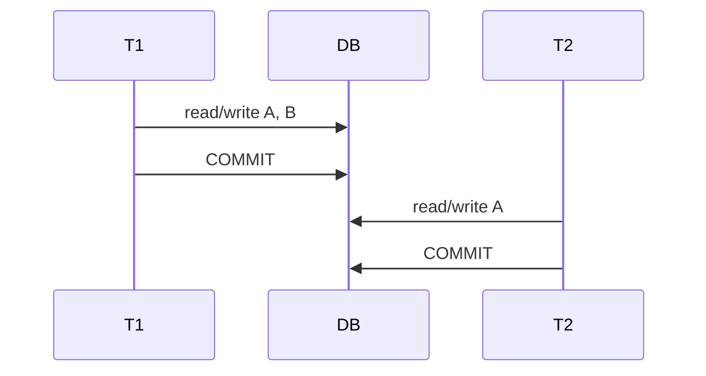
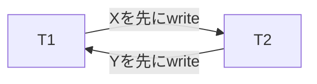
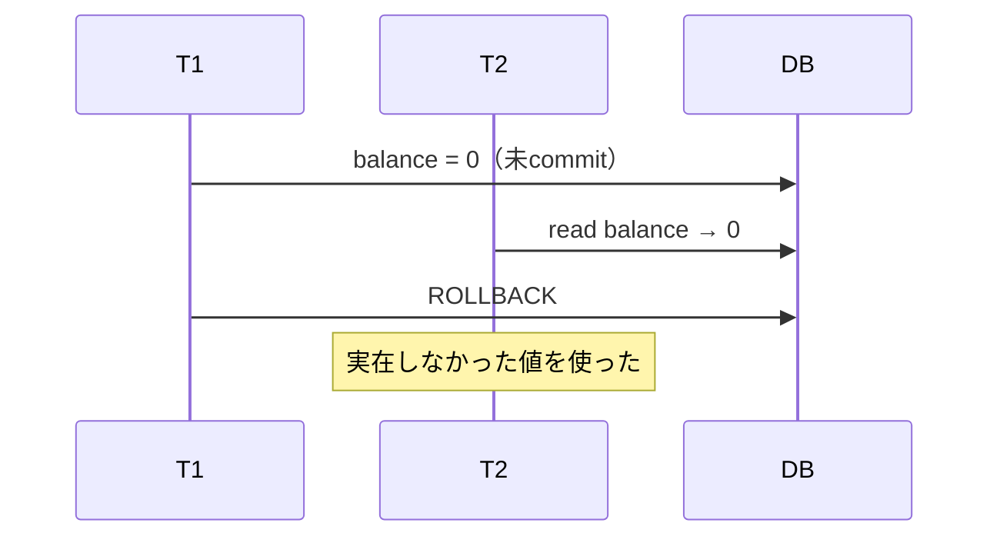
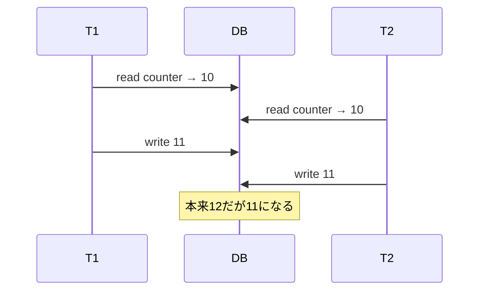

一つのSQLが正しくても、複数requestが同時に動くと結果が壊れることがあります。また、途中でprocessやmachineが停止すれば、複数statementの一部だけが残るかもしれません。

Transactionは複数のread/writeを一つの単位として扱い、並行実行と障害の中でアプリケーションの不変条件を守るための仕組みです。

## この章で答える問い

- ACIDの各性質は、どの失敗から守るのか
- Database consistencyはDBMSだけで保証できるのか
- Serializable scheduleとは何か
- Dirty read、lost update、write skewはどう違うのか
- Isolation levelを選ぶとき、名前以外に何を確認すべきか

## transaction boundary

在庫を1減らし、注文を作る処理を考えます。

```sql
BEGIN;

UPDATE inventory
SET available = available - 1
WHERE product_id = 7
  AND available > 0;

INSERT INTO orders (customer_id, status, total_amount)
VALUES (101, 'confirmed', 4800);

COMMIT;
```

この二つの変更は、どちらも成功するか、どちらも反映されない必要があります。在庫だけ減って注文がない状態も、注文だけあって在庫が減っていない状態も不正です。

Transaction boundaryは技術的なstatement数ではなく、業務上まとめて成功・失敗させたい単位から決めます。

## ACID

### Atomicity

Transaction内の操作をall-or-nothingとして扱います。途中でerrorやcrashが起きても、未完了transactionの一部だけを残しません。

Atomicityを実現する方法には、undo log、MVCC version、copy-on-writeなどがあります。WALを使うDBでは、未commit変更をundoできる情報をlogへ持つ場合があります。

Atomicityは「1 statementだけ実行する」という意味ではありません。複数statementを一つの業務操作へまとめることに価値があります。

### Consistency

Transactionの前後で、定義された不変条件を満たす状態を維持します。

DBMSが直接守れるもの：

- type
- NOT NULL
- UNIQUE
- CHECK
- FOREIGN KEY
- transaction isolationによる競合制御

アプリケーション設計も必要なもの：

- 注文合計と明細合計が一致する
- 一日に送金できる上限
- 外部決済とDB状態の対応
- 複数serviceにまたがるworkflow

Consistencyは「DBMSが自動的に業務を理解する」という意味ではありません。不変条件をconstraint、transaction、locking、application logicとして表現して初めて守れます。

### Isolation

複数transactionを同時に実行しても、互いの途中状態から不正な影響を受けないようにします。

最も強い目標の一つがserializabilityです。ただし、すべてを実際に一列へ実行する必要はありません。並行実行した結果が、何らかの直列順序と同じならよいと考えます。

Isolationを強くすると待機、abort、retryが増える可能性があるため、DBMSは複数levelを提供します。

### Durability

COMMIT成功を返したtransactionの結果を、processやmachineのcrash後も保持します。

通常はWALの永続化、data page write、replication、storage保証が関係します。

Durabilityの範囲は設定と構成によって変わります。

- Process crashまでか
- OS crashまでか
- Machine/storage lossまでか
- Datacenter lossまでか

Local WALだけではmachine全体の喪失へ耐えません。Synchronous replicaやbackupが別のfailure domainを補います。

## schedule

複数transactionのoperationを時系列へ並べたものをschedule/historyと呼びます。

二つの送金transactionを考えます。

```text
T1: read(A), write(A), read(B), write(B), commit
T2: read(A), write(A), commit
```

### serial schedule

T1の全operationが終わってからT2を実行する、または逆順にするscheduleです。



正しさを考えやすい一方、独立した処理まで待たせるためconcurrencyが低くなります。

### serializable schedule

Operationはinterleaveしていても、最終状態とread結果が、T1→T2またはT2→T1のどちらかのserial scheduleと同じscheduleです。

DBMSの目標は、安全にinterleaveしてCPU/I/O待ちを重ねながら、直列実行と同等の結果を作ることです。

## conflict serializability

異なるtransactionが同じdata itemへaccessし、少なくとも片方がwriteならconflictします。

| T1 | T2 | Conflict |
| --- | --- | --- |
| read X | read X | しない |
| read X | write X | する |
| write X | read X | する |
| write X | write X | する |

Conflict順序からprecedence graphを作り、cycleがなければconflict-serializableです。



このようにcycleがあるscheduleは、どちらを先にしたserial orderでも説明できません。

実際のSerializable実装はstrict 2PL、SSI、serializable MVCCなど複数あります。Conflict graphは考え方の基礎です。

## isolation anomaly

### dirty read

T1が未commitの値をT2が読み、T1がrollbackします。



T2がその値を外部通知や計算へ使うと取り消せません。

### dirty write

T1の未commit writeをT2が上書きします。Rollback時にどの値へ戻すか曖昧になり、ほとんどのtransactional DBは防ぎます。

### non-repeatable read

T1が同じrowを2回読む間にT2がcommitし、値が変わります。

```text
T1: read order.status → pending
T2: update order.status = confirmed; commit
T1: read order.status → confirmed
```

同じtransaction内のreportで値が揺れる可能性があります。

### phantom read

T1がpredicateでrow集合を読み、T2が条件に合うrowをinsert/deleteしてcommitします。T1が再実行するとrow集合が変わります。

```sql
-- T1
SELECT COUNT(*) FROM reservations
WHERE room_id = 7 AND date = DATE '2026-08-21';

-- T2が同条件のrowをINSERTしてCOMMIT

-- T1が再実行すると件数が増える
```

既存rowのlockだけでは、まだ存在しないphantomを防げません。Predicate/range lockやserializable検証が必要です。

### lost update

二つのtransactionが同じ古い値を読み、それぞれ計算した値を書き、片方の更新が失われます。



Atomic UPDATEならread-modify-writeをDB内で一つのwrite conflictとして扱えます。

```sql
UPDATE counters
SET value = value + 1
WHERE id = 1;
```

Applicationで読み、後から絶対値をUPDATEする場合はversion columnやlockを検討します。

### read skew

T1が複数rowを読む途中でT2が両rowを更新し、T1が新旧の混ざった状態を観測します。

口座AからBへ100移す場合：

```text
initial: A=500, B=500, total=1000

T1 reads A=500
T2 transfers: A=400, B=600; commit
T1 reads B=600

T1 observed total=1100
```

Statementごとに新しいsnapshotを取るRead Committedでは起こり得ます。Transaction全体で同じsnapshotを使えば防げます。

### write skew

二つのtransactionが同じsnapshotを読み、別々のrowを更新します。Write-write conflictがないため両方commitできても、全体の不変条件が壊れます。

「最低一人は当直」の例：

```text
initial: Alice=on, Bob=on

T1 reads both → BobがいるのでAliceをoff
T2 reads both → AliceがいるのでBobをoff

T1 writes Alice=off
T2 writes Bob=off
both commit → 誰もいない
```

Snapshot Isolationだけではwrite skewを防げません。Serializable、predicate locking、共通rowのexplicit lockなどが必要です。

## SQL isolation level

一般的な名称を整理します。ただし、SQL標準の現象定義と各DBMSの実装は完全には一致しません。

| Level | Dirty read | Non-repeatable read | Phantom | Snapshot/write skew |
| --- | --- | --- | --- | --- |
| Read Uncommitted | 許し得る | 許し得る | 許し得る | 許し得る |
| Read Committed | 防ぐ | 許し得る | 許し得る | 許し得る |
| Repeatable Read | 防ぐ | 防ぐ | 標準上は許し得る | 実装次第で許し得る |
| Serializable | 防ぐ | 防ぐ | 防ぐ | 防ぐことを目標とする |

これは暗記表ではなく出発点です。確認すべきもの：

- Snapshotをstatement単位・transaction単位のどちらで取るか
- Lost updateを検出するか
- Predicate/range conflictをどう扱うか
- Read-only transactionの保証
- Conflict時に待つかabortするか

### Read Committed

多くの実装でstatement開始時のcommitted dataを読みます。同じtransactionでもstatement間で新しいcommitが見えます。

短いOLTP transactionではconcurrencyを得やすい一方、read-modify-writeと複数statementの整合性をapplicationが意識します。

### Repeatable Read

Transaction全体で同じsnapshotを読む実装ならnon-repeatable readとread skewを防げます。

ただし同じrowへのwrite conflictやphantomの扱いは製品差があります。名前だけでSerializable相当と思わないようにします。

### Serializable

並行実行結果を何らかのserial orderと同等にします。実装はlock待ちまたはserialization failureによるabort/retryを発生させます。

Serializableは「errorが起きない最強mode」ではありません。正しさを守るため一方をabortすることがあり、applicationはtransaction全体をretryできる必要があります。

## Snapshot Isolation

Snapshot Isolation（SI）はtransaction開始時点などのconsistent snapshotを読み、通常first-committer-winsで同じrowへのwrite conflictを防ぎます。

防ぎやすいもの：

- dirty read
- non-repeatable read
- read skew
- 多くのlost update

残るもの：

- write skew
- read-only anomalyの一部
- predicateに基づく不変条件違反

SIはserializabilityと同じではありません。

## isolation levelを選ぶ

Level名からではなく、不変条件とaccess patternから決めます。

### 単一rowのcounter

```sql
UPDATE counters SET value = value + 1 WHERE id = 1;
```

Atomic statementとrow write conflictで守れるため、Read Committedでも十分な場合があります。

### 在庫引当

```sql
UPDATE inventory
SET available = available - 1
WHERE product_id = 7
  AND available > 0;
```

Affect row countを確認すれば、read後updateより安全に条件付きwriteできます。

### 複数rowの不変条件

「予約数がcapacity未満」「当直が最低一人」などpredicate/複数rowに依存する場合、Serializableまたはexplicit lockingを検討します。

### 長いread-only report

Transaction-level snapshotでconsistent reportを作れますが、長時間snapshotはold version回収やreplicationへ影響する場合があります。

## retry design

Deadlockやserialization failureは正常なconcurrency controlの結果として起こり得ます。

安全なretryには次が必要です。

1. Transaction全体を最初からやり直す
2. 外部API callをtransaction内で不用意に行わない
3. 副作用へidempotency keyを使う
4. Retry回数とbackoffへ上限を置く
5. Error codeを分類し、validation errorまでretryしない

Statementだけretryすると、前に読んだsnapshotや判断との整合が取れません。

## よくある誤解

### 「ACIDのConsistencyはreplicaの整合性」

ACIDのCはtransaction前後の不変条件です。Distributed consistency modelのstrong/eventual consistencyとは文脈が異なります。

### 「Repeatable Readならすべての競合を防げる」

Snapshot Isolation型のRepeatable Readではwrite skewが残る可能性があります。製品仕様と不変条件を確認します。

### 「Serializableならapplicationはretry不要」

正しいserial orderを作れない競合を検出すると、一方をabortします。Retry可能な設計が必要です。

## まとめ

- Atomicityはtransactionの一部だけが残ることを防ぐ
- Consistencyはconstraintとapplicationが定義した不変条件を守る
- Isolationは並行実行の相互作用を制御し、Durabilityはcommit済み結果を障害後も守る
- Serializable scheduleは、結果が何らかのserial orderと同等である
- Dirty/non-repeatable/phantom readに加え、lost update、read skew、write skewを区別する
- Snapshot Isolationはconsistent snapshotを提供するが、write skewを許し得る
- Isolation levelは名前ではなく、snapshot、write conflict、predicateの実装から選ぶ
- Deadlockとserialization failureを前提にtransaction全体をretry可能にする

## 確認問題

1. ACIDのConsistencyとdistributed consistency modelの違いを説明してください。
2. Lost updateをatomic UPDATEで防げる理由は何ですか。
3. Read skewとnon-repeatable readの違いを例で説明してください。
4. Snapshot Isolationでwrite skewが起きるscheduleを書いてください。
5. Serializable transactionをretryするとき、外部API callが問題になる理由を説明してください。

## 参考資料

- [PostgreSQL Documentation: Transaction Isolation](https://www.postgresql.org/docs/current/transaction-iso.html)
- [MySQL Documentation: InnoDB Transaction Isolation Levels](https://dev.mysql.com/doc/refman/8.4/en/innodb-transaction-isolation-levels.html)
- [Hal Berenson et al., “A Critique of ANSI SQL Isolation Levels”](https://doi.org/10.1145/223784.223785)
- [Atul Adya, “Weak Consistency: A Generalized Theory and Optimistic Implementations for Distributed Transactions”](https://publications.csail.mit.edu/lcs/pubs/pdf/MIT-LCS-TR-786.pdf)

次章では、これらの保証を実現するlock、MVCC、2PL、SSI、楽観・悲観的並行性制御を扱います。
