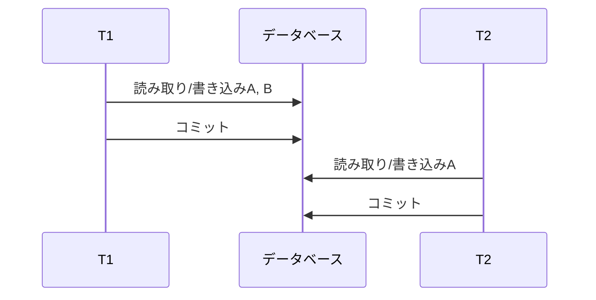
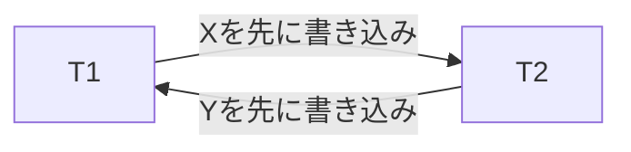
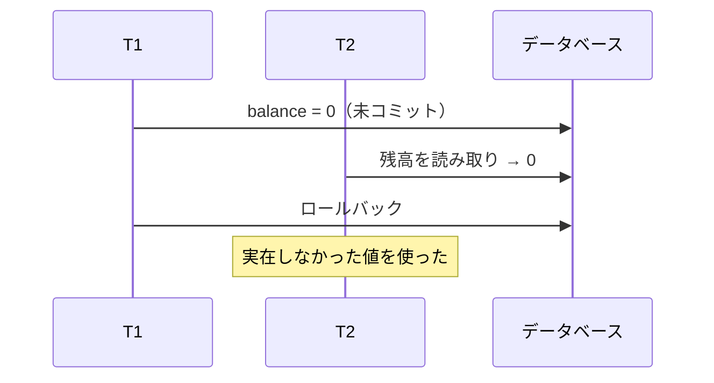
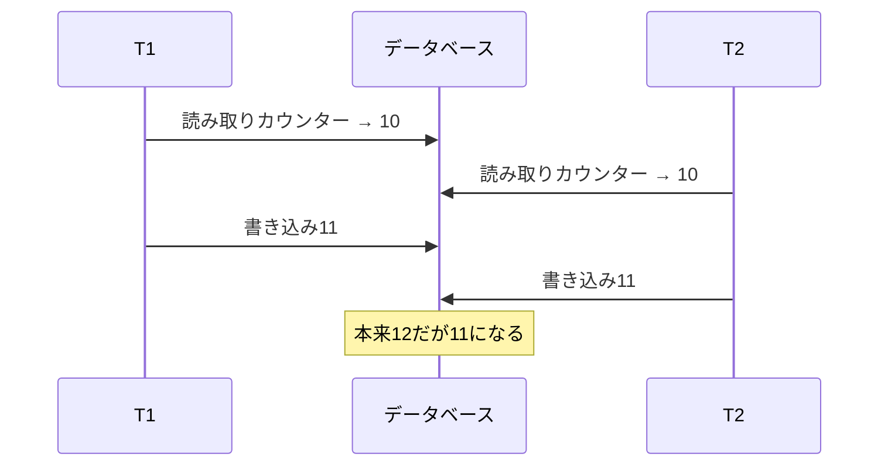

一つのSQLが正しくても、複数リクエストが同時に動くと結果が壊れることがあります。また、途中で処理や機器が停止すれば、複数文の一部だけが残るかもしれません。

トランザクションは複数の読み取り/書き込みを一つの単位として扱い、並行実行と障害の中でアプリケーションの不変条件を守るための仕組みです。

## この章で答える問い

- ACIDの各性質は、どの失敗から守るのか
- データベース整合性はDBMSだけで保証できるのか
- 直列化可能なスケジュールとは何か
- ダーティリード、更新消失、書き込みスキューはどう違うのか
- 分離レベルを選ぶとき、名前以外に何を確認すべきか

## トランザクション境界

在庫を1減らし、注文を作る処理を考えます。

```sql
BEGIN;

UPDATE inventory
SET available = available - 1
WHERE product_id = 7
  AND available > 0;

INSERT INTO orders (customer_id, status, total_amount)
VALUES (101, 'confirmed', 4800);

COMMIT;
```

この二つの変更は、どちらも成功するか、どちらも反映されない必要があります。在庫だけ減って注文がない状態も、注文だけあって在庫が減っていない状態も不正です。

トランザクション境界は技術的な文数ではなく、業務上まとめて成功・失敗させたい単位から決めます。

## ACID

### 原子性

トランザクション内の操作を全か無かとして扱います。途中でエラーやクラッシュが起きても、未完了トランザクションの一部だけを残しません。

原子性を実現する方法には、取り消しログ、MVCCバージョン、コピーオンライトなどがあります。WALを使うDBでは、未コミット変更を取り消しできる情報をログへ持つ場合があります。

原子性は「1文だけ実行する」という意味ではありません。複数文を一つの業務操作へまとめることに価値があります。

### 整合性

トランザクションの前後で、定義された不変条件を満たす状態を維持します。

DBMSが直接守れるもの：

- 型
- NOT NULL
- UNIQUE
- 検査
- 外部キー
- トランザクション分離性による競合制御

アプリケーション設計も必要なもの：

- 注文合計と明細合計が一致する
- 一日に送金できる上限
- 外部決済とDB状態の対応
- 複数サービスにまたがるワークフロー

整合性は「DBMSが自動的に業務を理解する」という意味ではありません。不変条件を制約、トランザクション、ロック制御、アプリケーションロジックとして表現して初めて守れます。

### 分離性

複数トランザクションを同時に実行しても、互いの途中状態から不正な影響を受けないようにします。

最も強い目標の一つが直列化可能性です。ただし、すべてを実際に一列へ実行する必要はありません。並行実行した結果が、何らかの直列順序と同じならよいと考えます。

分離性を強くすると待機、中止、再試行が増える可能性があるため、DBMSは複数レベルを提供します。

### 永続性

コミット成功を返したトランザクションの結果を、処理や機器のクラッシュ後も保持します。

通常はWALの永続化、データページ書き込み、レプリケーション、ストレージ保証が関係します。

永続性の範囲は設定と構成によって変わります。

- 処理クラッシュまでか
- OSクラッシュまでか
- 機器/ストレージ損失までか
- データセンター喪失までか

局所WALだけでは機器全体の喪失へ耐えません。同期レプリカやバックアップが別の障害領域を補います。

## スケジュール

複数トランザクションの操作を時系列へ並べたものをスケジュール/履歴と呼びます。

二つの送金トランザクションを考えます。

```text
T1: 読み取り(A), 書き込み(A), 読み取り(B), 書き込み(B), コミット
T2: 読み取り(A), 書き込み(A), コミット
```

### 直列スケジュール

T1の全操作が終わってからT2を実行する、または逆順にするスケジュールです。



正しさを考えやすい一方、独立した処理まで待たせるため同時実行性が低くなります。

### 直列化可能なスケジュール

操作は交互配置していても、最終状態と読み取り結果が、T1→T2またはT2→T1のどちらかの直列スケジュールと同じスケジュールです。

DBMSの目標は、安全に交互配置してCPU/I/O待ちを重ねながら、直列実行と同等の結果を作ることです。

## 競合直列化可能性

異なるトランザクションが同じデータ項目へアクセスし、少なくとも片方が書き込みなら競合します。

| T1 | T2 | 競合 |
| --- | --- | --- |
| 読み取りX | 読み取りX | しない |
| 読み取りX | 書き込みX | する |
| 書き込みX | 読み取りX | する |
| 書き込みX | 書き込みX | する |

競合順序から先行関係グラフを作り、循環がなければ競合直列化可能です。



このように循環があるスケジュールは、どちらを先にした直列注文でも説明できません。

実際のSerializable実装は厳格二相ロック、SSI、直列化可能なMVCCなど複数あります。競合グラフは考え方の基礎です。

## 分離性異常

### ダーティリード

T1が未コミットの値をT2が読み、T1がロールバックします。



T2がその値を外部通知や計算へ使うと取り消せません。

### ダーティライト

T1の未コミット書き込みをT2が上書きします。ロールバック時にどの値へ戻すか曖昧になり、ほとんどのトランザクションのDBは防ぎます。

### 反復不能読み取り

T1が同じ行を2回読む間にT2がコミットし、値が変わります。

```text
T1: 読み取り order.status → 保留中
T2: order.statusを確定済みに更新; コミット
T1: 読み取り order.status → 確定済み
```

同じトランザクション内のレポートで値が揺れる可能性があります。

### ファントムリード

T1が述語で行集合を読み、T2が条件に合う行を挿入/削除してコミットします。T1が再実行すると行集合が変わります。

```sql
-- T1
SELECT COUNT(*) FROM reservations
WHERE room_id = 7 AND date = DATE '2026-08-21';

-- T2が同条件の行を挿入してコミット

-- T1が再実行すると件数が増える
```

既存行のロックだけでは、まだ存在しないファントムを防げません。述語/範囲ロックや直列化可能性の検証が必要です。

### 更新消失

二つのトランザクションが同じ古い値を読み、それぞれ計算した値を書き、片方の更新が失われます。



原子的なUPDATEなら読み取り・変更・書き込みをDB内で一つの書き込み競合として扱えます。

```sql
UPDATE counters
SET value = value + 1
WHERE id = 1;
```

アプリケーションで読み、後から絶対値をUPDATEする場合はバージョン列やロックを検討します。

### 読み取りスキュー

T1が複数行を読む途中でT2が両行を更新し、T1が新旧の混ざった状態を観測します。

口座AからBへ100移す場合：

```text
初期状態: A=500, B=500, 合計=1000

T1読み取るA=500
T2が送金: A=400, B=600; コミット
T1読み取るB=600

T1が観測した合計=1100
```

文ごとに新しいスナップショットを取るコミット済み読み取りでは起こり得ます。トランザクション全体で同じスナップショットを使えば防げます。

### 書き込みスキュー

二つのトランザクションが同じスナップショットを読み、別々の行を更新します。書き込み-書き込み競合がないため両方コミットできても、全体の不変条件が壊れます。

「最低一人は当直」の例：

```text
初期状態: Alice=当直, Bob=当直

T1が両方を読み取る → BobがいるのでAliceを当直から外す
T2が両方を読み取る → AliceがいるのでBobを当直から外す

T1がAliceを当直外へ書き換える
T2がBobを当直外へ書き換える
両方がコミット → 誰もいない
```

スナップショット分離だけでは書き込みスキューを防げません。Serializable、述語ロック制御、共通行の明示的ロックなどが必要です。

## SQL分離レベル

一般的な名称を整理します。ただし、SQL標準の現象定義と各DBMSの実装は完全には一致しません。

| レベル | ダーティリード | 反復不能読み取り | ファントム | スナップショット/書き込みスキュー |
| --- | --- | --- | --- | --- |
| 未コミット読み取り | 許し得る | 許し得る | 許し得る | 許し得る |
| コミット済み読み取り | 防ぐ | 許し得る | 許し得る | 許し得る |
| 反復可能読み取り | 防ぐ | 防ぐ | 標準上は許し得る | 実装次第で許し得る |
| Serializable | 防ぐ | 防ぐ | 防ぐ | 防ぐことを目標とする |

これは暗記表ではなく出発点です。確認すべきもの：

- スナップショットを文単位・トランザクション単位のどちらで取るか
- 更新消失を検出するか
- 述語/範囲競合をどう扱うか
- 読み取り専用トランザクションの保証
- 競合時に待つか中止するか

### コミット済み読み取り

多くの実装で文開始時のコミット済みデータを読みます。同じトランザクションでも文間で新しいコミットが見えます。

短いOLTPトランザクションでは同時実行性を得やすい一方、読み取り・変更・書き込みと複数文の整合性をアプリケーションが意識します。

### 反復可能読み取り

トランザクション全体で同じスナップショットを読む実装なら反復不能読み取りと読み取りスキューを防げます。

ただし同じ行への書き込み競合やファントムの扱いは製品差があります。名前だけでSerializable相当と思わないようにします。

### Serializable

並行実行結果を何らかの直列注文と同等にします。実装はロック待ちまたは直列化障害による中止/再試行を発生させます。

Serializableは「エラーが起きない最強方式」ではありません。正しさを守るため一方を中止することがあり、アプリケーションはトランザクション全体を再試行できる必要があります。

## スナップショット分離

スナップショット分離（SI）はトランザクション開始時点などの一貫したスナップショットを読み、通常先コミッター優先で同じ行への書き込み競合を防ぎます。

防ぎやすいもの：

- ダーティリード
- 反復不能読み取り
- 読み取りスキュー
- 多くの更新消失

残るもの：

- 書き込みスキュー
- 読み取り専用異常の一部
- 述語に基づく不変条件違反

SIは直列化可能性と同じではありません。

## 分離レベルを選ぶ

レベル名からではなく、不変条件とアクセスパターンから決めます。

### 単一行のカウンター

```sql
UPDATE counters SET value = value + 1 WHERE id = 1;
```

原子的な文と行書き込み競合で守れるため、コミット済み読み取りでも十分な場合があります。

### 在庫引当

```sql
UPDATE inventory
SET available = available - 1
WHERE product_id = 7
  AND available > 0;
```

更新行数を確認すれば、読み取り後の更新より安全に条件付き書き込みできます。

### 複数行の不変条件

「予約数が容量未満」「当直が最低一人」など述語/複数行に依存する場合、Serializableまたは明示的ロック制御を検討します。

### 長い読み取り専用レポート

トランザクション-レベルスナップショットで一貫したレポートを作れますが、長時間スナップショットは古いバージョン回収やレプリケーションへ影響する場合があります。

## 再試行設計

デッドロックや直列化障害は正常な並行性制御の結果として起こり得ます。

安全な再試行には次が必要です。

1. トランザクション全体を最初からやり直す
2. 外部API呼び出しをトランザクション内で不用意に行わない
3. 副作用へ冪等性キーを使う
4. 再試行回数とバックオフへ上限を置く
5. エラー コードを分類し、検証エラーまで再試行しない

文だけ再試行すると、前に読んだスナップショットや判断との整合が取れません。

## よくある誤解

### 「ACIDの整合性はレプリカの整合性」

ACIDのCはトランザクション前後の不変条件です。分散整合性モデルの強い/結果整合性とは文脈が異なります。

### 「反復可能読み取りならすべての競合を防げる」

スナップショット分離型の反復可能読み取りでは書き込みスキューが残る可能性があります。製品仕様と不変条件を確認します。

### 「Serializableならアプリケーションは再試行不要」

正しい直列注文を作れない競合を検出すると、一方を中止します。再試行可能な設計が必要です。

## まとめ

- 原子性はトランザクションの一部だけが残ることを防ぐ
- 整合性は制約とアプリケーションが定義した不変条件を守る
- 分離性は並行実行の相互作用を制御し、永続性はコミット済み結果を障害後も守る
- 直列化可能なスケジュールは、結果が何らかの直列注文と同等である
- 未書き出し/反復不能読み取り/ファントムリードに加え、更新消失、読み取りスキュー、書き込みスキューを区別する
- スナップショット分離は一貫したスナップショットを提供するが、書き込みスキューを許し得る
- 分離レベルは名前ではなく、スナップショット、書き込み競合、述語の実装から選ぶ
- デッドロックと直列化障害を前提にトランザクション全体を再試行可能にする

## 確認問題

1. ACIDの整合性と分散整合性モデルの違いを説明してください。
2. 更新消失を原子的なUPDATEで防げる理由は何ですか。
3. 読み取りスキューと反復不能読み取りの違いを例で説明してください。
4. スナップショット分離で書き込みスキューが起きるスケジュールを書いてください。
5. Serializableトランザクションを再試行するとき、外部API呼び出しが問題になる理由を説明してください。

## 参考資料

- [PostgreSQL Documentation: Transaction Isolation](https://www.postgresql.org/docs/current/transaction-iso.html)
- [MySQL Documentation: InnoDB Transaction Isolation Levels](https://dev.mysql.com/doc/refman/8.4/en/innodb-transaction-isolation-levels.html)
- [Hal Berenson et al., “A Critique of ANSI SQL Isolation Levels”](https://doi.org/10.1145/223784.223785)
- [Atul Adya, “Weak Consistency: A Generalized Theory and Optimistic Implementations for Distributed Transactions”](https://publications.csail.mit.edu/lcs/pubs/pdf/MIT-LCS-TR-786.pdf)

次章では、これらの保証を実現するロック、MVCC、2PL、SSI、楽観・悲観的並行性制御を扱います。
