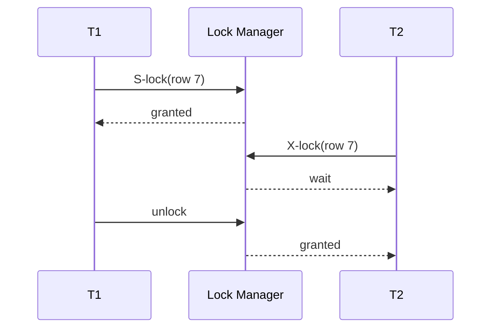
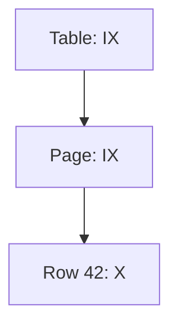
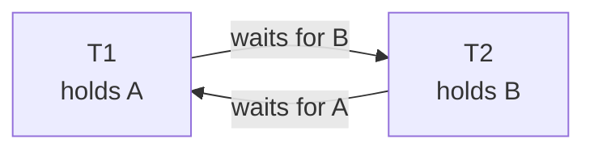
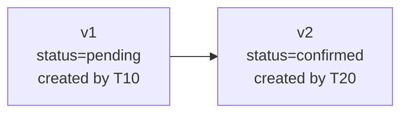

Isolation levelはアプリケーションから見える保証です。Concurrency controlは、その保証を実現する内部機構です。

DBMSは主に、競合するoperationを待たせる、古いversionを読ませる、危険なtransactionをabortする、という方法を組み合わせます。

## この章で答える問い

- Shared/exclusive lockはどのoperationを同時に許すのか
- Two-phase lockingはなぜserializabilityを作れるのか
- MVCCはreaderとwriterの競合をどう減らすのか
- Deadlockはどう検出し、どのtransactionを犠牲にするのか
- Optimisticとpessimistic concurrency controlをどう使い分けるのか
- SSIはsnapshotのwrite skewをどう検出するのか

## lock

Lockはdata itemへのoperationを許可・待機させる仕組みです。基本的なmodeを考えます。

- **Shared（S）lock**：read用。ほかのS lockと共存できる
- **Exclusive（X）lock**：write用。ほかのS/X lockと競合する

### compatibility matrix

| Requested \ Held | S | X |
| --- | --- | --- |
| S | 許可 | 待機 |
| X | 待機 | 待機 |

T1がS lockでrowを読んでいる間、T2も読めます。T2が更新するにはX lockが必要なので待ちます。



実際のDBMSにはupdate lock、key-share、schema lockなど追加modeがあります。

## lock granularity

Lock対象を細かくするとconcurrencyは上がりますが、lock数と管理costが増えます。

| Granularity | 利点 | 欠点 |
| --- | --- | --- |
| row/record | 異なるrowを並行更新しやすい | 大量rowでlock数が増える |
| page | 管理数を減らせる | 同じpageの別rowも競合し得る |
| table | 低costで全体を保護 | concurrencyが低い |
| predicate/range | phantomを防げる | 対象判定と競合範囲が複雑 |

大量のrow lockをtable lockへまとめるlock escalationを行う製品があります。Memoryを守る代わりに競合範囲が広がります。

## intention lock

Tableとrowの階層lockを併用すると、「table全体をlockしたいtransaction」が子row lockをすべて調べるのは高costです。

Intention lockは、下位granularityでlockを取得する意図を上位へ記録します。

- IS：下位にS lockを取る意図
- IX：下位にX lockを取る意図
- SIX：tableにS、下位にXを取る意図



Table X lock要求は、既存IXと競合するとすぐ判断できます。

## Two-Phase Locking

Two-Phase Locking（2PL）は、transactionのlock操作を二つのphaseへ分けます。

1. **Growing phase**：lockを取得する。解放しない
2. **Shrinking phase**：lockを解放する。新しく取得しない


2PLでconflict-serializableなscheduleを作れます。しかし、commit前にwrite lockを解放すると、別transactionが未commit値を読んだり上書きしたりする可能性があります。

### strict 2PL

Strict 2PLは少なくともX lockをcommit/rollbackまで保持します。Cascading abortを防ぎ、recoveryを単純化します。

Rigorous 2PLはS/X lockの両方をtransaction終了まで保持します。

Lockを長く持つほど安全性は分かりやすくなりますが、待機時間とdeadlock可能性が増えます。

## predicateとphantom

次のqueryで「予約がなければinsert」するとします。

```sql
SELECT COUNT(*)
FROM reservations
WHERE room_id = 7
  AND reserved_on = DATE '2026-08-21';
```

現在該当rowが0件なら、row lock対象がありません。別transactionが同じ条件のrowをinsertするとphantomが発生します。

対策：

- Index key range/gap lock
- Predicate lock
- Serializable validation
- Capacityを表す共通rowを明示lock

物理的なrange lockと論理predicate lockは実装が異なります。Indexがないpredicateでは広い範囲をlockする可能性があります。

## deadlock

T1がAをlockしてBを待ち、T2がBをlockしてAを待つとcycleになります。



待つだけでは永久に進まないため、DBMSは対処します。

### detection

Wait-for graphを作り、cycleを検出します。Cycle内の一つをvictimとしてabortし、そのlockを解放します。

Victim選択には次を考慮できます。

- 実行時間
- 変更量とrollback cost
- 優先度
- retry回数
- 保持resource

### timeout

一定時間待ったtransactionをabortします。実装は単純ですが、deadlockでない長い待機もabortし、timeoutまで無駄に待ちます。

### prevention

Timestampによるwait-die/wound-waitや、resource取得順の統一でcycleを防ぎます。

Applicationで有効な原則：

- Rowを常に同じkey順で更新する
- Transactionを短くする
- User inputやnetwork callをlock保持中に待たない
- 一度に扱うrow数を制限する

Deadlockを完全に排除できなくても、transaction全体をretryできれば回復できます。

## MVCC

Multi-Version Concurrency Control（MVCC）は、同じlogical rowの複数versionを保持し、transactionのsnapshotに見えるversionを選びます。



T20のcommit前に開始したreaderはv1を、commit後のsnapshotはv2を見るというように、readerがwriterを待たずにconsistent viewを得られます。

### snapshot

Snapshotは「どのtransactionの変更までvisibleか」を表します。

概念的なvisibility rule：

- snapshotより前にcommitしたversionは見える
- snapshot後に開始/commitしたversionは見えない
- aborted transactionのversionは見えない
- 自分のtransactionの変更は見える
- delete/updateで無効化されたversionもsnapshot時点によって見える

実装はtransaction ID range、active transaction list、commit timestamp、undo chainなどを使います。

### PostgreSQL型のversion

PostgreSQLはheap上に新しいtuple versionを作り、xmin/xmaxなどのmetadataでvisibilityを判定します。古いversionはVACUUMが回収します。

### InnoDB型のversion

InnoDBはclustered recordとundo logを使い、read viewに必要な古いversionをundo chainから再構築します。

同じMVCCでも、version配置とgarbage collectionが異なります。

## MVCCでもwriteは競合する

MVCCは主にread-write conflictを減らします。同じrowを二つのtransactionが更新するwrite-write conflictは、lock待ち、first-updater/committer-wins、abortなどで処理します。

```text
T1 updates row 7 → new version
T2 updates row 7 → wait or abort
```

「MVCCならlockを使わない」は誤りです。Row lock、index lock、schema lock、predicate protectionなどを併用します。

## garbage collectionとlong transaction

古いsnapshotを持つtransactionがいる間、そのsnapshotから見えるold versionを消せません。

Long-running transactionの影響：

- dead tuple/undo historyが増える
- table/index bloat
- vacuum/compactionが進めない
- transaction ID wraparound対策を妨げる
- storageとBuffer Poolを圧迫する
- replica applyやDDLへ影響する

Idle in transactionなconnectionもsnapshot/lockを保持する可能性があります。Transaction timeoutとmonitoringが重要です。

## pessimistic concurrency control

競合が起きると予想し、操作前にlockを取得します。

```sql
BEGIN;

SELECT available
FROM inventory
WHERE product_id = 7
FOR UPDATE;

-- applicationで判断
UPDATE inventory
SET available = available - 1
WHERE product_id = 7;

COMMIT;
```

利点：

- 競合時に早く待たせ、更新直前の状態を確保する
- 長い計算後のabortを避けられる場合がある
- hot resourceの順序を制御しやすい

欠点：

- 待機とdeadlock
- Lock保持中のfailureがほかを止める
- Read-onlyまで不要にblockする設計になり得る

## optimistic concurrency control

競合が少ないと仮定し、read/computeをlockなしで進め、commit前に変更されていないかvalidateします。

Application levelのversion column例：

```sql
SELECT id, status, version
FROM orders
WHERE id = 42;

UPDATE orders
SET status = 'confirmed',
    version = version + 1
WHERE id = 42
  AND version = 7;
```

Affect row countが0なら誰かが先に更新したため、再読込・merge・retryします。

一般的なOCC phase：

1. Read phase
2. Validation phase
3. Write phase

利点：

- 競合が少なければ待機が少ない
- Read/compute中にlockを保持しない
- Webの編集画面など長いthink timeへ使いやすい

欠点：

- 競合が多いとabortと再計算が増える
- 副作用を伴う処理のretryが難しい
- 複数row/predicateのvalidationが複雑

## timestamp ordering

各transactionへtimestampを割り当て、operationがtimestamp順序に反しないか検査します。

Data itemごとにread timestamp/write timestampを持ち、古いtransactionの遅れたwriteをabortする方式があります。

Lock待ちを避けられる一方、競合時にabortが増え、timestamp/metadata管理が必要です。MVCCと組み合わせたmulti-version timestamp orderingもあります。

## Serializable Snapshot Isolation

Serializable Snapshot Isolation（SSI）は、Snapshot Isolationのnon-blocking readを保ちつつ、serializabilityを壊す依存関係を検出してtransactionをabortします。

Write skewでは次のrw-dependencyができます。


SSIはdangerous structureを追跡し、cycleになり得るtransactionをabortします。

利点：

- Readerがwriterを直接blockしにくい
- Snapshot readの性能を保ちやすい

Cost：

- Dependency tracking memory
- False positive abort
- Application retry
- Long transactionでtrackingが増える

Serializableをlockで実現するかSSIで実現するかにより、待機とabortのprofileが変わります。

## lock waitを診断する

確認するもの：

1. Blocked transactionとblocker
2. 待っているlock mode/resource
3. Blockerが実行中かidle in transactionか
4. Transaction開始時刻と最後のstatement
5. Access順序
6. Index不足によって広いrowをlockしていないか
7. Application timeoutとDB timeoutの関係

Blockerのqueryだけでなく、transaction全体とrequest traceを結びつけます。

## concurrency strategyを選ぶ

| 状況 | 第一候補 |
| --- | --- |
| Hotな在庫1 rowを短く更新 | atomic UPDATEまたはpessimistic row lock |
| 競合の少ない編集画面 | version columnによるoptimistic control |
| Consistent read-heavy report | MVCC snapshot |
| 複数rowのpredicate不変条件 | Serializable / predicate protection |
| 同じ複数rowを更新 | 一貫したlock順 + retry |

DB isolationとapplication OCCは併用できます。

## よくある誤解

### 「MVCCはlock-freeである」

Version readはblockを減らしますが、write conflict、index、DDL、constraintにはlockが必要です。

### 「deadlockはbugなのでretryしてはいけない」

Access順不統一は改善すべきですが、完全排除が困難な並行systemではdeadlock victim retryは通常の回復手段です。

### 「optimisticは常に高速である」

Hot spotではabort/retryが仕事を増やします。競合率と再実行costで判断します。

## まとめ

- S/X lockはread/readを許し、writeを排他的にする
- Granularityを細かくするとconcurrencyが上がるがlock管理costも増える
- 2PLはgrowing/shrinking phaseでserializabilityを作り、strict 2PLはwrite lockを終了まで保持する
- Predicate/range protectionがないとphantomを防げない
- Deadlockはwait-for graphのcycleであり、victim abortとretryで解消する
- MVCCはsnapshotからvisible versionを選びreader/writer競合を減らす
- Old version回収はlong transactionに妨げられる
- Pessimisticは待機、optimisticはvalidation failureを選ぶ
- SSIはsnapshot間のdangerous dependencyを検出してabortする

## 確認問題

1. S/X compatibility matrixを使い、readとwriteの待機を説明してください。
2. Strict 2PLがcascading abortを防ぐ理由は何ですか。
3. 存在しないrowへのphantomをrow lockだけで防げない理由を説明してください。
4. MVCCのlong-running transactionがstorageを増やす経路を説明してください。
5. Hot counterでoptimistic controlが不利になる理由は何ですか。

## 参考資料

- [PostgreSQL Documentation: Explicit Locking](https://www.postgresql.org/docs/current/explicit-locking.html)
- [PostgreSQL Documentation: Routine Vacuuming](https://www.postgresql.org/docs/current/routine-vacuuming.html)
- [MySQL Documentation: InnoDB Locking](https://dev.mysql.com/doc/refman/8.4/en/innodb-locking.html)
- [Michael J. Cahill et al., “Serializable Isolation for Snapshot Databases”](https://doi.org/10.1145/1376616.1376690)

次章では、transactionのAtomicityとDurabilityをcrash後に回復するWAL、checkpoint、redo/undo、ARIESを扱います。
