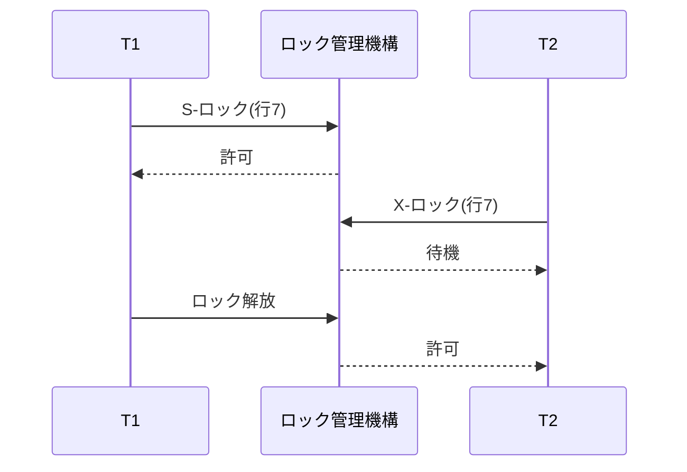
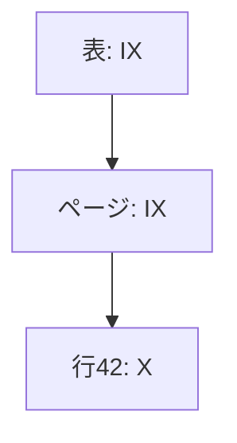
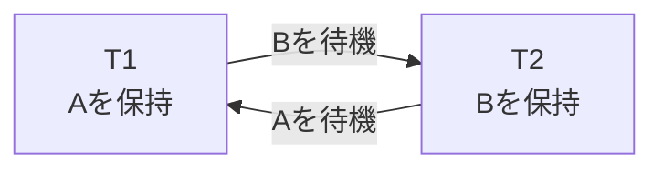
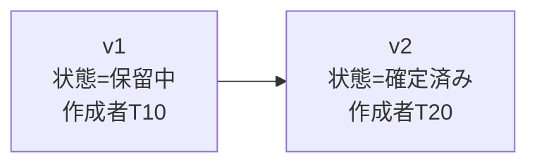

分離レベルはアプリケーションから見える保証です。並行性制御は、その保証を実現する内部機構です。

DBMSは主に、競合する操作を待たせる、古いバージョンを読ませる、危険なトランザクションを中止する、という方法を組み合わせます。

## この章で答える問い

- 共有/排他ロックはどの操作を同時に許すのか
- 二相ロックはなぜ直列化可能性を作れるのか
- MVCCは読み取り側と書き込み側の競合をどう減らすのか
- デッドロックはどう検出し、どのトランザクションを犠牲にするのか
- 楽観的と悲観的並行性制御をどう使い分けるのか
- SSIはスナップショットの書き込みスキューをどう検出するのか

## ロック

ロックはデータ項目への操作を許可・待機させる仕組みです。基本的な方式を考えます。

- **共有（S）ロック**：読み取り用。ほかのSロックと共存できる
- **排他（X）ロック**：書き込み用。ほかのS/Xロックと競合する

### 互換性表

| 要求側 \ 保持側 | S | X |
| --- | --- | --- |
| S | 許可 | 待機 |
| X | 待機 | 待機 |

T1がSロックで行を読んでいる間、T2も読めます。T2が更新するにはXロックが必要なので待ちます。



実際のDBMSには更新ロック、キー共有、スキーマロックなど追加方式があります。

## ロック粒度

ロック対象を細かくすると同時実行性は上がりますが、ロック数と管理コストが増えます。

| 粒度 | 利点 | 欠点 |
| --- | --- | --- |
| 行/レコード | 異なる行を並行更新しやすい | 大量行でロック数が増える |
| ページ | 管理数を減らせる | 同じページの別行も競合し得る |
| 表 | 低コストで全体を保護 | 同時実行性が低い |
| 述語/範囲 | ファントムを防げる | 対象判定と競合範囲が複雑 |

大量の行ロックを表ロックへまとめるロック昇格を行う製品があります。メモリを守る代わりに競合範囲が広がります。

## 意図ロック

表と行の階層ロックを併用すると、「表全体をロックしたいトランザクション」が子行ロックをすべて調べるのは高コストです。

意図ロックは、下位粒度でロックを取得する意図を上位へ記録します。

- IS：下位にSロックを取る意図
- IX：下位にXロックを取る意図
- SIX：表にS、下位にXを取る意図



表Xロック要求は、既存IXと競合するとすぐ判断できます。

## 二相ロック

二相ロック（2PL）は、トランザクションのロック操作を二つの段階へ分けます。

1. **拡大段階**：ロックを取得する。解放しない
2. **縮小段階**：ロックを解放する。新しく取得しない


2PLで競合直列化可能なスケジュールを作れます。しかし、コミット前に書き込みロックを解放すると、別トランザクションが未コミット値を読んだり上書きしたりする可能性があります。

### 厳格二相ロック

厳格二相ロックは少なくともXロックをコミット/ロールバックまで保持します。連鎖的中止を防ぎ、復旧を単純化します。

完全二相ロックはS/Xロックの両方をトランザクション終了まで保持します。

ロックを長く持つほど安全性は分かりやすくなりますが、待機時間とデッドロック可能性が増えます。

## 述語とファントム

次のクエリで「予約がなければ挿入」するとします。

```sql
SELECT COUNT(*)
FROM reservations
WHERE room_id = 7
  AND reserved_on = DATE '2026-08-21';
```

現在該当行が0件なら、行ロック対象がありません。別トランザクションが同じ条件の行を挿入するとファントムが発生します。

対策：

- インデックスキー 範囲／ギャップロック
- 述語ロック
- 直列化可能性の検証
- 容量を表す共通行を明示ロック

物理的な範囲ロックと論理述語ロックは実装が異なります。インデックスがない述語では広い範囲をロックする可能性があります。

## デッドロック

T1がAをロックしてBを待ち、T2がBをロックしてAを待つと循環になります。



待つだけでは永久に進まないため、DBMSは対処します。

### 検出

待機グラフを作り、循環を検出します。循環内の一つを犠牲対象として中止し、そのロックを解放します。

犠牲対象選択には次を考慮できます。

- 実行時間
- 変更量とロールバックコスト
- 優先度
- 再試行回数
- 保持資源

### タイムアウト

一定時間待ったトランザクションを中止します。実装は単純ですが、デッドロックでない長い待機も中止し、タイムアウトまで無駄に待ちます。

### 予防

タイムスタンプによるwait-die／wound-waitや、資源取得順の統一で循環を防ぎます。

アプリケーションで有効な原則：

- 行を常に同じキー順で更新する
- トランザクションを短くする
- 利用者入力やネットワーク呼び出しをロック保持中に待たない
- 一度に扱う行数を制限する

デッドロックを完全に排除できなくても、トランザクション全体を再試行できれば回復できます。

## MVCC

多版並行性制御（MVCC）は、同じ論理行の複数バージョンを保持し、トランザクションのスナップショットに見えるバージョンを選びます。



T20のコミット前に開始した読み取り側はv1を、コミット後のスナップショットはv2を見るというように、読み取り側が書き込み側を待たずに一貫したビューを得られます。

### スナップショット

スナップショットは「どのトランザクションの変更まで可視か」を表します。

概念的な可視性規則：

- スナップショットより前にコミットしたバージョンは見える
- スナップショット後に開始/コミットしたバージョンは見えない
- 中止済みトランザクションのバージョンは見えない
- 自分のトランザクションの変更は見える
- 削除／更新で無効化されたバージョンもスナップショット時点によって見える

実装はトランザクションID範囲、実行中トランザクションリスト、コミットタイムスタンプ、取り消し連鎖などを使います。

### PostgreSQL型のバージョン

PostgreSQLはヒープ上に新しいタプルバージョンを作り、xmin/xmaxなどのメタデータで可視性を判定します。古いバージョンはVACUUMが回収します。

### InnoDB型のバージョン

InnoDBはクラスタ化レコードと取り消しログを使い、読み取りビューに必要な古いバージョンを取り消し連鎖から再構築します。

同じMVCCでも、バージョン配置とガベージコレクションが異なります。

## MVCCでも書き込みは競合する

MVCCは主に読み取り-書き込み競合を減らします。同じ行を二つのトランザクションが更新する書き込み-書き込み競合は、ロック待ち、先更新者／先コミッター優先、中止などで処理します。

```text
T1が行7を更新 → 新しいバージョン
T2が行7を更新 → 待機または中止
```

「MVCCならロックを使わない」は誤りです。行ロック、インデックスロック、スキーマロック、述語保護などを併用します。

## ガベージコレクションと長時間トランザクション

古いスナップショットを持つトランザクションがいる間、そのスナップショットから見える古いバージョンを消せません。

長時間トランザクションの影響：

- 不要タプル/取り消し履歴が増える
- 表/インデックス肥大化
- 不要版の回収/コンパクションが進めない
- トランザクションID周回対策を妨げる
- ストレージとバッファプールを圧迫する
- レプリカ適用やDDLへ影響する

トランザクション内でアイドル状態の接続もスナップショット/ロックを保持する可能性があります。トランザクションタイムアウトと監視が重要です。

## 悲観的並行性制御

競合が起きると予想し、操作前にロックを取得します。

```sql
BEGIN;

SELECT available
FROM inventory
WHERE product_id = 7
FOR UPDATE;

-- アプリケーションで判断
UPDATE inventory
SET available = available - 1
WHERE product_id = 7;

COMMIT;
```

利点：

- 競合時に早く待たせ、更新直前の状態を確保する
- 長い計算後の中止を避けられる場合がある
- 高負荷資源の順序を制御しやすい

欠点：

- 待機とデッドロック
- ロック保持中の障害がほかを止める
- 読み取り専用まで不要に停止する設計になり得る

## 楽観的並行性制御

競合が少ないと仮定し、読み取り/計算をロックなしで進め、コミット前に変更されていないか検証します。

アプリケーション層のバージョン列例：

```sql
SELECT id, status, version
FROM orders
WHERE id = 42;

UPDATE orders
SET status = 'confirmed',
    version = version + 1
WHERE id = 42
  AND version = 7;
```

更新行数が0なら誰かが先に更新したため、再読込・マージ・再試行します。

一般的なOCC段階：

1. 読み取り段階
2. 検証段階
3. 書き込み段階

利点：

- 競合が少なければ待機が少ない
- 読み取り/計算中にロックを保持しない
- Webの編集画面など長い操作待ち時間へ使いやすい

欠点：

- 競合が多いと中止と再計算が増える
- 副作用を伴う処理の再試行が難しい
- 複数行/述語の検証が複雑

## タイムスタンプ順序制御

各トランザクションへタイムスタンプを割り当て、操作がタイムスタンプ順序に反しないか検査します。

データ項目ごとに読み取りタイムスタンプ/書き込みタイムスタンプを持ち、古いトランザクションの遅れた書き込みを中止する方式があります。

ロック待ちを避けられる一方、競合時に中止が増え、タイムスタンプ/メタデータ管理が必要です。MVCCと組み合わせた多版タイムスタンプ順序制御もあります。

## 直列化可能スナップショット分離

直列化可能スナップショット分離（SSI）は、スナップショット分離の非停止読み取りを保ちつつ、直列化可能性を壊す依存関係を検出してトランザクションを中止します。

書き込みスキューでは次のrw-依存関係ができます。


SSIは危険構造を追跡し、循環になり得るトランザクションを中止します。

利点：

- 読み取り側が書き込み側を直接停止しにくい
- スナップショット読み取りの性能を保ちやすい

コスト：

- 依存関係の追跡メモリ
- 偽陽性中止
- アプリケーション再試行
- 長時間トランザクションで追跡量が増える

Serializableをロックで実現するかSSIで実現するかにより、待機と中止のプロフィールが変わります。

## ロック待機を診断する

確認するもの：

1. 待機中トランザクションとブロッカー
2. 待っているロック方式/資源
3. ブロッカーが実行中か、トランザクション内でアイドル状態か
4. トランザクション開始時刻と最後の文
5. アクセス順序
6. インデックス不足によって広い行をロックしていないか
7. アプリケーションタイムアウトとDBタイムアウトの関係

ブロッカーのクエリだけでなく、トランザクション全体とリクエストトレースを結びつけます。

## 並行性制御方式を選ぶ

| 状況 | 第一候補 |
| --- | --- |
| 高負荷な在庫1行を短く更新 | 原子的なUPDATEまたは悲観的行ロック |
| 競合の少ない編集画面 | バージョン列による楽観的制御 |
| 一貫した読み取り中心のレポート | MVCCスナップショット |
| 複数行の述語不変条件 | Serializable / 述語保護 |
| 同じ複数行を更新 | 一貫したロック順 + 再試行 |

DB分離性とアプリケーションOCCは併用できます。

## よくある誤解

### 「MVCCはロック不要である」

バージョン読み取りは停止を減らしますが、書き込み競合、インデックス、DDL、制約にはロックが必要です。

### 「デッドロックは不具合なので再試行してはいけない」

アクセス順不統一は改善すべきですが、完全排除が困難な並行システムではデッドロック犠牲対象再試行は通常の回復手段です。

### 「楽観的は常に高速である」

高負荷箇所では中止/再試行が仕事を増やします。競合率と再実行コストで判断します。

## まとめ

- S/Xロックは読み取り/読み取りを許し、書き込みを排他的にする
- 粒度を細かくすると同時実行性が上がるがロック管理コストも増える
- 2PLは拡大/縮小段階で直列化可能性を作り、厳格二相ロックは書き込みロックを終了まで保持する
- 述語/範囲保護がないとファントムを防げない
- デッドロックは待機グラフの循環であり、犠牲対象中止と再試行で解消する
- MVCCはスナップショットから可視バージョンを選び読み取り側/書き込み側競合を減らす
- 古いバージョン回収は長時間トランザクションに妨げられる
- 悲観的は待機、楽観的は検証障害を選ぶ
- SSIはスナップショット間の危険依存関係を検出して中止する

## 確認問題

1. S/X互換性表を使い、読み取りと書き込みの待機を説明してください。
2. 厳格二相ロックが連鎖的中止を防ぐ理由は何ですか。
3. 存在しない行へのファントムを行ロックだけで防げない理由を説明してください。
4. MVCCの長時間トランザクションがストレージを増やす経路を説明してください。
5. 高負荷カウンターで楽観的制御が不利になる理由は何ですか。

## 参考資料

- [PostgreSQL Documentation: Explicit Locking](https://www.postgresql.org/docs/current/explicit-locking.html)
- [PostgreSQL Documentation: Routine Vacuuming](https://www.postgresql.org/docs/current/routine-vacuuming.html)
- [MySQL Documentation: InnoDB Locking](https://dev.mysql.com/doc/refman/8.4/en/innodb-locking.html)
- [Michael J. Cahill et al., “Serializable Isolation for Snapshot Databases”](https://doi.org/10.1145/1376616.1376690)

次章では、トランザクションの原子性と永続性をクラッシュ後に回復するWAL、チェックポイント、再実行/取り消し、ARIESを扱います。
