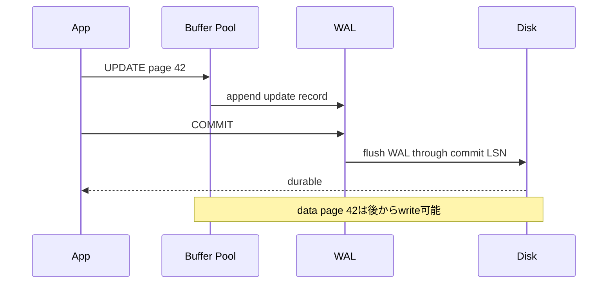
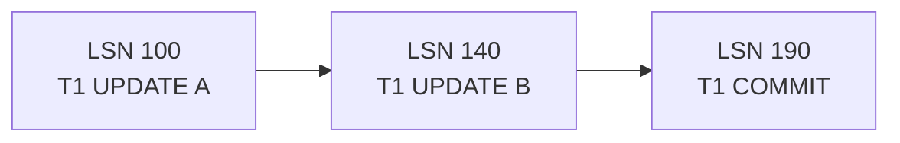
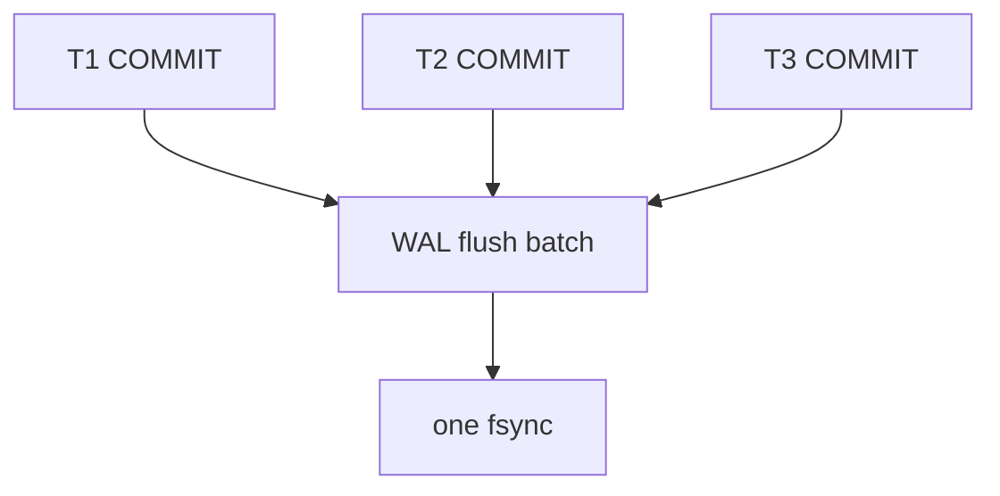
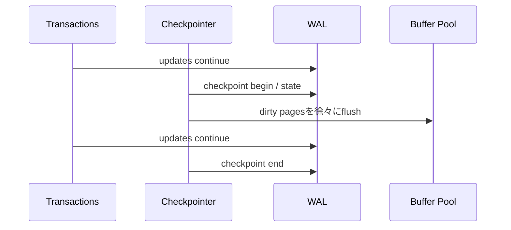
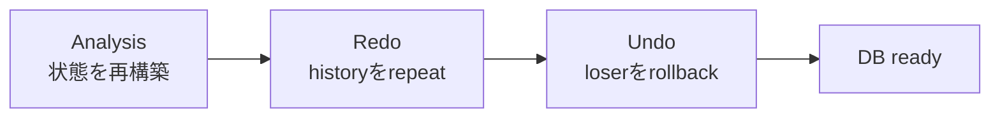
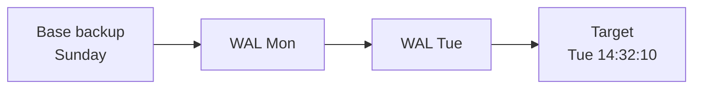

DBMSは更新のたびにdata page本体を同期書き込みすると、storage latencyでthroughputが制限されます。一方、memory上のdirty pageだけを更新してCOMMITを返すと、crashで結果を失います。

Write-Ahead Logging（WAL）は、変更の記録をdata pageより先に永続化し、高速なcommitとcrash recoveryを両立させます。

## この章で答える問い

- WALのwrite-ahead ruleは何を要求するのか
- Commit時にdata page本体を書かなくてもDurabilityを保てるのはなぜか
- Steal/no-steal、force/no-forceでredoとundoの必要性はどう変わるのか
- Checkpointは何を短縮し、なぜWALを不要にしないのか
- ARIESのanalysis、redo、undoは何を行うのか
- BackupとPITRはcrash recoveryとどう違うのか

## memory更新とcrash

Buffer Poolで次の状態を考えます。

```text
Transaction T1: COMMIT済み
Page 42: memoryではnew value、data fileはold value
```

このままprocessがcrashするとmemory上のnew valueは失われます。COMMIT成功を返しているため、再起動時にnew valueを復元しなければDurability違反です。

逆に未commitのT2が変更したdirty pageをdata fileへ書き出してからcrashした場合、再起動時にその変更を取り消さなければAtomicity違反です。

Recoveryは次の二つを扱います。

- **redo**：commit済みだがdata pageへ未反映の変更を再適用する
- **undo**：未commitだがdata pageへ反映された変更を取り消す

## WALの原則

Write-aheadには二つの重要な順序があります。

1. Dirty data pageをstorageへ書く前に、そのpage変更を復旧できるlog recordを永続化する
2. COMMIT成功を返す前に、そのtransactionのcommitに必要なlogを永続化する



Logはappend中心なので、複数のrandom data pageを同期writeするより効率的にcommitできます。

## log record

Log recordには実装に応じて次を含みます。

- LSN（Log Sequence Number）
- Transaction ID
- Record type
- 対象page/record
- redo情報
- undo情報
- 前のtransaction logへのpointer
- commit/abort/checkpoint情報

### physical log

「page 42のoffset 120をold bytesからnew bytesへ変更」のように物理byte差を記録します。Redo/undoが直接的ですが、page formatへ依存します。

### logical log

「key=7へrecordをinsert」のように論理operationを記録します。Compactで構造変更に柔軟な場合がありますが、recovery時にdata structure操作が必要です。

### physiological log

Pageは物理的に指定し、page内operationは論理的に記録します。ARIESで使われる考え方です。

実DBMSはoperation種類に応じて組み合わせます。

## LSN

LSNはWAL内の位置・順序を表します。Page headerにもpage LSNを持たせ、どのlog recordまで反映済みか記録します。

```text
log record LSN = 1200
page LSN       = 1250

→ pageにはLSN 1200の変更がすでに反映済み
```

Redo時にpage LSN >= log LSNなら、そのrecordを再適用せずskipできます。Recoveryをidempotentに近づけます。

Buffer Managerがpageをwriteする前に、WALが少なくともpage LSNまでflush済みであることを確認します。

## transaction log chain

各transactionのlog recordをprevLSNでchainすると、rollback時にそのtransactionの変更だけを逆順にたどれます。



Global WALでは複数transactionがinterleaveしていますが、transaction chainでundo対象を追跡できます。

## group commit

各transactionが別々にfsyncすると、1 commitにつきstorage latencyを支払います。Group commitは近い時刻のcommit recordを一度のWAL flushへまとめます。



個々のtransactionは少しbatchを待つ可能性がありますが、throughputを大きく改善できます。

WAL buffer size、commit delay、storage latency、concurrencyがbatch効率へ影響します。

## force/no-force、steal/no-steal

### force

COMMIT時にtransactionが変更したdata pageをすべて永続化します。Commit済み変更のredoは不要になりやすい一方、random I/Oを待つため遅くなります。

### no-force

COMMIT時にdata page本体のwriteを要求しません。高速ですが、crash時にcommit済み変更のredoが必要です。

### steal

Buffer Managerは未commit transactionのdirty pageをstorageへ書き出せます。Buffer Poolを柔軟に置換できますが、crash時にundoが必要です。

### no-steal

未commit dirty pageをstorageへ書きません。Undoは不要になりやすい一方、large transactionの全dirty pageをmemoryへ保持する必要があります。

| Policy | Recoveryへの影響 |
| --- | --- |
| force + no-steal | redo/undoを減らせるがruntime costが高い |
| no-force + no-steal | redoが必要 |
| force + steal | undoが必要 |
| no-force + steal | redoとundoが必要、柔軟で一般的 |

WAL + ARIES系はno-force/stealを可能にし、高いconcurrencyとBuffer Pool利用効率を得ます。

## checkpoint

WALをsystem開始時からすべてscanするとrecoveryが長くなります。Checkpointは、recovery開始点を新しくするための状態を記録します。

記録する例：

- active transaction
- dirty page table
- WAL位置
- flush済みpage

### sharp checkpoint

処理を止め、全dirty pageを書き、整合した一点を作ります。Recoveryは単純ですが、停止とI/O spikeが大きくなります。

### fuzzy checkpoint

Transactionを継続しながらcheckpoint情報をlogへ書き、dirty pageをbackgroundでflushします。



Fuzzy checkpoint中にもpageは更新されるため、checkpointだけで完全なdata snapshotにはなりません。Recoveryはcheckpoint時点のdirty/active情報と後続WALを使います。

Checkpoint頻度のtrade-off：

- 頻繁：recovery WALは短くなるがruntime I/O増加
- 低頻度：runtime writeは平準化しやすいがrecovery時間とWAL保持量増加

## crash recovery

Crash後の目的は、一貫したtransaction状態を持つDBへ戻すことです。

単純化すると：

1. Checkpointからactive transactionとdirty pageを復元する
2. WALを進みcommit済み変更をredoする
3. Crash時未完了transactionをundoする
4. Recovery完了後に通常serviceを開始する

Redoは「commit済みだけ」ではなく、history repeatingとして未commit変更も含めて一度再現し、その後undoするARIES設計があります。

## ARIES

ARIESはAlgorithm for Recovery and Isolation Exploiting Semanticsの略で、steal/no-force環境の代表的recovery algorithmです。

### 1. Analysis

最後のcheckpointからlogをscanし、次を再構築します。

- Transaction table：active transactionとlastLSN
- Dirty page table：dirty pageと最初にdirtyになったrecLSN
- Winner/loser transaction

Winnerはcommit済み、loserはcrash時未完了です。

### 2. Redo

Dirty page tableの最小recLSN付近からlogをforward scanし、必要な変更を再適用します。

Redo条件では次を確認します。

- Pageがdirty page tableにあるか
- log LSNがrecLSN以降か
- page LSNがlog LSNより古いか

Page LSNがすでに新しければskipします。

### 3. Undo

Loser transactionのlog chainをlastLSNから逆にたどり、変更を取り消します。



## Compensation Log Record

Undo操作自体もcrashする可能性があります。Compensation Log Record（CLR）は「どの変更をundoしたか」と「次にどこをundoするか」をWALへ記録します。

Recovery中に再crashしても、CLRをredoして完了済みundoを繰り返さず、残りから再開できます。

CLR自体はundoしません。Undoのundoを延々繰り返さないためです。

## idempotent redo

Recoveryは途中で再crashしても安全に再実行できる必要があります。

Page LSNやrecord metadataで、同じlog recordを二重適用しないようにします。Operationが数学的にidempotentでなくても、適用済み判定によってrecovery procedureをrepeatableにできます。

## crash failureとmedia failure

### crash failure

Memoryを失うがdata fileとWAL storageは利用可能です。Local WALで回復できます。

例：

- DB process crash
- OS crash
- power loss後にstorageが正常

### media failure

Data fileやWAL自体を失う・破損する障害です。Local recoveryだけでは戻せません。

例：

- disk loss
- filesystem corruption
- accidental DROP
- ransomware

Backup、replica、archive WALが必要です。

## backup

### logical backup

SQLやlogical row形式でexportします。

利点：

- Object/table単位でrestoreしやすい
- 別version/architectureへ移行しやすい

欠点：

- Large DBで遅い
- Restore時にindex再構築などが必要
- Physical stateをそのまま戻さない

### physical backup

Data fileをphysical formatでcopyします。

利点：

- Large DBを速くrestoreしやすい
- Cluster全体を同じphysical stateへ戻せる

欠点：

- DB version、platform、tablespace構成へ依存
- Online copy中の一貫性にWALが必要

Backupは「作成成功」だけでなくrestore testで検証します。

## Point-in-Time Recovery

Base backupへ、その後archiveしたWALを順にredoし、指定時刻/transaction直前まで復元します。



Accidental DELETEの直前へ戻せます。ただし復元先は通常別clusterとして立ち上げ、必要dataを抽出するか切り替えます。

PITRに必要：

- 有効なbase backup
- 連続したarchive WAL
- Timeline/history情報
- Recovery procedure
- 十分なstorageとrestore時間

WAL chainに欠損があるとその先へ進めません。

## replicaとrecovery

Physical replicaはleaderのWALを受け取りredoして同じ状態を作れます。

Replicaはbackupの代替になりません。Accidental DELETEも複製され、corruptionやoperator errorが広がる可能性があります。

役割を分けます。

- Replica：availability、read scaling、短いfailover
- Backup/PITR：過去状態、operator error、media/corruption recovery
- Archive/offline copy：failure domain分離

## checksumとcorruption

Page checksumはstorageから読んだpageが期待した内容か検出する助けになります。検出は修復ではありません。

破損対策：

- page/WAL checksum
- storage ECCとfilesystem protection
- replica比較
- periodic scrub
- backup verification
- restore drill

Silent corruptionは通常queryを実行できているだけでは分からないことがあります。

## RPOとRTO

- **RPO（Recovery Point Objective）**：どこまでのdata lossを許容するか
- **RTO（Recovery Time Objective）**：どれだけの停止時間を許容するか

例：

```text
RPO = 5 minutes
RTO = 30 minutes
```

Backup頻度だけでなくWAL archive遅延、replication mode、restore bandwidth、手順自動化が関係します。

## よくある誤解

### 「checkpointがあればWALを削除できる」

Replica、backup、PITR、未flush pageなどが必要とする位置までは保持が必要です。Checkpointだけで保持下限は決まりません。

### 「COMMIT成功時にはdata fileへrowが書かれている」

No-force WAL方式では、必要なWALがdurableならdata pageは後から書けます。

### 「replicaがあるのでbackupは不要」

Logical errorやdeleteも複製されます。過去へ戻るbackup/PITRは別の役割です。

## まとめ

- WALはdata pageより先にlogを永続化し、commit前に必要なlogをflushする
- LSNとpage LSNでlog順序と適用済み変更を判断する
- No-forceはredo、stealはundoを必要にする
- Group commitは複数commitを一度のWAL flushへまとめる
- Fuzzy checkpointはserviceを止めずにrecovery開始情報を記録する
- ARIESはanalysis、redo、undoの三phaseでhistoryを回復する
- CLRはundoの進捗をlog化し、recovery中の再crashへ備える
- Crash recovery、replica、backup/PITRは異なるfailureを扱う
- RPO/RTOはdata lossと復旧時間の目標を表す

## 確認問題

1. WALの二つのwrite-ahead ruleを説明してください。
2. No-force/stealでredoとundoの両方が必要になるscheduleを作ってください。
3. Fuzzy checkpointがWALを不要にしない理由は何ですか。
4. ARIESのanalysis、redo、undoで作る情報と処理を説明してください。
5. Replicaとbackupがそれぞれ守るfailureを比較してください。

## 参考資料

- [PostgreSQL Documentation: Write-Ahead Logging](https://www.postgresql.org/docs/current/wal-intro.html)
- [PostgreSQL Documentation: Continuous Archiving and PITR](https://www.postgresql.org/docs/current/continuous-archiving.html)
- [C. Mohan et al., “ARIES: A Transaction Recovery Method”](https://doi.org/10.1145/128765.128770)

次章からは分散DBへ進みます。まず同じdataを複数nodeへ複製するときのcommit条件とconsistencyを扱います。
