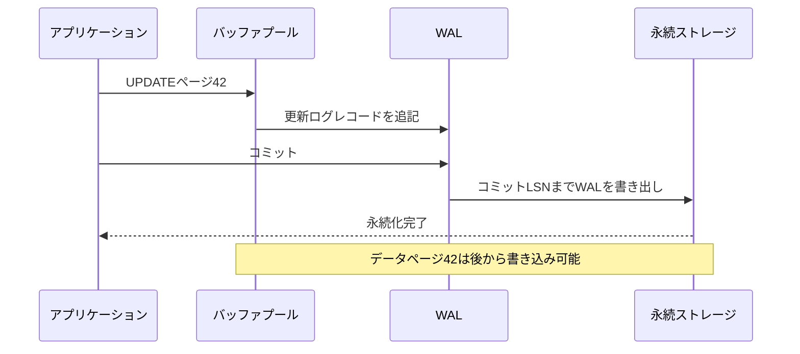
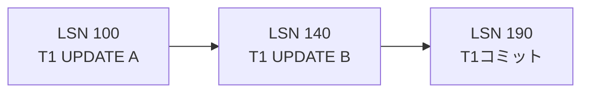
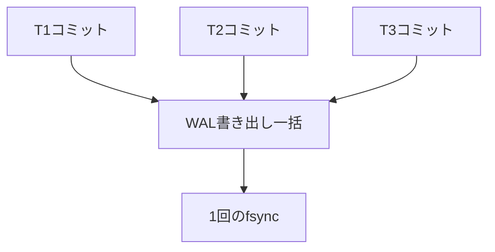
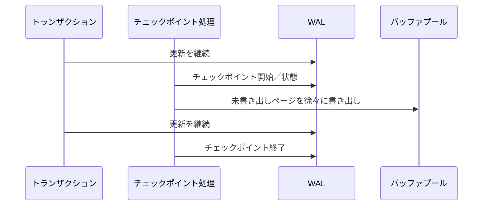
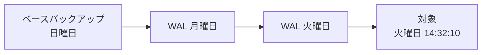

DBMSが更新のたびにデータページ本体を同期的に書き込むと、ストレージ遅延によって処理量が制限されます。一方、メモリ上の未書き出しページだけを更新してコミットを返すと、クラッシュで結果を失います。

先行書き込みログ（WAL）は、変更の記録をデータページより先に永続化し、高速なコミットとクラッシュ復旧を両立させます。

## この章で答える問い

- WALの先行書き込み規則は何を要求するのか
- コミット時にデータページ本体を書かなくても永続性を保てるのはなぜか
- スティール/スティールなし、フォース/フォースなしで再実行と取り消しの必要性はどう変わるのか
- チェックポイントは何を短縮し、なぜWALを不要にしないのか
- ARIESの分析、再実行、取り消しは何を行うのか
- バックアップとPITRはクラッシュ復旧とどう違うのか

## メモリ更新とクラッシュ

バッファプールで次の状態を考えます。

```text
トランザクションT1: コミット済み
ページ42: メモリでは新しい値、データファイルは古い値
```

このまま処理がクラッシュするとメモリ上の新しい値は失われます。コミット成功を返しているため、再起動時に新しい値を復元しなければ永続性違反です。

逆に未コミットのT2が変更した未書き出しページをデータファイルへ書き出してからクラッシュした場合、再起動時にその変更を取り消さなければ原子性違反です。

復旧は次の二つを扱います。

- **再実行**：コミット済みだがデータページへ未反映の変更を再適用する
- **取り消し**：未コミットだがデータページへ反映された変更を取り消す

## WALの原則

先行書き込みには二つの重要な順序があります。

1. 未書き出しデータページをストレージへ書く前に、そのページ変更を復旧できるログレコードを永続化する
2. コミット成功を返す前に、そのトランザクションのコミットに必要なログを永続化する



ログは追記中心なので、複数のランダムなデータページを同期的に書き込むより効率よくコミットできます。

## ログレコード

ログレコードには実装に応じて次を含みます。

- LSN（ログシーケンス番号）
- トランザクションID
- レコード型
- 対象ページ/レコード
- 再実行情報
- 取り消し情報
- 前のトランザクションログへのポインター
- コミット/中止/チェックポイント情報

### 物理ログ

「ページ42のオフセット120を古いバイトから新しいバイトへ変更」のように物理バイト差を記録します。再実行/取り消しが直接的ですが、ページ形式へ依存します。

### 論理ログ

「キー=7へレコードを挿入」のように論理操作を記録します。コンパクトで構造変更に柔軟な場合がありますが、復旧時にデータ構造操作が必要です。

### 生理的ログ

ページは物理的に指定し、ページ内操作は論理的に記録します。ARIESで使われる考え方です。

実DBMSは操作種類に応じて組み合わせます。

## LSN

LSNはWAL内の位置・順序を表します。ページヘッダーにもページLSNを持たせ、どのログレコードまで反映済みか記録します。

```text
ログレコードLSN = 1200
ページLSN       = 1250

→ ページにはLSN 1200の変更がすでに反映済み
```

再実行時にページLSN >= ログLSNなら、そのレコードを再適用せずスキップできます。復旧を冪等に近づけます。

バッファ管理機構がページを書き込む前に、WALが少なくともページLSNまで書き出し済みであることを確認します。

## トランザクションログ連鎖

各トランザクションのログレコードをprevLSNで連鎖すると、ロールバック時にそのトランザクションの変更だけを逆順にたどれます。



全体WALでは複数トランザクションが交互配置していますが、トランザクション連鎖で取り消し対象を追跡できます。

## グループコミット

各トランザクションが別々にfsyncすると、1コミットにつきストレージ遅延時間を支払います。グループコミットは近い時刻のコミットレコードを一度のWAL書き出しへまとめます。



個々のトランザクションは少し一括を待つ可能性がありますが、処理量を大きく改善できます。

WALバッファ大きさ、コミット遅延、ストレージ遅延時間、同時実行性が一括効率へ影響します。

## フォース/フォースなし、スティール/スティールなし

### フォース

コミット時にトランザクションが変更したデータページをすべて永続化します。コミット済み変更の再実行は不要になりやすい一方、ランダムI/Oを待つため遅くなります。

### フォースなし

コミット時にデータページ本体の書き込みを要求しません。高速ですが、クラッシュ時にコミット済み変更の再実行が必要です。

### スティール

バッファ管理機構は未コミットトランザクションの未書き出しページをストレージへ書き出せます。バッファプールを柔軟に置換できますが、クラッシュ時に取り消しが必要です。

### スティールなし

未コミット未書き出しページをストレージへ書きません。取り消しは不要になりやすい一方、大規模トランザクションの全未書き出しページをメモリへ保持する必要があります。

| 方針 | 復旧への影響 |
| --- | --- |
| フォース + スティールなし | 再実行/取り消しを減らせるが実行時コストが高い |
| フォースなし + スティールなし | 再実行が必要 |
| フォース + スティール | 取り消しが必要 |
| フォースなし + スティール | 再実行と取り消しが必要、柔軟で一般的 |

WAL + ARIES系はフォースなし/スティールを可能にし、高い同時実行性とバッファプール利用効率を得ます。

## チェックポイント

WALをシステム開始時からすべて走査すると復旧が長くなります。チェックポイントは、復旧開始点を新しくするための状態を記録します。

記録する例：

- 実行中トランザクション
- 未書き出しページ表
- WAL位置
- 書き出し済みページ

### 静止点チェックポイント

処理を止め、全未書き出しページを書き、整合した一点を作ります。復旧は単純ですが、停止とI/O急増が大きくなります。

### ファジーチェックポイント

トランザクションを継続しながらチェックポイント情報をログへ書き、未書き出しページをバックグラウンドで書き出しします。



ファジーチェックポイント中にもページは更新されるため、チェックポイントだけで完全なデータスナップショットにはなりません。復旧はチェックポイント時点の未書き出し/実行中情報と後続WALを使います。

チェックポイント頻度のトレードオフ：

- 頻繁：復旧WALは短くなるが実行時I/O増加
- 低頻度：実行時書き込みは平準化しやすいが復旧時間とWAL保持量増加

## クラッシュ復旧

クラッシュ後の目的は、一貫したトランザクション状態を持つDBへ戻すことです。

単純化すると：

1. チェックポイントから実行中トランザクションと未書き出しページを復元する
2. WALを進みコミット済み変更を再実行する
3. クラッシュ時に未完了だったトランザクションを取り消す
4. 復旧完了後に通常サービスを開始する

ARIESでは、再実行時に未コミット変更も含めて履歴を一度再現し、その後で未完了トランザクションを取り消します。

## ARIES

ARIESは「復旧と分離性の意味論を活用するアルゴリズム」の略で、スティール/フォースなし環境の代表的復旧アルゴリズムです。

### 1. 分析

最後のチェックポイントからログを走査し、次を再構築します。

- トランザクション表：実行中トランザクションと直前のLSN
- 未書き出しページ表：未書き出しページと最初に未書き出しになったrecLSN
- 完了/未完了トランザクション

完了はコミット済み、未完了はクラッシュ時未完了です。

### 2. 再実行

未書き出しページ表の最小recLSN付近からログを前向きに走査し、必要な変更を再適用します。

再実行条件では次を確認します。

- ページが未書き出しページ表にあるか
- ログLSNがrecLSN以降か
- ページLSNがログLSNより古いか

ページLSNがすでに新しければスキップします。

### 3. 取り消し

未完了トランザクションのログ連鎖を直前のLSNから逆にたどり、変更を取り消します。


## 補償ログレコード

取り消し操作自体もクラッシュする可能性があります。補償ログレコード（CLR）は「どの変更を取り消したか」と「次にどこを取り消すか」をWALへ記録します。

復旧中に再クラッシュしても、CLRを再実行して完了済み取り消しを繰り返さず、残りから再開できます。

CLR自体は取り消しません。取り消しの取り消しを延々繰り返さないためです。

## 冪等な再実行

復旧は途中で再クラッシュしても安全に再実行できる必要があります。

ページLSNやレコードメタデータで、同じログレコードを二重適用しないようにします。操作が数学的に冪等でなくても、適用済み判定によって復旧手順を再実行可能にできます。

## クラッシュ障害と媒体障害

### クラッシュ障害

メモリを失うがデータファイルとWALストレージは利用可能です。局所WALで回復できます。

例：

- DB処理クラッシュ
- OSクラッシュ
- 電源喪失後にストレージが正常

### 媒体障害

データファイルやWAL自体を失う・破損する障害です。局所復旧だけでは戻せません。

例：

- ディスク損失
- ファイルシステム破損
- 誤った削除操作
- ランサムウェア

バックアップ、レプリカ、WALアーカイブが必要です。

## バックアップ

### 論理バックアップ

SQLや論理行形式で書き出しします。

利点：

- オブジェクト/表単位で復元しやすい
- 別バージョン/アーキテクチャへ移行しやすい

欠点：

- 大規模DBで遅い
- 復元時にインデックス再構築などが必要
- 物理状態をそのまま戻さない

### 物理バックアップ

データファイルを物理形式で複製します。

利点：

- 大規模DBを速く復元しやすい
- クラスター全体を同じ物理状態へ戻せる

欠点：

- DBバージョン、基盤、表領域構成へ依存
- オンライン複製中の一貫性にWALが必要

バックアップは「作成成功」だけでなく復元試験で検証します。

## 時点復旧

ベースバックアップへ、その後アーカイブしたWALを順に再実行し、指定時刻/トランザクション直前まで復元します。



誤削除の直前へ戻せます。ただし復元先は通常別クラスターとして立ち上げ、必要データを抽出するか切り替えます。

PITRに必要：

- 有効なベースバックアップ
- 連続したWALアーカイブ
- 時系列/履歴情報
- 復旧手順
- 十分なストレージと復元時間

WAL連鎖に欠損があるとその先へ進めません。

## レプリカと復旧

物理レプリカはリーダーのWALを受け取り再実行して同じ状態を作れます。

レプリカはバックアップの代替になりません。誤削除も複製され、破損や運用者の操作ミスが広がる可能性があります。

役割を分けます。

- レプリカ：可用性、読み取りの負荷分散、短いフェイルオーバー
- バックアップ/PITR：過去状態、運用者の操作ミス、媒体破損からの復旧
- アーカイブ/オフライン複製：障害領域分離

## チェックサムと破損

ページチェックサムはストレージから読んだページが期待した内容か検出する助けになります。検出は修復ではありません。

破損対策：

- ページ/WALチェックサム
- ストレージECCとファイルシステムの保護
- レプリカ比較
- 定期的な全体検査
- バックアップ検証
- 復元訓練

サイレントデータ破損は通常クエリを実行できているだけでは分からないことがあります。

## RPOとRTO

- **RPO（復旧時点目標）**：どこまでのデータ損失を許容するか
- **RTO（復旧時間目標）**：どれだけの停止時間を許容するか

例：

```text
RPO = 5分
RTO = 30分
```

バックアップ頻度だけでなくWALアーカイブ遅延、レプリケーション方式、復元帯域幅、手順自動化が関係します。

## よくある誤解

### 「チェックポイントがあればWALを削除できる」

レプリカ、バックアップ、PITR、未書き出しページなどが必要とする位置までは保持が必要です。チェックポイントだけで保持下限は決まりません。

### 「コミット成功時にはデータファイルへ行が書かれている」

フォースなしWAL方式では、必要なWALが永続化済みならデータページは後から書けます。

### 「レプリカがあるのでバックアップは不要」

論理エラーや削除も複製されます。過去へ戻るバックアップ/PITRは別の役割です。

## まとめ

- WALはデータページより先にログを永続化し、コミット前に必要なログを書き出す
- LSNとページLSNでログ順序と適用済み変更を判断する
- フォースなしは再実行、スティールは取り消しを必要にする
- グループコミットは複数コミットを一度のWAL書き出しへまとめる
- ファジーチェックポイントはサービスを止めずに復旧開始情報を記録する
- ARIESは分析、再実行、取り消しの三段階で履歴を回復する
- CLRは取り消しの進捗をログ化し、復旧中の再クラッシュへ備える
- クラッシュ復旧、レプリカ、バックアップ/PITRは異なる障害を扱う
- RPO/RTOはデータ損失と復旧時間の目標を表す

## 確認問題

1. WALの二つの先行書き込み規則を説明してください。
2. フォースなし/スティールで再実行と取り消しの両方が必要になるスケジュールを作ってください。
3. ファジーチェックポイントがWALを不要にしない理由は何ですか。
4. ARIESの分析、再実行、取り消しで作る情報と処理を説明してください。
5. レプリカとバックアップがそれぞれ守る障害を比較してください。

## 参考資料

- [PostgreSQL Documentation: Write-Ahead Logging](https://www.postgresql.org/docs/current/wal-intro.html)
- [PostgreSQL Documentation: Continuous Archiving and PITR](https://www.postgresql.org/docs/current/continuous-archiving.html)
- [C. Mohan et al., “ARIES: A Transaction Recovery Method”](https://doi.org/10.1145/128765.128770)

次章からは分散DBへ進みます。まず同じデータを複数ノードへ複製するときのコミット条件と整合性を扱います。
