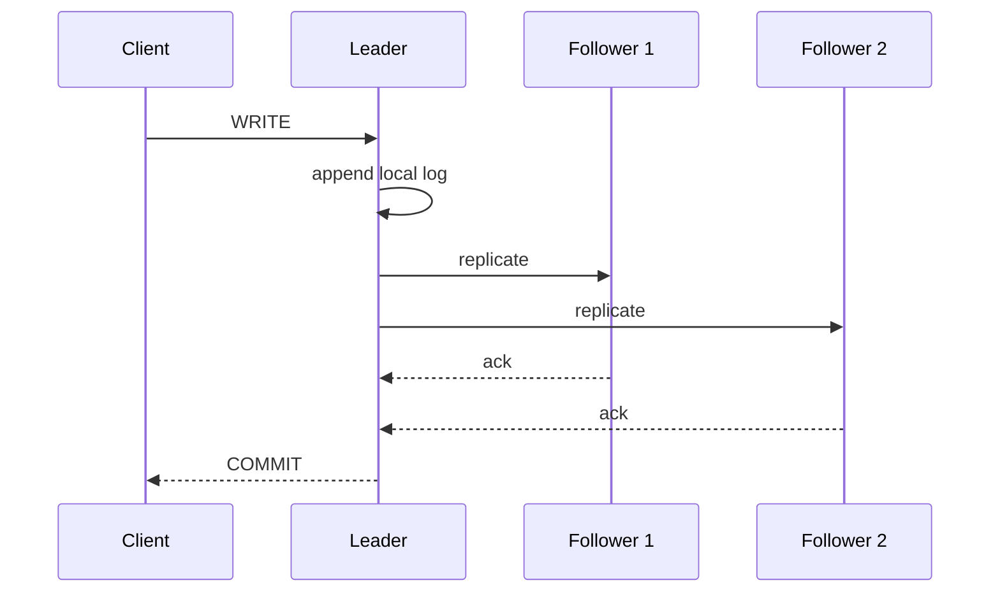
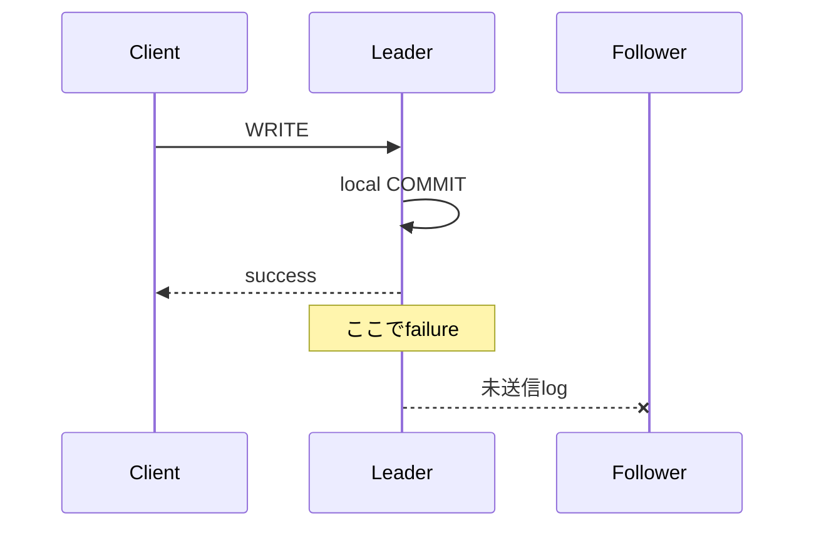
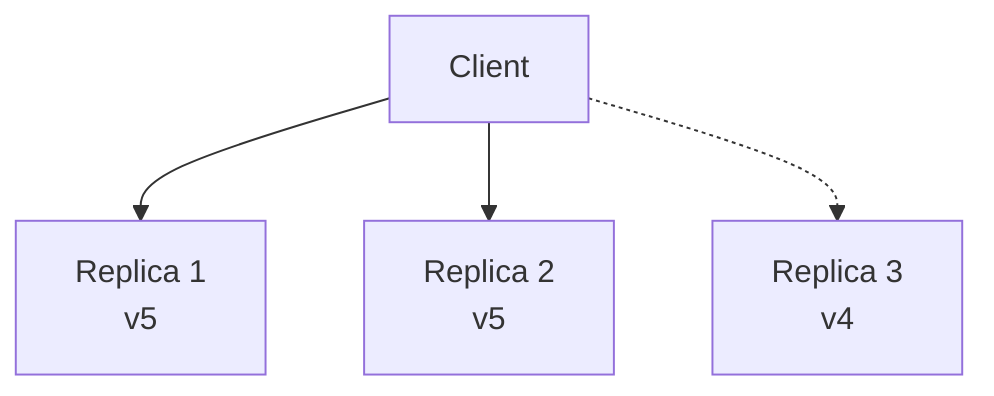

Replicationは同じlogical dataのcopyを複数nodeへ持つ仕組みです。Availability、durability、read throughputを改善できますが、copy間の遅延と不一致を新たに生みます。

「replicaが3台ある」という構成情報だけでは保証は分かりません。Writeを何台が確認したらcommitとするか、readをどこへ送るか、network partition時にどちら側を正とするかを定義する必要があります。

## この章で答える問い

- Replicationはavailability、durability、read scalingをどこまで改善するのか
- Synchronous/asynchronous replicationでCOMMITの意味はどう変わるのか
- Replica lagとread-after-write anomalyをどう扱うのか
- Linearizability、serializability、eventual consistencyは何が違うのか
- QuorumのR + W > Nは、どの前提で機能するのか
- CAPとPACELCは何を選択させるのか

## replicationの目的

### availability

一つのnodeが停止しても別copyでserviceを継続します。ただし自動failover、leader election、client routingが必要です。

### durability

別failure domainへcopyを置けば、machineやdisk喪失に耐えられます。同じrack・regionだけに置くと、共通障害へ弱いままです。

### read scaling

Read-only queryをreplicaへ分散できます。ただしlagしたreplicaから古い値を読む可能性があります。強いread consistencyが必要ならleaderやquorum readへ戻り、scaling効果が減ります。

### geographic locality

Userに近いregionのreplicaからreadしlatencyを下げます。Cross-region writeの同期は光速とnetwork latencyの制約を受けます。

Replicationはbackupの代替ではありません。誤DELETE、schema bug、corruptionも複製され得ます。

## physicalとlogical replication

### physical replication

WAL/page changeなどstorage engineの物理変更を転送します。

利点：

- Leaderと同じphysical stateを効率よく再現
- 全databaseを高throughputで複製しやすい

制約：

- Engine/version/platformへの依存が強い
- Table単位の変換・filterが難しい

### logical replication

INSERT/UPDATE/DELETEなどlogical changeをrow/table単位で転送します。

利点：

- 一部tableの選択
- version migration
- schema変換や異種consumer
- CDCへの利用

制約：

- DDL、sequence、large transactionなどを別途扱う
- Apply conflictとordering
- Row identityが必要

Statement-based replicationは同じSQLを再実行しますが、non-deterministic function、trigger、環境差で結果がずれる可能性があります。Row-based/logical changeは結果を送る代わりにlog量が増えます。

## leader/follower

一つのleaderがwriteを受け、replication logをfollowersへ送ります。



利点：

- Write orderをleaderで一本化
- Conflict解決が比較的単純
- Followerをread/standbyへ使える

課題：

- Leaderがwrite bottleneck
- Leader failure時の選出
- Lagしたfollowerの昇格によるdata loss
- Split brain防止

## synchronous replication

Leaderがclientへcommitを返す前に、指定replicaのackを待ちます。

```text
commit latency
≈ leader local durability
+ synchronous replica round trip
+ replica durability policy
```

利点：

- Ackしたreplicaが残ればcommitted dataを失いにくい
- Failover時のRPOを小さくできる

欠点：

- Network/replica latencyがwrite latencyへ加わる
- 必要replicaが利用不能ならwrite停止
- Slow replicaがtail latencyを上げる

「synchronous」のackがmemory受信、OS write、fsync、apply完了のどこを意味するか確認します。

## asynchronous replication

Leaderはlocal commit後、replicaのackを待たずにclientへ返します。



利点：

- Write latencyが低い
- Replica failure時もleaderが進行しやすい

欠点：

- Commit済みでもreplica未到達dataをfailoverで失い得る
- Read replicaが古い
- Lagが無制限に広がる可能性

### semi-synchronous

少なくとも1台への受信ackを待つなど、中間の保証を取ります。Apply/fsyncまで待つかで意味が変わります。

## replica lag

Lagはleader log位置とreplica receive/replay位置の差です。

原因：

- Network bandwidth/latency
- Replica CPU/I/O不足
- Large transaction
- Long-running queryとのconflict
- Single-thread apply
- DDL/index build
- Burst write

Lagを「秒」だけでなく、byte/LSN差、receive lag、flush lag、replay lagへ分けると原因を特定しやすくなります。

## read consistency

### read-after-write

Userがprofileを更新した直後、lagging replicaから古いprofileを読む問題です。

対策：

- 一定時間leaderへreadをstickする
- Write token/LSNをclientへ返し、その位置まで追いついたreplicaを選ぶ
- Session内readをleaderへ送る
- Synchronous applyを待つ

### monotonic reads

一度新しい値を読んだuserが、次のrequestで古いreplicaへ当たり過去へ戻らない保証です。

対策：

- Sessionを同じreplicaへroute
- 最後に読んだversion以上のreplicaを選ぶ

### consistent prefix

因果的に順序づいたwriteを順序どおり観測します。

```text
1. order created
2. payment captured

paymentだけ先に見えないこと
```

Partitionごとに別logを持つsystemでは、異なるkey間の順序を自動保証しない場合があります。

## consistency model

### linearizability

各operationがrequestとresponseの間の一点で瞬時に起きたように見え、real-time orderを守ります。

Write完了後に開始したreadは、そのwriteかそれ以降を返す必要があります。

単一object/registerに対する強い保証として理解できます。

### serializability

複数transactionの結果が何らかのserial orderと同等である保証です。Real-time orderを必ず守るとは限りません。

### strict serializability

Serializabilityにreal-time orderを加えます。Transaction全体のlinearizableな振る舞いに近い強い保証です。

```text
Linearizability: operation/objectのreal-time consistency
Serializability: transaction間のisolation
Strict serializability: serializability + real-time order
```

二つは同じ「強い整合性」という語で混同されがちですが、解く問題が異なります。

### eventual consistency

新しいwriteが止まれば、最終的にreplicaが収束する保証です。「いつ収束するか」「途中で何を読めるか」は別途定義が必要です。

Session guaranteeやconflict resolutionを追加しないeventual consistencyは、applicationへ大きな複雑性を渡します。

### causal consistency

因果関係のあるoperation順を全clientが守ります。無関係なconcurrent operationは異なる順に見えても構いません。

Commentへのreplyが元commentより先に見えない、といった性質を守ります。Version vector、logical clock、dependency metadataなどを使えます。

## multi-leader replication

複数leaderがwriteを受け、leader間でreplicateします。Multi-regionでlocal write latencyを下げられますが、同じdataへのconcurrent writeがconflictします。

Conflict resolution：

- Last-write-wins
- Version vectorでconcurrentを検出
- Field-level merge
- CRDT
- User/application resolution

Last-write-winsは単純ですが、clock skewやnetwork delayで正しいbusiness orderを表せず、dataを黙って失う可能性があります。

Writeをregion/user/keyへpartitionし、一つのkeyは一leaderだけがownerになる設計でconflictを減らせます。

## leaderless replication

Client/coordinatorが複数replicaへwriteし、複数からreadします。

N replica中、W台のwrite ack、R台のread responseを要求するquorumを考えます。

```text
N = 3
W = 2
R = 2

R + W = 4 > N
```

Read setとwrite setが少なくとも1 replicaで重なることを期待します。



## quorumの前提と限界

R + W > Nだけでlinearizabilityが自動的に得られるわけではありません。

必要な検討：

- Readが全responseから最新versionを判定できる
- Version orderが正しく比較できる
- Write同士のoverlap/conflict
- Sloppy quorumで本来のreplica集合外へwriteしていないか
- Concurrent read/write
- Failed writeが一部replicaへ残る
- Clock-based LWWのskew

Strong consistencyには通常、consensus/primary、read repairだけでなく、write orderとcommit ruleが必要です。

## read repairとhinted handoff

### read repair

Read時にreplica versionを比較し、古いreplicaへ新しいvalueを書き戻します。Read trafficがあるkeyは収束しやすくなります。

### anti-entropy

BackgroundでMerkle treeなどを比較し、不一致rangeを修復します。Readされないkeyも収束させます。

### hinted handoff

Target replicaがdown中、別nodeが一時的にwriteを保持し、復帰後に渡します。Availabilityを上げますが、sloppy quorumとconsistency semanticsを複雑にします。

## failover

Leader failure時：

1. Failureを検出する
2. Candidate followerのlog freshnessを比較する
3. 一つをnew leaderへ昇格する
4. Client routingを変更する
5. Old leader復帰時にfollowerへ戻し、divergent logを処理する

Failure detectorは完全ではありません。Nodeがdownしたのかnetworkだけ切れたのか区別できません。

### split brain

Old/new leaderが同時にwriteを受ける状態です。

対策：

- Majority consensus
- Leaseとfencing token
- Shared storage fencing
- Old leaderのwrite権限を失効

「VIPを移した」だけでは、old leaderがbackground jobや直接clientからwriteを受け続ける可能性があります。

## CAP

Network partitionが起きたとき、次の両方を常に満たせないという問題です。

- **Consistency**：ここではlinearizable registerに近い一貫した応答
- **Availability**：partitionしていない各nodeへのrequestがresponseを返す

Partition toleranceは分散systemでは選択肢というより前提です。Partition時に：

- CP：一部requestを拒否/待機してconsistencyを守る
- AP：各partitionで応答し、後でconflict/収束を扱う

System全体を一語でCP/APと呼ぶより、operationごとのmodeを見るべきです。Readはstaleで応答しwriteはmajority必須、という組み合わせもあります。

## PACELC

Partitionがない通常時でも、consistencyを強めるためremote replicaを待つとlatencyが増えます。

```text
if Partition:
  Availability vs Consistency
Else:
  Latency vs Consistency
```

Cross-region synchronous replicationはconsistency/durabilityを高め、normal operationのwrite latencyを増やします。

## 設計例

### Payment ledger

- Strong/strict serializable transaction
- Synchronous durable replicas
- Leader/consensus read
- Availability低下を受け入れて二重決済を防ぐ

### Product catalog

- Leader write、async read replicas
- Stale readを秒単位で許容
- Admin update後だけleader read

### Like count

- Local incrementをmerge
- Eventual consistency
- Exact real-time countよりavailability/latency優先

同じservice内でもdata種別でconsistency requirementは異なります。

## よくある誤解

### 「replicaを増やせばwrite throughputも増える」

Single-leaderではwriteはleaderへ集中し、replica送信分のworkも増えます。Read scalingとは別です。

### 「R + W > Nならstrong consistency」

Version order、concurrent operation、sloppy quorum、failed writeなど追加条件があります。

### 「eventual consistencyは一定秒後に必ず一致する」

Eventualは新しいwriteが止まった場合の収束です。Bounded stalenessではありません。

## まとめ

- Replicationはavailability、durability、read scalingを改善するが、lagとconflictを生む
- Synchronous replicationはreplica ackをcommit latencyへ含め、asynchronousはdata loss windowを持つ
- Read-after-write、monotonic read、consistent prefixはsessionから見える重要な保証である
- Linearizabilityはreal-time operation order、serializabilityはtransaction isolationを扱う
- Eventual consistencyだけでは中間状態と収束時間を説明し切れない
- Quorumはintersectionを作るが、R + W > Nだけでlinearizabilityは保証されない
- Failoverにはleader freshness、routing、fencing、split brain防止が必要
- CAPはpartition時、PACELCは通常時latencyも含むtrade-offを示す

## 確認問題

1. Synchronous replicationのackがreceive、flush、applyのどこかで保証が変わる理由を説明してください。
2. Read-after-writeをreplica routingで守る方法を二つ挙げてください。
3. Linearizabilityとserializabilityの違いを説明してください。
4. R + W > Nでも古い値を返し得る条件を挙げてください。
5. 商品catalogとpayment ledgerで異なるconsistencyを選ぶ理由は何ですか。

## 参考資料

- [PostgreSQL Documentation: Warm Standby and Streaming Replication](https://www.postgresql.org/docs/current/warm-standby.html)
- [PostgreSQL Documentation: Synchronous Replication](https://www.postgresql.org/docs/current/warm-standby.html#SYNCHRONOUS-REPLICATION)
- [Seth Gilbert and Nancy Lynch, “Brewer’s Conjecture and the Feasibility of Consistent, Available, Partition-Tolerant Web Services”](https://doi.org/10.1145/564585.564601)
- [Giuseppe DeCandia et al., “Dynamo: Amazon’s Highly Available Key-value Store”](https://doi.org/10.1145/1294261.1294281)

次章では、failureとpartitionがある中で一つのleaderと複製log順序へ合意するRaftを扱います。
