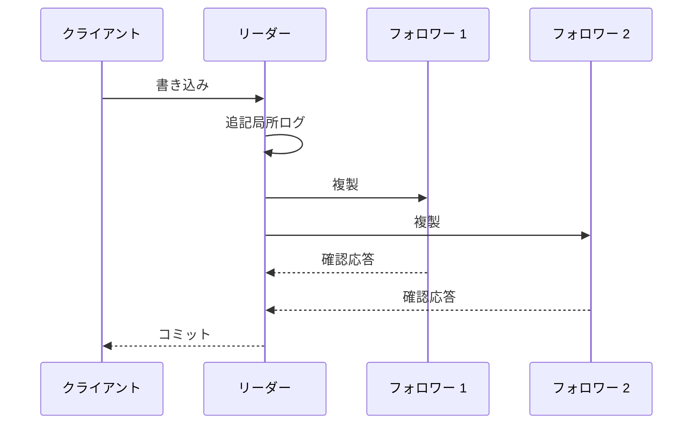
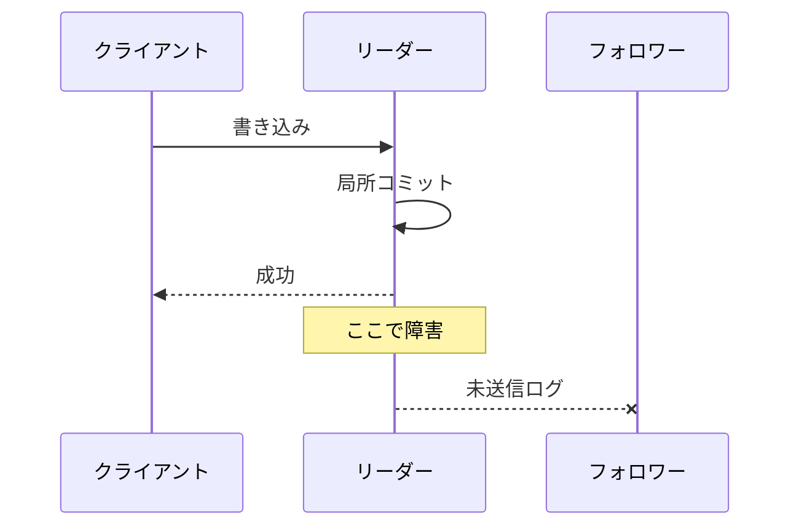
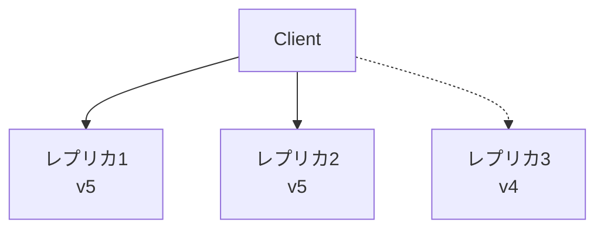

レプリケーションは同じ論理データの複製を複数ノードへ持つ仕組みです。可用性、永続性、読み取り処理量を改善できますが、複製間の遅延と不一致を新たに生みます。

「レプリカが3台ある」という構成情報だけでは保証は分かりません。書き込みを何台が確認したらコミットとするか、読み取りをどこへ送るか、ネットワーク分断時にどちら側を正とするかを定義する必要があります。

## この章で答える問い

- レプリケーションは可用性、永続性、読み取りの負荷分散をどこまで改善するのか
- 同期/非同期レプリケーションでコミットの意味はどう変わるのか
- レプリカ遅延と書き込み後の読み取り保証異常をどう扱うのか
- 線形化可能性、直列化可能性、結果整合性は何が違うのか
- クォーラムのR + W > Nは、どの前提で機能するのか
- CAPとPACELCは何を選択させるのか

## レプリケーションの目的

### 可用性

一つのノードが停止しても別複製でサービスを継続します。ただし自動フェイルオーバー、リーダー選挙、クライアント振り分けが必要です。

### 永続性

別障害領域へ複製を置けば、機器やディスク喪失に耐えられます。同じラック・リージョンだけに置くと、共通障害へ弱いままです。

### 読み取りの負荷分散

読み取り専用クエリをレプリカへ分散できます。ただし遅延したレプリカから古い値を読む可能性があります。強い読み取り整合性が必要ならリーダーやクォーラム読み取りへ戻り、拡張効果が減ります。

### 地理的局所性

利用者に近いリージョンのレプリカから読み取りし遅延時間を下げます。リージョン間書き込みの同期は光速とネットワーク遅延時間の制約を受けます。

レプリケーションはバックアップの代替ではありません。誤削除、スキーマ不具合、破損も複製され得ます。

## 物理と論理レプリケーション

### 物理レプリケーション

WAL/ページ変更などストレージエンジンの物理変更を転送します。

利点：

- リーダーと同じ物理状態を効率よく再現
- 全データベースを高処理量で複製しやすい

制約：

- エンジン/バージョン/基盤への依存が強い
- 表単位の変換・絞り込みが難しい

### 論理レプリケーション

挿入/UPDATE/削除など論理変更を行/表単位で転送します。

利点：

- 一部表の選択
- バージョン移行
- スキーマ変換や異種コンシューマー
- CDCへの利用

制約：

- DDL、連番、大規模トランザクションなどを別途扱う
- 適用競合と順序付け
- 行自動採番が必要

文単位レプリケーションは同じSQLを再実行しますが、非決定論的関数、トリガー、環境差で結果がずれる可能性があります。行単位/論理変更は結果を送る代わりにログ量が増えます。

## リーダー／フォロワー

一つのリーダーが書き込みを受け、レプリケーションログをフォロワー群へ送ります。



利点：

- 書き込み注文をリーダーで一本化
- 競合解決が比較的単純
- フォロワーを読み取り/待機系へ使える

課題：

- リーダーが書き込みボトルネック
- リーダー 障害時の選出
- 遅延したフォロワーの昇格によるデータ損失
- スプリットブレイン防止

## 同期レプリケーション

リーダーがクライアントへコミットを返す前に、指定レプリカの確認応答を待ちます。

```text
コミット遅延時間
≈ リーダーでのローカル永続化
+ 同期レプリカ往復通信
+ レプリカ永続性方針
```

利点：

- 確認応答したレプリカが残ればコミット済みデータを失いにくい
- フェイルオーバー時のRPOを小さくできる

欠点：

- ネットワーク/レプリカ遅延時間が書き込み遅延時間へ加わる
- 必要レプリカが利用不能なら書き込み停止
- 低速レプリカが裾の遅延時間を上げる

「同期」の確認応答がメモリ受信、OS書き込み、fsync、適用完了のどこを意味するか確認します。

## 非同期レプリケーション

リーダーは局所コミット後、レプリカの確認応答を待たずにクライアントへ返します。



利点：

- 書き込み遅延時間が低い
- レプリカ障害時もリーダーが進行しやすい

欠点：

- コミット済みでもレプリカ未到達データをフェイルオーバーで失い得る
- 読み取りレプリカが古い
- 遅延が無制限に広がる可能性

### 準同期

少なくとも1台への受信確認応答を待つなど、中間の保証を取ります。適用/fsyncまで待つかで意味が変わります。

## レプリカ遅延

遅延はリーダー ログ位置とレプリカ受信/再生位置の差です。

原因：

- ネットワーク帯域幅/遅延時間
- レプリカCPU/I/O不足
- 大規模トランザクション
- 長時間クエリとの競合
- 単一スレッド適用
- DDL/インデックス構築
- 書き込みの急増

遅延を「秒」だけでなく、バイト/LSN差、受信遅延、書き出し遅延、再生遅延へ分けると原因を特定しやすくなります。

## 読み取り整合性

### 書き込み後の読み取り保証

利用者がプロフィールを更新した直後、遅延したレプリカから古いプロフィールを読む問題です。

対策：

- 一定時間リーダーへ読み取りを固定する
- 書き込みトークン/LSNをクライアントへ返し、その位置まで追いついたレプリカを選ぶ
- セッション内読み取りをリーダーへ送る
- 同期適用を待つ

### 単調読み取り

一度新しい値を読んだ利用者が、次のリクエストで古いレプリカへ当たり過去へ戻らない保証です。

対策：

- セッションを同じレプリカへ振り分け
- 最後に読んだバージョン以上のレプリカを選ぶ

### 一貫した接頭辞

因果的に順序づいた書き込みを順序どおり観測します。

```text
1. 注文作成
2. 支払いの売上確定

支払いだけ先に見えないこと
```

パーティションごとに別ログを持つシステムでは、異なるキー間の順序を自動保証しない場合があります。

## 整合性モデル

### 線形化可能性

各操作がリクエストと応答の間の一点で瞬時に起きたように見え、実時間順序を守ります。

書き込み完了後に開始した読み取りは、その書き込みかそれ以降を返す必要があります。

単一オブジェクト/レジスターに対する強い保証として理解できます。

### 直列化可能性

複数トランザクションの結果が何らかの直列注文と同等である保証です。実時間順序を必ず守るとは限りません。

### 厳格直列化可能性

直列化可能性に実時間順序を加えます。トランザクション全体の線形化可能な振る舞いに近い強い保証です。

```text
線形化可能性: 操作/オブジェクトの実時間整合性
直列化可能性: トランザクション間の分離性
厳格な直列化可能性: 直列化可能性 + 実時間順序
```

二つは同じ「強い整合性」という語で混同されがちですが、解く問題が異なります。

### 結果整合性

新しい書き込みが止まれば、最終的にレプリカが収束する保証です。「いつ収束するか」「途中で何を読めるか」は別途定義が必要です。

セッション保証や競合解決を追加しない結果整合性は、アプリケーションへ大きな複雑性を渡します。

### 因果整合性

因果関係のある操作順を全クライアントが守ります。無関係な並行する操作は異なる順に見えても構いません。

コメントへの返信が元のコメントより先に見えない、といった性質を守ります。バージョンベクトル、論理時計、依存関係メタデータなどを使えます。

## 複数リーダー レプリケーション

複数リーダーが書き込みを受け、リーダー間で複製します。複数リージョンで局所書き込み遅延時間を下げられますが、同じデータへの並行する書き込みが競合します。

競合解決：

- 最終書き込み優先
- バージョンベクトルで並行するを検出
- フィールド単位のマージ
- CRDT
- 利用者/アプリケーション解決

最終書き込み優先は単純ですが、時計ずれやネットワーク遅延で正しい業務注文を表せず、データを黙って失う可能性があります。

書き込みをリージョン/利用者/キーへパーティションし、一つのキーは一リーダーだけが所有者になる設計で競合を減らせます。

## リーダーレスレプリケーション

クライアント/調整役が複数レプリカへ書き込みし、複数から読み取りします。

Nレプリカ中、W台の書き込み確認応答、R台の読み取り応答を要求するクォーラムを考えます。

```text
N = 3
W = 2
R = 2

R + W = 4 > N
```

読み取り集合と書き込み集合が少なくとも1レプリカで重なることを期待します。



## クォーラムの前提と限界

R + W > Nだけで線形化可能性が自動的に得られるわけではありません。

必要な検討：

- 読み取りが全応答から最新バージョンを判定できる
- バージョン注文が正しく比較できる
- 書き込み同士の重なり/競合
- 緩いクォーラムで本来のレプリカ集合外へ書き込みしていないか
- 並行する読み取り/書き込み
- 失敗書き込みが一部レプリカへ残る
- 時計基準LWWの偏り

強い整合性には通常、合意/主系、読み取り時修復だけでなく、書き込み注文とコミット規則が必要です。

## 読み取り時修復とヒント付き引き渡し

### 読み取り時修復

読み取り時にレプリカバージョンを比較し、古いレプリカへ新しい値を書き戻します。読み取り通信量があるキーは収束しやすくなります。

### 不整合の定期修復

バックグラウンドでMerkle木などを比較し、不一致範囲を修復します。読み取りされないキーも収束させます。

### ヒント付き引き渡し

対象レプリカが停止中、別ノードが一時的に書き込みを保持し、復帰後に渡します。可用性を上げますが、緩いクォーラムと整合性意味論を複雑にします。

## フェイルオーバー

リーダー 障害時：

1. 障害を検出する
2. 候補フォロワーのログ新しさを比較する
3. 一つを新しいリーダーへ昇格する
4. クライアント振り分けを変更する
5. 古いリーダー復帰時にフォロワーへ戻し、分岐したログを処理する

障害検出器は完全ではありません。ノードが停止したのかネットワークだけ切れたのか区別できません。

### スプリットブレイン

古い/新しいリーダーが同時に書き込みを受ける状態です。

対策：

- 過半数合意
- リースとフェンシングトークン
- 共有ストレージフェンシング
- 古いリーダーの書き込み権限を失効

「仮想IPを移した」だけでは、古いリーダーがバックグラウンドジョブや直接クライアントから書き込みを受け続ける可能性があります。

## CAP

ネットワーク分断が起きたとき、次の両方を常に満たせないという問題です。

- **整合性**：ここでは線形化可能レジスターに近い一貫した応答
- **可用性**：パーティションしていない各ノードへのリクエストが応答を返す

パーティション許容は分散システムでは選択肢というより前提です。パーティション時に：

- CP：一部リクエストを拒否/待機して整合性を守る
- AP：各パーティションで応答し、後で競合/収束を扱う

システム全体を一語でCP/APと呼ぶより、操作ごとの方式を見るべきです。読み取りは古いで応答し書き込みは過半数必須、という組み合わせもあります。

## PACELC

パーティションがない通常時でも、整合性を強めるため遠隔レプリカを待つと遅延時間が増えます。

```text
パーティション発生時:
  可用性対整合性
それ以外:
  遅延時間対整合性
```

リージョン間同期レプリケーションは整合性/永続性を高め、通常運用の書き込み遅延時間を増やします。

## 設計例

### 決済台帳

- 強い／厳格な直列化可能トランザクション
- 同期的に永続化するレプリカ群
- リーダー/合意読み取り
- 可用性低下を受け入れて二重決済を防ぐ

### 商品カタログ

- リーダー 書き込み、非同期読み取りレプリカ群
- 古い読み取りを秒単位で許容
- 管理者による更新後だけリーダー 読み取り

### 「いいね」の件数

- 各レプリカの増分をマージ
- 結果整合性
- 厳密なリアルタイム件数より可用性/遅延時間優先

同じサービス内でもデータ種別で整合性要件は異なります。

## よくある誤解

### 「レプリカを増やせば書き込み処理量も増える」

単一リーダーでは書き込みはリーダーへ集中し、レプリカ送信分の処理も増えます。読み取りの負荷分散とは別です。

### 「R + W > Nなら強い整合性」

バージョン注文、並行する操作、緩いクォーラム、失敗書き込みなど追加条件があります。

### 「結果整合性は一定秒後に必ず一致する」

結果整合的なは新しい書き込みが止まった場合の収束です。制限付き古さではありません。

## まとめ

- レプリケーションは可用性、永続性、読み取りの負荷分散を改善するが、遅延と競合を生む
- 同期レプリケーションはレプリカ確認応答をコミット遅延時間へ含め、非同期はデータ損失の時間幅を持つ
- 書き込み後の読み取り保証、単調読み取り、一貫した接頭辞はセッションから見える重要な保証である
- 線形化可能性は実時間操作順序、直列化可能性はトランザクション分離性を扱う
- 結果整合性だけでは中間状態と収束時間を説明し切れない
- クォーラムは共通部分を作るが、R + W > Nだけで線形化可能性は保証されない
- フェイルオーバーにはリーダー 新しさ、振り分け、フェンシング、スプリットブレイン防止が必要
- CAPはパーティション時、PACELCは通常時遅延時間も含むトレードオフを示す

## 確認問題

1. 同期レプリケーションの確認応答が受信、書き出し、適用のどこかで保証が変わる理由を説明してください。
2. 書き込み後の読み取り保証をレプリカ振り分けで守る方法を二つ挙げてください。
3. 線形化可能性と直列化可能性の違いを説明してください。
4. R + W > Nでも古い値を返し得る条件を挙げてください。
5. 商品カタログと決済台帳で異なる整合性を選ぶ理由は何ですか。

## 参考資料

- [PostgreSQL Documentation: Warm Standby and Streaming Replication](https://www.postgresql.org/docs/current/warm-standby.html)
- [PostgreSQL Documentation: Synchronous Replication](https://www.postgresql.org/docs/current/warm-standby.html#SYNCHRONOUS-REPLICATION)
- [Seth Gilbert and Nancy Lynch, “Brewer’s Conjecture and the Feasibility of Consistent, Available, Partition-Tolerant Web Services”](https://doi.org/10.1145/564585.564601)
- [Giuseppe DeCandia et al., “Dynamo: Amazon’s Highly Available Key-value Store”](https://doi.org/10.1145/1294261.1294281)

次章では、障害とパーティションがある中で一つのリーダーと複製ログ順序へ合意するRaftを扱います。
