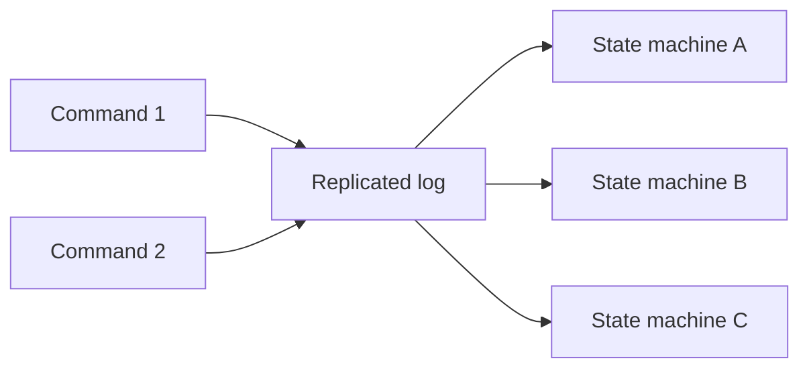
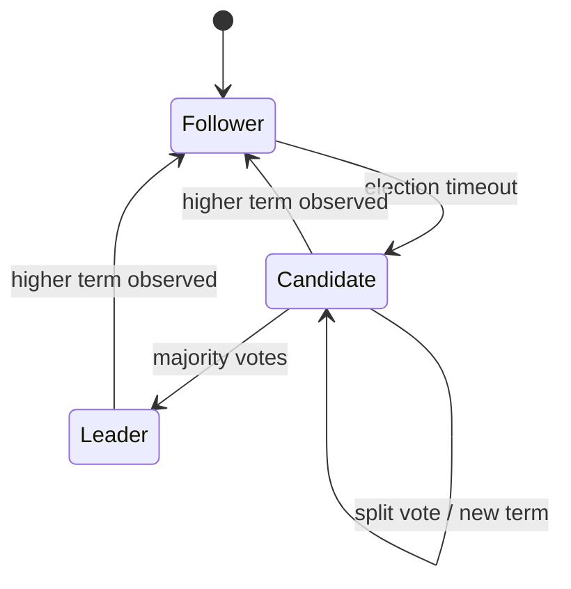
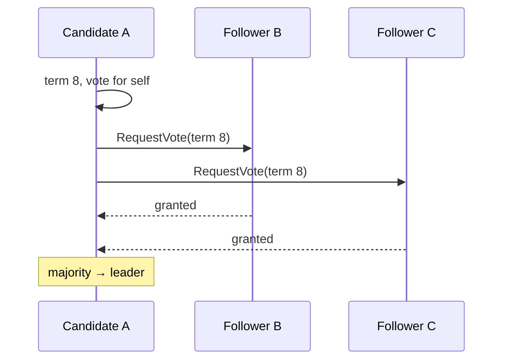
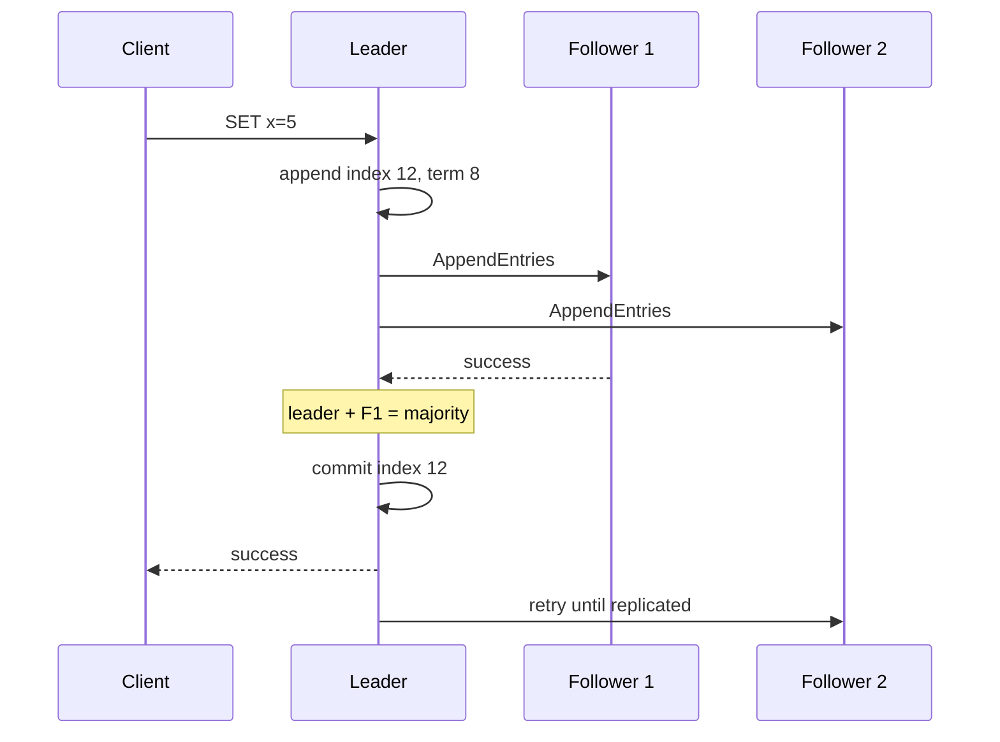
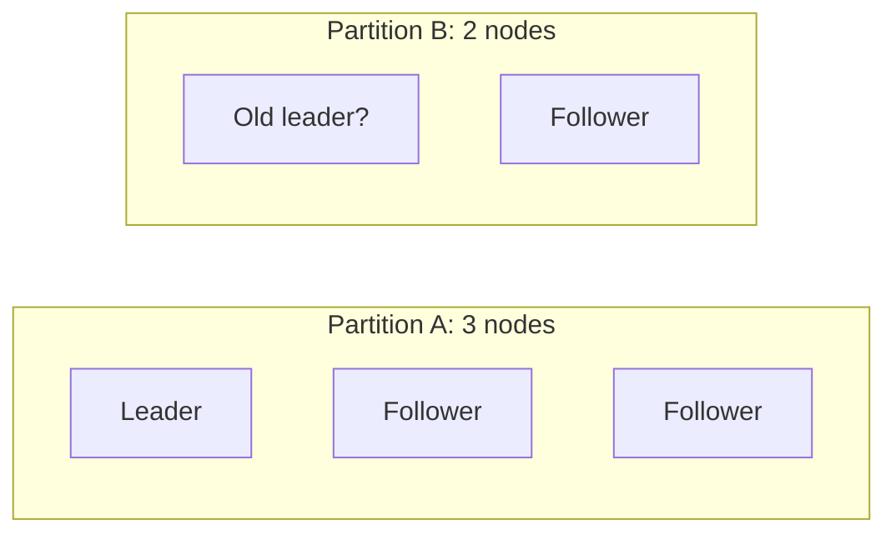
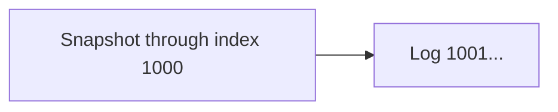

Nodeが停止しnetwork messageが遅延・重複・順序変更する環境で、複数nodeが「次に適用するoperation」へ合意する必要があります。Consensusは、単にdataのcopyを送ることではなく、どの値をどの順序で確定したかを共有する問題です。

Raftはconsensusをleader election、log replication、safetyへ分解して理解しやすくしたalgorithmです。

## この章で答える問い

- Replicationとconsensusは何が違うのか
- Safetyとlivenessはどのような性質か
- Raftのterm、follower、candidate、leaderは何を表すのか
- Leaderはいつlog entryをcommittedと判断できるのか
- 古いleaderが復帰したとき、divergent logをどう修復するのか
- Majorityは何node failureまで許容するのか

## consensus problem

Consensus algorithmは複数participantが一つのvalue/decisionへ合意することを目指します。

典型的な性質：

- **Agreement**：正しいnodeは異なる値を決定しない
- **Validity**：決定値は提案された値に由来する
- **Integrity**：一度だけ決定する
- **Termination**：十分な条件下で最終的に決定する

Asynchronous networkとcrash failureの下では、message遅延とnode failureを完全に区別できません。FLP resultが示すように、完全非同期systemではdeterministic consensusのterminationをすべてのexecutionで保証できません。実用algorithmはtimeoutやpartial synchronyを仮定して進行します。

## safetyとliveness

- **Safety**：「悪いことが起きない」。二つの異なるlog entryを同じ位置でcommitしない
- **Liveness**：「良いことがいつか起きる」。requestが十分なnetwork安定時にcommitする

Safetyはnetworkが不安定でも壊してはいけません。Livenessはpartition中に失っても、majorityが通信可能になれば回復できます。

## state machine replication

同じdeterministic state machineへ同じcommandを同じ順序で適用すれば、同じstateになります。



Consensusが合意する中心は、各commandのlog positionと内容です。各nodeはcommitted prefixを順にapplyします。

Random、current time、external API resultなどnon-deterministicな値は、leaderが結果をcommandへ含めるなどして同じinputにします。

## Raft server state

各serverは次のroleの一つです。

- **Follower**：leaderからlog/heartbeatを受ける
- **Candidate**：electionを開始してvoteを集める
- **Leader**：client commandを受け、logをfollowersへ複製する

時間はtermという連続した番号へ分かれます。Termはlogical clockとしてleader generationを表します。



各termには高々一人のleaderしか選ばれないようvote ruleを設計します。

## persistent state

Raft serverはcrash/restart後も次を保持します。

- currentTerm
- votedFor
- log entries

Memoryだけに置くと、再起動後に同じtermで複数candidateへvoteしたり、accepted logを忘れたりしてsafetyを壊します。

Volatile stateにはcommitIndex、lastAppliedなどがあります。Leaderは各followerのnextIndex、matchIndexも追跡します。

## leader election

Followerはrandomized election timeout内にleader heartbeatを受けなければcandidateになります。

1. currentTermをincrement
2. 自分へvote
3. 他serverへRequestVote
4. Majority voteを得たらleader
5. Higher termを見たらfollowerへ戻る



Random timeoutにより、全serverが同時candidateになるsplit voteを減らします。

## vote ruleとlog freshness

Followerは通常、同じtermで高々一candidateへvoteし、candidateのlogが自分と同等以上にup-to-dateな場合だけvoteします。

Freshnessはlast log termを優先し、同じならlast log indexを比較します。

```text
candidate log is up-to-date if:
  candidate.lastTerm > receiver.lastTerm
  OR
  same lastTerm AND candidate.lastIndex >= receiver.lastIndex
```

これにより、committed entryを持たないcandidateがleaderになることを防ぎ、Leader Completenessへつなげます。

## AppendEntries

Leaderはclient commandをlocal logへappendし、AppendEntries RPCでfollowersへ送ります。HeartbeatもentryなしAppendEntriesです。

RPCは概念的に次を含みます。

- leader term
- prevLogIndex
- prevLogTerm
- new entries
- leaderCommit

Followerはprev位置のtermが一致する場合に新entryを受け入れます。一致しなければrejectし、leaderはnextIndexを戻して共通prefixを探します。



## log matching property

二つのlogが同じindexとtermのentryを持つなら：

1. そのentryのcommandも同じ
2. それ以前の全entryも同じ

LeaderがprevLogIndex/prevLogTerm一致を要求することで維持します。

Followerのconflicting suffixはleaderのlogに合わせて削除されます。

## commit rule

Leaderは現在termのentryがmajorityに保存されたとき、そのentryをcommitできます。Commit indexまでのprefixをstate machineへapplyします。

なぜ「任意の過去term entryがmajorityにある」だけでは直接commitしないのでしょうか。古いtermのentryは特殊なelection/log配置で別leaderに上書きされる可能性を排除できないためです。

Current term entryをmajorityへ複製してcommitすると、それ以前のentryも間接的にcommittedになります。

```text
term 7: index 10, 11
term 8: index 12 replicated to majority

→ index 12 commit
→ prefix 1..12 commit
```

このruleはRaft safetyの重要な細部です。

## majorityとfailure tolerance

N nodeのmajorityはfloor(N/2)+1です。

| Nodes | Majority | 同時crashを許容 |
| --- | --- | --- |
| 1 | 1 | 0 |
| 3 | 2 | 1 |
| 5 | 3 | 2 |
| 7 | 4 | 3 |

一般に2f+1 nodeでf crash failureを許容します。

4 nodeのmajorityは3で、許容failureは1です。3 nodeと同じfailure toleranceなのに必要ackが増えるため、通常odd numberを使います。

## network partition

5 nodeが3対2へpartitionした場合、3側はmajorityを作りleaderを選んで進行できます。2側のold leaderはmajorityへ複製できず、新entryをcommitできません。



Minority側がclientへ未commit write成功を返してはいけません。Timeout後に失敗させるか待たせます。

## old leaderの復帰

Partition中のold leaderが未commit entryを持って復帰することがあります。

New leaderはhigher termです。Old leaderはhigher term AppendEntriesを見てfollowerへ戻ります。Log matchingによりconflicting suffixを削除し、leader logへ合わせます。

Clientはresponseを受け取れなかったwriteがcommitしたか分からないためretryします。Commandにclient IDとsequence/idempotency keyを含め、state machine側でduplicateを除去する必要があります。

Consensusはclient retryのexactly-once semanticsを自動提供しません。

## linearizable read

Leaderがlocal stateを読むだけでは、network partitionで既にnew leaderが選ばれているのに自分をleaderと思っている可能性があります。

Linearizable readの方法：

- ReadIndex：current leaderであることをmajority communicationで確認
- Current termのentryをcommitしてleadershipを確立
- Lease read：bounded clock driftとlease条件を仮定
- Readをlogへ載せる

Leaseはlatencyを下げますが、clock assumptionとfencingが必要です。

Follower readは通常staleです。Followerがleader commit indexへ追いついても、read開始時点のlatest commitを知るため追加protocolが必要です。

## snapshotとlog compaction

Logを永久に保持するとstorageとrecovery timeが増えます。State machineのsnapshotを作り、それ以前のlog prefixをdiscardできます。

Lagging followerが古すぎる場合、leaderはInstallSnapshotでstateを転送します。



Snapshotにはlast included index/termを記録し、後続logとの連続性を保ちます。

## membership change

Cluster memberを一度に入れ替えると、old/new configurationが異なるmajorityを作り、二leaderが生まれる可能性があります。

Joint consensusではtransition中にold/new両configurationのmajorityを要求し、安全に切り替えます。

実装によってsingle-server changeなど簡略化したprotocolを使いますが、member変更自体もconsensus対象です。

## consensusが解かないもの

Raftが提供する中心はordered replicated logです。次を自動では解きません。

- SQL transaction isolation
- 複数Raft group間のatomicity
- Shard key
- Secondary index
- Backup/PITR
- Client request deduplication
- State machine bug
- Byzantine behavior

Distributed DBはRaft groupごとにreplicationし、上位でtransaction、sharding、query executionを構築します。

## Raftと2PCの違い

| Raft | 2PC |
| --- | --- |
| 一つのreplicated state machineでlog orderへ合意 | 複数participantのtransaction commit/abortを決める |
| Majority failure tolerance | Coordinator/participantのprepare state |
| Leader electionを含む | Coordinator recoveryが必要 |
| 同じdataのreplica間 | 異なるresource/shard間 |

2PCのdecisionをRaftでreplicateすることはできますが、問題は別です。

## よくある誤解

### 「Raftはleader election algorithmである」

Electionは一部です。Log matching、commit rule、leader completenessによってreplicated logのsafetyを保証します。

### 「majorityへ送信したらcommitである」

Current term entryのcommit rule、durable保存、match indexが必要です。単なるpacket送信ではありません。

### 「leaderからreadすればlinearizable」

Stale leaderの可能性をmajority/leaseで排除する必要があります。

## まとめ

- Consensusはfailure下で一つのdecision/log orderへ合意する問題である
- State machine replicationは同じcommand sequenceから同じstateを作る
- Raftはtermとfollower/candidate/leader roleを持つ
- RequestVoteはtermごとの一票とlog freshnessでleader completenessを守る
- AppendEntriesはprev index/termでlog matchingを確認する
- Leaderはcurrent term entryがmajorityへ複製されたときcommitを進める
- 2f+1 nodeでf crash failureを許容する
- Minority partitionはsafetyのためwrite progressを失う
- Linearizable readにはstale leader排除が必要
- Raftはtransaction、sharding、backup、client deduplicationを自動では解かない

## 確認問題

1. Safetyとlivenessの違いをRaftの例で説明してください。
2. Vote時にcandidate log freshnessを確認する理由は何ですか。
3. Raftがcurrent term entryをmajorityへ複製してcommitするruleを説明してください。
4. 5 node clusterが2対3へpartitionした場合、どちらが進行できますか。
5. Leader local readだけではlinearizableにならない理由を説明してください。

## 参考資料

- [Diego Ongaro and John Ousterhout, “In Search of an Understandable Consensus Algorithm”](https://raft.github.io/raft.pdf)
- [Raft Website and Visualization](https://raft.github.io/)
- [Heidi Howard et al., “Raft Refloated”](https://doi.org/10.1145/3127479.3128609)

次章では、dataとloadを複数Raft group/nodeへ分割するpartitioningとshardingを扱います。
