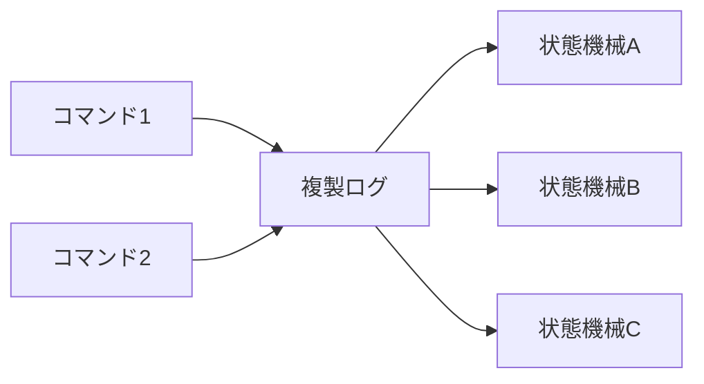
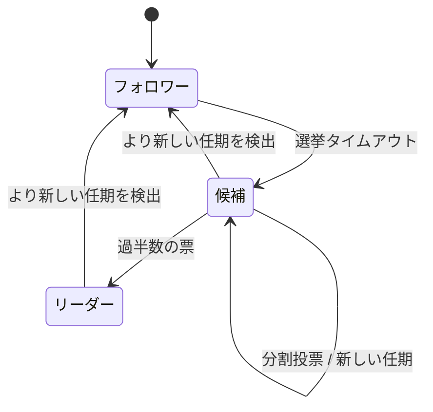
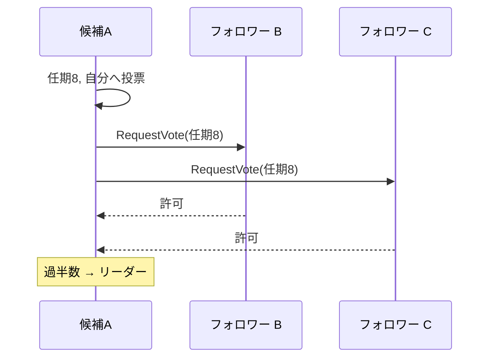
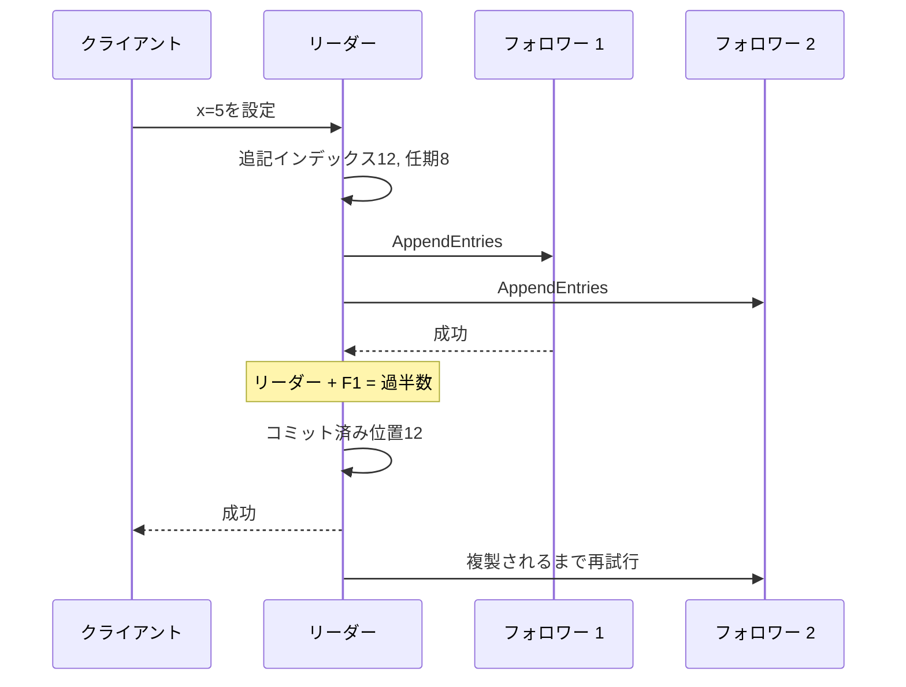
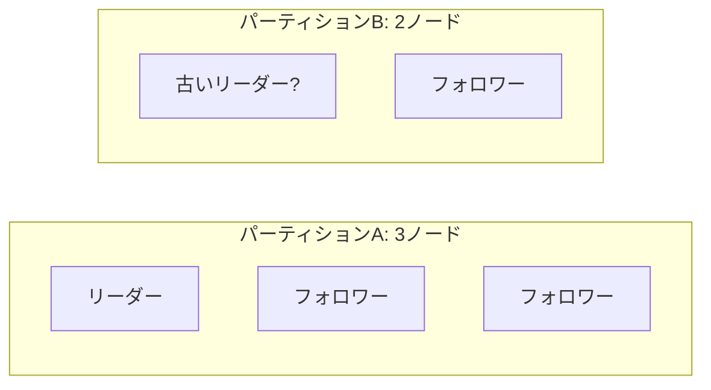
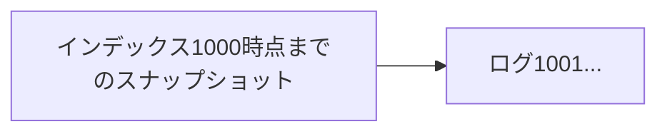

ノードが停止しネットワークメッセージが遅延・重複・順序変更する環境で、複数ノードが「次に適用する操作」へ合意する必要があります。合意は、単にデータの複製を送ることではなく、どの値をどの順序で確定したかを共有する問題です。

Raftは合意をリーダー選挙、ログレプリケーション、安全性へ分解して理解しやすくしたアルゴリズムです。

## この章で答える問い

- レプリケーションと合意は何が違うのか
- 安全性と活性はどのような性質か
- Raftの任期、フォロワー、候補、リーダーは何を表すのか
- リーダーはいつログ項目をコミット済みと判断できるのか
- 古いリーダーが復帰したとき、分岐したログをどう修復するのか
- 過半数は何ノード障害まで許容するのか

## 合意問題

合意アルゴリズムは複数参加者が一つの値/決定へ合意することを目指します。

典型的な性質：

- **一致性**：正しいノードは異なる値を決定しない
- **妥当性**：決定値は提案された値に由来する
- **完全性**：一度だけ決定する
- **終了性**：十分な条件下で最終的に決定する

非同期ネットワークとクラッシュ障害の下では、メッセージ遅延とノード障害を完全に区別できません。FLP結果が示すように、完全非同期システムでは決定論的合意の終了性をすべての実行で保証できません。実用アルゴリズムはタイムアウトや部分同期を仮定して進行します。

## 安全性と活性

- **安全性**：「悪いことが起きない」。二つの異なるログ項目を同じ位置でコミットしない
- **活性**：「良いことがいつか起きる」。リクエストが十分なネットワーク安定時にコミットする

安全性はネットワークが不安定でも壊してはいけません。活性はパーティション中に失っても、過半数が通信可能になれば回復できます。

## 状態機械レプリケーション

同じ決定論的状態機械へ同じコマンドを同じ順序で適用すれば、同じ状態になります。



合意が合意する中心は、各コマンドのログ位置と内容です。各ノードはコミット済み接頭辞を順に適用します。

ランダム、現在の時間、外部API結果など非決定論的な値は、リーダーが結果をコマンドへ含めるなどして同じ入力にします。

## Raftサーバー状態

各サーバーは次のロールの一つです。

- **フォロワー**：リーダーからログ/ハートビートを受ける
- **候補**：選挙を開始して投票を集める
- **リーダー**：クライアントコマンドを受け、ログをフォロワー群へ複製する

時間は任期という連続した番号へ分かれます。任期は論理時計としてリーダーの世代を表します。



各任期には高々一人のリーダーしか選ばれないよう投票規則を設計します。

## 永続状態

Raftサーバーはクラッシュ/再起動後も次を保持します。

- currentTerm
- votedFor
- ログ項目

メモリだけに置くと、再起動後に同じ任期で複数候補へ投票したり、受理済みログを忘れたりして安全性を壊します。

揮発性状態にはcommitIndex、lastAppliedなどがあります。リーダーは各フォロワーのnextIndex、matchIndexも追跡します。

## リーダー選挙

フォロワーはランダム化された選挙タイムアウト内にリーダー ハートビートを受けなければ候補になります。

1. currentTermを1増やす
2. 自分へ投票
3. 他サーバーへRequestVote
4. 過半数投票を得たらリーダー
5. より新しい任期を見たらフォロワーへ戻る



ランダムタイムアウトにより、全サーバーが同時候補になる分割投票を減らします。

## 投票規則とログ新しさ

フォロワーは通常、同じ任期で高々一候補へ投票し、候補のログが自分と同等以上に同等以上に新しいな場合だけ投票します。

新しさは最後のログ任期を優先し、同じなら最後のログインデックスを比較します。

```text
候補ログが同等以上に新しい条件:
  candidate.lastTerm > receiver.lastTerm
  OR
  lastTermが同じ、かつcandidate.lastIndex >= receiver.lastIndex
```

これにより、コミット済み項目を持たない候補がリーダーになることを防ぎ、リーダー完全性へつなげます。

## AppendEntries

リーダーはクライアントコマンドを局所ログへ追記し、AppendEntries RPCでフォロワー群へ送ります。ハートビートも項目なしAppendEntriesです。

RPCは概念的に次を含みます。

- リーダー 任期
- prevLogIndex
- prevLogTerm
- 新しい項目
- leaderCommit

フォロワーは直前位置の任期が一致する場合に新項目を受け入れます。一致しなければ拒否し、リーダーはnextIndexを戻して共通接頭辞を探します。



## ログ整合性性質

二つのログが同じインデックスと任期の項目を持つなら：

1. その項目のコマンドも同じ
2. それ以前の全項目も同じ

リーダーがprevLogIndex/prevLogTerm一致を要求することで維持します。

フォロワーの競合する末尾はリーダーのログに合わせて削除されます。

## コミット規則

リーダーは現在任期の項目が過半数に保存されたとき、その項目をコミットできます。コミット済み位置までの接頭辞を状態機械へ適用します。

なぜ「任意の過去任期項目が過半数にある」だけでは直接コミットしないのでしょうか。古い任期の項目は特殊な選挙/ログ配置で別リーダーに上書きされる可能性を排除できないためです。

現在の任期項目を過半数へ複製してコミットすると、それ以前の項目も間接的にコミット済みになります。

```text
任期7: インデックス10, 11
任期8: インデックス12過半数へ複製済み

→ インデックス12コミット
→ 接頭辞1..12コミット
```

この規則はRaft安全性の重要な細部です。

## 過半数と障害許容

Nノードの過半数は⌊N/2⌋+1です。

| ノード数 | 過半数 | 同時クラッシュを許容 |
| --- | --- | --- |
| 1 | 1 | 0 |
| 3 | 2 | 1 |
| 5 | 3 | 2 |
| 7 | 4 | 3 |

一般に2f+1ノードでfクラッシュ障害を許容します。

4ノードの過半数は3で、許容障害は1です。3ノードと同じ障害許容なのに必要確認応答が増えるため、通常は奇数を使います。

## ネットワーク分断

5ノードが3対2へパーティションした場合、3側は過半数を作りリーダーを選んで進行できます。2側の古いリーダーは過半数へ複製できず、新項目をコミットできません。



少数派側がクライアントへ未コミット書き込み成功を返してはいけません。タイムアウト後に失敗させるか待たせます。

## 古いリーダーの復帰

パーティション中の古いリーダーが未コミット項目を持って復帰することがあります。

新しいリーダーは、より新しい任期に属します。古いリーダーは、より新しい任期のAppendEntriesを受けるとフォロワーへ戻ります。ログ整合性により競合する末尾を削除し、リーダーのログへ合わせます。

クライアントは応答を受け取れなかった書き込みがコミットしたか分からないため再試行します。コマンドにクライアントIDと連番/冪等性キーを含め、状態機械側で重複を除去する必要があります。

合意はクライアント再試行の厳密に1回意味論を自動提供しません。

## 線形化可能読み取り

リーダーが局所状態を読むだけでは、ネットワーク分断で既に新しいリーダーが選ばれているのに自分をリーダーと思っている可能性があります。

線形化可能読み取りの方法：

- ReadIndex：現在のリーダーであることを過半数通信で確認
- 現在の任期の項目をコミットしてリーダーの地位を確立
- リース読み取り：制限付き時計のずれとリース条件を仮定
- 読み取りをログへ載せる

リースは遅延時間を下げますが、時計仮定とフェンシングが必要です。

フォロワー 読み取りは通常古いです。フォロワーがリーダー コミット済み位置へ追いついても、読み取り開始時点の最新コミットを知るため追加プロトコルが必要です。

## スナップショットとログコンパクション

ログを永久に保持するとストレージと復旧時間が増えます。状態機械のスナップショットを作り、それ以前のログ接頭辞を破棄できます。

遅延したフォロワーが古すぎる場合、リーダーはInstallSnapshotで状態を転送します。



スナップショットには最後の含まれる最終インデックス/任期を記録し、後続ログとの連続性を保ちます。

## 構成変更

クラスター メンバーを一度に入れ替えると、古い/新しい構成が異なる過半数を作り、二リーダーが生まれる可能性があります。

共同合意では遷移中に古い/新しい両構成の過半数を要求し、安全に切り替えます。

実装によって単一サーバー 変更など簡略化したプロトコルを使いますが、メンバー変更自体も合意対象です。

## 合意が解かないもの

Raftが提供する中心は順序付けられた複製ログです。次を自動では解きません。

- SQLトランザクション分離性
- 複数Raftグループ間の原子性
- シャードキー
- セカンダリインデックス
- バックアップ/PITR
- クライアントリクエスト重複排除
- 状態機械不具合
- ビザンチン障害

分散DBはRaftグループごとにレプリケーションし、上位でトランザクション、シャーディング、クエリ実行を構築します。

## Raftと2PCの違い

| Raft | 2PC |
| --- | --- |
| 一つの複製状態機械でログ順序へ合意 | 複数参加者のトランザクションコミット/中止を決める |
| 過半数障害許容 | 調整役/参加者の準備状態 |
| リーダー選挙を含む | 調整役復旧が必要 |
| 同じデータのレプリカ間 | 異なる資源/シャード間 |

2PCの決定をRaftで複製することはできますが、問題は別です。

## よくある誤解

### 「Raftはリーダー選挙アルゴリズムである」

選挙は一部です。ログ整合性、コミット規則、リーダー完全性によって複製ログの安全性を保証します。

### 「過半数へ送信したらコミットである」

現在の任期項目のコミット規則、永続保存、一致インデックスが必要です。単なるパケット送信ではありません。

### 「リーダーから読み取りすれば線形化可能」

古いリーダーの可能性を過半数/リースで排除する必要があります。

## まとめ

- 合意は障害下で一つの決定/ログ順序へ合意する問題である
- 状態機械レプリケーションは同じコマンド連番から同じ状態を作る
- Raftは任期と、フォロワー／候補／リーダーの役割を持つ
- RequestVoteは任期ごとの一票とログ新しさでリーダー完全性を守る
- AppendEntriesはprevインデックス/任期でログ整合性を確認する
- リーダーは現在の任期項目が過半数へ複製されたときコミットを進める
- 2f+1ノードでfクラッシュ障害を許容する
- 少数派パーティションは安全性のため書き込み進捗を失う
- 線形化可能読み取りには古いリーダー排除が必要
- Raftはトランザクション、シャーディング、バックアップ、クライアント重複排除を自動では解かない

## 確認問題

1. 安全性と活性の違いをRaftの例で説明してください。
2. 投票時に候補ログ新しさを確認する理由は何ですか。
3. Raftが現在の任期項目を過半数へ複製してコミットする規則を説明してください。
4. 5ノードクラスターが2対3へパーティションした場合、どちらが進行できますか。
5. リーダーのローカル読み取りだけでは線形化可能にならない理由を説明してください。

## 参考資料

- [Diego Ongaro and John Ousterhout, “In Search of an Understandable Consensus Algorithm”](https://raft.github.io/raft.pdf)
- [Raft Website and Visualization](https://raft.github.io/)
- [Heidi Howard et al., “Raft Refloated”](https://doi.org/10.1145/3127479.3128609)

次章では、データと負荷を複数Raftグループ/ノードへ分割する分割とシャーディングを扱います。
