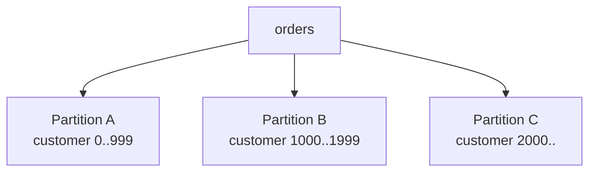
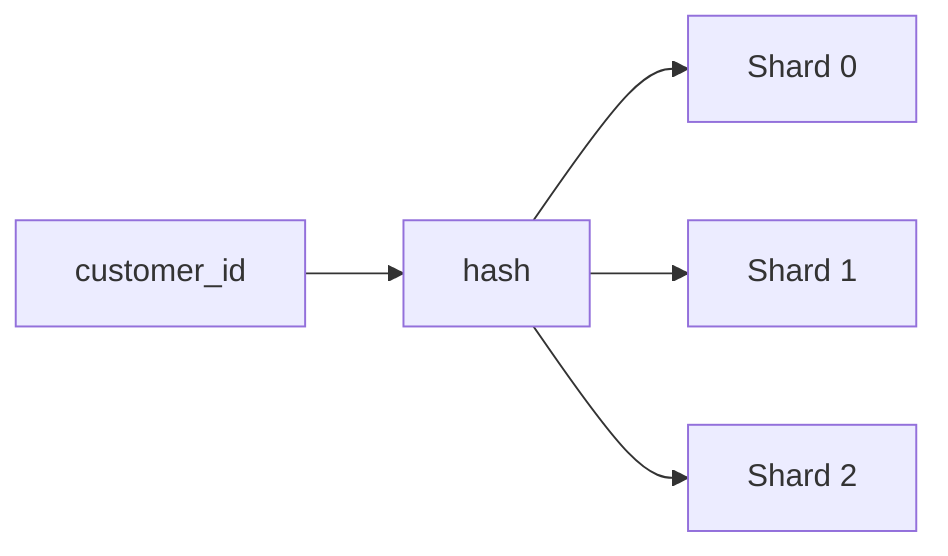
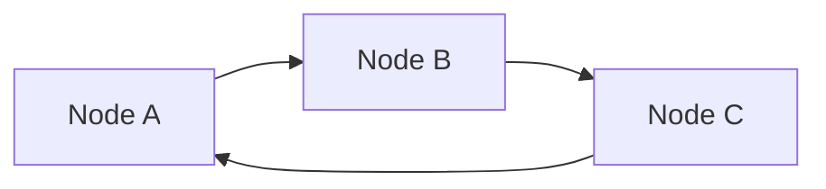
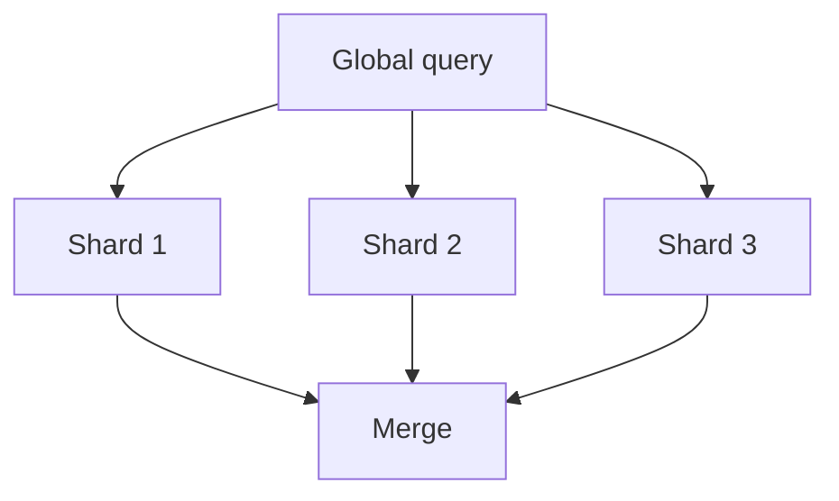
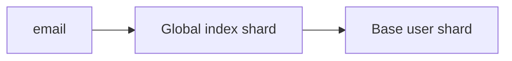
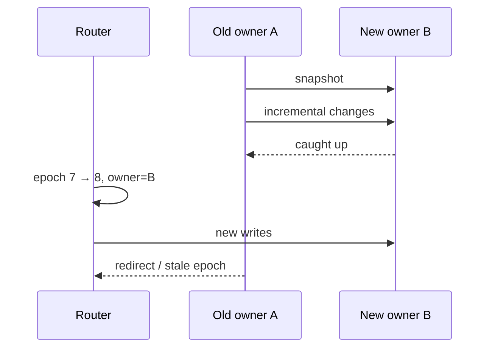
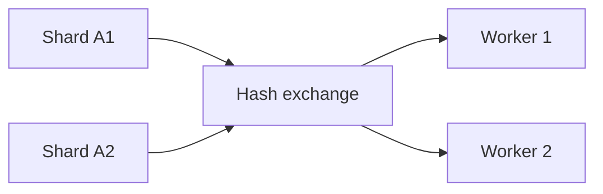

一つのnodeへdata、write throughput、read loadが収まらなくなると、dataを複数のpartitionへ分けます。分割により容量を増やせますが、request routing、cross-partition query、rebalancing、transactionという新しいcostが生まれます。

Shardingの難しさは「どう分けるか」より、「分けた後にqueryとdataが変化し続けること」です。

## この章で答える問い

- Horizontal/vertical partitioningは何を分けるのか
- Range/hash partitioningはquery localityとload balanceをどう交換するのか
- 良いshard keyはどのような性質を持つのか
- Global secondary indexはwriteとconsistencyをどう複雑にするのか
- Hot partitionとdata skewをどう検出・緩和するのか
- Online resharding中のread/writeをどう正しくrouteするのか

## partitioningとsharding

用語は製品によって異なります。本書では：

- **Partitioning**：一つのlogical table/data setを複数部分へ分割する一般概念
- **Sharding**：partitionを複数node/failure domainへ配置するhorizontal partitioning

一つのDB instance内のtable partitionも、複数nodeのshardも、keyから対象partitionを決める点は共通します。ただしshardingではnetwork、partial failure、distributed transactionが加わります。

## horizontal partitioning

Rowをpartition keyで分けます。



各partitionは同じcolumn schemaを持ち、row集合が異なります。

利点：

- Data容量とwriteを分散
- Partition pruning
- Old partitionのarchive/drop
- Maintenance単位を小さくする

課題：

- Cross-partition query
- Skew
- Partition metadata
- Rebalancing

## vertical partitioning

Column groupまたは機能単位で分けます。

```text
users_core(id, email, name)
users_profile(id, bio, avatar_blob, preferences)
```

頻繁に読むsmall columnとlarge/cold columnを分け、row幅とI/Oを減らせます。別service/DBへ分ける場合はjoinとtransactionを失い、applicationで統合するcostが増えます。

Normalizationによるtable分割と似ていますが、vertical partitioningはaccess patternや物理配置を主目的にする場合があります。

## range partitioning

Keyの連続範囲をpartitionへ割り当てます。

```text
P1: 2026-01-01 <= ordered_at < 2026-02-01
P2: 2026-02-01 <= ordered_at < 2026-03-01
P3: 2026-03-01 <= ordered_at < 2026-04-01
```

利点：

- Range queryが少数partitionへ局所化
- 時系列dataのdrop/archive
- Sorted locality
- Split境界を理解しやすい

欠点：

- Monotonic keyで最新partitionへwrite集中
- Range sizeとloadが不均等
- Hot key range
- Boundary管理

Time seriesではwrite hotspotを許容しつつ、bucket内をhash subpartitionする方法があります。

## hash partitioning

Hash(key) mod Nなどでpartitionを選びます。



利点：

- Uniform keyならloadを分散しやすい
- Point lookupのroutingが明確
- Monotonic keyのwriteを分散

欠点：

- Range localityを失う
- Partition数変更で多くのkeyが移動
- Hot key一つは分散できない
- Hash前のkey distributionとrequest distributionは別

Uniform row数でも、有名customerへtrafficが集中すればhot shardになります。

## consistent hashing

単純hash mod NではN変更時に多くのkeyの割り当てが変わります。Consistent hashingはnodeとkeyをring上へ配置し、node追加・削除時の移動範囲を限定します。



Virtual node/tokenを各physical nodeへ複数割り当てると：

- Loadを細かく分散
- Heterogeneous capacityに比例配分
- 移動単位を小さくする

ただしvirtual node数が多いほどmetadataとreplica placementが複雑になります。

Modern distributed DBではrange partitionを自動splitし、placement managerがrangeをnodeへ割り当てる方式もあります。Consistent hashingだけがrebalancing解ではありません。

## list partitioning

明示値集合で分けます。

```text
JP, KR → Asia-East partition
US, CA → North-America partition
DE, FR → Europe partition
```

Data residencyやregion routingを表現しやすい一方、地域間load差、未分類値、region変更を扱います。

## shard key

Shard keyはdata placementとrequest routingを決める最重要設計です。

良い性質：

- Cardinalityが十分高い
- Write/read loadが均等
- 主要queryがkeyを指定する
- Co-locateしたいdataで共有できる
- 値が安定して変更されにくい
- Tenant isolation/region要件に合う

### customer_idで注文を分ける

```text
shard = hash(customer_id)
```

顧客別注文一覧と顧客単位transactionを一shardへ閉じ込められます。

弱点：

- 全顧客の時間range reportはscatter-gather
- Large customerがhotspot
- Customer IDを持たないaccess pathにglobal indexが必要

### ordered_atで分ける

時系列scanとarchiveに向きますが、最新rangeへwriteが集中し、顧客別履歴が複数partitionへ散ります。

「最もselectiveなcolumn」ではなく、transaction boundary、query locality、growth、hotspotを合わせて選びます。

## composite partitioning

Range + hashなどを組み合わせます。

```text
first: month(ordered_at)
then:  hash(customer_id) into 16 buckets
```

時間range pruningとwrite分散を両立できますが、partition数、metadata、small partitionを増やします。

## routing

### client-side routing

Client libraryがpartition mapを持ち、直接target nodeへ送ります。

- Hopが少ない
- Client更新とmetadata refreshが必要
- 多言語clientでlogicが分散

### proxy/coordinator routing

Gatewayがkeyからtargetを選びます。

- Clientが単純
- Proxyのlatency/bottleneck
- Metadataを中央管理しやすい

### redirect

任意nodeがrequestを受け、正しいownerへredirect/forwardします。Stale partition mapでも動けますが追加hopがあります。

Partition mapにはversion/epochを付け、古いrouterによる誤writeを防ぎます。

## partition pruning

Query predicateから不要partitionを除外します。

```sql
SELECT *
FROM orders
WHERE ordered_at >= DATE '2026-08-01'
  AND ordered_at <  DATE '2026-09-01';
```

ordered_at range partitionならAugust partitionだけ読めます。

Pruningを妨げる例：

- Partition keyへfunctionを適用
- Type/collation mismatch
- Runtimeまで値が不明
- OR条件
- Partition keyを含まないpredicate

Static pruningとruntime/dynamic pruningを持つoptimizerがあります。

## scatter-gather

Target shardを一つに絞れないqueryは全shardへ送ります。



Latencyは最も遅いshardに引きずられ、request fan-outがsystem loadを増幅します。

```text
100 API requests
× 100 shards
= 10,000 shard requests
```

ORDER BY + LIMITでは各shardからlocal top-Kを取り、coordinatorでmergeできます。GROUP BYではpartial aggregateをmergeします。

## co-location

関連dataを同じpartition keyで配置するとlocal join/transactionにできます。

```text
customers partitioned by customer_id
orders    partitioned by customer_id
payments  partitioned by customer_id
```

ただしproduct inventoryはproduct_idで分けたいかもしれません。一つのplacementで全access patternをlocalにできないため、duplicate/derived viewまたはdistributed operationが必要です。

## local secondary index

各shard内だけのsecondary indexです。Index entryとbase rowが同じshardにあり、writeをlocal transactionで更新できます。

Index keyだけでqueryすると全shardを検索する必要があります。

```sql
SELECT * FROM users WHERE email = 'a@example.com';
```

Usersがuser_id hash shardで、emailからshardが分からなければscatterです。

## global secondary index

全shardを横断するindexを別partitioned structureとして持ちます。



利点：

- Secondary keyからtarget shardを特定
- Global uniquenessを実現しやすい

課題：

- Base writeとindex writeが別shard
- Distributed transactionまたはasync propagation
- Stale index
- Index hotspot
- Repartition時の整合

Synchronous global indexはwrite latencyとavailabilityを犠牲にし、asynchronous indexはread-after-writeとdangling entryを扱います。

## global uniqueness

Emailなどを全shardでUNIQUEにするには：

- Emailでpartitionしたglobal index
- Central allocation service
- Deterministic owner shard
- Reservation protocol

各user shardでlocal UNIQUEを置くだけでは、別shardに同じemailを作れます。

## data skewとhotspot

### data skew

Row/byte数が特定partitionへ偏ります。

### load skew

Data量は均等でもrequestが偏ります。

### temporal hotspot

Campaignやcelebrity eventで一時的に特定keyがhotになります。

観測するもの：

- Partitionごとのrow/byte
- Read/write QPS
- CPU/I/O/network
- Queue/latency
- Compaction/replication lag
- Top keys/tenants

Average node使用率はhot partitionを隠します。

## hotspot対策

- Hot keyをsaltして複数bucketへ分ける
- Read cache/replica
- Write aggregation/batching
- Dedicated shard
- Tenant rate limit
- Adaptive repartition
- Key設計変更

Saltはwriteを分散しますが、readで複数bucketをmergeし、uniquenessやorderingを複雑にします。

Counterを16bucketへ分ける例：

```text
counter_id = post42#0 ... post42#15
total = SUM(all buckets)
```

Exact current valueを読むcostとeventual aggregationを受け入れます。

## splitとmerge

Range partitionが大きくなったらsplitします。

```text
[A, Z)
→ [A, M) + [M, Z)
```

Small partitionが増えすぎたらmergeします。Split/mergeはmetadata更新、replica作成、routing change、in-flight requestを調整します。

## online rebalancing

PartitionをNode AからBへ移動する流れの一例：

1. Bへsnapshotをcopy
2. Copy中のincremental logを転送
3. BがAへ追いつく
4. Ownership epochを変更
5. New requestをBへroute
6. Old Aへのrequestをredirect/reject
7. 安全確認後Aのcopyを削除



### dual writeの危険

Migration中にapplicationがA/Bへ個別にdual writeすると、一方だけ成功するpartial failureが起きます。

Ownerがlogを一つに順序づけ、new replicaへ複製する方式や、transaction/CDCで移行します。Cutoverにはepoch/fencing tokenを使い、old ownerのlate writeを拒否します。

## resharding cost

Data移動はbackground loadとしてproduction trafficと競合します。

- Disk read/write
- Network bandwidth
- Compaction
- Replica catch-up
- Cache coldness
- Checksum verification

Rate limitとpriorityを設定し、failure時にresumeできるcopy protocolが必要です。

## distributed query execution

Distributed planにはexchange operatorが加わります。

### gather

各worker resultをcoordinatorへ集めます。

### broadcast

Small tableを全workerへ送ります。

### repartition

Join/group keyで両入力をnetwork shuffleします。



Network byte、serialization、backpressure、worker skewがcost modelへ加わります。

## shard数を決める

多すぎるshard：

- Metadataとconnection増加
- Small file/compaction overhead
- Fan-out増加
- Rebalance operation増加

少なすぎるshard：

- 1 shardがnode capacityを超える
- Parallelism不足
- 移動単位が大きい
- Hotspotを分割しにくい

将来のgrowthを見込みつつ、virtual partition/range splitでphysical node数と独立させます。

## よくある誤解

### 「hash shardなら均等になる」

Key数は均等でもrequest frequency、row size、tenant sizeが偏ります。

### 「shard keyは後から変えればよい」

全data移動、index再構築、routing、foreign key、application queryを巻き込む大規模migrationです。

### 「global indexがあればsharding前と同じ」

Base/indexのdistributed writeとstalenessが加わり、transaction semanticsが変わります。

## まとめ

- Horizontal partitionはrow、vertical partitionはcolumn/機能を分ける
- Rangeはlocality、hashはload distributionを得やすい
- Shard keyはquery routing、transaction boundary、co-location、skewを同時に決める
- Partition pruningできないqueryはscatter-gatherでfan-outする
- Local indexはwriteが単純、global indexはlookupを改善するがdistributed consistencyを必要とする
- Data skewとload skewをpartition単位で観測する
- Online rebalancingはsnapshot、incremental catch-up、epoch cutover、old owner fencingを行う
- Distributed queryはbroadcast/repartition/gatherのnetwork costを持つ

## 確認問題

1. Rangeとhash partitioningを時系列queryとwrite hotspotから比較してください。
2. customer_id shardが顧客別queryに向き、全体reportに不利な理由を説明してください。
3. Local secondary indexとglobal secondary indexのwrite pathを比較してください。
4. Online migrationでapplication dual writeが危険な理由は何ですか。
5. Hashでrow数が均等でもhot shardが生まれる例を作ってください。

## 参考資料

- [PostgreSQL Documentation: Table Partitioning](https://www.postgresql.org/docs/current/ddl-partitioning.html)
- [Google Cloud Spanner: Life of Reads and Writes](https://cloud.google.com/spanner/docs/whitepapers/life-of-reads-and-writes)
- [James C. Corbett et al., “Spanner: Google’s Globally-Distributed Database”](https://doi.org/10.1145/2491245)
- [Dynamo Paper](https://doi.org/10.1145/1294261.1294281)

次章では、複数shard/serviceにまたがる変更をall-or-nothingまたは補償可能なworkflowとして扱う分散transactionを学びます。
