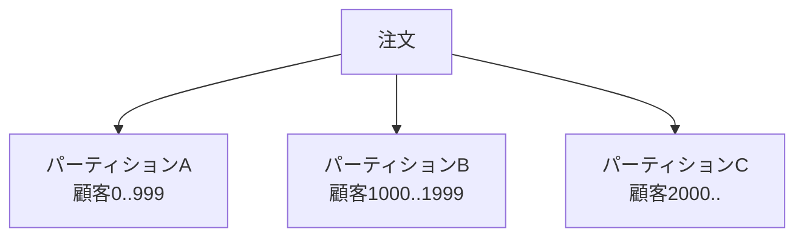
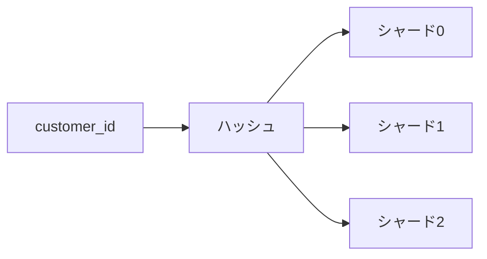
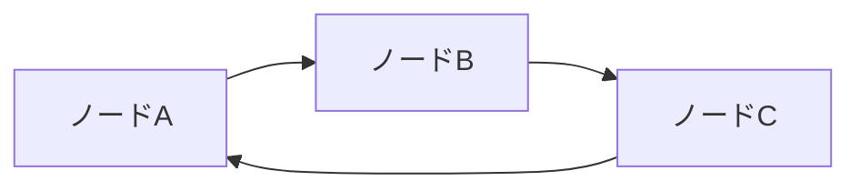
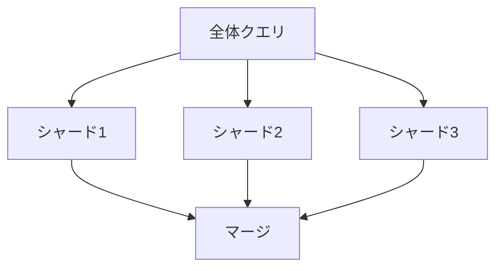
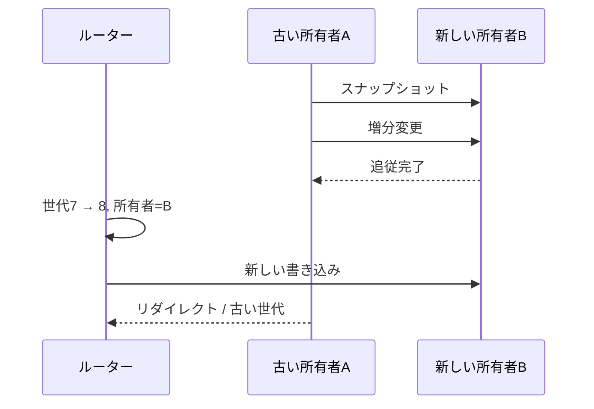
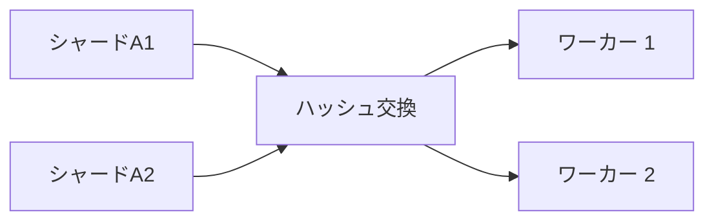

一つのノードへデータ、書き込み処理量、読み取り負荷が収まらなくなると、データを複数のパーティションへ分けます。分割により容量を増やせますが、リクエスト振り分け、パーティション横断クエリ、再均衡化、トランザクションという新しいコストが生まれます。

シャーディングの難しさは「どう分けるか」より、「分けた後にクエリとデータが変化し続けること」です。

## この章で答える問い

- 水平/垂直分割は何を分けるのか
- 範囲/ハッシュ分割はクエリ局所性と負荷分散をどう交換するのか
- 良いシャードキーはどのような性質を持つのか
- グローバルセカンダリインデックスは書き込みと整合性をどう複雑にするのか
- 高負荷パーティションとデータ偏りをどう検出・緩和するのか
- オンライン再シャーディング中の読み取り/書き込みをどう正しく振り分けするのか

## 分割とシャーディング

用語は製品によって異なります。本書では：

- **分割**：一つの論理表/データ集合を複数部分へ分割する一般概念
- **シャーディング**：パーティションを複数ノード/障害領域へ配置する水平分割

一つのDBインスタンス内の表パーティションも、複数ノードのシャードも、キーから対象パーティションを決める点は共通します。ただしシャーディングではネットワーク、部分障害、分散トランザクションが加わります。

## 水平分割

行をパーティションキーで分けます。



各パーティションは同じ列スキーマを持ち、行集合が異なります。

利点：

- データ容量と書き込みを分散
- パーティション刈り込み
- 古いパーティションのアーカイブ/削除
- 保守単位を小さくする

課題：

- パーティション横断クエリ
- 偏り
- パーティションメタデータ
- 再均衡化

## 垂直分割

列グループまたは機能単位で分けます。

```text
users_core(id, メール, name)
users_profile(id, bio, avatar_blob, preferences)
```

頻繁に読む小規模列と大規模/低負荷列を分け、行幅とI/Oを減らせます。別サービス/DBへ分ける場合は結合とトランザクションを失い、アプリケーションで統合するコストが増えます。

正規化による表分割と似ていますが、垂直分割はアクセスパターンや物理配置を主目的にする場合があります。

## 範囲分割

キーの連続範囲をパーティションへ割り当てます。

```text
P1: 2026-01-01 <= ordered_at < 2026-02-01
P2: 2026-02-01 <= ordered_at < 2026-03-01
P3: 2026-03-01 <= ordered_at < 2026-04-01
```

利点：

- 範囲クエリが少数パーティションへ局所化
- 時系列データの削除/アーカイブ
- 整列による局所性
- 分割境界を理解しやすい

欠点：

- 単調キーで最新パーティションへ書き込み集中
- 範囲大きさと負荷が不均等
- 高負荷キー 範囲
- 境界管理

時系列では書き込み集中箇所を許容しつつ、バケット内をハッシュ再分割する方法があります。

## ハッシュ分割

ハッシュ(キー) mod Nなどでパーティションを選びます。



利点：

- 一様キーなら負荷を分散しやすい
- 単一キー検索の振り分けが明確
- 単調キーの書き込みを分散

欠点：

- 範囲局所性を失う
- パーティション数変更で多くのキーが移動
- 高負荷キー一つは分散できない
- ハッシュ前のキーの分布とリクエスト分布は別

一様行数でも、有名顧客へ通信量が集中すれば高負荷シャードになります。

## コンシステントハッシュ法

単純な「ハッシュ値 mod N」では、Nの変更時に多くのキーの割り当てが変わります。コンシステントハッシュ法はノードとキーをリング上へ配置し、ノード追加・削除時の移動範囲を限定します。



仮想ノード/トークンを各物理ノードへ複数割り当てると：

- 負荷を細かく分散
- 異なるノード容量に応じた比例配分
- 移動単位を小さくする

ただし仮想ノード数が多いほどメタデータとレプリカ配置が複雑になります。

近年の分散DBでは範囲パーティションを自動分割し、配置管理機構が範囲をノードへ割り当てる方式もあります。コンシステントハッシュ法だけが再均衡化の解ではありません。

## リスト分割

明示値集合で分けます。

```text
JP, KR → 東アジアパーティション
US, CA → 北米パーティション
DE, FR → 欧州パーティション
```

データ所在地要件やリージョン振り分けを表現しやすい一方、地域間負荷差、未分類値、リージョン変更を扱います。

## シャードキー

シャードキーはデータ配置とリクエスト振り分けを決める最重要設計です。

良い性質：

- 行数が十分高い
- 書き込み/読み取り負荷が均等
- 主要クエリがキーを指定する
- 同じ場所に配置したいデータで共有できる
- 値が安定して変更されにくい
- テナント分離性/リージョン要件に合う

### customer_idで注文を分ける

```text
シャード = ハッシュ(customer_id)
```

顧客別注文一覧と顧客単位トランザクションを一シャードへ閉じ込められます。

弱点：

- 全顧客の時間範囲レポートは分散問い合わせと集約
- 大規模顧客が集中箇所
- 顧客IDを持たないアクセス経路に全体インデックスが必要

### ordered_atで分ける

時系列走査とアーカイブに向きますが、最新範囲へ書き込みが集中し、顧客別履歴が複数パーティションへ散ります。

「最も選択率の高い列」ではなく、トランザクション境界、クエリ局所性、増加傾向、集中箇所を合わせて選びます。

## 複合分割

範囲 + ハッシュなどを組み合わせます。

```text
最初: month(ordered_at)
次に: ハッシュ(customer_id)を16バケットへ振り分け
```

時間範囲刈り込みと書き込み分散を両立できますが、パーティション数、メタデータ、小規模パーティションを増やします。

## 振り分け

### クライアント側振り分け

クライアントライブラリがパーティションマップを持ち、直接対象ノードへ送ります。

- 中継回数が少ない
- クライアント更新とメタデータ更新が必要
- 多言語クライアント側へ処理が分散

### プロキシ/調整役振り分け

ゲートウェイがキーから対象を選びます。

- クライアントが単純
- プロキシの遅延時間/ボトルネック
- メタデータを中央管理しやすい

### リダイレクト

任意ノードがリクエストを受け、正しい所有者へリダイレクト/転送します。古いパーティションマップでも動けますが追加中継回数があります。

パーティションマップにはバージョン/世代を付け、古いルーターによる誤書き込みを防ぎます。

## パーティション刈り込み

クエリ述語から不要パーティションを除外します。

```sql
SELECT *
FROM orders
WHERE ordered_at >= DATE '2026-08-01'
  AND ordered_at <  DATE '2026-09-01';
```

ordered_at範囲パーティションなら8月パーティションだけ読めます。

刈り込みを妨げる例：

- パーティションキーへ関数を適用
- 型/照合順序の不一致
- 実行時まで値が不明
- OR条件
- パーティションキーを含まない述語

静的刈り込みと実行時/動的刈り込みを持つ最適化器があります。

## 分散問い合わせと集約

対象シャードを一つに絞れないクエリは全シャードへ送ります。



遅延時間は最も遅いシャードに引きずられ、リクエスト分岐数がシステム負荷を増幅します。

```text
100回のAPI要求
× 100シャード
= 10,000回のシャード要求
```

ORDER BY + 上限では各シャードからローカル上位K件を取り、調整役でマージできます。GROUP BYでは部分集約をマージします。

## コロケーション

関連データを同じパーティションキーで配置すると局所結合/トランザクションにできます。

```text
customersをcustomer_idで分割
ordersをcustomer_idで分割
paymentsをcustomer_idで分割
```

ただし商品在庫はproduct_idで分けたいかもしれません。一つの配置で全アクセスパターンを局所にできないため、重複/派生ビューまたは分散操作が必要です。

## 局所セカンダリインデックス

各シャード内だけのセカンダリインデックスです。インデックス項目と基底行が同じシャードにあり、書き込みを局所トランザクションで更新できます。

インデックスキーだけでクエリすると全シャードを検索する必要があります。

```sql
SELECT * FROM users WHERE email = 'a@example.com';
```

usersがuser_idによるハッシュシャードに分かれ、メールから対象シャードが分からなければ、全シャードへの散布検索が必要です。

## グローバルセカンダリインデックス

全シャードを横断するインデックスを別の分割構造として持ちます。


利点：

- 副系キーから対象シャードを特定
- 全体一意性を実現しやすい

課題：

- 基底書き込みとインデックス書き込みが別シャード
- 分散トランザクションまたは非同期伝播
- 古いインデックス
- インデックス集中箇所
- 再分割時の整合

同期全体インデックスは書き込み遅延時間と可用性を犠牲にし、非同期インデックスは書き込み後の読み取り保証と孤立項目を扱います。

## 全体一意性

メールなどを全シャードでUNIQUEにするには：

- メールでパーティションした全体インデックス
- 中央割り当てサービス
- 決定論的所有者シャード
- 予約プロトコル

各利用者シャードで局所UNIQUEを置くだけでは、別シャードに同じメールを作れます。

## データ偏りと集中箇所

### データ偏り

行/バイト数が特定パーティションへ偏ります。

### 負荷偏り

データ量は均等でもリクエストが偏ります。

### 一時的な集中箇所

キャンペーンや著名人に起因するイベントで一時的に特定キーが高負荷になります。

観測するもの：

- パーティションごとの行/バイト
- 読み取り/書き込みQPS
- CPU/I/O/ネットワーク
- キュー/遅延時間
- コンパクション/レプリケーション遅延
- 高負荷キー／テナント

平均ノード使用率は高負荷パーティションを隠します。

## 集中箇所対策

- 高負荷キーをソルトして複数バケットへ分ける
- 読み取りキャッシュ/レプリカ
- 書き込み集約/一括処理
- 専用シャード
- テナント流量制限
- 適応的な再分割
- キー設計変更

ソルトは書き込みを分散しますが、読み取りで複数バケットをマージし、一意性や順序付けを複雑にします。

カウンターを16バケットへ分ける例：

```text
counter_id = post42#0 ... post42#15
合計 = 全バケットのSUM
```

正確な現在の値を読むコストと結果整合的な集約を受け入れます。

## 分割とマージ

範囲パーティションが大きくなったら分割します。

```text
[A, Z)
→ [A, M) + [M, Z)
```

小規模パーティションが増えすぎたらマージします。分割/マージはメタデータ更新、レプリカ作成、振り分け変更、処理中のリクエストを調整します。

## オンライン再均衡化

パーティションをノードAからBへ移動する流れの一例：

1. Bへスナップショットを複製
2. 複製中の増分ログを転送
3. BがAへ追いつく
4. 所有権世代を変更
5. 新しいリクエストをBへ振り分け
6. 古いAへのリクエストをリダイレクト/拒否
7. 安全確認後Aの複製を削除



### 二重書き込みの危険

移行中にアプリケーションがA/Bへ個別に二重書き込みすると、一方だけ成功する部分障害が起きます。

所有者がログを一つに順序づけ、新しいレプリカへ複製する方式や、トランザクション/CDCで移行します。切り替えには世代/フェンシングトークンを使い、古い所有者の遅れて到着した書き込みを拒否します。

## 再シャーディングコスト

データ移動はバックグラウンド負荷として本番環境通信量と競合します。

- ディスク読み取り/書き込み
- ネットワーク帯域幅
- コンパクション
- レプリカ追従
- キャッシュ未温状態
- チェックサム検証

流量制限と優先度を設定し、障害時に再開できる複製プロトコルが必要です。

## 分散クエリ実行

分散計画には交換演算子が加わります。

### 集約

各ワーカー 結果を調整役へ集めます。

### ブロードキャスト

小規模表を全ワーカーへ送ります。

### 再分割

結合/グループキーで両入力をネットワーク再分配します。



ネットワークバイト、直列化、逆圧、ワーカー 偏りがコストモデルへ加わります。

## シャード数を決める

多すぎるシャード：

- メタデータと接続増加
- 小規模ファイル/コンパクションオーバーヘッド
- 分岐数増加
- 再均衡化操作増加

少なすぎるシャード：

- 1シャードがノード容量を超える
- 並列度不足
- 移動単位が大きい
- 集中箇所を分割しにくい

将来の増加傾向を見込みつつ、仮想パーティション/範囲分割で物理ノード数と独立させます。

## よくある誤解

### 「ハッシュシャードなら均等になる」

キー数は均等でもリクエスト頻度、行大きさ、テナント大きさが偏ります。

### 「シャードキーは後から変えればよい」

全データ移動、インデックス再構築、振り分け、外部キー、アプリケーションクエリを巻き込む大規模移行です。

### 「全体インデックスがあればシャーディング前と同じ」

基底/インデックスの分散書き込みと古さが加わり、トランザクション意味論が変わります。

## まとめ

- 水平パーティションは行、垂直パーティションは列/機能を分ける
- 範囲は局所性、ハッシュは負荷分布を得やすい
- シャードキーはクエリ振り分け、トランザクション境界、コロケーション、偏りを同時に決める
- パーティション刈り込みできないクエリは分散問い合わせと集約で分岐数する
- 局所インデックスは書き込みが単純、全体インデックスは参照を改善するが分散整合性を必要とする
- データ偏りと負荷偏りをパーティション単位で観測する
- オンライン再均衡化はスナップショット、増分追従、世代切り替え、古い所有者フェンシングを行う
- 分散クエリはブロードキャスト/再分割/集約のネットワークコストを持つ

## 確認問題

1. 範囲とハッシュ分割を時系列クエリと書き込み集中箇所から比較してください。
2. customer_id シャードが顧客別クエリに向き、全体レポートに不利な理由を説明してください。
3. 局所セカンダリインデックスとグローバルセカンダリインデックスの書き込み経路を比較してください。
4. オンライン移行でアプリケーション二重書き込みが危険な理由は何ですか。
5. ハッシュで行数が均等でも高負荷シャードが生まれる例を作ってください。

## 参考資料

- [PostgreSQL Documentation: Table Partitioning](https://www.postgresql.org/docs/current/ddl-partitioning.html)
- [Google Cloud Spanner: Life of Reads and Writes](https://cloud.google.com/spanner/docs/whitepapers/life-of-reads-and-writes)
- [James C. Corbett et al., “Spanner: Google’s Globally-Distributed Database”](https://doi.org/10.1145/2491245)
- [Dynamo Paper](https://doi.org/10.1145/1294261.1294281)

次章では、複数シャード/サービスにまたがる変更を全か無かまたは補償可能なワークフローとして扱う分散トランザクションを学びます。
