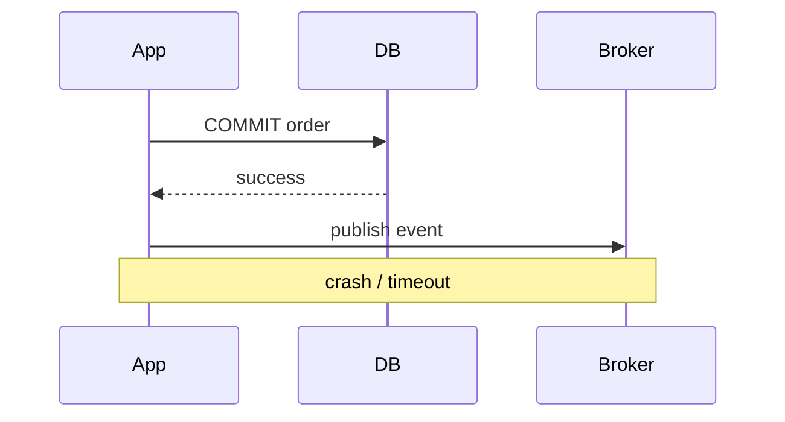
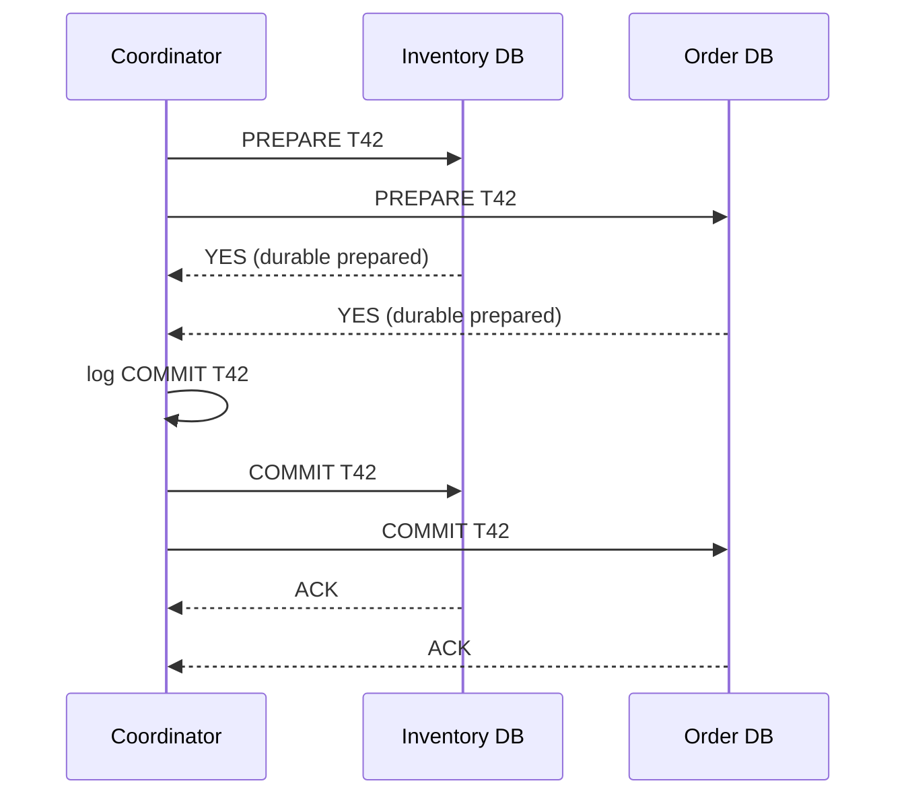
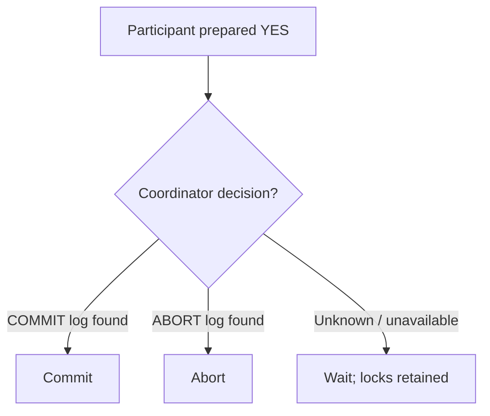
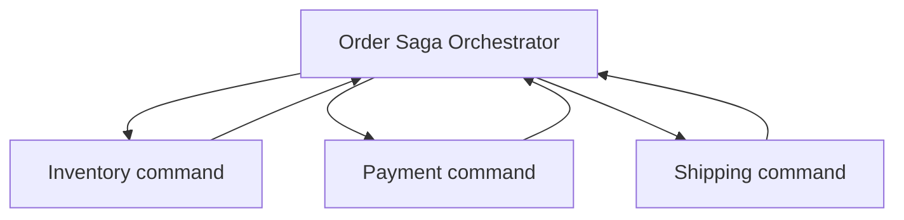
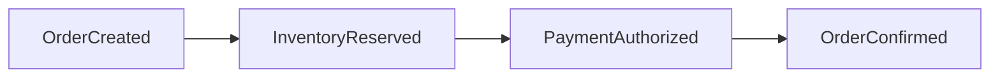
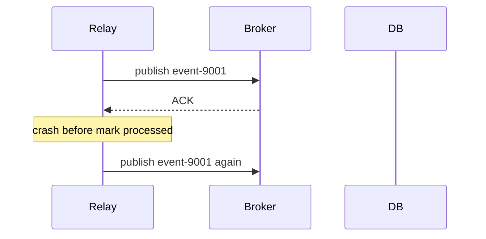

注文、在庫、決済が別service・別databaseにあると、単一DB transactionでは全変更をまとめられません。一方だけ成功するpartial failure、response消失、retry重複が通常状態として現れます。

分散transaction設計では「失敗をなくす」のではなく、各失敗点で残る状態と、再実行・補償・運用回復の手順を定義します。

## この章で答える問い

- Atomic commitとconsensusは何が違うのか
- 2PCのprepareはparticipantへ何を約束させるのか
- Coordinator failureでtransactionがin-doubtになるのはなぜか
- SagaはACID transactionの単純な代替なのか
- DB更新とmessage publishのdual-write問題をoutboxでどう解くのか
- At-least-once deliveryをidempotencyでどう安全に扱うのか

## localとdistributed transaction

単一DBでは：

```sql
BEGIN;
UPDATE inventory SET available = available - 1 WHERE product_id = 7;
INSERT INTO orders (...) VALUES (...);
COMMIT;
```

DBMSが一つのWAL、lock/MVCC、recoveryでatomicityを提供します。

別resourceの場合：

```text
Inventory DB: decrement stock
Order DB:     create order
Payment API:  capture money
Message bus:  publish OrderConfirmed
```

各systemのfailureとcommit pointが独立します。

## dual-write problem

Applicationが二つのsystemへ順にwriteします。



DB commit後、publish前にcrashするとorderはあるのにeventがありません。逆順ならeventはあるのにDB rollbackという状態が起きます。

Retryだけでは解決しません。Publish成功後にresponseを失うとduplicate publishになるためです。

## atomic commit

複数participantがtransactionをcommitするかabortするか、一つのdecisionへ従うprotocolです。

望む性質：

- 全participantがcommit、または全員abort
- Commitしたparticipantとabortしたparticipantが混在しない
- Participant crash/recovery後もdecisionを守る

代表がTwo-Phase Commit（2PC）です。

## Two-Phase Commit

Role：

- **Coordinator**：transaction decisionを進める
- **Participant**：各resourceのlocal transactionを実行する

### Phase 1: prepare / vote

Coordinatorが各participantへPREPAREを送り、commit可能かvoteさせます。

ParticipantがYESと答える前に：

- Local constraintを検査
- 必要lockを保持
- Redo/undoとprepared stateをdurable logへ書く
- Coordinator decisionを待てる状態にする

YESは「今commitした」ではなく、「後でCOMMIT命令が来たら必ずcommitでき、ABORTならrollbackできる」という約束です。

### Phase 2: decision

- 全participantがYES：CoordinatorはCOMMITをdurableに記録して通知
- 一つでもNO/timeout：ABORTを記録して通知



## prepared transaction

Prepare後のparticipantはdecisionを受けるまで次を維持します。

- Lock
- Undo/redo state
- Transaction ID
- Resource reservation

通常のconnectionが切れてもprepared stateは残ります。これがatomicityを守る一方、長時間in-doubtになるとほかのtransactionをblockします。

## 2PCのfailure

### Participantがprepare前にfailure

CoordinatorはNO/timeoutとしてabortできます。Participant recovery後もlocal unprepared transactionをrollbackします。

### ParticipantがYES後にfailure

Prepared stateはdurableです。Recovery後にcoordinatorへdecisionを問い合わせ、commit/abortします。

### Coordinatorがdecision前にfailure

ParticipantがYESを返していると、自分だけではcommit/abortを決められません。Coordinator recoveryを待つin-doubt/blocking状態になります。



### CoordinatorがCOMMIT記録後、通知前にfailure

Durable decisionはCOMMITです。Recovery後に再送します。Participantはidempotently同じdecisionを適用します。

## 2PCはconsensusではない

2PC coordinatorを一台だけにすると、そのfailure中はprepared participantがblockします。Raft/Paxosでcoordinator decisionをreplicateすればavailabilityを改善できます。

| 2PC | Consensus |
| --- | --- |
| 複数participantのcommit/abortをatomicに決める | Replicasが一つのordered decisionへ合意する |
| Participantは異なるresourceを持つ | Participantは同じstate machineを複製することが多い |
| Coordinator decisionが中心 | Majorityとleader election |
| Prepared lock/resourceを保持 | Log replicationを進める |

Consensus-backed 2PCでもnetwork partition時のlatency、participant unavailability、lock保持は残ります。

## Three-Phase Commit

3PCはprepareとcommitの間にpre-commit phaseを追加し、一定のsynchronous network/failure detector仮定でblockingを減らします。

完全asynchronous network partitionでは安全にnon-blockingを保証できず、実用systemではconsensus-backed coordinatorなど別方式が一般的です。

「2PCがblockするので3PCにすれば解決」と単純化しません。

## 2PCを使う条件

向いている：

- ParticipantがXA/prepared transactionを支える
- Atomicityが必須
- Transactionが短い
- Participant数が少ない
- Coordinatorとmonitoringを高可用化
- Lock holdとfailure時運用を受け入れる

不向き：

- Human approvalを含む長時間workflow
- 外部payment/emailのようにprepareできない副作用
- 高latency cross-region
- Participant autonomyが高いmicroservices

## Saga

Sagaは長いbusiness transactionを複数のlocal transactionへ分け、失敗時にcompensating transactionを実行するpatternです。

注文例：

```text
T1: Create order
T2: Reserve inventory
T3: Authorize payment
T4: Confirm order

T3 fails:
C2: Release inventory
C1: Cancel order
```

各local transactionはcommitして外部から見えるため、Saga全体はisolationを自動提供しません。途中状態をmodelとして許容し、statusとworkflowを明示します。

## compensation

Compensationはbyte-level undoではなく、業務上の逆操作です。

- 在庫予約 → 予約解放
- Payment authorization → void
- Capture → refund
- Shipment → return request（発送自体は取り消せない）
- Email送信 → 取り消せない。訂正email

Compensationも失敗・retry・duplicateするためidempotentに設計します。

既にほかのtransactionが状態を利用している場合、完全に元へ戻せないことがあります。

## orchestration

中央orchestratorがstepとstateを管理し、commandを送りresultを受けます。



利点：

- Workflowとtimeoutが一か所で見える
- Compensation順を管理しやすい
- Monitoring/operationが明確

欠点：

- Orchestratorがcomplex/central coupling
- State persistenceとhigh availabilityが必要

## choreography

各serviceがeventを購読し、次eventを発行します。



利点：

- Central coordinatorなし
- Service autonomy
- Event-driven integration

欠点：

- End-to-end flowが見えにくい
- Cyclic dependency
- Event contract変更
- Compensationとtimeoutの所在が曖昧

小さなflowはchoreography、複雑なbusiness processはorchestrationが理解しやすい傾向があります。

## Saga isolation anomaly

途中状態が見えるため：

- Dirty/semantic read：まだ最終確定していないorderを別processが使う
- Lost update：compensationが後続変更を上書き
- Oversell：複数Sagaがcapacityを同時確認

対策：

- Semantic lock：status=RESERVING中は別operationを制限
- Version/OCC
- Escrow/resource reservation
- Commutative operation
- Reread/validation
- Pivot transaction設計

SagaはACID isolationを「不要にする」のではなく、application levelで明示的に扱います。

## transactional outbox

DB変更とevent送信のdual writeを避けるため、business rowとoutbox rowを同じlocal transactionでcommitします。

```sql
BEGIN;

INSERT INTO orders (id, status, ...)
VALUES ('order-42', 'confirmed', ...);

INSERT INTO outbox (
  event_id, aggregate_id, event_type, payload, created_at
) VALUES (
  'event-9001', 'order-42', 'OrderConfirmed', ..., now()
);

COMMIT;
```

別relayがoutboxを読みmessage brokerへpublishします。


DB commit時点で「publishすべきevent」がdurableになります。Crashしてもrelayが再開できます。

## outbox delivery

Relayがpublish成功後、outboxをprocessedにする前にcrashすると再publishします。



Outboxは通常at-least-once publishなのでconsumer deduplicationが必要です。

Polling publisherとCDC方式があります。

- Polling：実装しやすい。Polling latency、locking、batchが必要
- CDC：DB logから低latencyで取得。Connector運用、schema、orderingが必要

## inboxとidempotent consumer

Consumerはevent IDをinbox/dedup tableへ記録し、business updateと同じtransactionで処理します。

```sql
BEGIN;

INSERT INTO inbox (consumer, event_id)
VALUES ('billing', 'event-9001')
ON CONFLICT DO NOTHING;

-- INSERTされた場合だけbusiness update

COMMIT;
```

Unique(consumer, event_id)でduplicateを無害化します。

Retention期間を過ぎてdedup recordを消した後のlate redeliveryも考えます。

## delivery semantics

### at-most-once

Messageを0回または1回処理します。Lossはあり得るがduplicateを避けます。

### at-least-once

最低1回処理します。Lossを避ける代わりにduplicateがあり得ます。

### exactly-once

範囲を明示する必要があります。Broker内部、stream processor state、特定DBへのtransactional sinkでexactly-onceを提供できても、外部email/paymentまで一度だけ副作用を保証するとは限りません。

実務ではat-least-once delivery + idempotent effectでeffectively-onceな業務結果を作ります。

## idempotency key

同じrequestを複数回実行しても結果を一つにします。

```sql
CREATE TABLE payment_requests (
  idempotency_key TEXT PRIMARY KEY,
  request_hash    TEXT NOT NULL,
  status          TEXT NOT NULL,
  result          JSONB
);
```

処理：

1. Clientがoperationごとにstable keyを送る
2. Serverはkeyを一意にinsert
3. 同じkey・同じrequestなら保存済みresultを返す
4. 同じkey・異なるrequestならerror
5. In-progressならwait/poll/retry response

Keyをretryごとに作り直すとdedupできません。

## ambiguous outcome

Clientがtimeoutしたとき、serverは：

- Request未受信
- 処理中
- Commit済みだがresponse loss
- Abort済み

のどれか分かりません。

「timeoutしたので反対操作をする」のは危険です。Operation status APIとidempotency keyで元operationの結果を確認します。

## ordering

Message brokerがpartition内順序を保証しても、複数producer/partitionではglobal orderがありません。

Aggregateごとのsequence numberを持たせます。

```text
order-42 version 7: PaymentAuthorized
order-42 version 8: OrderConfirmed
```

Consumerはversion 8を先に受けたらbuffer/retryし、duplicate version 7を無視できます。

Wall clock timestampだけでorderを決めるとclock skewに弱いため、DB commit sequence、per-aggregate version、Lamport clockなどlogical orderingを使います。

## clockと因果順序

Lamport clockはeventごとにcounterを進め、message受信時にmax(local, received)+1とします。

```text
if a happened-before b:
  L(a) < L(b)
```

逆は必ずしも成り立たず、concurrent eventを区別できません。Vector clockはnodeごとのcounterでcausality/concurrencyを検出できますが、metadataが増えます。

Business workflowではaggregate versionやworkflow stepがより直接的な場合があります。

## 方式を選ぶ

| 要件 | 候補 |
| --- | --- |
| 短い複数DB更新、全participantがprepare対応、強いatomicity | 2PC |
| 長時間business workflow、外部副作用 | Saga |
| DB commitとevent publishを結ぶ | Transactional outbox + CDC |
| Message duplicateを無害化 | Inbox / idempotent consumer |
| Client timeout後の再送 | Idempotency key + status lookup |
| Hot capacity reservation | Local transaction/escrowをownerへ集約 |

複数patternを組み合わせます。Sagaの各stepがoutboxでeventを出し、consumerがinboxでdedupする構成が一般的です。

## 運用状態

分散workflowには状態をquery可能にします。

- transaction/saga ID
- current step/status
- started/updated time
- attempt count
- last error
- next retry time
- participant result
- compensation state
- idempotency key

Dead letter queueへ送って終わりではなく、再実行・skip・compensate・manual completeのrunbookを用意します。

## よくある誤解

### 「2PCならfailureがなくなる」

Atomic decisionを守りますが、prepared lock、coordinator recovery、latency、blockingが残ります。

### 「Sagaはeventual consistency版のACID transaction」

途中状態が見え、compensationは完全undoでなく、isolationをapplicationで設計します。

### 「message brokerのexactly-onceで外部APIも一度だけ」

Exactly-onceの境界外にある副作用にはidempotencyが必要です。

## まとめ

- 複数resourceへの順次writeはpartial failureとambiguous outcomeを生む
- 2PCのprepare YESは、後のcommit/abort decisionへ従えるdurableな約束である
- Coordinator unavailable中、prepared participantはin-doubtでblockし得る
- 2PCとconsensusは異なる問題で、consensus-backed coordinatorで可用性を改善できる
- Sagaはlocal transactionとcompensationで長いworkflowを表すが、途中状態とisolationを扱う必要がある
- Transactional outboxはDB変更とpublish予定eventを一つのlocal transactionへ入れる
- Relay/consumerはat-least-onceを前提にevent IDとinboxでdedupする
- Idempotency keyはclient timeout後のretryを同一operationへ結びつける
- Orderingにはaggregate versionやlogical clockを使う

## 確認問題

1. 2PC participantがYESを返す前にdurableにする必要がある情報は何ですか。
2. Coordinator failureでprepared participantが勝手にabortできない理由を説明してください。
3. Payment captureのcompensationが単純なrollbackではない理由は何ですか。
4. Outbox relayがduplicate publishするfailure pointを書いてください。
5. At-least-once messageをconsumer側でeffectively-onceにする方法を説明してください。

## 参考資料

- [Jim Gray and Leslie Lamport, “Consensus on Transaction Commit”](https://doi.org/10.1145/2890785)
- [Hector Garcia-Molina and Kenneth Salem, “Sagas”](https://doi.org/10.1145/38713.38742)
- [PostgreSQL Documentation: Two-Phase Transactions](https://www.postgresql.org/docs/current/two-phase.html)
- [Debezium Documentation: Outbox Event Router](https://debezium.io/documentation/reference/stable/transformations/outbox-event-router.html)

次章では、ここまでのDB内部知識をapplicationのconnection、query、migration、monitoring、backup/failover運用へ接続します。
