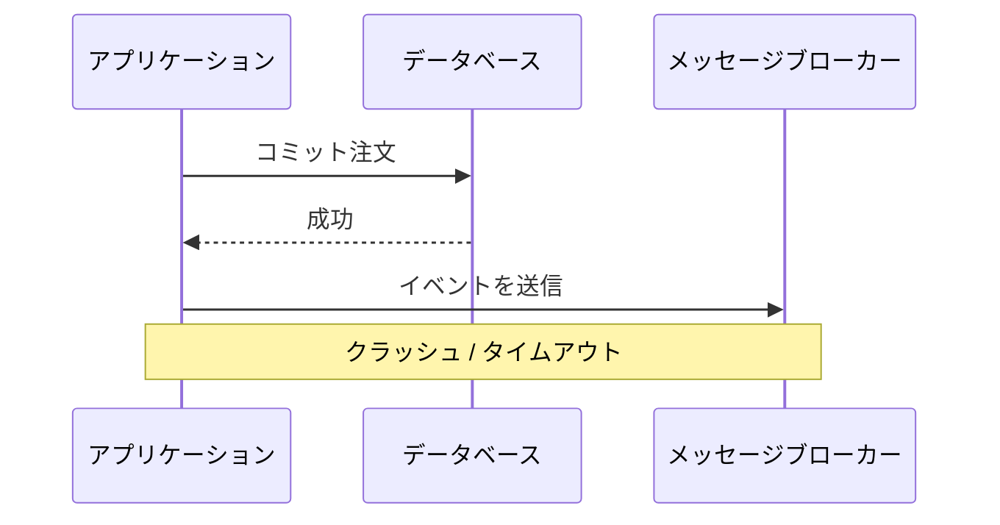
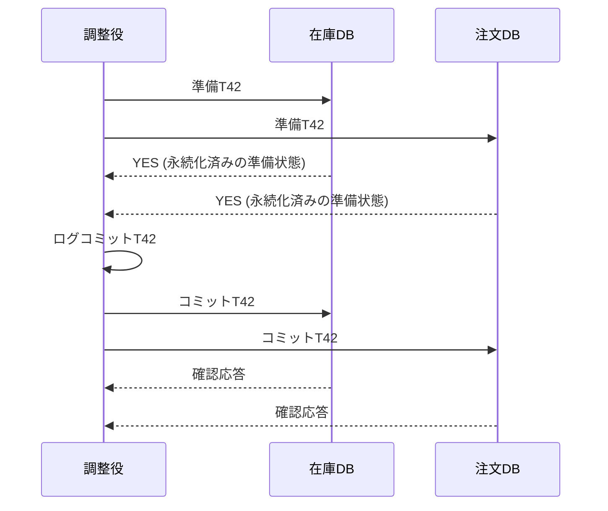
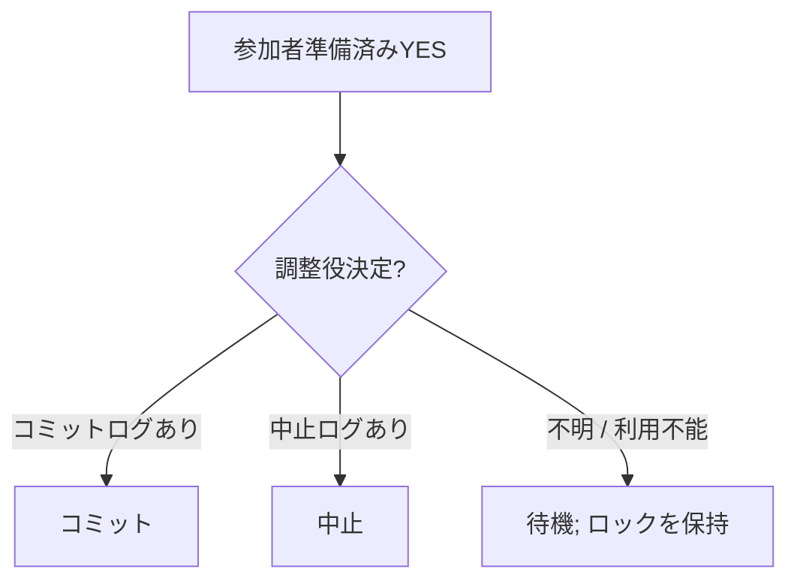
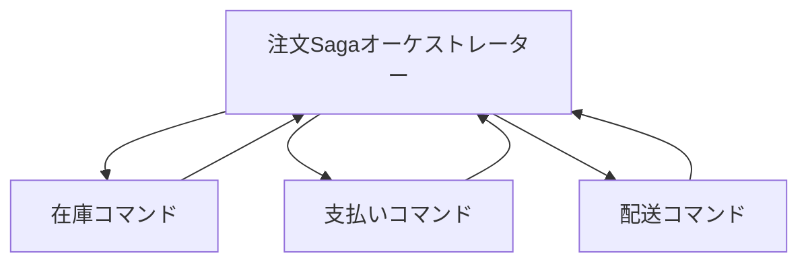
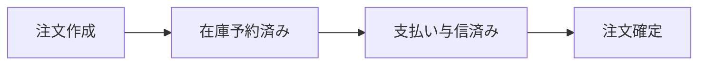
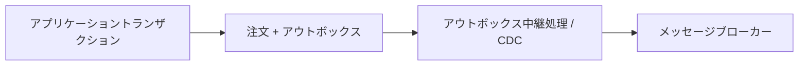
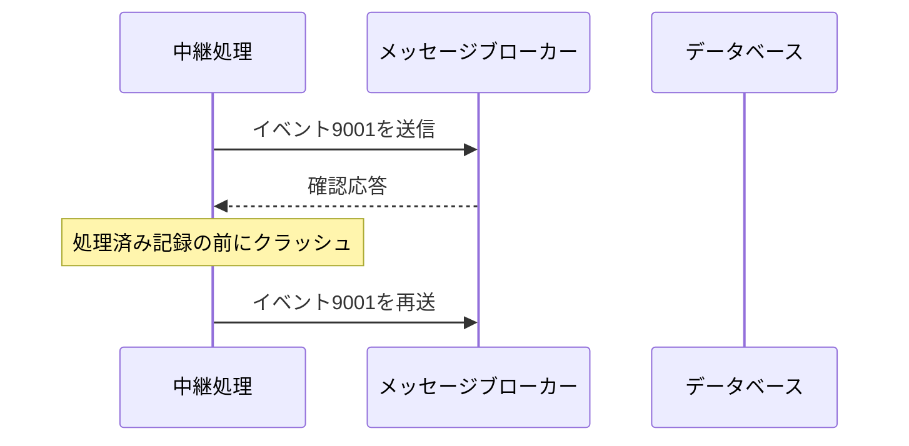

注文、在庫、決済が別サービス・別データベースにあると、単一DBトランザクションでは全変更をまとめられません。一方だけ成功する部分障害、応答消失、再試行重複が通常状態として現れます。

分散トランザクション設計では「失敗をなくす」のではなく、各失敗点で残る状態と、再実行・補償・運用回復の手順を定義します。

## この章で答える問い

- 原子的なコミットと合意は何が違うのか
- 2PCの準備は参加者へ何を約束させるのか
- 調整役障害でトランザクションが結果未確定になるのはなぜか
- SagaはACIDトランザクションの単純な代替なのか
- DB更新とメッセージ送信の二重書き込み問題をアウトボックスでどう解くのか
- 1回以上配信を冪等性でどう安全に扱うのか

## 局所と分散トランザクション

単一DBでは：

```sql
BEGIN;
UPDATE inventory SET available = available - 1 WHERE product_id = 7;
INSERT INTO orders (...) VALUES (...);
COMMIT;
```

DBMSが一つのWAL、ロック/MVCC、復旧で原子性を提供します。

別資源の場合：

```text
在庫DB: 在庫を減らす
注文DB:     注文を作成
支払いAPI:  代金を確定
メッセージバス:  注文確定を送信
```

各システムの障害とコミット境界は独立しています。

## 二重書き込み問題

アプリケーションが二つのシステムへ順に書き込みします。



DBコミット後、送信前にクラッシュすると注文はあるのにイベントがありません。逆順ならイベントはあるのにDBロールバックという状態が起きます。

再試行だけでは解決しません。送信成功後に応答を失うと重複送信になるためです。

## 原子的なコミット

複数参加者がトランザクションをコミットするか中止するか、一つの決定へ従うプロトコルです。

望む性質：

- 全参加者がコミット、または全員中止
- コミットした参加者と中止した参加者が混在しない
- 参加者クラッシュ/復旧後も決定を守る

代表が二相コミット（2PC）です。

## 二相コミット

ロール：

- **調整役**：トランザクションの決定を進める
- **参加者**：各資源の局所トランザクションを実行する

### 段階1: 準備 / 投票

調整役が各参加者へ準備を送り、コミット可能か投票させます。

参加者がYESと答える前に：

- 局所制約を検査
- 必要ロックを保持
- 再実行/取り消しと準備済み状態を永続化済みログへ書く
- 調整役決定を待てる状態にする

YESは「今コミットした」ではなく、「後でコミット命令が来たら必ずコミットでき、中止ならロールバックできる」という約束です。

### 段階2: 決定

- 全参加者がYES：調整役はコミットを永続化済みに記録して通知
- 一つでもNO/タイムアウト：中止を記録して通知



## 準備済みトランザクション

準備後の参加者は決定を受けるまで次を維持します。

- ロック
- 取り消し/再実行状態
- トランザクションID
- 資源の予約

通常の接続が切れても準備済み状態は残ります。これが原子性を守る一方、長時間結果未確定になるとほかのトランザクションを停止します。

## 2PCの障害

### 参加者が準備前に障害

調整役はNO/タイムアウトとして中止できます。参加者復旧後も局所の未準備トランザクションをロールバックします。

### 参加者がYES後に障害

準備済み状態は永続化されます。復旧後に調整役へ決定を問い合わせ、コミット/中止します。

### 調整役が決定前に障害

参加者がYESを返していると、自分だけではコミット/中止を決められません。調整役復旧を待つ結果未確定/処理停止状態になります。



### 調整役がコミット記録後、通知前に障害

永続化された決定はコミットです。復旧後に再送します。参加者は冪等に同じ決定を適用します。

## 2PCは合意ではない

2PC調整役を一台だけにすると、その障害中は準備済み参加者が停止します。Raft/Paxosで調整役決定を複製すれば可用性を改善できます。

| 2PC | 合意 |
| --- | --- |
| 複数参加者のコミット／中止を原子的に決める | レプリカ群が一つの順序付けられた決定へ合意する |
| 参加者は異なる資源を持つ | 参加者は同じ状態機械を複製することが多い |
| 調整役決定が中心 | 過半数とリーダー選挙 |
| 準備済みロック/資源を保持 | ログレプリケーションを進める |

合意-支えられた2PCでもネットワーク分断時の遅延時間、参加者利用不能、ロック保持は残ります。

## 三相コミット

3PCは準備とコミットの間に事前コミット段階を追加し、一定の同期ネットワーク/障害検出器仮定で処理停止を減らします。

完全非同期ネットワーク分断では安全に非停止を保証できず、実用システムでは合意で支えた調整役など別方式が一般的です。

「2PCが停止するので3PCにすれば解決」と単純化しません。

## 2PCを使う条件

向いている：

- 参加者がXA/準備済みトランザクションを支える
- 原子性が必須
- トランザクションが短い
- 参加者数が少ない
- 調整役と監視を高可用化
- ロック保持と障害時運用を受け入れる

不向き：

- 人による承認を含む長時間ワークフロー
- 外部支払い/メールのように準備できない副作用
- 高遅延時間リージョン間
- 参加者自律性が高いマイクロサービス

## Saga

Sagaは長い業務トランザクションを複数の局所トランザクションへ分け、失敗時に補償トランザクションを実行するパターンです。

注文例：

```text
T1: 注文を作成
T2: 在庫を予約
T3: 支払いを与信
T4: 注文を確定

T3が失敗:
C2: 在庫予約を解除
C1: 注文を取り消し
```

各局所トランザクションはコミットして外部から見えるため、Saga全体は分離性を自動提供しません。途中状態をモデルとして許容し、状態とワークフローを明示します。

## 補償

補償はバイト単位の取り消しではなく、業務上の逆操作です。

- 在庫予約 → 予約解放
- 支払いの与信 → 与信取消
- キャプチャ → 返金
- 発送 → 返品依頼（発送自体は取り消せない）
- メール送信 → 取り消せない。訂正メール

補償も失敗・再試行・重複するため冪等に設計します。

既にほかのトランザクションが状態を利用している場合、完全に元へ戻せないことがあります。

## オーケストレーション

中央オーケストレーターが手順と状態を管理し、コマンドを送り結果を受けます。



利点：

- ワークフローとタイムアウトが一か所で見える
- 補償順を管理しやすい
- 監視/操作が明確

欠点：

- オーケストレーターが複雑化／中央への結合
- 状態永続化と高可用性が必要

## コレオグラフィ

各サービスがイベントを購読し、次イベントを発行します。



利点：

- 中央調整役なし
- サービスの自律性
- イベント駆動連携

欠点：

- 端から端までの流れが見えにくい
- 循環依存
- イベント契約変更
- 補償とタイムアウトの所在が曖昧

小さな流れはコレオグラフィ、複雑な業務プロセスはオーケストレーションが理解しやすい傾向があります。

## Saga分離性異常

途中状態が見えるため：

- 未書き出し/意味的な読み取り：まだ最終確定していない注文を別処理が使う
- 更新消失：補償が後続変更を上書き
- 過剰販売：複数Sagaが容量を同時確認

対策：

- 意味的ロック：状態=RESERVING中は別操作を制限
- バージョン/OCC
- エスクロー/資源の予約
- 可換な操作
- 再読み取り/検証
- ピボットトランザクション設計

SagaはACID分離性を「不要にする」のではなく、アプリケーション層で明示的に扱います。

## トランザクショナル・アウトボックス

DB変更とイベント送信の二重書き込みを避けるため、業務行とアウトボックス行を同じ局所トランザクションでコミットします。

```sql
BEGIN;

INSERT INTO orders (id, status, ...)
VALUES ('order-42', 'confirmed', ...);

INSERT INTO outbox (
  event_id, aggregate_id, event_type, payload, created_at
) VALUES (
  'event-9001', 'order-42', 'OrderConfirmed', ..., now()
);

COMMIT;
```

別中継処理がアウトボックスを読みメッセージブローカーへ送信します。



DBコミット時点で「送信すべきイベント」が永続化済みになります。クラッシュしても中継処理が再開できます。

## アウトボックス配信

中継処理が送信成功後、アウトボックスを処理済みにする前にクラッシュすると再送信します。



アウトボックスは通常1回以上送信なのでコンシューマー 重複排除が必要です。

ポーリング型送信処理とCDC方式があります。

- ポーリング：実装しやすい。ポーリング遅延時間、ロック制御、一括が必要
- CDC：DBログから低遅延時間で取得。コネクター運用、スキーマ、順序付けが必要

## インボックスと冪等なコンシューマー

コンシューマーはイベントIDをインボックス/重複排除表へ記録し、業務更新と同じトランザクションで処理します。

```sql
BEGIN;

INSERT INTO inbox (consumer, event_id)
VALUES ('billing', 'event-9001')
ON CONFLICT DO NOTHING;

-- 挿入された場合だけ業務更新

COMMIT;
```

Unique(コンシューマー, event_id)で重複を無害化します。

保持期間を過ぎて重複排除レコードを消した後の遅れて到着した再配信も考えます。

## 配信の意味論

### 最大1回

メッセージを0回または1回処理します。損失はあり得るが重複を避けます。

### 1回以上

最低1回処理します。損失を避ける代わりに重複があり得ます。

### 厳密に1回

範囲を明示する必要があります。ブローカー内部、ストリーム処理の状態、特定DBへのトランザクション対応の出力先で厳密に1回を提供できても、外部メール/支払いまで一度だけ副作用を保証するとは限りません。

実務では1回以上の配信と冪等な処理を組み合わせ、実質的に1回の業務結果を作ります。

## 冪等性キー

同じリクエストを複数回実行しても結果を一つにします。

```sql
CREATE TABLE payment_requests (
  idempotency_key TEXT PRIMARY KEY,
  request_hash    TEXT NOT NULL,
  status          TEXT NOT NULL,
  result          JSONB
);
```

処理：

1. クライアントが操作ごとに安定したキーを送る
2. サーバーはキーを一意に挿入
3. 同じキー・同じリクエストなら保存済み結果を返す
4. 同じキー・異なるリクエストならエラー
5. 処理中なら待機/状態確認/再試行応答

キーを再試行ごとに作り直すと重複排除できません。

## 結果不明

クライアントがタイムアウトしたとき、サーバーは：

- リクエスト未受信
- 処理中
- コミット済みだが応答損失
- 中止済み

のどれか分かりません。

「タイムアウトしたので反対操作をする」のは危険です。操作状態APIと冪等性キーで元操作の結果を確認します。

## 順序付け

メッセージブローカーがパーティション内順序を保証しても、複数プロデューサー/パーティションでは全体注文がありません。

集約ごとの連番を持たせます。

```text
注文-42バージョン7: 支払い与信済み
注文-42バージョン8: 注文確定
```

コンシューマーはバージョン8を先に受けたらバッファ/再試行し、重複バージョン7を無視できます。

実時間時計タイムスタンプだけで注文を決めると時計ずれに弱いため、DBコミット連番、集約ごとのバージョン、Lamport時計など論理順序付けを使います。

## 時計と因果順序

Lamport時計はイベントごとにカウンターを進め、メッセージ受信時にmax(局所, 受信値)+1とします。

```text
if a先行発生b:
  L(a) < L(b)
```

逆は必ずしも成り立たず、並行するイベントを区別できません。ベクトル時計はノードごとのカウンターで因果関係/同時実行性を検出できますが、メタデータが増えます。

業務ワークフローでは集約バージョンやワークフロー 手順がより直接的な場合があります。

## 方式を選ぶ

| 要件 | 候補 |
| --- | --- |
| 短い複数DB更新、全参加者が準備対応、強い原子性 | 2PC |
| 長時間業務ワークフロー、外部副作用 | Saga |
| DBコミットとイベント送信を結ぶ | トランザクショナル・アウトボックス + CDC |
| メッセージ重複を無害化 | インボックス / 冪等なコンシューマー |
| クライアントタイムアウト後の再送 | 冪等性キー + 状態参照 |
| 高負荷容量予約 | 局所トランザクション/エスクローを所有者へ集約 |

複数パターンを組み合わせます。Sagaの各手順がアウトボックスでイベントを出し、コンシューマーがインボックスで重複排除する構成が一般的です。

## 運用状態

分散ワークフローには状態をクエリ可能にします。

- トランザクション/saga ID
- 現在の手順/状態
- 開始／更新時刻
- 試行回数
- 最後のエラー
- 次再試行時間
- 参加者結果
- 補償状態
- 冪等性キー

デッドレターキューへ送って終わりではなく、再実行・スキップ・補償実行・手動完了の運用手順書を用意します。

## よくある誤解

### 「2PCなら障害がなくなる」

原子的な決定を守りますが、準備済みロック、調整役復旧、遅延時間、処理停止が残ります。

### 「Sagaは結果整合性版のACIDトランザクション」

途中状態が見え、補償は完全取り消しでなく、分離性をアプリケーションで設計します。

### 「メッセージブローカーの厳密に1回で外部APIも一度だけ」

厳密に1回の境界外にある副作用には冪等性が必要です。

## まとめ

- 複数資源への順次書き込みは部分障害と結果不明を生む
- 2PCの準備YESは、後のコミット/中止決定へ従える永続化された約束である
- 調整役利用不能中、準備済み参加者は結果未確定で停止し得る
- 2PCと合意は異なる問題で、合意で支えた調整役で可用性を改善できる
- Sagaは局所トランザクションと補償で長いワークフローを表すが、途中状態と分離性を扱う必要がある
- トランザクショナル・アウトボックスはDB変更と送信予定イベントを一つの局所トランザクションへ入れる
- 中継処理/コンシューマーは1回以上を前提にイベントIDとインボックスで重複排除する
- 冪等性キーはクライアントタイムアウト後の再試行を同一操作へ結びつける
- 順序付けには集約バージョンや論理時計を使う

## 確認問題

1. 2PC参加者がYESを返す前に永続化する必要がある情報は何ですか。
2. 調整役障害で準備済み参加者が勝手に中止できない理由を説明してください。
3. 支払いの確定の補償が単純なロールバックではない理由は何ですか。
4. アウトボックス中継処理が重複送信する障害発生箇所を書いてください。
5. 1回以上メッセージをコンシューマー側で実質的に1回にする方法を説明してください。

## 参考資料

- [Jim Gray and Leslie Lamport, “Consensus on Transaction Commit”](https://doi.org/10.1145/2890785)
- [Hector Garcia-Molina and Kenneth Salem, “Sagas”](https://doi.org/10.1145/38713.38742)
- [PostgreSQL Documentation: Two-Phase Transactions](https://www.postgresql.org/docs/current/two-phase.html)
- [Debezium Documentation: Outbox Event Router](https://debezium.io/documentation/reference/stable/transformations/outbox-event-router.html)

次章では、ここまでのDB内部知識をアプリケーションの接続、クエリ、移行、監視、バックアップ/フェイルオーバー運用へ接続します。
