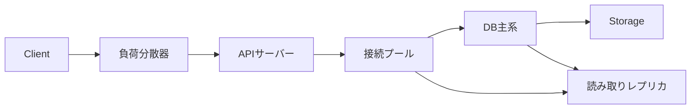
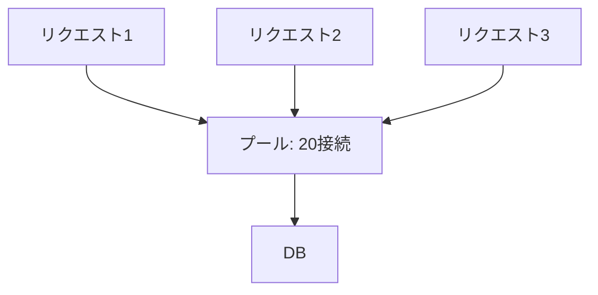

DB内部の仕組みを理解する目的は、実際のアプリケーションと運用で正しい判断をすることです。遅いAPIの原因はSQL文字列だけでなく、接続待ち、トランザクション境界、ロック、レプリカ遅延、移行、再試行の集中にあるかもしれません。

この章では、リクエストがDBへ到達する前後を含む端から端までのな設計と診断を扱います。

## この章で答える問い

- 接続プールはなぜ必要で、なぜ大きすぎても遅くなるのか
- プリペアド文とパラメーターはセキュリティと計画へどう影響するのか
- N+1、オフセット、長時間トランザクションはDB内部で何を増やすのか
- スキーマ移行を停止時間ゼロ／最小で行うにはどう段階化するのか
- 低速クエリ、ロック待機、バッファプール、レプリカ遅延をどう関連づけるのか
- バックアップとフェイルオーバーを「設定済み」ではなく「復旧可能」とどう証明するのか

## リクエスト経路



API遅延時間は各区間の合計です。

```text
リクエスト遅延時間
= APIでの待ち行列
+ 接続プール待ち
+ ネットワーク
+ DB実行
+ ロック/I/O待機
+ 直列化
+ 応答転送
```

DBクエリ時間だけを測ると、接続プール待ちやアプリケーション側N+1を見落とします。トレースへ接続取得とトランザクション区間を含めます。

## 接続のコスト

接続確立には：

- TCP/TLSハンドシェイク
- 認証
- 処理/スレッド/セッション割り当て
- セッションパラメーター 設定
- プリペアド文/キャッシュウォームアップ

が必要です。リクエストごとに新規接続を作ると遅延時間とDB資源を浪費します。

## 接続プール

プールは少数の長寿命接続をアプリケーションリクエスト間で再利用します。



プールの役割：

- 接続確立コストを償却
- DBへ流す同時実行性を制限
- リクエストをキューして逆圧
- 壊れた/期限切れ接続を交換

### プールを大きくすれば速くなるわけではない

DBが同時に効率よく処理できるクエリ数には上限があります。接続を増やしすぎると：

- CPUコンテキストスイッチ
- バッファ/キャッシュ競合
- ロックキュー
- セッションごとのメモリ
- I/Oキュー
- トランザクション数

が増え、処理量が頭打ちになった後遅延時間だけ悪化します。

### 大きさの決定

万能な式はありません。次から測定します。

1. DB CPU/コアとストレージ容量
2. クエリのCPU/I/O/ロック比率
3. APIインスタンス数
4. レプリカへの分散
5. 対象遅延時間
6. 障害時のインスタンス増加

```text
DB接続総数
= インスタンス当たりの接続プール数
× アプリケーションインスタンス数
× プロセス／ワーカー数
```

通常時10インスタンス × プール20 = 200でも、自動拡張で50インスタンスなら1000です。DBの最大接続数と一致させるだけでなく、実効同時実行性を小さく制御します。

### プールタイムアウト

プールが空のとき無制限に待たせるとリクエストキューが増え、利用者タイムアウト後もDB処理が残ります。

- 接続プール取得タイムアウト
- リクエスト期限
- クエリ/文のタイムアウト
- トランザクションタイムアウト

を整合させ、上流期限よりDBタイムアウトを少し短くします。

## 接続状態

プールへ返す前にトランザクション、一時設定、ロール、search_path、準備済み状態などを初期化します。

最も危険なのは未完了トランザクションのまま接続を返すことです。次リクエストが同じトランザクションを引き継いだり、ロック/スナップショットを保持し続けたりします。

ORM／セッションフレームワークの後始末保証を確認し、トランザクション内でアイドル状態の接続を監視します。

## プリペアド文とバインドパラメーター

```sql
SELECT id, status
FROM orders
WHERE customer_id = $1
  AND ordered_at >= $2;
```

バインドパラメーターの利点：

- SQLインジェクションを防ぐ境界を作る
- 解析/計画を再利用できる
- 型を明確にできる
- ログ記録で文と値を分離

表名、列名、ORDER BY方向は通常値パラメーターにできません。許可リストから識別子を選び、安全に引用符で囲みします。

### 計画キャッシュ

プリペアド文を再利用すると計画コストを減らせますが、パラメーター 分布によって最適計画が異なります。

- 汎用計画：再利用が安い、高負荷/低負荷値差に弱い
- カスタム計画：値に適応、毎回計画コスト

偏りの大きいクエリでは実際のパラメーター別遅延時間と計画を観測します。

## トランザクション境界

トランザクションは短く、必要なDB操作だけを含めます。

悪い例：

```text
BEGIN
SELECT ... FOR UPDATE
支払いAPIを呼び出し（2秒）
待機利用者/ネットワーク
UPDATE
コミット
```

ロックを保持したままネットワークを待ち、タイムアウト/デッドロックを増やします。

代替：

- 支払い意図/冪等性で外部操作を分離
- 予約状態をコミットしてSaga化
- 楽観的バージョンで再検証
- アウトボックスでイベントをトランザクション後に発行

DBトランザクションは外部API呼び出しをロールバックできません。

## N+1クエリ

注文100件を読み、各注文の明細を個別クエリすると101クエリになります。

```text
1クエリ: 注文
100クエリ: 注文ごとの明細
= 101往復
```

問題：

- ネットワーク往復通信
- プール占有
- 解析／計画の繰り返し
- スナップショット間の不整合
- DB QPS増幅

対策：

- 結合
- 一括WHERE order_id IN (...)
- ORM即時読み込み
- DataLoader/リクエスト単位の一括処理
- 事前計算済み集約

巨大結合で親行を重複させるコストもあるため、2クエリ一括が適切な場合があります。

## ページ送り

### オフセットページ送り

```sql
SELECT id, ordered_at
FROM orders
ORDER BY ordered_at DESC, id DESC
LIMIT 50 OFFSET 500000;
```

DBはオフセット分を読み捨てる必要があり、深いページほどコストが増えます。並行挿入/削除で行が重複・欠落することもあります。

### キーセットページ送り

最後に見たソートキーをカーソルにします。

```sql
SELECT id, ordered_at
FROM orders
WHERE (ordered_at, id) < ($last_ordered_at, $last_id)
ORDER BY ordered_at DESC, id DESC
LIMIT 50;
```

複合インデックスと一致すれば、カーソル位置から50件だけ読めます。同順位の決着用に一意なIDを含め、安定した全順序を作ります。

欠点：

- 任意ページ番号へ移動しにくい
- ソート条件ごとにカーソル設計
- カーソル符号化/versioning

## タイムアウトとキャンセル

クライアントが諦めてもDBクエリが動き続けると容量を消費します。

期限伝播：

```text
HTTP期限2.0s
  接続プールのタイムアウト0.2s
  DB文のタイムアウト1.5s
  応答時間予算0.3s
```

クエリキャンセルがサーバーへ届くか確認します。トランザクション中の文のタイムアウト後、トランザクションが中止状態になるドライバーもあるためロールバックします。

## 再試行

再試行可能：

- 直列化障害
- デッドロック犠牲対象
- 一時的な接続断
- リーダー 変更
- 流量制限/過負荷（Retry-After）

通常再試行しない：

- 制約違反
- 構文/型エラー
- 認証／認可
- 決定論的アプリケーションエラー

指数バックオフ + ジッター、上限回数、期限を使います。層ごとに3回再試行すると3³に増える再試行増幅を避け、一つの所有者層へ集約します。

書き込み再試行には冪等性キーが必要です。

## スキーマ移行

アプリケーションとスキーマを同時に一瞬で切り替えることはできません。ローリング展開では古い/新しいアプリケーションが同時に動きます。

### 拡張・縮約方式

例：customers.nameをfirst_name/last_nameへ分ける。

1. **拡張**：新しい列をNULL許容/既定値なしで追加
2. 新しいアプリケーションが古い/新しい両方を扱う
3. 既存行を小規模一括で既存データの補完
4. 読み取りを新しい列へ切り替える
5. 制約/インデックスをオンラインに検証
6. 古い書き込みを停止
7. **契約**：古い列を後のリリースで削除


移行とアプリケーションロールバックの両方が可能な互換期間を作ります。

### 表書き換え

列既定値/型変更が表全体書き換えや長時間ロックを起こすかはDBバージョン/操作によります。

本番環境前に：

- ロックの強さ
- 書き換え有無
- WAL/レプリケーション量
- ディスク余力
- 所要時間
- キャンセル/ロールバック方法

を同等データ量で検証します。

## オンラインインデックス作成

通常のインデックス構築が書き込みを停止する場合、並行する/オンライン機能を使います。

オンライン構築でも：

- CPU/I/O
- WAL
- レプリカ遅延
- 一時的なディスク
- 無効/失敗インデックス後始末
- 長時間トランザクション待ち

が発生します。ピーク外に流量制限し、進捗を監視します。

インデックス追加前後にクエリ計画と書き込み遅延時間を比較します。

## 既存データの補完

一括UPDATEは大規模トランザクション、WALの急増、ロック、肥大化、レプリカ遅延を起こします。

安全な既存データの補完：

- 主キー 範囲で小規模一括
- コミット各一括処理の間
- 流量制限
- 再開チェックポイント
- 冪等な更新条件
- 指標
- レプリカ遅延で速度制限

```sql
UPDATE orders
SET normalized_status = lower(status)
WHERE id > $last_id
  AND id <= $next_id
  AND normalized_status IS NULL;
```

完了後にNULL残数、チェックサム/標本、制約検証で確認します。

## 可観測性

### REDとUSE

アプリケーション側：

- 率
- エラー数
- 所要時間

資源側：

- 使用率
- 飽和
- エラー数

DBへ対応づけます。

| 症状 | 確認候補 |
| --- | --- |
| API遅延時間上昇 | 接続プール待ち、クエリ時間、ロック待機、I/O |
| DB CPU高騰 | QPS、計画変更、全件走査、式 |
| I/O飽和 | キャッシュミス、走査、チェックポイント、コンパクション |
| 接続枯渇 | 接続漏れ、長時間トランザクション、低速クエリ |
| レプリカ遅延 | 書き込みの急増、ネットワーク、適用、長時間クエリ |
| ディスク増加 | 肥大化、WAL保持期間、一時ファイル、バックアップ |

## 低速クエリログ

記録したいもの：

- 正規化済みクエリ／指紋
- 所要時間
- 行
- パラメーターの安全な標本
- データベース/利用者/アプリケーション
- 待機イベント
- トレース/リクエストID
- 計画ID/ハッシュ

機密データをログへ出さないマスキングが必要です。

平均遅延時間だけでなくp95/p99と合計時間を見ると、「非常に遅い少数クエリ」と「少し遅い大量クエリ」を区別できます。

```text
合計DB時間
= 呼び出し回数 × 平均所要時間
```

## 待機分析

クエリが遅いとき、CPUで実行中か何を待っているか分けます。

- ロック
- ストレージ読み取り/書き込み
- WAL書き出し
- ネットワーク/クライアント
- バッファ固定/ラッチ
- 並列ワーカー
- レプリカ適用

待機イベントとブロッカーグラフをトレースへ結び、症状ではなくボトルネックを特定します。

## 計画の性能退行

同じクエリが急に遅くなる原因：

- 統計情報更新
- データ分布変化
- パラメーター差
- インデックス追加/削除
- DB更新
- メモリ/キャッシュ状態
- スキーマ/型変更

クエリ指紋ごとの計画履歴、遅延時間、行を保存すると比較できます。緊急時ヒントで戻す場合も、根本の統計情報/データを調べます。

## 不要版の回収と統計情報

MVCC DBでは不要版の回収が古いバージョンを回収し、統計情報が最適化器を支えます。

監視：

- 不要タプル/履歴長
- 最後の不要版の回収/解析
- 長時間トランザクション
- トランザクションID経過時間
- 表/インデックス肥大化
- 自動保守ワーカーの飽和

保守を「暇な時間だけの仕事」と考えると、書き込み中心の表で追いつかず利用者向け処理遅延時間へ跳ね返ります。

## バックアップと復元訓練

バックアップ成功ログは復旧証明ではありません。

復元訓練：

1. 隔離環境へ復元
2. WAL/PITRを対象まで適用
3. アプリケーション層の整合性検査
4. 行/標本/チェックサム検証
5. 接続・起動手順
6. 実測RTO
7. 欠損WAL/認証情報/権限確認
8. 運用手順書更新

暗号鍵、シークレット、拡張機能、外部オブジェクトストレージも復元範囲に含めます。

## フェイルオーバーと計画切り替え

- **フェイルオーバー**：予期しない障害で待機系へ切替
- **計画切り替え**：計画済み保守でロールを安全に交換

確認項目：

- 切り替え候補の鮮度
- データ損失/RPO
- フェンシング古い主系
- DNS/プロキシ/クライアントキャッシュ
- 接続再試行
- 読み取り専用/書き込み方式
- 連番/自動採番
- バックグラウンドジョブ
- 監視警告の解除

フェイルオーバー試験は「新しい主系が起動した」だけでなくアプリケーション書き込み/読み取り、古い主系復帰、切り戻しまで行います。

## セキュリティ

### 最小権限

アプリケーションロールへ必要な表/操作だけを許可します。移行ロール、読み取り専用分析処理、バックアップロールを分離します。

### SQLインジェクション

値はバインドパラメーター、動的な識別子は許可リスト。文字列連結でSQLを作らない。

### 暗号化

- TLS通信時
- ストレージ/バックアップ保存時暗号化
- 列／アプリケーション層の機密データの暗号化
- 鍵のローテーションと復旧

暗号化はアクセス制御やSQLインジェクション対策の代替ではありません。

### シークレット管理

認証情報をソースコード／ログ／イメージへ入れず、シークレット管理機構と短命認証情報を使います。ローテーション時にプール接続を更新できるようにします。

### 監査

誰が、いつ、どのデータへ、どの操作をしたかを記録します。大量の監査のストレージ、改ざん耐性、保持期間、プライバシーも設計します。

## 容量計画

現在の平均ではなく増加傾向と障害形態を含めます。

```text
ピーク負荷
× 増加率
× フェイルオーバー時の集中係数
× 安全余裕
```

レプリカ3台へ読み取りを均等分散している場合、1台停止時は残りの負荷が1.5倍です。保守/再シャーディング/バックアップが重なる余力も必要です。

負荷試験では本番環境に近いデータ量、偏り、インデックス/キャッシュ状態、同時実行性を使います。空の小規模DBのベンチマークは計画もI/Oも異なります。

## インシデント応答

1. 利用者への影響とSLOを確認
2. 変更/イベント時系列を固定
3. 飽和した資源と待機を特定
4. 負荷を減らす安全な緩和策
5. クエリ/計画/ロック/レプリカを切り分け
6. 復旧操作の副作用を評価
7. 証拠を保存
8. 事後検証で再発防止

「DBを再起動」「接続上限を増やす」は一時的にキューを消しても原因を隠すことがあります。

## よくある誤解

### 「DB max_connectionsまでプールを使う」

接続上限は安全な実効同時実行性ではありません。全アプリケーションインスタンスとセッションごとのメモリを考えます。

### 「無停止移行はロックを取らない」

短いメタデータロックや検証、資源競合は残ります。互換性と停止時間を小さくする設計です。

### 「バックアップジョブが成功なら復旧できる」

復元、キー、WAL連続性、アプリケーション検証、実測時間を試して初めて証明できます。

## まとめ

- リクエスト遅延時間はプール待ち、ネットワーク、DB実行、ロック/I/O待ちを分けて観測する
- プールは接続再利用だけでなくDB同時実行性への逆圧である
- トランザクション内で外部APIや利用者入力を待たない
- N+1は往復通信とQPSを増幅し、キーセットページ送りは深いオフセットを避ける
- タイムアウトを端から端までの期限へ揃え、再試行を一層へ集約する
- 拡張・縮約方式移行で古い/新しいアプリケーションの互換期間を作る
- 既存データの補完とオンラインインデックスもWAL、I/O、レプリカ遅延を監視する
- 低速クエリは計画、行、ループ数、待機、トレースを結びつける
- バックアップは復元訓練、フェイルオーバーはアプリケーション確認とフェンシングまで試す
- 最小権限、バインドパラメーター、暗号化、監査を層として組み合わせる

## 確認問題

1. アプリケーションインスタンス数を無視した接続プールの大きさの決定が危険な理由を説明してください。
2. N+1を結合一つにまとめる以外の解決を二つ挙げてください。
3. 拡張・縮約方式で列名前変更を安全に行う手順を設計してください。
4. 低速APIを接続プール待ち、ロック、I/Oへ切り分ける観測項目を書いてください。
5. バックアップ成功と復元可能性が同じでない理由を説明してください。

## 参考資料

- [PostgreSQL Documentation: Monitoring Database Activity](https://www.postgresql.org/docs/current/monitoring-stats.html)
- [PostgreSQL Documentation: Routine Vacuuming](https://www.postgresql.org/docs/current/routine-vacuuming.html)
- [PostgreSQL Documentation: Backup and Restore](https://www.postgresql.org/docs/current/backup.html)
- [OWASP: SQL Injection Prevention Cheat Sheet](https://cheatsheetseries.owasp.org/cheatsheets/SQL_Injection_Prevention_Cheat_Sheet.html)

最終章では、1件の注文をスキーマ、ページ、計画、トランザクション、WAL、レプリケーション、シャーディング、Sagaまで全レイヤーで追跡します。
