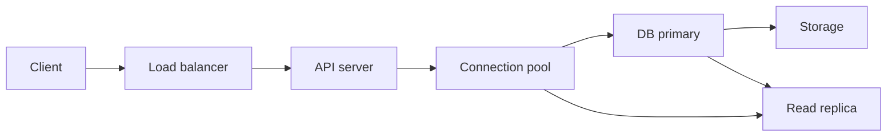
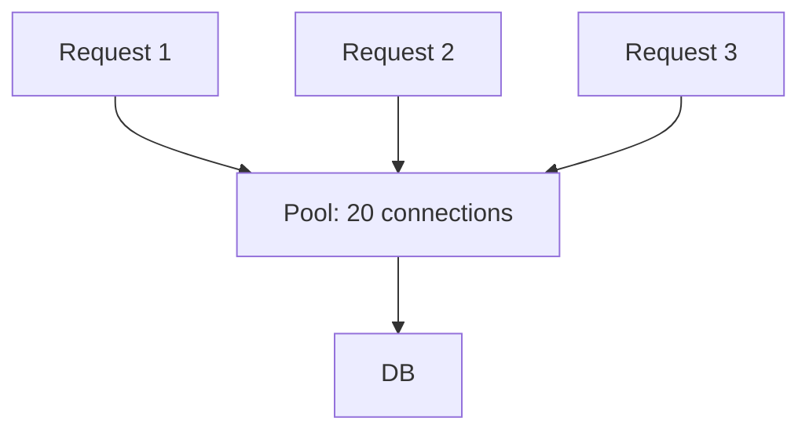
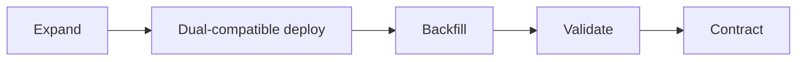

DB内部の仕組みを理解する目的は、実際のapplicationと運用で正しい判断をすることです。遅いAPIの原因はSQL textだけでなく、connection待ち、transaction境界、lock、replica lag、migration、retry stormにあるかもしれません。

この章では、requestがDBへ到達する前後を含むend-to-endな設計と診断を扱います。

## この章で答える問い

- Connection poolはなぜ必要で、なぜ大きすぎても遅くなるのか
- Prepared statementとparameterはsecurityとplanへどう影響するのか
- N+1、OFFSET、長時間transactionはDB内部で何を増やすのか
- Schema migrationをzero/low downtimeで行うにはどう段階化するのか
- Slow query、lock wait、Buffer Pool、replica lagをどう関連づけるのか
- Backupとfailoverを「設定済み」ではなく「復旧可能」とどう証明するのか

## request path



API latencyは各区間の合計です。

```text
request latency
= queue at API
+ pool wait
+ network
+ DB execution
+ lock/I/O wait
+ serialization
+ response transfer
```

DB query timeだけを測ると、pool waitやapplication側N+1を見落とします。Traceへconnection取得とtransaction spanを含めます。

## connectionのcost

Connection確立には：

- TCP/TLS handshake
- Authentication
- Process/thread/session allocation
- Session parameter setup
- Prepared statement/cache warm-up

が必要です。Requestごとに新規connectionを作るとlatencyとDB resourceを浪費します。

## connection pool

Poolは少数の長寿命connectionをapplication request間で再利用します。



Poolの役割：

- Connection確立costを償却
- DBへ流すconcurrencyを制限
- Requestをqueueしてbackpressure
- Broken/expired connectionを交換

### poolを大きくすれば速くなるわけではない

DBが同時に効率よく処理できるquery数には上限があります。Connectionを増やしすぎると：

- CPU context switch
- Buffer/cache contention
- Lock queue
- Per-session memory
- I/O queue
- Transaction数

が増え、throughputが頭打ちになった後latencyだけ悪化します。

### sizing

万能な式はありません。次から測定します。

1. DB CPU/coreとstorage capacity
2. QueryのCPU/I/O/lock比率
3. API instance数
4. Replicaへの分散
5. Target latency
6. Failure時のinstance増加

```text
total possible DB connections
= pool per instance
× application instances
× process/workers
```

通常時10 instance × pool 20 = 200でも、autoscalingで50 instanceなら1000です。DB max connectionと一致させるだけでなく、実効concurrencyを小さく制御します。

### pool timeout

Poolが空のとき無制限に待たせるとrequest queueが増え、user timeout後もDB workが残ります。

- Pool acquisition timeout
- Request deadline
- Query/statement timeout
- Transaction timeout

を整合させ、上流deadlineよりDB timeoutを少し短くします。

## connection state

Poolへ返す前にtransaction、temporary setting、role、search_path、prepared stateなどをresetします。

最も危険なのはopen transactionのままconnectionを返すことです。次requestが同じtransactionを引き継いだり、lock/snapshotを保持し続けたりします。

ORM/session frameworkのcleanup保証を確認し、idle in transactionを監視します。

## prepared statementとbind parameter

```sql
SELECT id, status
FROM orders
WHERE customer_id = $1
  AND ordered_at >= $2;
```

Bind parameterの利点：

- SQL injectionを防ぐ境界を作る
- Parse/planを再利用できる
- Typeを明確にできる
- Loggingでstatementとvalueを分離

Table名、column名、ORDER BY方向は通常value parameterにできません。Allowlistからidentifierを選び、安全にquoteします。

### plan cache

Prepared statementを再利用するとplanning costを減らせますが、parameter distributionによって最適planが異なります。

- Generic plan：再利用が安い、hot/cold value差に弱い
- Custom plan：valueに適応、毎回planning cost

High skew queryではactual parameter別latencyとplanを観測します。

## transaction boundary

Transactionは短く、必要なDB操作だけを含めます。

悪い例：

```text
BEGIN
SELECT ... FOR UPDATE
call payment API (2 seconds)
wait user/network
UPDATE
COMMIT
```

Lockを保持したままnetworkを待ち、timeout/deadlockを増やします。

代替：

- Payment intent/idempotencyで外部operationを分離
- Reservation statusをcommitしてSaga化
- Optimistic versionで再検証
- Outboxでeventをtransaction後に発行

DB transactionは外部API callをrollbackできません。

## N+1 query

注文100件を読み、各注文のitemsを個別queryすると101 queryになります。

```text
1 query: orders
100 queries: items per order
= 101 round trips
```

問題：

- Network round trip
- Pool占有
- Repeated parse/plan
- Snapshot間の不整合
- DB QPS増幅

対策：

- JOIN
- Batch WHERE order_id IN (...)
- ORM eager loading
- DataLoader/request-scoped batching
- Precomputed aggregate

巨大JOINでparent rowを重複させるcostもあるため、2 query batchが適切な場合があります。

## pagination

### OFFSET pagination

```sql
SELECT id, ordered_at
FROM orders
ORDER BY ordered_at DESC, id DESC
LIMIT 50 OFFSET 500000;
```

DBはoffset分を読み捨てる必要があり、深いpageほどcostが増えます。並行insert/deleteでrowが重複・欠落することもあります。

### keyset pagination

最後に見たsort keyをcursorにします。

```sql
SELECT id, ordered_at
FROM orders
WHERE (ordered_at, id) < ($last_ordered_at, $last_id)
ORDER BY ordered_at DESC, id DESC
LIMIT 50;
```

Composite indexと一致すれば、cursor位置から50件だけ読めます。Tie-breakerにunique idを含め、stable total orderを作ります。

欠点：

- 任意page番号へjumpしにくい
- Sort条件ごとにcursor設計
- Cursor encoding/versioning

## timeoutとcancellation

Clientが諦めてもDB queryが動き続けるとcapacityを消費します。

Deadline propagation：

```text
HTTP deadline 2.0s
  pool timeout 0.2s
  DB statement timeout 1.5s
  response budget 0.3s
```

Query cancellationがserverへ届くか確認します。Transaction中のstatement timeout後、transactionがaborted stateになるdriverもあるためrollbackします。

## retry

Retry可能：

- Serialization failure
- Deadlock victim
- Transient connection loss
- Leader change
- Rate limit/overload（Retry-After）

通常retryしない：

- Constraint violation
- Syntax/type error
- Authentication/authorization
- Deterministic application error

Exponential backoff + jitter、上限回数、deadlineを使います。Layerごとに3回retryすると3³に増えるretry amplificationを避け、一つのowner layerへ集約します。

Write retryにはidempotency keyが必要です。

## schema migration

Applicationとschemaを同時に一瞬で切り替えることはできません。Rolling deploymentではold/new applicationが同時に動きます。

### expand-contract

例：customers.nameをfirst_name/last_nameへ分ける。

1. **Expand**：new columnsをnullable/defaultなしで追加
2. New applicationがold/new両方を扱う
3. Existing rowsをsmall batchでbackfill
4. Readをnew columnsへ切り替える
5. Constraint/indexをonlineにvalidate
6. Old writeを停止
7. **Contract**：old columnを後のreleaseで削除



Migrationとapplication rollbackの両方が可能なcompatibility windowを作ります。

### table rewrite

Column default/type変更がtable全体rewriteやlong lockを起こすかはDB version/operationによります。

Production前に：

- Lock level
- Rewrite有無
- WAL/replication量
- Disk headroom
- Duration
- Cancel/rollback方法

を同等data量で検証します。

## online index creation

通常のindex buildがwriteをblockする場合、concurrent/online optionを使います。

Online buildでも：

- CPU/I/O
- WAL
- Replica lag
- Temporary disk
- Invalid/failed index cleanup
- Long transaction待ち

が発生します。Peak外にrate limitし、progressを監視します。

Index追加前後にquery planとwrite latencyを比較します。

## backfill

一括UPDATEはlarge transaction、WAL burst、lock、bloat、replica lagを起こします。

安全なbackfill：

- Primary key rangeでsmall batch
- Commit between batches
- Rate limit
- Resume checkpoint
- Idempotent update condition
- Metrics
- Replica lagでthrottle

```sql
UPDATE orders
SET normalized_status = lower(status)
WHERE id > $last_id
  AND id <= $next_id
  AND normalized_status IS NULL;
```

Completion後にNULL残数、checksum/sample、constraint validationで確認します。

## observability

### REDとUSE

Application側：

- Rate
- Errors
- Duration

Resource側：

- Utilization
- Saturation
- Errors

DBへ対応づけます。

| Symptom | 確認候補 |
| --- | --- |
| API latency上昇 | pool wait、query time、lock wait、I/O |
| DB CPU高騰 | QPS、plan change、full scan、expression |
| I/O saturation | cache miss、scan、checkpoint、compaction |
| Connection枯渇 | leak、long transaction、slow query |
| Replica lag | write burst、network、apply、long query |
| Disk増加 | bloat、WAL retention、temp、backup |

## slow query log

記録したいもの：

- Normalized query/fingerprint
- Duration
- Rows
- Parametersの安全なsample
- Database/user/application
- Wait event
- Trace/request ID
- Plan ID/hash

Sensitive dataをlogへ出さないmaskingが必要です。

Average latencyだけでなくp95/p99とtotal timeを見ると、「非常に遅い少数query」と「少し遅い大量query」を区別できます。

```text
total DB time
= calls × average duration
```

## wait analysis

Queryが遅いとき、CPUで実行中か何を待っているか分けます。

- Lock
- Storage read/write
- WAL flush
- Network/client
- Buffer pin/latch
- Parallel worker
- Replica apply

Wait eventとblocker graphをtraceへ結び、症状ではなくbottleneckを特定します。

## plan regression

同じqueryが急に遅くなる原因：

- Statistics更新
- Data distribution変化
- Parameter差
- Index追加/削除
- DB upgrade
- Memory/cache state
- Schema/type変更

Query fingerprintごとのplan history、latency、rowsを保存すると比較できます。Emergency hintで戻す場合も、根本のstatistics/dataを調べます。

## vacuumとstatistics

MVCC DBではvacuumがold versionを回収し、statisticsがoptimizerを支えます。

監視：

- Dead tuples/history length
- Last vacuum/analyze
- Long transaction
- Transaction ID age
- Table/index bloat
- Auto maintenance worker saturation

Maintenanceを「暇な時間だけの仕事」と考えると、write-heavy tableで追いつかずforeground latencyへ跳ね返ります。

## backupとrestore drill

Backup success logは復旧証明ではありません。

Restore drill：

1. Isolated environmentへrestore
2. WAL/PITRをtargetまでapply
3. Application-level consistency check
4. Row/sample/checksum検証
5. 接続・起動手順
6. 実測RTO
7. 欠損WAL/credential/permission確認
8. Runbook更新

Encryption key、secret、extension、external object storageも復元範囲に含めます。

## failoverとswitchover

- **Failover**：unexpected failureでstandbyへ切替
- **Switchover**：planned maintenanceでroleを安全に交換

確認項目：

- Candidate freshness
- Data loss/RPO
- Fencing old primary
- DNS/proxy/client cache
- Connection retry
- Read-only/write mode
- Sequence/identity
- Background jobs
- Monitoring alert reset

Failover testは「new primaryが起動した」だけでなくapplication write/read、old primary復帰、failbackまで行います。

## security

### least privilege

Application roleへ必要なtable/operationだけを許可します。Migration role、read-only analytics、backup roleを分離します。

### SQL injection

Valueはbind parameter、dynamic identifierはallowlist。String連結でSQLを作らない。

### encryption

- TLS in transit
- Storage/backup encryption at rest
- Column/application-level encryption for sensitive data
- Key rotationとrecovery

Encryptionはaccess controlやSQL injection対策の代替ではありません。

### secret管理

Credentialをsource code/log/imageへ入れず、secret managerと短命credentialを使います。Rotation時にpool connectionを更新できるようにします。

### audit

誰が、いつ、どのdataへ、どのoperationをしたかを記録します。High-volume auditのstorage、tamper resistance、retention、privacyも設計します。

## capacity planning

Current averageではなくgrowthとfailure modeを含めます。

```text
peak load
× growth factor
× failover concentration
× safety margin
```

Replica 3台へreadを均等分散している場合、1台停止時は残りのloadが1.5倍です。Maintenance/resharding/backupが重なるheadroomも必要です。

Load testではproductionに近いdata volume、skew、index/cache state、concurrencyを使います。Empty small DBのbenchmarkはplanもI/Oも異なります。

## incident response

1. User impactとSLOを確認
2. Change/event timelineを固定
3. Saturated resourceとwaitを特定
4. Loadを減らす安全なmitigation
5. Query/plan/lock/replicaを切り分け
6. Recovery actionの副作用を評価
7. Evidenceを保存
8. Post-incidentで再発防止

「DBを再起動」「connection上限を増やす」は一時的にqueueを消しても原因を隠すことがあります。

## よくある誤解

### 「DB max_connectionsまでpoolを使う」

Connection上限は安全な実効concurrencyではありません。全application instanceとper-session memoryを考えます。

### 「zero-downtime migrationはlockを取らない」

短いmetadata lockやvalidation、resource競合は残ります。互換性と停止時間を小さくする設計です。

### 「backup jobがgreenなら復旧できる」

Restore、key、WAL連続性、application検証、実測時間を試して初めて証明できます。

## まとめ

- Request latencyはpool待ち、network、DB実行、lock/I/O待ちを分けて観測する
- Poolはconnection再利用だけでなくDB concurrencyへのbackpressureである
- Transaction内で外部APIやuser inputを待たない
- N+1はround tripとQPSを増幅し、keyset paginationはdeep OFFSETを避ける
- Timeoutをend-to-end deadlineへ揃え、retryを一layerへ集約する
- Expand-contract migrationでold/new applicationの互換期間を作る
- Backfillとonline indexもWAL、I/O、replica lagを監視する
- Slow queryはplan、rows、loops、wait、traceを結びつける
- Backupはrestore drill、failoverはapplication確認とfencingまで試す
- Least privilege、bind parameter、encryption、auditを層として組み合わせる

## 確認問題

1. Application instance数を無視したpool sizingが危険な理由を説明してください。
2. N+1をJOIN一つにまとめる以外の解決を二つ挙げてください。
3. Expand-contractでcolumn renameを安全に行うstepを設計してください。
4. Slow APIをpool wait、lock、I/Oへ切り分ける観測項目を書いてください。
5. Backup successとrestore可能性が同じでない理由を説明してください。

## 参考資料

- [PostgreSQL Documentation: Monitoring Database Activity](https://www.postgresql.org/docs/current/monitoring-stats.html)
- [PostgreSQL Documentation: Routine Vacuuming](https://www.postgresql.org/docs/current/routine-vacuuming.html)
- [PostgreSQL Documentation: Backup and Restore](https://www.postgresql.org/docs/current/backup.html)
- [OWASP: SQL Injection Prevention Cheat Sheet](https://cheatsheetseries.owasp.org/cheatsheets/SQL_Injection_Prevention_Cheat_Sheet.html)

最終章では、1件の注文をschema、page、plan、transaction、WAL、replication、sharding、Sagaまで全レイヤーで追跡します。
