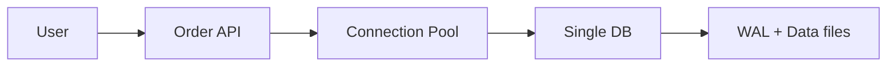
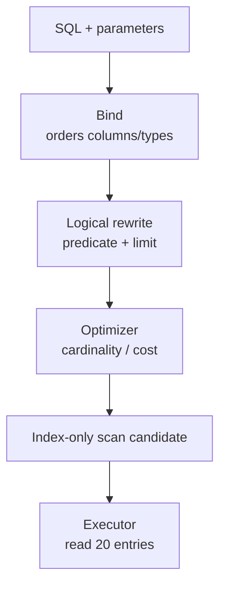
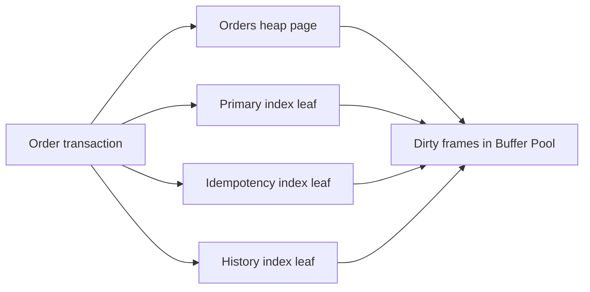
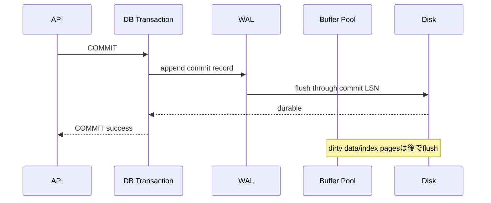
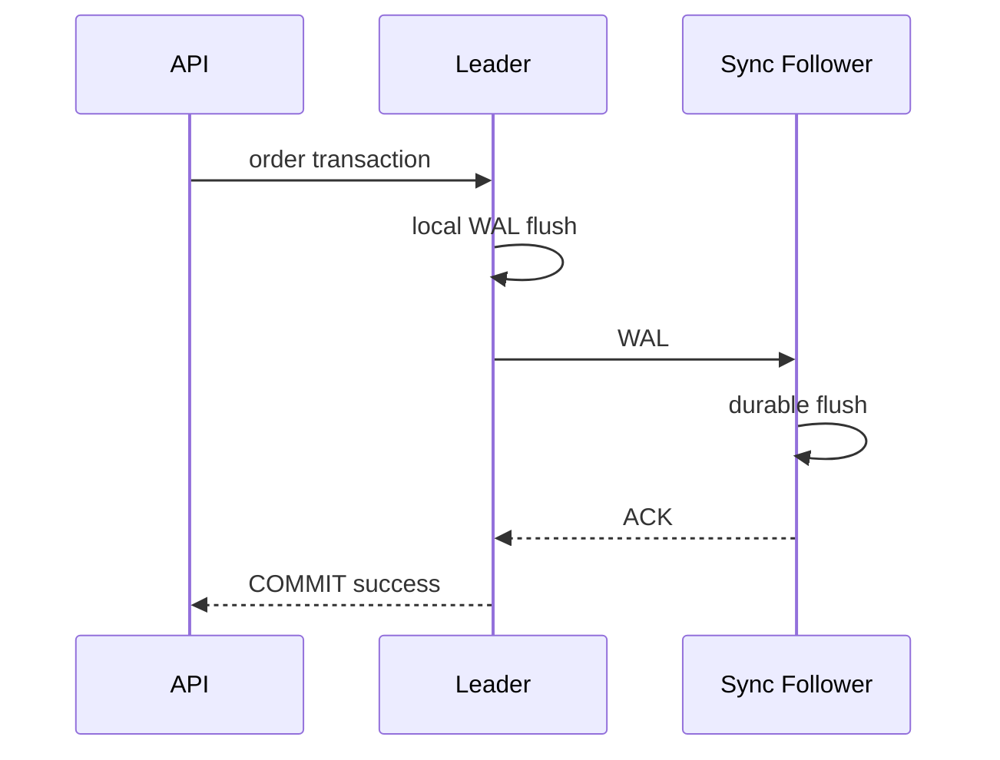
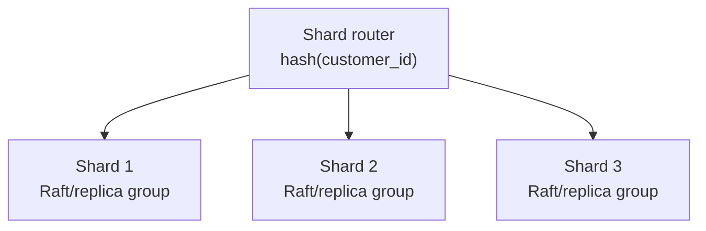
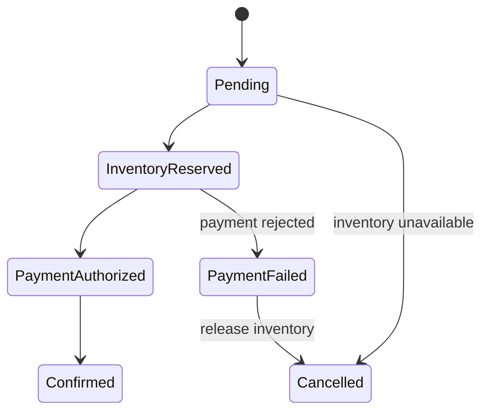
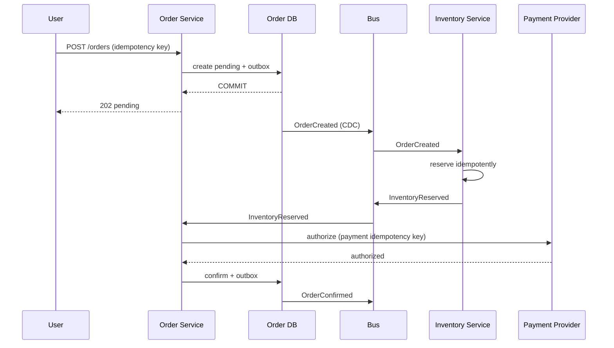

この章では、本書の概念を一つの注文処理へ統合します。正常系を図示するだけでなく、競合、crash、response loss、replica lag、network partitionが起きたときに何が残るかを追跡します。

最終的な問いは一つです。

> 「注文完了をuserへ返した」とき、systemのどこまでが、どのfailureに対して保証されているのか。

## この章で答える問い

- 単一nodeで注文を作るとき、schema、index、transaction、WALはどう連携するのか
- COMMIT前後のcrashとresponse lossで、どのdurable stateが残るのか
- Replicationとfailoverを追加すると「注文完了」の意味はどう変わるのか
- Sharding後に在庫不変条件をどこで守るのか
- Paymentを含むSagaをoutbox、inbox、idempotencyでどう回復可能にするのか

## system要件

小さなEC serviceから始めます。

Functional requirement：

- 顧客が商品を1個購入する
- 在庫0なら注文を作らない
- 同じrequest retryで二重注文しない
- 注文履歴を新しい順に表示する
- 決済成功後に注文をconfirmedにする

Non-functional requirement：

- 注文API p99 < 500 ms
- 在庫oversellを許さない
- Commit済み注文のRPO = 0を目標
- Primary failureからRTO < 2 min
- 監査のため注文履歴を7年保持
- Payment provider timeoutを安全にretry

要件によって設計は変わります。RPO=5分を許せるならasync replica、RPO=0ならsynchronous durable replicaやconsensusを検討します。

## Stage 1：単一node DB

最初はapplicationと一つのPostgreSQL相当RDBを使います。



分散化を急がず、constraintとtransactionで不変条件を一か所へ集めます。

## schema

```sql
CREATE TABLE customers (
  id     BIGINT GENERATED ALWAYS AS IDENTITY PRIMARY KEY,
  email  TEXT NOT NULL UNIQUE,
  name   TEXT NOT NULL
);

CREATE TABLE products (
  id     BIGINT GENERATED ALWAYS AS IDENTITY PRIMARY KEY,
  sku    TEXT NOT NULL UNIQUE,
  name   TEXT NOT NULL,
  price  INTEGER NOT NULL CHECK (price >= 0)
);

CREATE TABLE inventory (
  product_id  BIGINT PRIMARY KEY REFERENCES products(id),
  available   INTEGER NOT NULL CHECK (available >= 0),
  version     BIGINT NOT NULL DEFAULT 0
);

CREATE TABLE order_requests (
  idempotency_key  TEXT PRIMARY KEY,
  request_hash     TEXT NOT NULL,
  status           TEXT NOT NULL
                   CHECK (status IN ('processing', 'completed', 'failed')),
  response         JSONB,
  created_at       TIMESTAMPTZ NOT NULL DEFAULT now()
);

CREATE TABLE orders (
  id               BIGINT GENERATED ALWAYS AS IDENTITY PRIMARY KEY,
  idempotency_key  TEXT NOT NULL UNIQUE,
  customer_id      BIGINT NOT NULL REFERENCES customers(id),
  status           TEXT NOT NULL
                   CHECK (status IN (
                     'pending', 'inventory_reserved', 'payment_authorized',
                     'confirmed', 'payment_failed', 'cancelled'
                   )),
  total_amount     INTEGER NOT NULL CHECK (total_amount >= 0),
  ordered_at       TIMESTAMPTZ NOT NULL DEFAULT now()
);

CREATE TABLE order_items (
  order_id      BIGINT NOT NULL REFERENCES orders(id),
  product_id    BIGINT NOT NULL REFERENCES products(id),
  product_name  TEXT NOT NULL,
  unit_price    INTEGER NOT NULL CHECK (unit_price >= 0),
  quantity      INTEGER NOT NULL CHECK (quantity > 0),
  PRIMARY KEY (order_id, product_id)
);
```

Product nameとunit priceをorder_itemsへsnapshotとして保存します。Product masterが後で変わっても購入時点の明細を保持するための意図的な非正規化です。

Idempotency keyはclient operationを一意にします。

## index

Primary/UNIQUE constraintが作るindexに加え、注文履歴用を作ります。

```sql
CREATE INDEX orders_customer_history_idx
ON orders (customer_id, ordered_at DESC, id DESC)
INCLUDE (status, total_amount);
```

この順序は次のqueryに対応します。

```sql
SELECT id, ordered_at, status, total_amount
FROM orders
WHERE customer_id = $1
  AND (ordered_at, id) < ($2, $3)
ORDER BY ordered_at DESC, id DESC
LIMIT 20;
```

- customer_id equalityで顧客rangeを選ぶ
- ordered_at, idでstableな降順
- Cursor位置から20件
- status/total_amountをcovering payloadにする

Wide indexのwrite costとvisibilityによるtable accessは測定します。

## request contract

```http
POST /orders
Idempotency-Key: 01K3...

{
  "customerId": 101,
  "productId": 7,
  "quantity": 1
}
```

Serverは同じkeyと同じrequest bodyなら保存済みresultを返し、同じkeyで異なるbodyなら409相当を返します。

Timeout後もclientは同じkeyでretryします。

## transaction

一商品版のtransactionを作ります。

```sql
BEGIN;

-- 1. 同一operationの結果を確保
INSERT INTO order_requests (idempotency_key, request_hash, status)
VALUES ($key, $hash, 'processing')
ON CONFLICT (idempotency_key) DO NOTHING;

-- 既存ならrequest_hashと保存済みresultを検査して終了

-- 2. 条件付きで在庫を引く
UPDATE inventory
SET available = available - $quantity,
    version = version + 1
WHERE product_id = $product_id
  AND available >= $quantity;

-- affected rows = 0ならROLLBACKしてsold_out

-- 3. 商品情報を読み、注文と明細を作る
INSERT INTO orders (..., status, ...)
VALUES (..., 'pending', ...)
RETURNING id;

INSERT INTO order_items (...)
SELECT ..., name, price, $quantity
FROM products
WHERE id = $product_id;

-- 4. idempotency recordへ結果を保存
UPDATE order_requests
SET status = 'completed',
    response = $response
WHERE idempotency_key = $key;

COMMIT;
```

:::note[簡略化]
実装ではrequest hashの検証、error result retention、price変更との整合、複数itemのlock順を追加します。ここでは内部経路を追いやすくするため一商品へ絞ります。
:::

## oversellを防ぐ

ApplicationでSELECTしてからUPDATEするとlost updateやcheck-then-act raceが起きます。

```text
available = 1

T1 reads 1
T2 reads 1
T1 writes 0
T2 writes 0
→ 2 orders created
```

条件付きatomic UPDATEなら同じrowへのwrite conflictが直列化されます。

```sql
UPDATE inventory
SET available = available - 1
WHERE product_id = 7
  AND available >= 1;
```

最初のtransactionが0へ更新してcommitした後、次のtransactionはpredicateを再確認しaffected rows=0になります。

複数productを更新する場合はproduct_id昇順でlock/updateし、deadlockを減らします。

## SQLが内部を通る

注文履歴queryを追います。



Statisticsはcustomer_idごとの注文数とordered_at分布を近似します。通常顧客は20件でも、一部merchant accountが1000万件ならparameter-sensitive planが必要かもしれません。

EXPLAINで確認：

- Index conditionにcustomer/cursorが入るか
- Actual rowsが20付近か
- Heap/table fetches
- Rows removed by filter
- Buffer hits/reads
- Planning/execution time

## pageとBuffer Pool

Insert時：

1. orders heap/data pageをBuffer Poolへpin
2. 空きslotへnew record
3. Primary、idempotency、history index leafを更新
4. 各変更のWAL recordをappend
5. Dirty pagesをunpin



同じ顧客注文がhistory indexで近くに並び、recent pageがcacheされやすくなります。Heap pageは別配置なのでindex-only条件を満たさない場合は追加accessします。

Indexが増えるほど1注文のdirty pageとWAL量が増えます。

## COMMITとWAL



APIがsuccessを受けた時点で、local machine crash後にWALからredoできる保証です。Data page本体がすべて書かれたという意味ではありません。

## crash injection

### Case A：在庫UPDATE後、COMMIT前にprocess crash

- WALにupdate recordがあるかもしれない
- Transaction commit recordはない
- Dirty pageがdata fileへsteal済みかもしれない
- Recoveryはloser transactionをundo
- 注文は成功として返していない

### Case B：COMMIT WAL flush後、response前にAPI/connection loss

- DB transactionはcommit済み
- Clientは結果を知らない
- 同じidempotency keyでretry
- Serverは保存済みresponseを返す
- 新しい注文は作らない

### Case C：COMMIT response後、data page flush前にmachine crash

- WALはdurable
- Recoveryでredo
- Local storageが残る限り注文は復元

### Case D：diskとWALを同時喪失

- Local recovery不能
- Synchronous replica、backup/PITRが必要

Failure pointごとに証拠となるdurable stateを確認します。

## Stage 2：leader/follower

RPO=0を目標に、別failure domainのsynchronous followerをcommit条件へ入れます。



Successの意味は「leaderと指定followerに必要WALがdurable」です。Follower apply完了まで待たない構成なら、即時follower readはまだ古い可能性があります。

## read routing

注文直後の確認画面は：

- Leaderからread
- Commit LSN tokenを渡し、replay済みreplicaだけ選ぶ
- Synchronous apply mode

のいずれかでread-after-writeを守ります。

過去注文一覧は数秒のstalenessを許し、async read replicaへ送れます。API endpointごとにconsistency requirementを決めます。

## failover

Leader failure時：

1. Failure detectorが疑う
2. Synchronous/最もfreshなfollowerをcandidateへ
3. Consensus/fencingでold leaderのwriteを止める
4. New leaderへrouting
5. Pool connectionを再確立
6. In-flight requestを同じidempotency keyでretry

Response lossにより「commitしたか不明」のrequestが発生します。Idempotency recordがnew leaderへ複製されていることが重要です。

Old leader復帰時、勝手にprimaryとしてwriteを受けないようfenceし、new timelineへ追従させます。

## replicationだけで守れないもの

- OperatorがordersをDELETE
- Bugが在庫を0にする
- Schema migrationがdataを破壊
- Corruptionが全replicaへ広がる

Backup/PITRを別failure domainへ持ち、restore drillします。

## Stage 3：sharding

注文dataとwrite loadが一clusterへ収まらなくなったとします。

Customer単位のquery/transactionが中心なのでcustomer_id hashでshardします。



Customers、orders、order_itemsをcustomer_idでco-locateします。

問題：inventoryはproduct_id単位で全顧客が競合します。Customer shardへ複製すると同じ在庫を独立に引いてoversellします。

選択肢：

1. Inventoryをproduct_id owner shardへ置きdistributed transaction
2. Warehouse/regionごとに在庫quotaをescrow配分
3. Reservation serviceを単一ownerとして呼ぶSaga
4. Productごとにstock tokenを事前partition

Write hotspotとatomicity requirementで選びます。

## escrowによる分割

Global在庫100を4 regionへquota配分します。

```text
Region A: 30
Region B: 30
Region C: 20
Region D: 20
Total:   100
```

各regionはlocal transactionでquota内を販売でき、oversellしません。需要偏り時にquota transferが必要で、global available表示はeventually consistentになります。

Exact global在庫とlow-latency local writeのtrade-offです。

## Stage 4：paymentとのSaga

Payment providerは2PC participantになれません。Order workflowをSagaとしてmodel化します。

状態：



Order DBの各state transitionとoutbox eventを同じlocal transactionでcommitします。

## outbox

```sql
BEGIN;

UPDATE orders
SET status = 'inventory_reserved'
WHERE id = $order_id
  AND status = 'pending';

INSERT INTO outbox (
  event_id, aggregate_id, aggregate_version, event_type, payload
) VALUES (
  $event_id, $order_id, 2, 'InventoryReserved', $payload
);

COMMIT;
```

CDC/relayがeventをat-least-onceでpublishします。Payment consumerはevent_idをinboxへ記録しduplicateを無害化します。

## payment idempotency

Payment requestにも注文ID/attempt IDをidempotency keyとして渡します。

```text
payment key = order-42:authorization:v1
```

Timeout後は同じkeyでstatusを確認/retryします。新しいkeyで再送すると二重authorization/captureの危険があります。

Payment authorized後、order confirm前にcrashしても、outbox/inboxとworkflow stateから再開します。

## compensation

Payment rejected：

1. Orderをpayment_failedへ
2. ReleaseInventory command/event
3. Inventory reservationをidempotently解放
4. Orderをcancelledへ

Payment capture後に在庫確保失敗：

- Refundは新しいfinancial transaction
- 元capture recordを消さない
- Refund failureをretry/運用queue
- Userへpending refund状態を見せる

Compensationはhistoryを消すundoではありません。

## end-to-end sequence



Immediate 200 confirmedを返したい場合、API request内で全stepを待つためlatencyとfailure ambiguityが増えます。202 pending + status polling/pushでlong workflowを表す方法があります。

## consistency boundary

各状態で保証を明記します。

| API/State | 保証 |
| --- | --- |
| POST 202 pending | Order DBへrequestとworkflow開始がdurable |
| inventory_reserved | Inventory ownerでquotaを確保 |
| payment_authorized | Providerがidempotency keyに対しauthorizationを記録 |
| confirmed | Order DBへ最終stateとeventがdurable |
| Event delivered | 少なくとも1回。Consumerはdedup |

「注文完了」のUIをconfirmedにだけ対応させます。Pendingをconfirmedと表示しません。

## failure matrix

| Failure point | Durable state | Recovery |
| --- | --- | --- |
| Request受信前 | なし | 同じkeyでretry |
| Order COMMIT後、response前 | Order + idempotency result | Retryで保存済み結果 |
| Outbox COMMIT後、publish前 | Outbox row | Relay再開 |
| Publish後、processed前 | Brokerにevent、outbox未完了 | Duplicate publish、consumer dedup |
| Inventory reserve後、event前 | Reservation + outbox | Inventory relay再開 |
| Payment成功後、response loss | Providerにkey/result | 同じkeyでstatus/retry |
| Confirm COMMIT前crash | Payment authorized、order中間state | Workflow resume |
| Compensation途中failure | Stateにcompensating | Stepごとにretry |
| Leader failure | Replica/consensus log | Failover + client retry |
| Region loss | Remote replica/backup | RPO/RTO手順 |

このtableを実装前に作ると、必要なidempotencyとdurable stateが見えます。

## query path after sharding

顧客注文一覧はcustomer_idから一shardへrouteできます。

Adminの全注文searchはscatter-gatherになり、production OLTP shardへ負荷をかけます。

対策：

- CDCでanalytics/search storeへ複製
- Time/customer別materialized view
- Global index
- Bounded time rangeとrate limit

OLTP storageをすべてのqueryに使わない判断が必要です。

## observability

一注文をtrace ID/order IDで追跡します。

Span：

- API queue/pool wait
- DB transaction
- WAL/commit latency
- Outbox lag
- Broker publish/delivery
- Inventory reservation
- Payment call
- Saga transition

Metrics：

- Order stateごとの滞留数/age
- Idempotency hit/conflict
- Serialization/deadlock retry
- Pool saturation
- Commit p99
- Replica lag
- Outbox oldest unpublished age
- Consumer lag/dedup count
- Compensation failure
- Shard QPS/size/skew

Average completion timeだけでなく、pending stateのoldest ageをalertします。

## SLO

同期APIと非同期workflowを分けます。

```text
Order acceptance SLO:
  99.9% within 500 ms

Order confirmation SLO:
  99% within 10 s
  99.9% within 2 min

Durability:
  confirmed orders RPO 0 for single-node failure
```

SLOごとにerror budget、alert、runbookを作ります。

## capacity

1 orderあたりの増加を概算します。

```text
base rows:
  order + item + request + outbox

indexes:
  PK + idempotency + history + FK-related

WAL:
  row changes + index changes + full-page/metadata as implementation requires

replication:
  WAL × replicas

events:
  broker retention + consumer state
```

Logical order payloadだけでなくwrite amplificationを含めてstorage/networkを見積もります。

## failure injection

Stagingで次を自動試験します。

1. COMMIT response直前にconnection切断
2. Outbox publish ACK直後にrelay kill
3. Consumer DB commit直後、ACK前にkill
4. Payment responseをdrop
5. Leader process kill
6. Majority/minority partition
7. Replica applyをslow化
8. Backfill中にfailover
9. Disk full
10. Restore + PITR

期待resultをfailure matrixと照合します。Chaos testはrandomに壊すことではなく、invariantを検証するexperimentです。

## invariant check

定期的に次を検査します。

```text
inventory.available >= 0

confirmed order
→ payment authorization/capture exists

cancelled after reservation
→ reservation released or compensation pending

outbox event
→ aggregate/version exists

idempotency key
→ at most one business operation
```

Violationを自動修復する前にevidenceを保存し、reconciliation jobをidempotentにします。

## design decision table

| Requirement | Mechanism | Cost |
| --- | --- | --- |
| Oversell防止 | Conditional atomic UPDATE / reservation owner | Hot row contention |
| Request duplicate防止 | Idempotency key + UNIQUE + stored result | Retention/storage |
| Fast history query | Composite covering index + keyset | Write/index cost |
| Crash後commit保持 | WAL + recovery | WAL flush latency |
| Node loss RPO 0 | Synchronous durable replica/consensus | Network latency/availability |
| Read scaling | Async replica | Staleness/routing |
| Capacity scaling | customer_id sharding | Global query/distributed inventory |
| DB→event atomicity | Transactional outbox | Duplicate delivery/relay |
| External workflow | Saga + compensation | Visible intermediate state |
| Retry safety | Inbox/idempotent consumer | Dedup state |
| Operator error recovery | Backup + PITR | Storage/restore time |

Mechanismの列だけでなくcost列を必ず書きます。

## 段階的に成長させる

1. Single DB + constraint + transaction
2. 必要なindexとobservability
3. Replica + tested failover + backup/PITR
4. Outboxによるintegration
5. Bottleneckを測定してpartition
6. Distributed transaction/Sagaを必要箇所だけ導入

最初から最終構成を作ると、運用complexityがbusiness loadより先に増えます。一方、idempotency key、stable key、outbox可能なtransaction boundaryなど、将来のfailureへ備える局所的設計は早く導入できます。

## 最終確認

「注文完了」と返した時点の答えを、構成別に述べます。

### Single node + local WAL

Commitに必要なWALがlocal durable storageへ到達し、crash recoveryで復元できる。Machine/storage全損は保証外。

### Synchronous follower

Leaderと指定followerのack policyが要求する位置までdurable。Apply前のreplica readは古い可能性。共通failure domainやoperator errorは保証外。

### Consensus replicated shard

Current termのlog entryがmajorityへdurableに複製されcommitされている。Minority failureに耐える。Client response lossにはidempotencyが必要。

### Saga confirmed

Order aggregateがconfirmedへ遷移し、必要なinventory/payment stepが各ownerでdurable、outbox eventがpublish予定としてdurable。Consumerへの一度だけdeliveryは保証せずdedupで業務結果を守る。

## まとめ

- 正しいschemaとconstraintを最初の防衛線にする
- Conditional writeとtransactionで単一DB内の在庫不変条件を守る
- Composite indexとkeyset paginationで注文履歴を局所化する
- WAL commit、data page flush、replica applyを別の時点として説明する
- Response lossをidempotency keyで同一operationへ結びつける
- Replicationはfailoverを支えるがbackup/PITRを置き換えない
- Shard keyはquery localityとtransaction boundaryを決める
- External paymentはSaga、outbox、inbox、compensationでfailure stateを明示する
- Failure matrix、invariant、trace、SLOで設計を検証可能にする
- 各保証にはlatency、availability、write amplification、運用complexityのcostがある

## 最終演習

1. 複数商品注文でdeadlockを減らし、all-or-nothingで在庫を引くtransactionを設計してください。
2. Async replicaだけの構成でleader failureした場合、clientへ返した注文が失われるtimelineを書いてください。
3. customer_id shardでemail検索を提供するglobal indexのwrite/failure pathを設計してください。
4. Payment capture後にOrder DBが長時間停止した場合のrecoveryとuser表示を定義してください。
5. 「confirmed orderは二重課金されず、在庫が負にならない」を検証するfailure injection planを作ってください。

## 参考資料

- [PostgreSQL Documentation](https://www.postgresql.org/docs/current/)
- [Raft Paper](https://raft.github.io/raft.pdf)
- [Spanner Paper](https://doi.org/10.1145/2491245)
- [Sagas Paper](https://doi.org/10.1145/38713.38742)

この章を説明できれば、DBを個別の用語ではなく、application requestからstorage、transaction、recovery、distributed workflowまで連続したsystemとして捉えられています。
