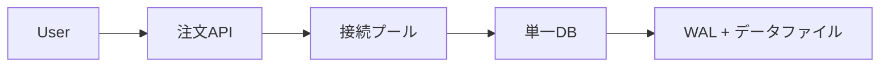
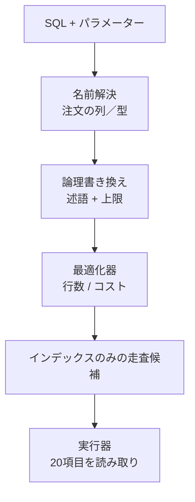
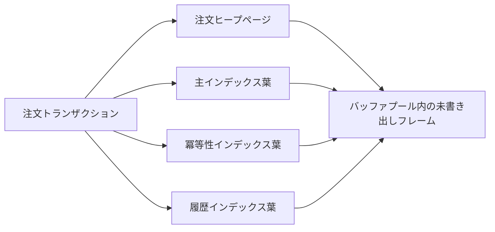
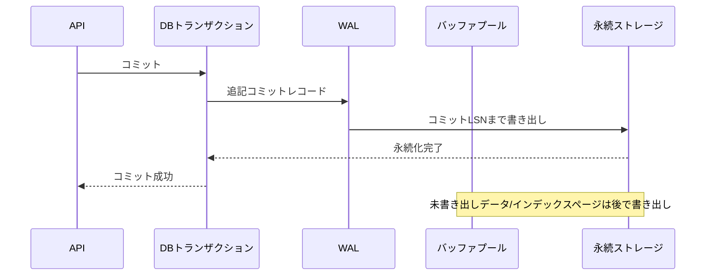
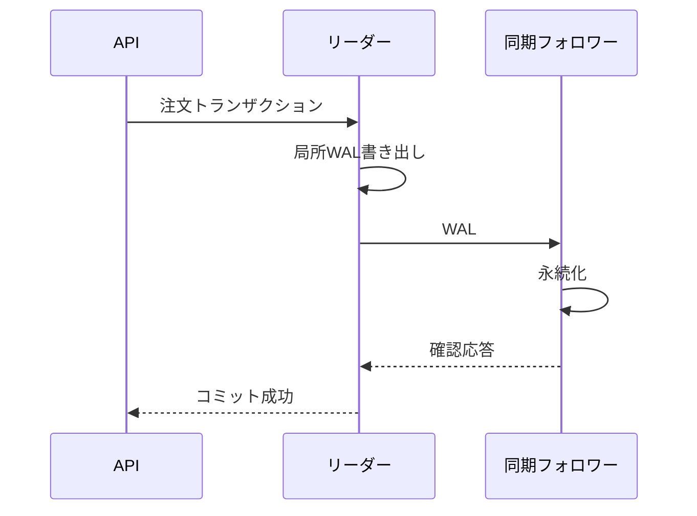
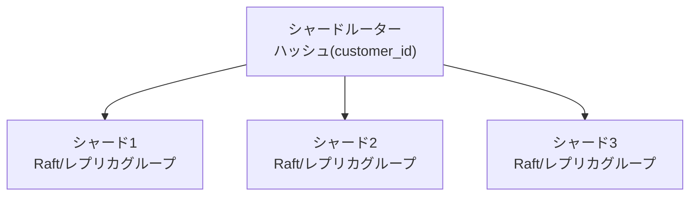
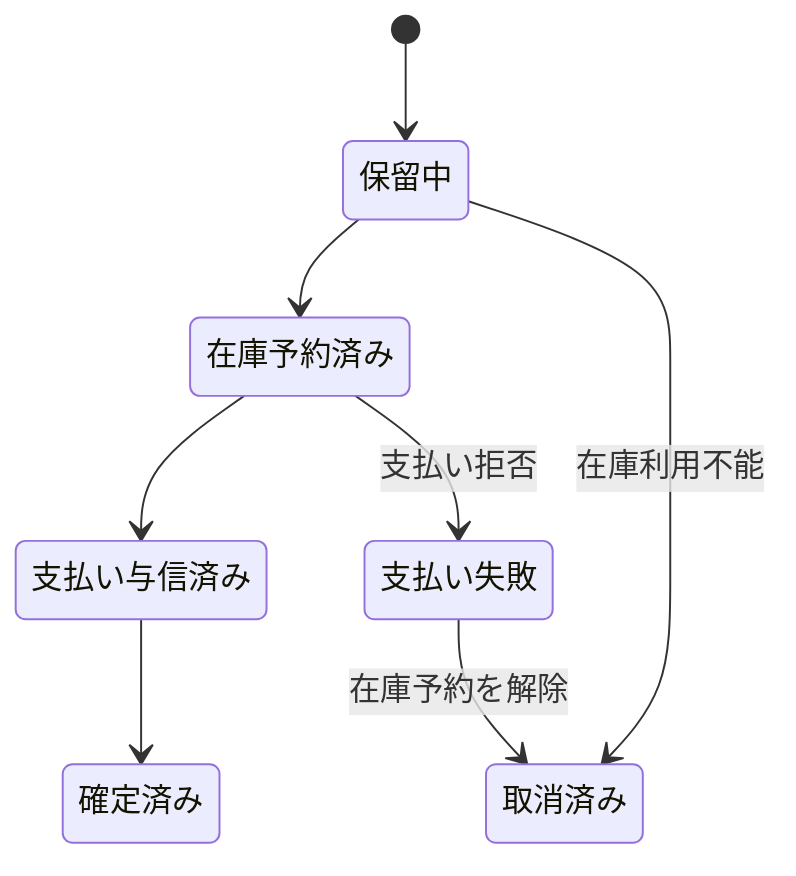
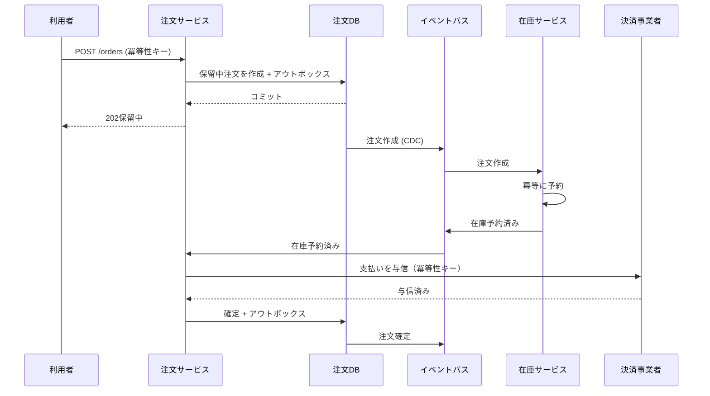

この章では、本書の概念を一つの注文処理へ統合します。正常系を図示するだけでなく、競合、クラッシュ、応答損失、レプリカ遅延、ネットワーク分断が起きたときに何が残るかを追跡します。

最終的な問いは一つです。

> 「注文完了を利用者へ返した」とき、システムのどこまでが、どの障害に対して保証されているのか。

## この章で答える問い

- 単一ノードで注文を作るとき、スキーマ、インデックス、トランザクション、WALはどう連携するのか
- コミット前後のクラッシュと応答損失で、どの永続状態が残るのか
- レプリケーションとフェイルオーバーを追加すると「注文完了」の意味はどう変わるのか
- シャーディング後に在庫不変条件をどこで守るのか
- 支払いを含むSagaをアウトボックス、インボックス、冪等性でどう回復可能にするのか

## システム要件

小さなECサービスから始めます。

機能要件：

- 顧客が商品を1個購入する
- 在庫0なら注文を作らない
- 同じリクエスト再試行で二重注文しない
- 注文履歴を新しい順に表示する
- 決済成功後に注文を確定済みにする

非機能要件：

- 注文API p99 < 500 ms
- 在庫過剰販売を許さない
- コミット済み注文のRPO = 0を目標
- 主系障害からRTO < 2 min
- 監査のため注文履歴を7年保持
- 決済事業者タイムアウトを安全に再試行

要件によって設計は変わります。RPO=5分を許せるなら非同期レプリカ、RPO=0なら同期的に永続化するレプリカや合意を検討します。

## 段階1：単一ノードDB

最初はアプリケーションと一つのPostgreSQL相当RDBを使います。



分散化を急がず、制約とトランザクションで不変条件を一か所へ集めます。

## スキーマ

```sql
CREATE TABLE customers (
  id     BIGINT GENERATED ALWAYS AS IDENTITY PRIMARY KEY,
  email  TEXT NOT NULL UNIQUE,
  name   TEXT NOT NULL
);

CREATE TABLE products (
  id     BIGINT GENERATED ALWAYS AS IDENTITY PRIMARY KEY,
  sku    TEXT NOT NULL UNIQUE,
  name   TEXT NOT NULL,
  price  INTEGER NOT NULL CHECK (price >= 0)
);

CREATE TABLE inventory (
  product_id  BIGINT PRIMARY KEY REFERENCES products(id),
  available   INTEGER NOT NULL CHECK (available >= 0),
  version     BIGINT NOT NULL DEFAULT 0
);

CREATE TABLE order_requests (
  idempotency_key  TEXT PRIMARY KEY,
  request_hash     TEXT NOT NULL,
  status           TEXT NOT NULL
                   CHECK (status IN ('processing', 'completed', 'failed')),
  response         JSONB,
  created_at       TIMESTAMPTZ NOT NULL DEFAULT now()
);

CREATE TABLE orders (
  id               BIGINT GENERATED ALWAYS AS IDENTITY PRIMARY KEY,
  idempotency_key  TEXT NOT NULL UNIQUE,
  customer_id      BIGINT NOT NULL REFERENCES customers(id),
  status           TEXT NOT NULL
                   CHECK (status IN (
                     'pending', 'inventory_reserved', 'payment_authorized',
                     'confirmed', 'payment_failed', 'cancelled'
                   )),
  total_amount     INTEGER NOT NULL CHECK (total_amount >= 0),
  ordered_at       TIMESTAMPTZ NOT NULL DEFAULT now()
);

CREATE TABLE order_items (
  order_id      BIGINT NOT NULL REFERENCES orders(id),
  product_id    BIGINT NOT NULL REFERENCES products(id),
  product_name  TEXT NOT NULL,
  unit_price    INTEGER NOT NULL CHECK (unit_price >= 0),
  quantity      INTEGER NOT NULL CHECK (quantity > 0),
  PRIMARY KEY (order_id, product_id)
);
```

商品名と単価をorder_itemsへスナップショットとして保存します。商品マスターが後で変わっても購入時点の明細を保持するための意図的な非正規化です。

冪等性キーはクライアント操作を一意にします。

## インデックス

主系/一意制約が作るインデックスに加え、注文履歴用を作ります。

```sql
CREATE INDEX orders_customer_history_idx
ON orders (customer_id, ordered_at DESC, id DESC)
INCLUDE (status, total_amount);
```

この順序は次のクエリに対応します。

```sql
SELECT id, ordered_at, status, total_amount
FROM orders
WHERE customer_id = $1
  AND (ordered_at, id) < ($2, $3)
ORDER BY ordered_at DESC, id DESC
LIMIT 20;
```

- customer_id 等値で顧客範囲を選ぶ
- ordered_at, idで安定した降順
- カーソル位置から20件
- 状態/total_amountをカバリング内容にする

幅広いインデックスの書き込みコストと可視性による表アクセスは測定します。

## リクエスト契約

```http
POST /orders
Idempotency-Key: 01K3...

{
  "customerId": 101,
  "productId": 7,
  "quantity": 1
}
```

サーバーは同じキーと同じリクエスト本文なら保存済み結果を返し、同じキーで異なる本文なら409相当を返します。

タイムアウト後もクライアントは同じキーで再試行します。

## トランザクション

一商品版のトランザクションを作ります。

```sql
BEGIN;

-- 1. 同一操作の結果を確保
INSERT INTO order_requests (idempotency_key, request_hash, status)
VALUES ($key, $hash, 'processing')
ON CONFLICT (idempotency_key) DO NOTHING;

-- 既存ならrequest_hashと保存済み結果を検査して終了

-- 2. 条件付きで在庫を引く
UPDATE inventory
SET available = available - $quantity,
    version = version + 1
WHERE product_id = $product_id
  AND available >= $quantity;

-- 更新行数 = 0ならロールバックしてsold_out

-- 3. 商品情報を読み、注文と明細を作る
INSERT INTO orders (..., status, ...)
VALUES (..., 'pending', ...)
RETURNING id;

INSERT INTO order_items (...)
SELECT ..., name, price, $quantity
FROM products
WHERE id = $product_id;

-- 4. 冪等性レコードへ結果を保存
UPDATE order_requests
SET status = 'completed',
    response = $response
WHERE idempotency_key = $key;

COMMIT;
```

:::note[簡略化]
実装ではリクエストハッシュの検証、エラー 結果保持期間、価格変更との整合、複数項目のロック順を追加します。ここでは内部経路を追いやすくするため一商品へ絞ります。
:::

## 過剰販売を防ぐ

アプリケーションでSELECTしてからUPDATEすると更新消失や検査後実行の競合が起きます。

```text
available = 1

T1読み取る1
T2読み取る1
T1書き込む0
T2書き込む0
→ 2件の注文が作成される
```

条件付き原子的なUPDATEなら同じ行への書き込み競合が直列化されます。

```sql
UPDATE inventory
SET available = available - 1
WHERE product_id = 7
  AND available >= 1;
```

最初のトランザクションが0へ更新してコミットした後、次のトランザクションは述語を再確認し更新行数=0になります。

複数商品を更新する場合はproduct_id昇順でロック／更新し、デッドロックを減らします。

## SQLが内部を通る

注文履歴クエリを追います。



統計情報はcustomer_idごとの注文数とordered_at分布を近似します。通常顧客は20件でも、一部大口取引先アカウントが1000万件ならパラメーター依存計画が必要かもしれません。

EXPLAINで確認：

- インデックス条件に顧客/カーソルが入るか
- 実行時行数が20付近か
- ヒープ／表の参照
- フィルターで除外した行
- バッファのヒット／読み取り
- 計画/実行時間

## ページとバッファプール

挿入時：

1. ordersヒープ/データページをバッファプールへ固定
2. 空きスロットへ新しいレコード
3. 主系、冪等性、履歴インデックス葉を更新
4. 各変更のWALレコードを追記
5. 未書き出しページを固定解除



同じ顧客注文が履歴インデックスで近くに並び、最近ページがキャッシュされやすくなります。ヒープページは別配置なのでインデックス-のみ条件を満たさない場合は追加アクセスします。

インデックスが増えるほど1注文の未書き出しページとWAL量が増えます。

## コミットとWAL



APIが成功を受けた時点で、局所機器クラッシュ後にWALから再実行できる保証です。データページ本体がすべて書かれたという意味ではありません。

## クラッシュインジェクション

### ケースA：在庫UPDATE後、コミット前に処理クラッシュ

- WALに更新ログレコードがあるかもしれない
- トランザクションコミットレコードはない
- 未書き出しページがデータファイルへスティール済みかもしれない
- 復旧は未完了トランザクションを取り消し
- 注文は成功として返していない

### ケースB：コミットWAL書き出し後、応答前にAPI/接続損失

- DBトランザクションはコミット済み
- クライアントは結果を知らない
- 同じ冪等性キーで再試行
- サーバーは保存済み応答を返す
- 新しい注文は作らない

### ケースC：コミット応答後、データページ書き出し前に機器クラッシュ

- WALは永続化済み
- 復旧で再実行
- 局所ストレージが残る限り注文は復元

### ケースD：ディスクとWALを同時喪失

- 局所復旧不能
- 同期レプリカ、バックアップ/PITRが必要

障害発生箇所ごとに証拠となる永続状態を確認します。

## 段階2：リーダー／フォロワー

RPO=0を目標に、別障害領域の同期フォロワーをコミット条件へ入れます。



成功の意味は「リーダーと指定フォロワーに必要WALが永続化済み」です。フォロワー 適用完了まで待たない構成なら、即時フォロワー 読み取りはまだ古い可能性があります。

## 読み取り先の振り分け

注文直後の確認画面は：

- リーダーから読み取り
- コミットLSNトークンを渡し、再生済みレプリカだけ選ぶ
- 同期適用方式

のいずれかで書き込み後の読み取り保証を守ります。

過去注文一覧は数秒の古さを許し、非同期読み取りレプリカへ送れます。APIエンドポイントごとに整合性要件を決めます。

## フェイルオーバー

リーダー 障害時：

1. 障害検出器が疑う
2. 同期/最も新しいなフォロワーを候補へ
3. 合意/フェンシングで古いリーダーの書き込みを止める
4. 新しいリーダーへ振り分け
5. プール接続を再確立
6. 処理中のリクエストを同じ冪等性キーで再試行

応答損失により「コミットしたか不明」のリクエストが発生します。冪等性レコードが新しいリーダーへ複製されていることが重要です。

古いリーダー復帰時、古い主系からの書き込みをフェンシングし、新しい時系列へ追従させます。

## レプリケーションだけで守れないもの

- 運用者がordersを削除
- 不具合が在庫を0にする
- スキーマ移行がデータを破壊
- 破損が全レプリカへ広がる

バックアップ/PITRを別障害領域へ持ち、復元訓練します。

## 段階3：シャーディング

注文データと書き込み負荷が一クラスターへ収まらなくなったとします。

顧客単位のクエリ/トランザクションが中心なのでcustomer_id ハッシュでシャードします。



customers、orders、order_itemsをcustomer_idで同じ場所に配置します。

問題：在庫はproduct_id単位で全顧客が競合します。顧客シャードへ複製すると同じ在庫を独立に引いて過剰販売します。

選択肢：

1. 在庫をproduct_id 所有者シャードへ置き分散トランザクション
2. 倉庫/リージョンごとに在庫割当量をエスクロー配分
3. 予約サービスを単一所有者として呼ぶSaga
4. 商品ごとに在庫トークンを事前パーティション

書き込み集中箇所と原子性要件で選びます。

## エスクローによる分割

全体在庫100を4リージョンへ割当量配分します。

```text
リージョンA: 30
リージョンB: 30
リージョンC: 20
リージョンD: 20
合計:   100
```

各リージョンは局所トランザクションで割当量内を販売でき、過剰販売しません。需要が偏った場合は割当量の転送が必要で、全体の在庫表示は結果整合的になります。

正確な全体在庫と低遅延局所書き込みのトレードオフです。

## 段階4：支払いとのSaga

決済事業者は2PC参加者になれません。注文ワークフローをSagaとしてモデル化します。

状態：



注文DBの各状態遷移とアウトボックスイベントを同じ局所トランザクションでコミットします。

## アウトボックス

```sql
BEGIN;

UPDATE orders
SET status = 'inventory_reserved'
WHERE id = $order_id
  AND status = 'pending';

INSERT INTO outbox (
  event_id, aggregate_id, aggregate_version, event_type, payload
) VALUES (
  $event_id, $order_id, 2, 'InventoryReserved', $payload
);

COMMIT;
```

CDC/中継処理がイベントを1回以上で送信します。支払いコンシューマーはevent_idをインボックスへ記録し重複を無害化します。

## 支払い冪等性

支払いリクエストにも注文ID/試行IDを冪等性キーとして渡します。

```text
支払いキー = 注文-42:認可:v1
```

タイムアウト後は同じキーで状態を確認/再試行します。新しいキーで再送すると二重認可/キャプチャの危険があります。

支払い与信済み後、注文確定前にクラッシュしても、アウトボックス/インボックスとワークフロー 状態から再開します。

## 補償

支払い拒否：

1. 注文をpayment_failedへ
2. ReleaseInventoryコマンド/イベント
3. 在庫予約を冪等に解放
4. 注文を取消済みへ

支払いの確定後に在庫確保失敗：

- 返金は新しい会計トランザクション
- 元キャプチャレコードを消さない
- 返金障害を再試行/運用キュー
- 利用者へ保留中返金状態を見せる

補償は履歴を消す取り消しではありません。

## 端から端までの連番



即時200確定済みを返したい場合、APIリクエスト内で全手順を待つため遅延時間と障害曖昧さが増えます。202保留中 + 状態ポーリング/pushで長時間ワークフローを表す方法があります。

## 整合性境界

各状態で保証を明記します。

| API/状態 | 保証 |
| --- | --- |
| POST 202保留中 | 注文DBへリクエストとワークフロー開始が永続化済み |
| inventory_reserved | 在庫所有者で割当量を確保 |
| payment_authorized | 決済事業者が冪等性キーに対し認可を記録 |
| 確定済み | 注文DBへ最終状態とイベントが永続化済み |
| イベント配信済み | 少なくとも1回。コンシューマーは重複排除 |

「注文完了」のUIを確定済みにだけ対応させます。保留中を確定済みと表示しません。

## 障害マトリクス

| 障害発生箇所 | 永続状態 | 復旧 |
| --- | --- | --- |
| リクエスト受信前 | なし | 同じキーで再試行 |
| 注文コミット後、応答前 | 注文 + 冪等性結果 | 再試行で保存済み結果 |
| アウトボックスコミット後、送信前 | アウトボックス行 | 中継処理再開 |
| 送信後、処理済み前 | ブローカーにイベント、アウトボックス未完了 | 重複送信、コンシューマー 重複排除 |
| 在庫予約後、イベント前 | 予約 + アウトボックス | 在庫中継処理再開 |
| 支払い成功後、応答損失 | 決済事業者にキー/結果 | 同じキーで状態/再試行 |
| 確定コミット前クラッシュ | 支払い与信済み、注文中間状態 | ワークフロー 再開 |
| 補償途中障害 | 状態に補償中 | 手順ごとに再試行 |
| リーダー 障害 | レプリカ/合意ログ | フェイルオーバー + クライアント再試行 |
| リージョン損失 | 遠隔レプリカ/バックアップ | RPO/RTO手順 |

この表を実装前に作ると、必要な冪等性と永続状態が見えます。

## クエリシャーディング後のクエリ経路

顧客注文一覧はcustomer_idから一シャードへ振り分けできます。

管理者の全注文探索は分散問い合わせと集約になり、本番環境OLTPシャードへ負荷をかけます。

対策：

- CDCで分析処理/探索保存へ複製
- 時間/顧客別実体化ビュー
- 全体インデックス
- 制限付き時間範囲と流量制限

OLTPストレージをすべてのクエリに使わない判断が必要です。

## 可観測性

一注文をトレースID/注文IDで追跡します。

区間：

- APIキュー/接続プール待ち
- DBトランザクション
- WAL/コミット遅延時間
- アウトボックス遅延
- ブローカー送信/配信
- 在庫予約
- 支払い呼び出し
- Sagaの状態遷移

指標：

- 注文状態ごとの滞留数/経過時間
- 冪等性ヒット/競合
- 直列化/デッドロック再試行
- プール飽和
- コミットp99
- レプリカ遅延
- アウトボックス未送信の最長経過時間
- コンシューマー 遅延/重複排除件数
- 補償障害
- シャードQPS/大きさ/偏り

平均完了時間だけでなく、保留中状態の最長経過時間を警告します。

## SLO

同期APIと非同期ワークフローを分けます。

```text
注文受付SLO:
  99.9%が500ミリ秒以内

注文確定SLO:
  99%が10秒以内
  99.9%が2分以内

永続性:
  確定済み注文は単一ノード障害に対してRPO 0
```

SLOごとにエラー予算、警告、運用手順書を作ります。

## 容量

1注文あたりの増加を概算します。

```text
基底行:
  注文 + 項目 + リクエスト + アウトボックス

インデックス:
  PK + 冪等性 + 履歴 + 外部キー関連

WAL:
  行変更 + インデックス変更 + 全ページイメージ／実装上必要なメタデータ

レプリケーション:
  WAL × レプリカ群

イベント:
  ブローカー保持期間 + コンシューマー 状態
```

論理注文内容だけでなく書き込み増幅を含めてストレージ/ネットワークを見積もります。

## 障害インジェクション

検証環境で次を自動試験します。

1. コミット応答直前に接続切断
2. アウトボックス送信確認応答直後に中継処理強制終了
3. コンシューマー DBコミット直後、確認応答前に強制終了
4. 支払い応答を削除
5. リーダー 処理強制終了
6. 過半数/少数派パーティション
7. レプリカ適用を低速化
8. 既存データの補完中にフェイルオーバー
9. ディスク満杯
10. 復元 + PITR

期待結果を障害マトリクスと照合します。カオス試験はランダムに壊すことではなく、不変条件を検証する実験です。

## 不変条件の検査

定期的に次を検査します。

```text
inventory.available >= 0

確定済み注文
→ 支払い与信／売上確定が存在

予約後に取消済み
→ 予約解放済み、または補償処理中

アウトボックスイベント
→ 集約／バージョンが存在

冪等性キー
→ 業務操作は最大1回
```

違反を自動修復する前に証拠を保存し、照合作業を冪等にします。

## 設計判断表

| 要件 | 仕組み | コスト |
| --- | --- | --- |
| 過剰販売防止 | 条件付き原子UPDATE / 予約所有者 | 高負荷行競合 |
| リクエスト重複防止 | 冪等性キー + UNIQUE + 保存済み結果 | 保持期間/ストレージ |
| 高速な履歴クエリ | 複合カバリングインデックス + キーセット | 書き込み/インデックスコスト |
| クラッシュ後コミット保持 | WAL + 復旧 | WAL書き出し遅延時間 |
| ノード損失RPO 0 | 同期的に永続化するレプリカ/合意 | ネットワーク遅延時間/可用性 |
| 読み取りの負荷分散 | 非同期レプリカ | 古さ/振り分け |
| 容量拡張 | customer_id シャーディング | 全体クエリ/分散在庫 |
| DB→イベント原子性 | トランザクショナル・アウトボックス | 重複配信/中継処理 |
| 外部ワークフロー | Saga + 補償 | 外部から見える中間状態 |
| 再試行安全性 | インボックス/冪等なコンシューマー | 重複排除状態 |
| 運用者の操作ミス復旧 | バックアップ + PITR | ストレージ/復元時間 |

仕組みの列だけでなくコスト列を必ず書きます。

## 段階的に成長させる

1. 単一DB + 制約 + トランザクション
2. 必要なインデックスと可観測性
3. レプリカ + 検証済みフェイルオーバー + バックアップ/PITR
4. アウトボックスによる連携
5. ボトルネックを測定してパーティション
6. 分散トランザクション/Sagaを必要箇所だけ導入

最初から最終構成を作ると、運用複雑さが業務負荷より先に増えます。一方、冪等性キー、安定したキー、アウトボックス可能なトランザクション境界など、将来の障害へ備える局所的設計は早く導入できます。

## 最終確認

「注文完了」と返した時点の答えを、構成別に述べます。

### 単一ノード + 局所WAL

コミットに必要なWALが局所の永続ストレージへ到達し、クラッシュ復旧で復元できる。機器/ストレージ全損は保証外。

### 同期フォロワー

リーダーと指定フォロワーの確認応答方針が要求する位置まで永続化済みである。適用前のレプリカ読み取りは古い可能性。共通障害領域や運用者の操作ミスは保証外。

### 合意で複製したシャード

現在の任期のログ項目が過半数へ永続化を伴って複製されコミットされている。少数派障害に耐える。クライアント応答損失には冪等性が必要。

### Sagaで確定済み

注文集約が確定済みへ遷移し、必要な在庫/支払い手順が各所有者で永続化済みであり、アウトボックスイベントが送信予定として永続化されている。コンシューマーへの一度だけ配信は保証せず重複排除で業務結果を守る。

## まとめ

- 正しいスキーマと制約を最初の防衛線にする
- 条件付き書き込みとトランザクションで単一DB内の在庫不変条件を守る
- 複合インデックスとキーセットページ送りで注文履歴を局所化する
- WALコミット、データページ書き出し、レプリカ適用を別の時点として説明する
- 応答損失を冪等性キーで同一操作へ結びつける
- レプリケーションはフェイルオーバーを支えるがバックアップ/PITRを置き換えない
- シャードキーはクエリ局所性とトランザクション境界を決める
- 外部支払いはSaga、アウトボックス、インボックス、補償で障害状態を明示する
- 障害マトリクス、不変条件、トレース、SLOで設計を検証可能にする
- 各保証には遅延時間、可用性、書き込み増幅、運用複雑さのコストがある

## 最終演習

1. 複数商品注文でデッドロックを減らし、全か無かで在庫を引くトランザクションを設計してください。
2. 非同期レプリカだけの構成でリーダー 障害した場合、クライアントへ返した注文が失われる時系列を書いてください。
3. customer_id シャードでメール検索を提供する全体インデックスの書き込み/障害経路を設計してください。
4. 支払いの確定後に注文DBが長時間停止した場合の復旧と利用者表示を定義してください。
5. 「確定済み注文は二重課金されず、在庫が負にならない」を検証する障害インジェクション計画を作ってください。

## 参考資料

- [PostgreSQL Documentation](https://www.postgresql.org/docs/current/)
- [Raft Paper](https://raft.github.io/raft.pdf)
- [Spanner Paper](https://doi.org/10.1145/2491245)
- [Sagas Paper](https://doi.org/10.1145/38713.38742)

この章を説明できれば、DBを個別の用語ではなく、アプリケーションリクエストからストレージ、トランザクション、復旧、分散ワークフローまで連続したシステムとして捉えられています。
